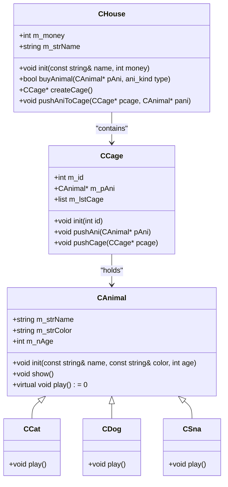

# 迭代器`Intreator`


```c++

class iterator//! iterator 
{
public:
	Node* point;

	iterator(Node* pHead):point(pHead) {};
	bool isNullptr() { return point == nullptr; }
	bool isEqualPtr(Node* Ptr) { return point == Ptr; }
	int getValue() { return point->val; }

	Node* leftAdd() { return point = point->pNext; }
	Node* rightAdd() {
		Node* pOrg = point;
		point = point->pNext;
		return pOrg;
	}

	//! 运算符重载
	//! 返回值 operator‘运算符’ (函数参数){ 函数定义};
	//! ret operator XXXXX () { };
	bool operator==(Node* pNode) { return point == pNode; }
	bool operator!=(Node* pNode) { return point != pNode; }
	int operator*() { return point->val; }
	//? 默认左加加 括号加int 表示右加加
	Node* operator++(){ return point = point->pNext; }
	Node* operator++(int) {
		Node* pOrg = point;
		point = point->pNext;
		return pOrg;
	}
};


void List::show_list_ite(){
	iterator ite(pHead);
	while (!ite.isNullptr()) {
		std::cout << ite.getValue() << ' ';
		ite.leftAdd();
	}
}
void List::show_list_ite_operator() {
	iterator ite(pHead);
	while (ite != nullptr) {
		std::cout << *ite << ' ';
		++ite;
	}
}
void List::show_list() {
	Node* pNode = pHead;
	while (pNode != pEnd) {
		std::cout << pNode->val << ' ';
		pNode = pNode->pNext;
	}
	std::cout << pNode->val << '\n';
}

```

---

# 运算符重载`operator`

ret __operator__ `运算符` (参数) { } ;
- 左右加加以及左右减减无参数默认为左操作 右操作参数为 `int` 一个词

```c++
	void list::operator>>(int val) {
		this->push_back(val);
	}

// 可在main函数中这样写
	List newList;//定义变量 
	for (int i = 0; i < 10; i++) {
		newList >> i;
	}

```


----
# `<list>` 链表

```c++
#include <iostream>
#include <list>
using namespace std;


int main() {
	std::list<int> newList;
	for (int i = 0; i < 5; i++)
		newList.push_back(i * 31 + 17);

	list<int>::iterator ite = newList.begin();//! 定义迭代器 只想头节点
	while (ite != newList.end())std::cout << *ite++ << ' ';
	std::cout << '\n';

	newList.push_front(90);
	newList.push_front(110);
	ite = newList.begin();
	while (ite != newList.end())std::cout << *ite++ << ' ';
	std::cout << '\n';

	ite = ++newList.begin();
	newList.insert(ite, 99);//! 在迭代器指向的地址之前插入元素 返回新插入元素的迭代器
	ite = newList.begin();
	while (ite != newList.end())std::cout << *ite++ << ' ';//110 99 90 17 48 79 110 141
	std::cout << '\n';

////--------------------------------------------------
	//? earese
	ite = ++newList.begin();
	::advance(ite, 3);//! 将迭代器向后偏移3

	ite=newList.erase(ite);//! 删除迭代器节点 返回删除迭代器下一个 参数迭代器默认会失效 
	for (int& i : newList)std::cout << i << ' ';
////-------------------------------------------------
	std::cout << *newList.begin() << ' ' << *--newList.end() << '\n';
	std::cout << newList.front() << ' ' << newList.back() << '\n';

	std::cout << "Size : " << newList.size() << '\n';
	newList.clear();
	std::cout << newList.size() << '\n';
;
	return 0;;

};

```

---
---
---
---

# 项目-宠物小屋

> [!quote] 屎💩💩💩💩💩💩💩💩💩💩
> 🐱🐈🐈‍⬛
> 🦮🐕‍🦺🐩🐕
> 🐍





---
---
---
---
---


Next Note : [[1102-1103-1109]] 飞机大战