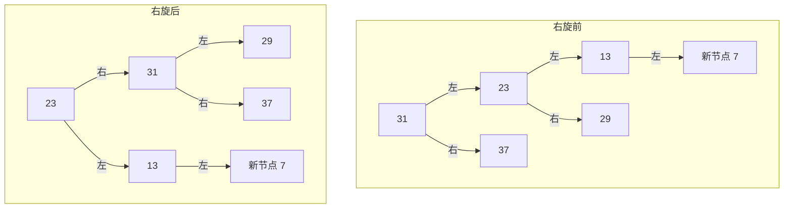
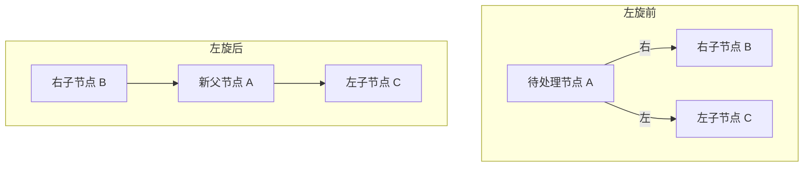

# BST 转换为有序双向链表


---
# 判断二叉树是否平衡
[Leetcode110](https://leetcode.cn/problems/balanced-binary-tree/)


---
# 旋转

> [!quote] 双亲孩子表示法

特殊情况 传入节点为空 充当闯入节点的孩子为空
##### 左子的左子 有了新孩子破坏了该节点平衡 使用右旋
##### 右子的右子引起不平衡 使用 左旋

##### 右子的左子引起不平衡 使用右左旋
##### 左子的右子引起不平衡 使用左右旋


### 右旋



### 左旋



### 右左旋
```mermaid

```

### 左右旋
```mermaid
graph TD;
    subgraph "左右旋前"
        A[31]
        A -->|左| B[23]
        A -->|右| C[37]
        B -->|左| D[13]
        B -->|右| E[29]
        D -->|左| F[新节点 7]
        A -->|右| G[30]  
    end

    subgraph "左右旋后"
        B_1[23]
        B_1 -->|左| D_1[13]
        B_1 -->|右| A_1[31]
        A_1 -->|左| E_1[29]
        A_1 -->|右| C_1[37]
        A_1 -->|右| G_1[30]
        D_1 -->|左| F_1[新节点 7]
    end
```


---
---
---
---
---


Next Note : [[1028]] 


