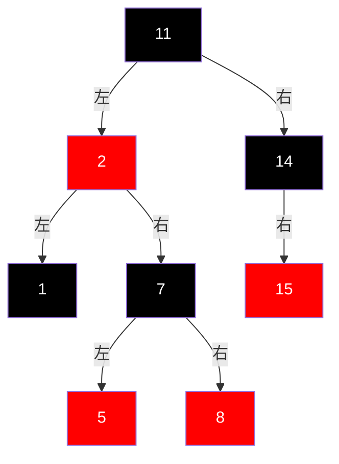

##### 左旋
##### 右左旋
##### 左右旋

---
# RBT 红黑树

> [!bug] 红黑树五点性质
> - 所有节点不是红的就是黑的
> - 根节点为黑
> - 终端节点(空孩子)被认为是黑
> - 不存在两个相连的红节点
> - 任意节点到终端节点的黑色节点个数相同

假设某条路径黑节点数为k 该路径最长为2k(BRBRBR...) 最短为k(BBBB...)
->
- 不存在某条路径长度为另一条的 2 倍
- 增删改查时间复杂度为O( $log_2(n)$ )

---
---
---

Next Note : [[1030]] 

