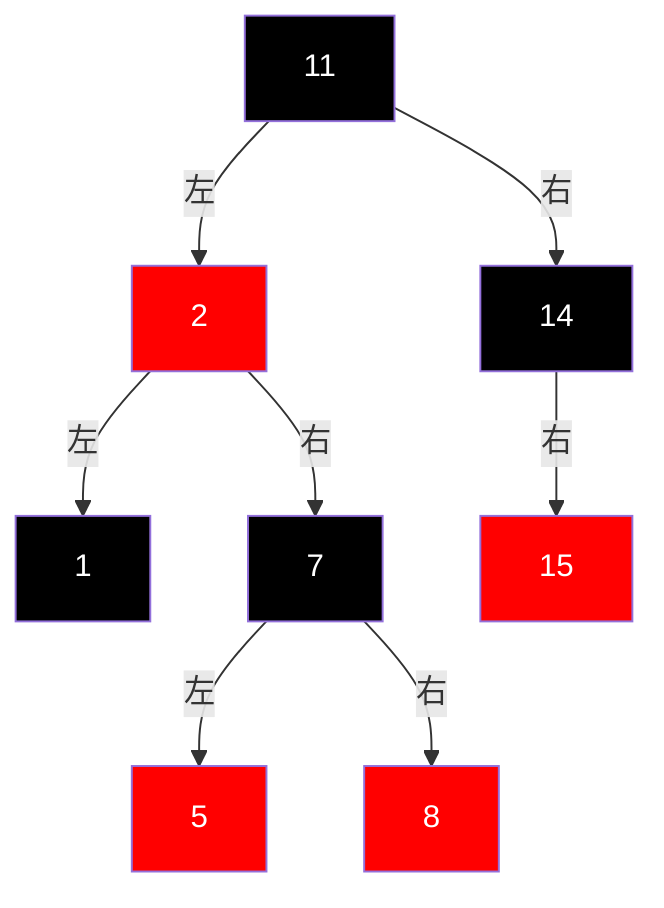

# RBT

> 新插入节点 Z 置红

- 树为空 : 直接插入变色为 [-]
- 父亲节点为黑 : 直接插入 [-]
- 父亲节点为红
	1. 叔叔为红 : 父亲变黑 爷爷变红 叔叔变黑 ; 定爷爷(已平衡)为新节点重新讨论
	2. 叔叔为黑 : 
		- 父亲是爷爷左 
			- 新节点Z 为父亲右 : 定父亲为新节点进行左旋 而后有右旋(Z为爷爷左右子 Z的到来导致不平衡 进行左右旋) [-]
			- 新节点Z 为父亲左 : 父亲变黑 爷爷变红 以爷爷为旋转点右旋 [-]
		- 父亲是爷爷右
			- 新节点Z 为父亲左 : 定父亲为新节点进行右旋 而后有左旋(Z为爷爷右左子 Z的到来导致不平衡 进行右左旋)
			- 新节点Z 为父亲右 : 父亲变黑 爷爷变红 以爷爷为旋转点左旋

---
---
---
---
---

Next Note : [[1031-1101]] 
