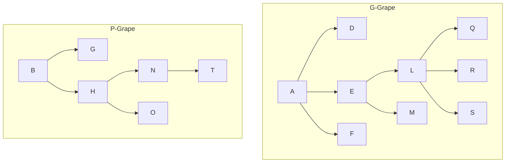
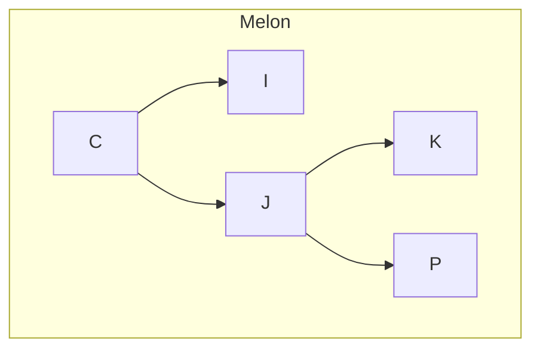

# $B$-Tree $B^+$-Tree
- 结构区别 B树任意节点为一记录 $B^+$树叶子节点才是记录
- 增删区别 
- 查区别
	1. B 树 查时间复杂度O(1) ~ O($log_M(n)$) 查找到的记录可能出现在根或者树上任意位置
	2. $B^+$树恒为O($log_M(n)$) 因查找到的记录一定在叶子上
	3. __范围查找时__ $B^+$ 树更合适 因叶子节点间的指针可以遍历 而B树找到最值后很可能需要访问父亲 兄弟等

---
---
---

##### Tree -> Binary Tree
- 连接兄弟
- 除最左侧孩子节点保持与父亲连接 断开与父亲连接
- 原来最左孩子变左孩子 最左孩子右边的兄弟变其右孩子
##### Forest -> Binary Tree
- 将根节点视为兄弟相连
- 兄弟相连
- 同Tree -> Binary Tree 处理

---
---
---

# 并查集 Disjoint Set

> [!quote] example
> 一堆喜欢吃水果的人组成一个集合 他们喜欢吃葡萄Grape和瓜Melon
> 喜欢吃Grape 的人分为喜欢吃绿葡萄和喜欢吃紫葡萄的两部分
> 	喜欢吃绿葡萄的有 A D E F L M Q R S
> 	喜欢吃紫葡萄的有 B G H N T
> 喜欢吃西瓜的有 C I J K O P

graph TD;
    A[11]:::black
    A -->|左| B[2]:::red
    A -->|右| C[14]:::black
    B -->|左| D[1]:::black
    B -->|右| E[7]:::black
    E -->|左| F[5]:::red
    E -->|右| G[8]:::red
    C -->|右| H[15]:::red

    classDef black fill:#000000,color:#ffffff;
    classDef red fill:#ff0000,color:#ffffff;

将喜欢同一种水果的人以一种数据结构存储到一起 一般为 __树__ 
例如此例:

> [!bug] 以父亲表示法构造树

| A   | B   | C   | D   | E   | F   | G   | H   | I   | J   | K   | L   | M   |
| --- | --- | --- | --- | --- | --- | --- | --- | --- | --- | --- | --- | --- |
| -1  | -1  | -1  |     |     |     |     |     |     |     |     |     |     |

| N   | O   | P   | Q   | R   | S   | T   |
| --- | --- | --- | --- | --- | --- | --- |
|     |     |     |     |     |     |     |
|     |     |     |     |     |     |     |
##### 查
> [!quote] 如何知道两人是否喜欢吃相同水果？
> 找到所在树的根节点 是否相同
##### 并
> [!quote] 将喜欢吃紫葡萄和瓜的合并
> 紫葡萄父亲指向瓜父亲

## 优化
##### 并
- __按秩合并__ : 根节点存储当前树元素个数相反数 合并时 小树往大树合并 小数根父亲变大叔 大树更新节点个数

##### 查
- __路径压缩___ : 查找到根的过程中记录路径 后将路径中父亲更新为根 最终多次查询树高度可压缩为 2

---
---
---
---

Next Note : [[1108]] 