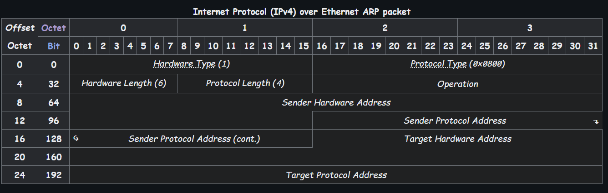

# 七层模型
ISO/ Open System Interconnection
- 开放系统互连理论模型: 开源, 功能完善, 可二次开发. 属于标准

| 名称                 | 作用简介                         | 常见协议 / 设备                       | 数据类型  |
| ------------------ | ---------------------------- | ------------------------------- | ----- |
| 应用层 (Application)  | 提供网络服务给应用程序，直接面向用户           | HTTP、FTP、SMTP、DNS、TELNET        |       |
| 表示层 (Presentation) | 数据格式转换、加解密、压缩等               | SSL/TLS、JPEG、MPEG、ASCII、BASE64  |       |
| 会话层 (Session)      | 建立、管理、终止会话，保持会话状态            | NetBIOS、RPC、SQL 会话、SIP          |       |
| 传输层 (Transport)    | 提供端到端通信<br>保证数据传输可靠性或效率      | TCP、UDP                         |       |
| 网络层 (Network)      | 负责*寻址和路由*<br>数据从源头到目的地的路径选择  | IP、ICMP、IGMP、ARP、IPSec、OSPF、BGP | IP数据报 |
| 数据链路层 (Data Link)  | 建立和管理物理链路上的逻辑连接<br>帧的传输和差错检测 | MAC、PPP、以太网协议、ARP、Switch(交换机)   | 数据帧   |
| 物理层 (Physical)     | 传输比特流，定义电气、机械规范              | RJ45、光纤、网线、集线器、Repeater         | 01比特流 |

- 实际应用: [*TCP/IP协议簇*](https://en.wikipedia.org/wiki/Internet_protocol_suite) 应用层-传输层-网络互连层-网络链接层 
![[TCP_IP协议簇.png]] 


----

# 网络基础

## 协议

----

 `[!!quote:协议就是规则]` 本质上是通信双方约定的数据格式和处理规则
 - 例如, 在自己的项目中, 各种结构体定义了客户端与服务器之间在登录/注册等其他任务**传输的数据结构和意义**, 就是自定义*应用层协议*

#### `json` 与结构体对比
- **JSON** : JavaScript Object Notation 是一种轻量级、可读性强的 **数据交换格式**，常用于客户端与服务器之间通信

```json title:"protobuf 和结构体很像 是字符串格式 通常是 UTF-8 编码 Google推出"
json {
	"data" : "123",
	"cmd" : "public:",
	"status" : "admin"
}
```

| 场景                 | 能否用 JSON       |
| ------------------ | -------------- |
| **网络传输 跨语言  **      | ✔ 推荐 JSON      |
| **配置文件、日志**        | ✔ 推荐 JSON      |
| **程序内部数据结构 本地调用  ** | ✘ 不推荐，结构体更快更安全 |
- 同时, *对于空数据*, json可以很好处理, 但结构体可能出现问题
- 需要和其他语言 JavaScript、 Python、 Go 交互
- 需要良好可读性、调试方便
- 传输字段可变、扩展性高的接口设计 如 REST API  

| 对比项      | JSON 文本            | 结构体（二进制）             |
| -------- | ----------------- | -------------------- |
| **可读性**  | ✔ 高，可直接打印、查看      | ✘ 低，是二进制，需要解释才能读     |
| **跨语言性** | ✔ 好，任何语言都支持 JSON  | ✘ 差，结构体字节对齐、大小端等问题复杂 |
| **灵活性**  | ✔ 高，可变字段、嵌套结构体    | ✘ 固定结构，添加字段需重新定义     |
| **效率**   | ✘ 低，需解析字符串，性能开销较大 | ✔ 高，内存直接操作           |
| **体积**   | ✘ 通常更大 含键名、引号      | ✔ 精简（只传字段数据）         |
| **安全性**  | ✘ 无类型检查，易错        | ✔ 编译时类型检查            |
| **调试方便** | ✔ 打印 JSON 更直观     | ✘ 打印结构体要用调试器或格式化     |

**序列化**  : 将内存中的数据结构 如结构体、对象  **转换为字节序列**或格式化字符串, 如 JSON、XML，以便网络传输或存储
**反序列化** : 将字节序列或格式化字符串 **恢复成原始数据结构**

----

### 端口 port
 
* 端口是设备用于进行网络通信的**逻辑通道**，可以理解为一台主机上不同网络服务的“入口”或“门”
* **作用**：用于区分同一台设备上运行的多个网络应用程序. **IP地址 + 端口号** 可以唯一标识网络中的一个进程通信端点
* **举例比喻**： **IP 地址像一栋楼**，端口就像这栋楼里的**每个房间的门**.  虽然楼只有一栋一个IP，但可以有很多个门（端口）服务不同的“访客”（服务）

##### 端口号范围

| 范围            | 类型                           | 举例                                  |
| ------------- | ---------------------------- | ----------------------------------- |
| 0 - 1023      | **知名端口 Well-known  **         | HTTP(80)、HTTPS(443)、FTP(21)、SSH(22) |
| 1024 - 49151  | **注册端口 Registered  **         | 常用于用户程序、服务应用                        |
| 49152 - 65535 | **动态/私有端口 Dynamic/Private  ** | 临时端口，用于客户端连接等                       |

##### 端口类型
* **物理端口**：如网口、USB 接口，是设备上的实际通信接口
* *虚拟端口 逻辑端口*：由操作系统分配的，用于网络通信的软件端口，如 TCP/UDP 端口


---

### HTTP
应用层协议

[[HTTP&HTTPS#HTTP协议简介]]
[[HTTP&HTTPS#HTTP协议概述]] 
[[HTTP&HTTPS#HTTP协议特性]] 
[[HTTP&HTTPS#HTTP请求报文]] 
[[HTTP&HTTPS#HTTP响应报文]] 
[[HTTP&HTTPS#HTTP工作流程]] 
[[HTTP&HTTPS#URL构成]] 
[[HTTP&HTTPS#http的应用场景]]

### HTTPS


----

### [DNS](https://en.wikipedia.org/wiki/Domain_Name_System) 域名服务器 Domain Name System

DNS 域名系统  用于将 **域名 `www.google.com`解析为IP 地址`142.250.72.68`**，是互联网的重要基础服务之一. 应用层协议
* 实现 `域名<->IP地址` 之间的转换
* 让用户通过*记忆友好的域名*访问网站，而非数字 IP
#### DNS 解析过程
1. **浏览器缓存** 本地是否解析过  
2. **系统缓存操作系统**
3. **本地 hosts 文件**
4. **本地 DNS 服务器** 由运营商或用户指定  
5. **递归查询**其他 DNS 服务器直到找到结果：
   * 根域名服务器 Root DNS  
   * 顶级域名服务器 TLD，如 .com  
   * 权威域名服务器 具体网站信息  

#### 使用的协议

* 使用 **UDP 协议**，端口号 **53** 请求小于 512 字节  
* 若数据包太大则会使用 **TCP**

#### DNS 数据包大致格式
* Header：标志、状态码、查询数等
* Question：查询的域名类型
* Answer：返回的 IP 等信息

---

### [IP](https://en.wikipedia.org/wiki/IPv4) 网际协议

##### IP 地址Internet Protocol Address

IP地址是“互联网协议地址”，是为每台连接到网络的设备分配的**逻辑地址**. 在互联网中用于唯一标识一台主机或网络，类似于“网络中的门牌号”
- *IPv4*：32 位地址，如 `192.168.1.1`，共约 42 亿个地址. *IPv6*：128 位地址，如 `2001:0db8:85a3::8a2e:0370:7334`，解决地址枯竭问题
* **特点**：与设备的**物理地址 MAC  无关**，实现了逻辑寻址和网络层的路由转发. IP 地址可分为 **公网地址** 与 **私网地址**
* **分类 按用途**： A/B/C 类地址 IPv4 常见划分. *静态 IP / 动态 IP*
* **组成结构 IPv4**：网络号 + 主机号. 通过子网掩码区分这两部分

##### IPv4 头部

![[05-review/photos/IPv4Header.png]]

首部长度20~60字节
1. 版本
2. IHL: 首部长度
3. DSCP, ECN: 区分服务
4. 总长度
5. 标识: 标记当前包属于哪一个大包
6. 标志: 3位, 分别为Reserved, Don't Fragment (DF), More Fragments (MF)
	- 保留
	- DF: 标识是否分片
	- MF: 若为最后一个分片, 设置为非0
7. 片偏移: 当前片相对于首片的偏移
8. TTL: 最大生存跳数
9. 协议: 上层协议类型: `1:ICMP. 2:IGMP. 6:TCP. 17:UDP`
10. 首部校验和
11. 可选部分: TVL格式, 有些设备需要传输数据但是无传输层, 例如, 手机连接同厂商的WiFi, 家用路由器无传输层

##### 非阻塞套接字发送
1. 若为多线程, 可将待发送数据添加到发送缓冲区, 监听可发送事件. 即当多线程时, 若`send`发送数据未发完, 可以注册可写事件, 将未发送完的数据添加到自定义的缓冲区. 当事件到来, 就从缓冲区取出, 然后发送. 
2. 有数据要发送就放入自定义缓冲区, 注册可写事件, 保证一个缓冲队列线程安全即可. `muduo` 库单线程实现


----

### 发送接收缓冲区
*缓冲区*: 现代操作系统一般不允许用户层直接对实际数据(网络socket, 文件)直接操作, 而是用一个缓冲区, 由系统往实际文件进行读写

对于TCP与UDP的数据收发, 也同样是这样的:
1. 操作系统会给程序分配4G虚拟内存, 让程序认为自己有这么大的内存.实际按需分配, 在Windows上2G内核, 2G用户空间. 而在Linux为1G内核, 3G用户
2. 用户创建一个socket时, 系统会在内核空间给这个socket分配一个64K的发送接收缓冲区
3. 用户调用的读写是对相应的用户空间与内核空间数据的*拷贝*操作, 实际由操作系统进行数据的处理


### [TCP](https://en.wikipedia.org/wiki/Transmission_Control_Protocol) 传输控制协议

- 传输层协议. 提供面向连接的,基于字节流的,可靠交付的,全双工的端到端的传输层协议

##### TCP 首部
![[05-review/photos/TCPHeader.png]]

> [!example] TCP如何保证可靠?
> 1. 面向连接的: 三次握手保证连接, 四次挥手保证断开
> 2. 可靠交付: 使用确认号与序号以及收到确认和超时重传保证可靠交付
> 3. 流量控制: 使用滑动窗口一次发送多个数据包进行累计应答
> 4. 拥塞控制: 满开始, 拥塞避免, 快重传, 快恢复等拥塞算法保证网络通畅
> 5. 合理的分段; 校验重新排序; 


##### 三次握手
1. 服务器处于Listen状态
2. 客户端发送建立连接请求, 即SYN标志,seq1有效. 客户端进入`SYN_SEND`状态(connect阻塞)
3. 服务器收到后, 发送SYN回复, 此时SYN和ACK, ack=seq1+1, seq2=y都有效. 服务器进入`SYN_RECV`状态(accept阻塞)
4. 客户端收到SYN回复, 发送有效ACK,seq2=y+1报文. 进入`establish`状态(connect返回)
5. 服务器收到也进入`establish`. 开始通信(accept返回)

> [!abstract] 为什么不是两次握手? 为什么不是4次?
> 1. 若为两次,即无客户端第二次返回, 会使得服务器在回复SYN后认为客户端已经可用, 但是若客户端此时关闭, 服务器就无从得知. 将造成服务器资源浪费, 同时易受到网络攻击
> 2. 若为4次即第二次拆分为SYN和ACK: 因为两个标志位在逻辑上不冲突, 互不影响建立连接工作

##### 四次挥手
1. 主动方发送FIN.表示主动方数据处理完了. 进入FIN_SEND_1状态
2. 被动方*立即*回复一个ACK, 确认收到主动方FIN. 进入CLSOE_WAIT状态
3. 主动方收到后, 进入FIN_SEND_2状态.
4. *等被动方数据处理完了* 再回复一个FIN. 进入LAST_ACK状态
5. 主动方收到后, 回复ACK, 确认收到被动方FIN. 进入TIME_WAIT状态, 等待*2MSL*后无异常就退出(close)
6. 被动方收到ACK后, 关闭连接(close)

> [!abstract] 为什么不是三次挥手? 为什么等待2MSL?
> 若合并2.3次: FIN表示不再有有效数据. 被动断开方可能还有数据没有处理完, 不能发送FIN.
> 若去掉第四次: 被动方无法确认自己的FIN是否接收成功, 会超时重传. 主动方得通知被动方收到收到断开确认了
> 
> *2MSL*: 若最后一次挥手丢包就会出现只有三次挥手的问题, 等待2MSL即一个往返, 可以确认被动方收到


- RTT(Round-Trip Time) *往返时延* ~~ping~~ : 由三个部分决定:_链路的传播时间_ _末端系统的处理时间_ 以及 _路由器的缓存中的排队和处理时间_
- RTO(Retransmission Timeout) *超时重传时间*: 超时重传计时器. 此计时器设置的超时重传时间RTO应当略大于RTT,一般可取RTO=2RTT. 可以根据具体情况人为调整RTO的值. 当超过了规定的超时重传时间还未收到对此TCP报文段的预期确认信息,则必须重新传输此TCP报文段

##### 流量控制
*累计应答*: 一次发送多个包, 进行一次应答; 滑动窗口原理
*滑动窗口*: TCP传输时, 维护一个滑动窗口, 窗口中的报文无需等待

 

- 窗口大小在握手时交换. 后续在*Window*中更新

| _第x个包丢了就回ack x(x为丢掉的包中序号seq最小的)_               |
| ---------------------------------------------- |
|  |
|  |

##### 拥塞控制

![[cwnds.png]]


##### 保活机制
当接收端接收窗口达到0时, 发送方会发送一个持续计时器, 当计时器到达, 就向接收端发送一个小数据包, 接收端处理回复小数据. 保证接收端在窗口为0时发送端不会陷入死锁. (如果接收端接窗口变大后, 回复包丢了, 发送端就会陷入死锁)

###### 心跳机制
- 应用层程序保证客户端仍然在线上的机制, 可像TCP心跳机制那样, 定时发送短数据确认.
- *实现*: 1. 应用层实现. 2. 使用`SO_KEEPALIVE`套接字选项

##### Nagle 算法
目的: 尽可能让发送大数据包, 避免网络中充斥着许多小数据包
规则:
1. 若包长度达到MSS允许发送
2. 若FIN包允许发送
3. 设置`TCP_NODELY`允许发送
4. 未设置`TCP_CORK`时,若发送的所有小数据包都被确认,则允许发送
5. 若都不满足, 但发生超时, 允许发送
Negle算法默认打开. 如果对于一些需要小数据包交互的场景的程序 比如 telnet或ssh这样的交互性比较强的程序 则需要关闭Nagle算法

##### 粘包问题
- 原因: TCP是基于字节流的, 一种没有边界的, 可以合并的传输方式
- *何时粘包*: 当一个包大小大于缓冲区大小时, 会拆包, 同理, 当一个数据包小于时也可能会和后续的数据粘在一起
解决方法4个方面:
1. 固定包大小: 对于小数据, 大空间可能浪费
2. 短连接: 建立连接时传输数据, 然后断开
3. 标志位: 可能和数据内容冲突
4. 先发包大小.再发包长度

##### 总结
- 面向连接的
- 可靠传输 : ack和seq 为什么可靠
   1. 三次握手 四次挥手 
   2. 重传和确认机制
   3. 合理的分段(MSS MTU)
   4. 校验重新排序
   5. 滑动窗口 流量控制
   6. 拥塞窗口 4种拥塞控制算法

- 基于字节流的 : _粘包问题解决_
   1. 先包大小再发数据
   2. 添加开始/结束标志
   3. 固定包大小
   4. 短连接

_TCP可以发广播吗？_ 
- 理论不行 因为TCP是一对一传输的
- 可使用循环加随机轮询地发送

应用程序保证UDP不丢包(借鉴TCP) : 
   1. 实现seq ack机制 -> 数据写入一个消息队列 收到队列中确认后发送其他包
   2. 加上滑动窗口 : 累计应答
##### TCP/UDP 对比

| 性能     | UDP                    | TCP                 |
| ------ | ---------------------- | ------------------- |
| 是否连接   | 无连接                    | 面向连接                |
| 是否可靠   | 不可靠传输 不使用流量控制和拥塞控制     | 可靠传输 使用流量控制和拥塞控制    |
| 连接对象个数 | 支持一对一 一对多 多对一和多对多交互通信  | 只能是一对一通信            |
| 传输方式   | 面向报文                   | 面向字节流               |
| 首部开销   | 首部开销小 仅8字节             | 首部最小20字节 最大60字节     |
| 适用场景   | 适用于实时应用(IP电话、视频会议、直播等) | 适用于要求可靠传输的应用 例如文件传输 |

----

[UDP首部格式](https://en.wikipedia.org/wiki/User_Datagram_Protocol#UDP_datagram_structure) 
大小: 8字节
![[UDPHeader.png]]
- 长度: 该字段以八位字节为单位指定 UDP 数据报（标头字段和数据字段）的长度. 以字节为单位
- 校验和: 校验和字段可用于对报头和数据进行错误校验. 此字段在 IPv4 中是可选的，但在 IPv6 中大多数情况下是必需的

----


压力测试
- 并发量: 最大连接数
- IO: 吞吐

> [!abstract] _为何客户端不用绑定`bind`_
> 端口号作用：根据目的端口到达指定应用程序
> 因此服务器需要首先接收到到消息，需要指定到该程序在指定IP以及端口上监听数据的到来
> 而客户端实际上可绑定也可不绑定，不绑定操作系统会自动分配，向指定IP以及端口发送数据，而后该端口会接受收据


---

### [ARP](https://en.wikipedia.org/wiki/Address_Resolution_Protocol) 地址解析协议 Address Resolution Protocol
ARP 是 **地址解析协议**，用于将 **IP 地址解析为 MAC 地址**，仅在同一局域网中使用. 链路层协议
* 当设备知道目标 IP 地址时，但不知道目标设备的 MAC 地址，就会通过 ARP 查询
* 局域网内通信，使用 **广播**. 不经过路由器, 仅同网段. 不安全，容易被 ARP 欺骗攻击 ARP spoofing  .
##### ARP代理
当发送端广播ARP请求时, 本地网络上不会有主机回应(因为IP地址是外网的), 此时*路由器*将会回应该请求, 则发送源误认为路由器就是目的主机,会将报文全部转发给它, 再由路由器转发报文到外网, 则该路由器就被称为ARP代理

##### 免费ARP
在主机开机配置时, 会发送一个*目的IP地址为自己IP地址*的ARP请求报文, 该报文称为免费ARP,其作用如下
1. 让主机确认本地网络上是否有与自己IP地址相同的主机,若有,则会返回一个错误报文
2. 告诉整个广播域,目前某个IP所对应的MAC地址是什么.  这一行为就像是在发宣传单,而宣传单是不需要回应的.
3. 若接收主机ARP缓存中本身就有发送源主机的`IP<=>MAC`对,则会更新,否则,会缓存发送源的`IP<=>MAC`对

#### ARP 解析过程
1. A 想发包给 B，知道 B 的 IP，但不知道 B 的 MAC
2. A 在局域网内*广播*发送 ARP 请求 "谁是 192.168.1.3？请告诉我你的 MAC"  
3. B 收到请求后，发送 ARP 响应，告知自己的 MAC 地址
4. A 将 IP-MAC 对缓存进 **ARP 表**，下次直接使用

#### ARP 包大致结构

* 包括：发送方/接收方的 MAC 和 IP 地址
* 操作类型：请求 *1*  或响应 *2*

 
[Wikipedia](https://en.wikipedia.org/wiki/Address_Resolution_Protocol#Packet_structure)

----

## 以太网帧结构 [Ethernet Frame](https://en.wikipedia.org/wiki/Ethernet_frame)

- 以太网Ⅱ帧结构

![[EthernetⅡFrame.png]]
- 长度64~1518, 根据etherType可区分为`0x0800: 包含IPv4数据报; 0x0806: ARP数据报; 0x86DD: IPv6数据报`
- *MTU*: 即Data段长度: 46~1500, 以太网最大传输数据长度(有效载荷)
- *MSS*: TCP数据报长度

##### 802.3 vs EthernetⅡ
以太网类型 (EtherType) 字段在新的 802.3 标准中被更改为（数据）长度字段. 由于接收方仍然需要知道如何解释帧，因此该标准要求在长度之后添加一个 IEEE 802.2 报头来指定类型. 多年后，802.3x-1997 标准以及 802.3 标准的后续版本正式批准了这两种帧类型
*如何区分*: 看EtherType是否大于1500
- 以太网 II 帧由于其简单性和较低的开销，在以太网局域网中最为常见
- 为了允许在同一个以太网段上使用一些使用以太网 II 帧的帧和一些使用原始版本 802.3 帧的帧，以太网类型 (EtherType) 的值必须大于或等于 1536 (0x0600)
- 选择该值的原因是，以太网 802.3 帧的有效载荷字段的最大长度为 1500 个八位字节（0x05DC）
	- 因此，如果该字段的值大于或等于 1536，则该帧一定是以太网 II 帧，而该字段是类型字段
	- 如果该字段的值小于或等于 1500，则一定是 IEEE 802.3 帧，而该字段是长度字段
	- 1500 到 1536（不含 1500）之间的值未定义
	- 此约定允许软件判断一个帧是以太网 II 帧还是 IEEE 802.3 帧，从而允许两种标准在同一物理介质上共存

----

## 交换机Switch
交换机是一种工作在数据链路层OSI第二层的**网络设备**，用于连接多个设备并进行数据帧转发. 根据设备的 MAC 地址，智能地将数据包只转发到目标设备所在的端口，而不是像集线器一样广播

##### 工作原理

1. **学习 MAC 地址**：每当一个端口收到数据帧时，交换机会**读取源 MAC 地址**，并将其与接收端口号记录在**MAC 地址表 CAM 表**中。
2. **查表转发**：
   * 收到帧后，交换机查看其目标 MAC 地址
   * 在 MAC 地址表中查找目标地址所对应的端口
   * **只将帧转发到该端口**，而不是广播
3. **泛洪 Flooding  机制**：
   * 如果目标 MAC 地址不在表中，交换机会**将帧广播到除来源外的所有端口** 防止丢包  
   * 等目标设备响应后，再记录其 MAC 与端口映射

##### MAC 地址表 示意  

| MAC 地址            | 对应端口 |
| ----------------- | ---- |
| 00-14-22-01-23-45 | 1    |
| 00-16-EA-12-34-56 | 2    |
| 00-02-B3-1C-9C-F9 | 3    |

> 当目标地址是 `00-02-B3-1C-9C-F9`，交换机会查表并将数据帧转发到端口 3

##### 交换机 vs 集线器Hub

| 对比项    | 交换机 Switch      | 集线器（Hub）    |
| ------ | -------------- | ----------- |
| 工作层    | 数据链路层 第 2 层     | 物理层（第 1 层）  |
| 是否智能转发 | ✔ 根据 MAC 表智能转发 | ✘ 广播所有端口    |
| 效率     | 高              | 低，多余流量大     |
| 冲突域    | 每端口一个 无冲突       | 所有端口一个（易冲突） |

---

## 路由器 Router
路由器是一种工作在网络层OSI第三层的**网络设备**，主要用于**连接不同网络之间的通信**，根据 **IP 地址** 来转发数据包。
* **作用**：负责**寻找最优路径**，将来自一个网络的数据转发到另一个网络，例如：将家庭局域网的数据发送到互联网。

##### 工作原理

1. **接收数据包**： 路由器从某个接口收到数据包，并读取其中的 **目标 IP 地址**
2. **查找路由表**： 路由器在内部维护一张 **路由表**，记录目标网络应该从哪个接口/网关转发
3. **决定路径并转发**： 根据目标 IP 地址查表，选择最优路径，将数据包从正确的端口发出，转发到下一个路由器或最终设备

##### 路由表 示意  

| 目标网络        | 子网掩码          | 下一跳网关      | 接口       |
| ----------- | ------------- | ---------- | -------- |
| 192.168.1.0 | 255.255.255.0 | - 直连        | eth0     |
| 0.0.0.0     | 0.0.0.0       | 100.64.0.1 | eth1 外网   |

> 如果目标 IP 不在局域网，就走默认网关 如连接到运营商  

##### 路由器 vs 交换机

|        | 路由器 Router           | 交换机（Switch）  |
| ------ | ------------------- | ------------ |
| 工作层    | 网络层 第 3 层            | 数据链路层（第 2 层） |
| 依据     | **IP 地址**           | **MAC 地址**   |
| 用途     | 连接不同网络 如 LAN ↔ WAN   | 局域网内设备通信     |
| 设备范围   | 家庭网关、企业边缘设备、骨干路由器   | 局域网内部设备      |
| NAT 转换 | ✔ 通常内置 NAT 功能       | ✘ 不支持 NAT    |

##### 家用路由器的功能 除了转发  

* **NAT 网络地址转换**：允许多个内网设备共享一个公网 IP 上网
* **DHCP**：自动分配 IP 地址给局域网设备
* **防火墙、安全策略**：屏蔽恶意访问
* **无线接入点** Wi-Fi AP  ：路由器 + 无线功能合二为一


---

## 网关Gateway
网关是网络中的**出入口设备**，_设备或软件_. 用于连接两个不同网络 通常是内网和外网. 网关必须要有路由功能 默认的主机号都是0
* **作用**：当设备要访问**外部网络** 如互联网  时，数据会先发送到网关，由网关负责**转发到目标网络**
* **通俗理解**：网关就像是小区的大门，局域网的设备出门上网，都要经过它
一般家庭路由器的 IP 如 `192.168.1.1`  就是局域网设备的**默认网关**. 在 Linux 中可以用 `ip route` 或 `route -n` 查看默认网关

----

## 子网掩码Subnet Mask
子网掩码是用来划分 IP 地址中的**网络号和主机号**的一个参数. 确定一个 IP 地址属于哪个子网，帮助设备判断目标 IP 是**在本地局域网**还是**需要通过网关转发**
- 将IP地址与子网掩码按位与操作即可得到网络号
```text
IP 地址：      192.168.1.100
子网掩码：    255.255.255.0
```

* 前 24 位是网络号 192.168.1  
* 后 8 位是主机号 .100  
* 所以它所在的子网是：**192.168.1.0/24**

如果目标 IP 是：
* `192.168.1.105`  同子网，直接通信
* `10.0.0.1`  不同子网，数据将发往网关

----
## 子网划分Subnetting
子网划分是将一个较大的网络 IP 地址段  切分成多个较小的网络（子网）的过程. 
1. 提高地址利用率
2. 提高网络管理效率
3. 限制广播范围，减少广播风暴
4. 提升安全性 逻辑隔离  

| IP 类型    |                | 举例 以 `192.168.1.0/24` 为例       |
| -------- | -------------- | ----------------------------- |
| **网络地址** | 子网的开始地址，不可分配   | `192.168.1.0`                 |
| **主机地址** | 可分配给主机使用的地址范围  | `192.168.1.1 ~ 192.168.1.254` |
| **广播地址** | 子网中所有主机的广播目标地址 | `192.168.1.255`               |

| 类型    | 范围或用途                      |
| ----- | -------------------------- |
| 私有子网  | 局域网使用，不可直接访问互联网            |
| 公有子网  | 可以被互联网访问 例如在云服务中分配的公网段      |
| 管理子网  | 用于网络设备、监控等系统管理用途           |
| DMZ子网 | 非军事区，部署对外服务的服务器 如 Web 服务器   |


##### 子网种类

| 类别   | 地址范围 首段                       | 默认子网掩码        | 网络位数        | 主机数（理论）   | 用途           |
| ---- | ----------------------------- | ------------- | ----------- | --------- | ------------ |
| A    | 1.0.0.0 ~ 126.255.255.255     | 255.0.0.0     | /8          | ~1677 万   | 大型网络         |
| B    | 128.0.0.0 ~ 191.255.255.255   | 255.255.0.0   | /16         | ~6.5 万    | 中型网络         |
| C    | 192.0.0.0 ~ 223.255.255.255   | 255.255.255.0 | /24         | 254       | 小型网络         |
| D    | 224.0.0.0 ~ 239.255.255.255   | 无             | -           | -         | 组播 Multicast |
| E    | 240.0.0.0 ~ 255.255.255.255   | 无             | -           | -         | 保留 实验、研究用途   |
| 私有地址 | 私有地址范围                        | 可用地址数量        | 默认掩码        | 用途示例      |              |
| A    | 10.0.0.0 ~ 10.255.255.255     | 16,777,216    | 255.0.0.0   | 大型企业/数据中心 |              |
| B    | 172.16.0.0 ~ 172.31.255.255   | 1,048,576     | 255.240.0.0 | 中型企业      |              |
| C    | 192.168.0.0 ~ 192.168.255.255 | 65,536        | 255.255.0.0 | 家用路由器、局域网 |              |
- **127.x.x.x** 是保留地址 回环地址  ，属于 A 类但不能用于分配
- D、E 类地址不能用于常规设备的 IP 分配
- 私有 IP 需要通过 **NAT 网络地址转换** 才能访问互联网

_单播_ : 一对一通信
_广播_ : 广播域中都能收到数据 一对多 强调在哪儿
_组播_ : 一对多 目的设备可在不同路由器下 强调是谁
_有限广播地址_ :指的是32位全位1(即255.255.255.255)的IP地址 用于本网广播
_直接广播地址_ :可在其他指定广播域发广播 而有限广播地址只能在自己的广播域发广播

----


## 网络IO模型


对于socket的数据读写分为*阻塞式*与*非阻塞式*. 
- 阻塞时: 程序阻塞在`recv`或`send`. 交出CPU时间片
- 非阻塞: 程序读/写一次, 返回对应成功操作数据大小. 不交出时间片, 继续往下执行

*同步处理*与*异步处理*:
- 同步处理: 排队处理
- 异步处理: 同时处理

*同步IO*与*异步IO*:
- 同步IO: epoll等*就绪*模型, 操作系统告知有数据可操作, 由程序操作数据拷贝, 然后执行下面的操作.
- 异步IO: IOCP等*完成*模型, 操作系统拷贝数据, 程序直接执行下面的操作.

老王烧水泡泡面为例: 
- 同步阻塞: 老王烧水, 盯着水烧开, 再泡泡面, 吃面
- 同步非阻塞: 老王烧水, 隔一忽儿看一眼开没开, 开了再泡泡面, 吃面
- 异步阻塞: 老王烧水, 自动水壶, 盯着水烧开了, 水壶叫:泡面被水壶泡好了, 吃面
- 异步非阻塞: 老王烧水, 自动水壶, 隔一忽儿看一眼, 水壶叫:泡面被水壶泡好了, 吃面

对于同步(IO)阻塞+多线程: 自己调用recv, 调用时阻塞, 一个客户端一个线程. 最多几千连接即最大线程数, 无法完成服务器所需高可用, 高吞吐.
提出IO多路复用模型:

##### IO多路复用
- 单个线程能够打开最大文件描述符为1024, 最多线程数也无法应对高并发. 
- 而IO多路复用技术就是使*单个线程能够完成多个事件的监听*的技术.  
- 在Linux上有SELECT, poll, epoll. macOS, BSD上有kqueue. 这些是同步的就绪模型. 而Windows上的IOCP是异步的完成模型
epoll+多线程: epoll为同步IO模型, 加上多线程可实现同步IO异步处理

反应堆reactor模型
1. 多路复用器
2. 派发器
3. 处理器/执行器 callback


----


# Other

----

## 谈谈你了解的计算机安全或网络安全?
都属于[信息安全](https://zh.wikipedia.org/wiki/%E4%BF%A1%E6%81%AF%E5%AE%89%E5%85%A8) 
计算机系统安全是指一系列包含敏感和有价值的信息和服务的进程和机制，不被未得到授权和不被信任的个人，团体或事件公开，修改或损坏
- 设计安全系统有很多技巧和技术. 
- 执行[最小权限原则](https://zh.wikipedia.org/wiki/%E6%9C%80%E5%B0%8F%E6%9D%83%E9%99%90%E5%8E%9F%E5%88%99 "最小权限原则")，即一个实体只能拥有它所需要的权限. 在这种方式下，即使攻击者能够进入系统的某一部分，也难以进入到其他部分.
- 严谨的[代码审查](https://zh.wikipedia.org/wiki/%E4%BB%A3%E7%A0%81%E5%AE%A1%E6%9F%A5 "代码审查")（code review）和[单元测试](https://zh.wikipedia.org/wiki/%E5%8D%95%E5%85%83%E6%B5%8B%E8%AF%95 "单元测试")（unit testing）是最好的保证模块安全的方式

网络安全始于身份验证. 身份验证通常需要用户名和[密码](https://zh.wikipedia.org/wiki/%E5%AF%86%E7%A0%81 "密码"). 由于这一过程只需一个细节（也就是密码）来验证用户是否是真实的，所以这种认证方式被称为单因素认证（Single-Factor Authentication，简称SFA）
- 一些服务采用[两因素认证](https://zh.wikipedia.org/wiki/%E5%A4%9A%E9%87%8D%E8%A6%81%E7%B4%A0%E9%A9%97%E8%AD%89 "多重要素验证"). 这种验证需要使用用户“所拥有的”某种东西（例如[安全令牌](https://zh.wikipedia.org/wiki/%E5%AE%89%E5%85%A8%E4%BB%A4%E7%89%8C "安全令牌")等物理设备、银行卡或手机）. 
- 一些服务也采用三因素认证时. 这种验证则需要用户“很难被替代”的某种东西（例如[指纹](https://zh.wikipedia.org/wiki/%E6%8C%87%E7%B4%8B "指纹")或[视网膜扫描](https://zh.wikipedia.org/w/index.php?title=%E8%A7%86%E7%BD%91%E8%86%9C%E6%89%AB%E6%8F%8F&action=edit&redlink=1 "视网膜扫描（页面不存在）")）.

----
## 分布式和负载均衡

#### 分布式

*分布式系统*: 将一个业务或系统拆分成多个相互协作的节点部署在不同服务器上, 通过网络协作完成整体业务功能.
- 水平拓展 scale-out: 通过增加节点提升性能
- 高可用HA: 某节点宕机, 其他节点可接管任务
- 资源共享: 不同节点分担不同业务
- 容错能力: 通过冗余和一致性算法保证稳定
常见场景:

##### [分布式存储 HDFS Ceph](https://zh.wikipedia.org/wiki/%E5%88%86%E5%B8%83%E5%BC%8F%E5%9D%97%E5%AD%98%E5%82%A8) 

##### [分布式计算 MapReduce,Spark](https://zh.wikipedia.org/wiki/%E5%88%86%E5%B8%83%E5%BC%8F%E8%AE%A1%E7%AE%97) 

##### [分布式数据库 MySQL分库分表,TiDB](https://zh.wikipedia.org/wiki/%E5%88%86%E5%B8%83%E5%BC%8F%E6%95%B0%E6%8D%AE%E5%BA%93)
**事务性质**

由于分布式数据库的结构特性，根据分布式系统的[CAP定理](https://zh.wikipedia.org/wiki/CAP%E5%AE%9A%E7%90%86 "CAP定理")，实现[ACID](https://zh.wikipedia.org/wiki/ACID "ACID")事务需要付出很大的成本来维护可用性，所以为了保障可用性而总结出一套弱化的事务特性：

- 基本可用（**B**asically **A**vailable）：系统能够基本运行、一直提供服务。
- 软状态（**S**oft-state）：系统不要求一直保持强一致状态。
- [最终一致性](https://zh.wikipedia.org/wiki/%E6%9C%80%E7%BB%88%E4%B8%80%E8%87%B4%E6%80%A7 "最终一致性")（**E**ventual consistency）：系统需要在某一时刻后达到一致性要求。

简称**BASE**，与ACID相对应（acid为“酸”的英文名称，base为“碱”的英文名称）


#### 负载均衡
- 将请求/任务合理分配到多个服务器节点, 提升吞吐量, 减少单节点压力, 提升可用性.
*负载均衡方式*:
1. DNS负载均衡: 通过DNS解析返回不同服务器IP. 实现简单, 但是DNS缓存更新慢,权重控制不灵活
2. 反向代理负载均衡: 请求先到代理服务器, 由代理转发给后端服务器. *后端服务器IP隐藏, 同时保证安全*. 常用Nginx, HAProxy
3. 硬件负载均衡: F5, Citrix专用设备, 高性能, 高消费
4. LVS内核级负载均衡: Linux Virtual Server,性能更高
5. 客户端负载均衡: 客户端根据算法选择服务端, RPC框架常见

*负载均衡算法*:
1. 轮询 Round Robin
2. 加权轮询 Weighed RR
3. 最少连接数 Leased Connections
4. 加权最少连接 Weighted LC
5. IP散列 IP Hash: 同一IP分配同一节点
6. 一致性哈希: *Consistent Hash*, 分布式缓存常用


|               | 正向代理（Forward Proxy） | 反向代理（Reverse Proxy）    |
| ------------- | ------------------- | ---------------------- |
| **客户端是否知道目标** | 否，客户端访问代理，代理再访问目标   | 是，客户端访问的就是代理（但不知道真实后端） |
| **作用对象**      | 服务端                 | 客户端                    |
| **常见用途**      | 翻墙、访问被屏蔽网站、缓存加速     | *负载均衡*、*安全防护*、*隐藏后端*结构 |
| **举例**        | Shadowsocks、Squid   | Nginx、HAProxy          |

##### Nginx 反向代理的负载均衡

Nginx 的 `upstream` 配置可实现负载均衡：

```nginx
upstream backend {
    server 192.168.1.101 weight=3;
    server 192.168.1.102;
    server 192.168.1.103 backup;
}

server {
    listen 80;
    location / {
        proxy_pass http://backend;
    }
}
```

- **weight**：权重，数值越大分配请求越多
- **backup**：备用服务器，主节点都挂了才会用
- 支持轮询、最少连接、IP 哈希等策略

#### LVS负载均衡 Linux Virtual Server
- LVS 在 Linux 内核中实现，性能高，适合高并发场景
*LVS 三种模式*:
1. *NAT 模式Network Address Translation*: 请求到达 LVS 后，修改目标 IP 为后端服务器 IP，响应再修改回客户端 IP. *简单，支持端口映射*. 但所有流量都经过 LVS，压力大
2. *DR 模式Direct Routing*:  LVS 只负责请求的转发，响应直接从 Real Server 返回客户端. *性能高，请求和响应分离*. 但需要 LVS 与 Real Server 在同一物理网络
3. *TUN 模式IP Tunneling*:  LVS 通过 IP 隧道将请求发给 Real Server，响应直接回客户端. *支持跨网络*. 需要服务器支持 IP 隧道协议


## 集群 Cluster
即计算机集群, 一组松散或紧密联系在一起的工作的计算机. 这些计算机协同工作, 在许多方面可视为单个系统, 为每个节点设置设置相同的任务, 由软件控制和调度.  可以理解为：**多台机器 -→ 像一台机器一样工作**
- 部署集群通常是为了提高单台计算机的性能和可用性，而集群也通常比速度或可用性相当的单台计算机的成本效益要高

| 对比项      | 集群                                   | 分布式                      |
| -------- | ------------------------------------ | ------------------------ |
| **核心目的** | 提升性能和可用性                             | 拆分业务、分摊计算与存储             |
| **节点特征** | 节点之间通常是**相同/相似功能**，互为备份或共同处理         | 节点可能功能完全不同，各司其职          |
| **依赖关系** | 多台机器协作处理**同一份任务/数据**                 | 多台机器处理**不同部分任务/数据**      |
| **举例**   | Redis 集群（多个节点共同存储一份数据）<br>MySQL 主从集群 | 微服务架构<br>HDFS（存储分布在不同节点） |

- **分布式**：把任务拆开，不同节点干不同的活
- **集群**：大家干同一类活，一起顶一个更大的锅

----

----

----

