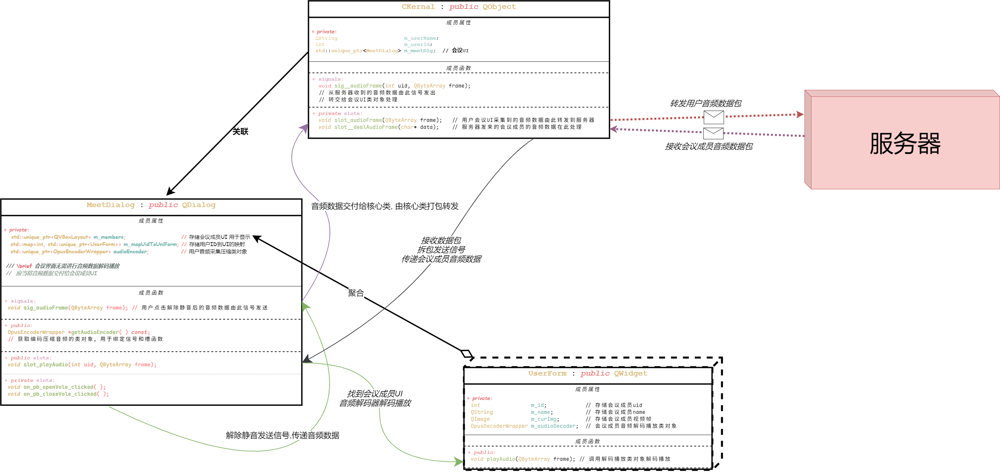

1. 登录注册 系统
2. 大厅  房间系统
3. 采集视频 音频 
4. 编码音频 解码音频 压缩视频
5. 发送 接收视音频
6. 播放视频 播放声音  
7. 优化--多线程 等等


----
# 数据库

```sql title:"Meeting DB SQL sentence"
CREATE DATABASE meeting;                                          '' 0731


DROP TABLE IF EXISTS t_user ;                                     '' 用户信息表 0801
CREATE TABLE t_user (
    u_id bigint NOT NULL AUTO_INCREMENT, 
    u_tel varchar(20) NOT NULL ,
    u_password varchar(70) NOT NULL, 
    u_name varchar(45) NOT NULL, 
    PRIMARY KEY ( u_id )
)ENGINE=InnoDB CHARSET=utf8mb4;
```

- 从 MySQL 8.0 开始，整型的“显示宽度”已经被废弃. 也就是说，`bigint(11)` 和 `bigint` 在存储上没有区别，`(11)` 只在老版本 `ZEROFILL` 时有意义
- 目前 `utf8` 实际上指的是 `utf8mb3`（最多 3 字节），它不能完全存储所有 Unicode 字符（比如某些 emoji）.
- MySQL 计划让 `utf8` 直接变成 `utf8mb4` 的别名（最多 4 字节）.
- 建议**明确指定 `utf8mb4`**，避免以后升级时出现兼容问题

----


 


为什么选CS而不是BS

音频采集,编码为什么选OPUS, 其他方案: speex等

图像采集为什么选opencv,其他 QCamera, ffmpeg?
- 人脸识别. 开源. ffmpeg门槛高
- 

