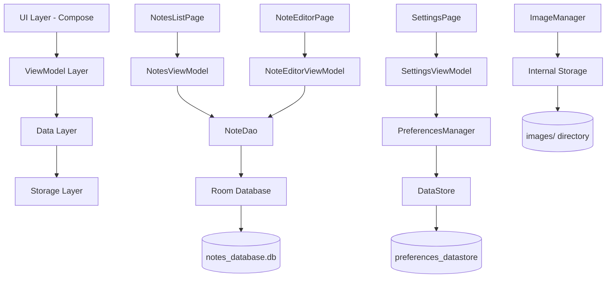

# Notes App 产品报告

## ① 产品功能介绍

Notes App 是一款简洁易用的 Android 笔记应用程序，主要功能包括：

### 核心功能

- **笔记管理**：支持创建、编辑、删除笔记
- **多选操作**：长按进入多选模式，可批量选择、置顶/取消置顶、删除笔记
- **多媒体支持**：支持在笔记中插入图片并预览
- **标签分类**：为笔记添加标签进行分类管理
- **时间戳记录**：自动记录笔记创建和更新时间
- **搜索筛选**：按时间、置顶状态排序显示笔记

### 用户界面特性

- **Material Design 3**：采用现代化的设计语言
- **响应式布局**：适配不同屏幕尺寸
- **夜间模式**：支持深色主题
- **流畅交互**：支持长按、点击等手势操作

## ② 程序概要设计

### 主要组件

1. **NotesListPage**：笔记列表页面，展示所有笔记卡片
2. **NoteEditorPage**：笔记编辑页面，提供富文本编辑功能
3. **SettingsPage**：应用设置页面
4. **NotesViewModel**：管理笔记列表和选择状态
5. **NoteEditorViewModel**：管理单个笔记的编辑状态

### 数据流设计

```
UI Layer (Compose) → ViewModel Layer → Data Layer (Room DB) → Storage
```

### 状态管理

- 使用 Jetpack Compose 的 State 和 Flow 进行状态管理
- ViewModel 负责业务逻辑和数据缓存
- Room 数据库提供本地数据持久化

## ③ 软件架构图



### 架构层次说明

- **UI Layer**: 使用 Jetpack Compose 构建响应式用户界面
- **ViewModel Layer**: 处理业务逻辑，管理 UI 状态
- **Data Layer**: 提供数据访问接口，处理数据转换
- **Storage Layer**: 本地数据存储（数据库、偏好设置、文件）

## ④ 技术亮点及其实现原理

### 1. 响应式状态管理

**技术亮点**: 使用 Jetpack Compose 的 State 和 Flow 实现响应式编程

**实现原理**:

```kotlin
val notes by viewModel.notes.collectAsState()
val selectedNoteIds by viewModel.selectedNoteIds.collectAsState()
```

- 通过 `collectAsState()` 将 Flow 转换为 Compose State
- 当数据源发生变化时，UI 自动重组更新

### 2. 图片压缩与优化

**技术亮点**: 智能图片压缩算法，平衡质量与存储空间

**实现原理**:

```kotlin
private fun compressBitmap(bitmap: Bitmap, maxWidth: Int = 1080, maxHeight: Int = 1080): Bitmap {
    var width = bitmap.width
    var height = bitmap.height
    
    // 计算缩放比例
    val scale = minOf(maxWidth.toFloat() / width, maxHeight.toFloat() / height)
    if (scale < 1.0f) {
        width = (width * scale).toInt()
        height = (height * scale).toInt()
    }
    // ...
}
```

- 动态计算缩放比例，保持原始宽高比
- 最大分辨率限制为 1080p，减少存储空间占用

### 3. 自动保存机制

**技术亮点**: 基于防抖的智能自动保存

**实现原理**:

```kotlin
titleFlow
    .debounce(2000)  // 2秒防抖
    .onEach { saveNote() }
    .launchIn(viewModelScope)
```

- 使用 `debounce` 操作符避免频繁保存
- 在用户停止输入 2 秒后自动保存，提升用户体验

### 4. 类型安全的数据转换

**技术亮点**: Room TypeConverter 实现复杂类型的数据库存储

**实现原理**:

```kotlin
class Converters {
    @TypeConverter
    fun fromStringList(value: String): List<String> {
        return if (value.isEmpty()) {
            emptyList()
        } else {
            value.split(",")
        }
    }

    @TypeConverter
    fun toStringList(value: List<String>): String {
        return value.joinToString(",")
    }
}
```

- 将 `List<String>` 类型转换为逗号分隔的字符串存储
 - 保证类型安全的同时支持复杂数据结构

### 5. 高效的图片加载

**技术亮点**: 使用 Coil 库实现异步图片加载和缓存

**实现原理**:

```kotlin
AsyncImage(
    model = imageFile,
    contentDescription = "笔记图片预览",
    modifier = Modifier.fillMaxSize(),
    contentScale = ContentScale.Crop
)
```

- 异步加载图片，避免阻塞主线程
- 自动内存和磁盘缓存，提升加载速度

### 6. 手势识别与交互

**技术亮点**: 组合点击和长按手势识别

**实现原理**:

```kotlin
.pointerInput(Unit) {
    detectTapGestures(
        onLongPress = { onLongClick() },
        onTap = { onClick() }
    )
}
```

- 使用 Compose 的 pointerInput API 识别复杂手势
- 区分点击和长按操作，提供不同的交互体验

### 7. 生命周期感知的数据观察

**技术亮点**: 使用 stateIn 操作符实现生命周期感知的数据流

**实现原理**:

```kotlin
val notes = noteDao.getAllNotes()
    .stateIn(
        scope = viewModelScope,
        started = SharingStarted.WhileSubscribed(5000),
        initialValue = emptyList()
    )
```

- 当订阅者活跃时才发送数据
- 5秒延迟停止策略，避免不必要的资源消耗

### 8. 安全的文件管理

**技术亮点**: 应用私有目录下的安全文件存储

**实现原理**:

```kotlin
private val imagesDir: File by lazy {
    File(context.filesDir, "images").apply {
        if (!exists()) mkdirs()
    }
}
```

- 使用应用私有目录，防止其他应用访问
- 自动创建目录结构，确保文件存储路径安全

该应用采用了现代 Android 开发的最佳实践，结合 Jetpack Compose、MVVM 架构、响应式编程等技术，实现了功能完整、性能优良的笔记管理应用。


---