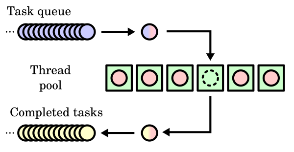

## 池化技术 [pool](https://en.wikipedia.org/wiki/Pool_(computer_science))
池化技术能够减少资源对象的创建次数，提⾼程序的响应性能，特别是在⾼并发下这种提⾼更加明显。使用池化技术缓存的资源对象有如下共同特点：
1. 对象创建时间长；
2. 对象创建需要大量资源；
3. 对象创建后可被重复使用像常见的线程池、内存池、连接池、对象池都具有以上的共同特点。

---

## 线程池 [thread_pool](https://en.wikipedia.org/wiki/Thread_pool)



*可并发任务*
- 线程过多会带来调度开销，进而影响缓存局部性和整体性能。
- 而线程池维护着多个线程，等待着监督管理者分配可并发执行的任务。
- 这避免了在处理短时间任务时创建与销毁线程的代价。
- 线程池不仅能够保证内核的充分利用，还能防止过分调度。
- 可用线程数量应该取决于可用的并发处理器、处理器内核、内存、网络sockets等的数量。 
	- 例如，对于计算密集型任务，线程数上限一般取CPU逻辑核心数+2，线程数过多会导致额外的线程切换开销。

[线程池模式一般分为两种：HS/HA半同步/半异步模式、L/F领导者与跟随者模式](https://zh.wikipedia.org/wiki/%E7%BA%BF%E7%A8%8B%E6%B1%A0#)
- 半同步/半异步模式又称为生产者消费者模式，是比较常见的实现方式，比较简单。分为同步层、队列层、异步层三层。同步层的主线程处理工作任务并存入工作队列，工作线程从工作队列取出任务进行处理，如果工作队列为空，则取不到任务的工作线程进入挂起状态。由于线程间有数据通信，因此不适于大数据量交换的场合。
- 领导者跟随者模式，在线程池中的线程可处在3种状态之一：领导者leader、追随者follower或工作者processor。任何时刻线程池只有一个领导者线程。事件到达时，领导者线程负责消息分离，并从处于追随者线程中选出一个来当继任领导者，然后将自身设置为工作者状态去处置该事件。处理完毕后工作者线程将自身的状态置为追随者。这一模式实现复杂，但避免了线程间交换任务数据，提高了CPU cache相似性。在[ACE](https://zh.wikipedia.org/wiki/ACE%E8%87%AA%E9%80%82%E9%85%8D%E9%80%9A%E4%BF%A1%E7%8E%AF%E5%A2%83 "ACE自适配通信环境")(Adaptive Communication Environment)中，提供了领导者跟随者模式实现。


---
## 内存池 [memory_pool](https://en.wikipedia.org/wiki/Memory_pool)
**固定大小区块规划（fixed-size-blocks allocation）**
**优点**
- 内存池允许在执行期以常量时间规划存储器区块，并且不会有存储器破碎的情况产生。一次归还存储器中成千上万个对象的存储器区块只需要一个操作，无需像 malloc 一般需要个别 free。
- 内存池可以在层次结构式的树状结构中被分群，非常适合某些特定的程序结构，例如[递归](https://zh.wikipedia.org/wiki/%E9%80%92%E5%BD%92 "递归")与[迭代](https://zh.wikipedia.org/wiki/%E8%BF%AD%E4%BB%A3 "迭代")。
- 固定区块大小的内存池不需将每次规划的信息记录下来（例如规划的存储器区块大小，因为每次规划都是一样的）。针对一些小而多的存储器区块规划会节省一些空间。

**缺点**  内存池模块在使用时，必须依照程序需求来做个别调整，才能保持时间与空间效率

**策略**
1. 小块内存（<4k）：先分配一个整块，在整块里每次用一小块内存
2. 大块内存（>4k）：直接分配

**图示**


  
---
## 连接池 
[Connection_pool](https://en.wikipedia.org/wiki/Connection_pool)
- 维护[数据库连接](https://zh.wikipedia.org/wiki/%E6%95%B0%E6%8D%AE%E5%BA%93%E8%BF%9E%E6%8E%A5 "数据库连接")的缓存，以便在将来需要对数据库发出请求时可以重用连接
- 连接池用于提高在数据库上执行命令的性能
- 为每个用户打开和维护数据库连接，尤其是对动态数据库驱动的[网站](https://zh.wikipedia.org/wiki/%E7%B6%B2%E7%AB%99 "网站")应用程序发出的请求，既昂贵又浪费资源。在连接池中，创建连接之后，将连接放在池中并再次使用，这样就不必建立新的连接
- 如果所有连接都正在使用，则创建一个新连接并将其添加到池中
- 连接池还减少了用户必须等待建立与数据库的连接的时间

大白话：创建数据库连接是⼀个很耗时的操作，也容易对数据库造成安全隐患。所以，在程序初始化的时候，集中创建多个数据库连接，并把他们集中管理，供程序使用，可以保证较快的数据库读写速度，还更加安全可靠。这里讲的数据库，不单只是指Mysql，也同样适用于Redis。


---

## 异步请求池
**同步请求要点**：
请求方作为客户端请求后（send/sendto），立即调用（recv/recvfrom）阻塞等待结果返回。


**异步请求要点**：
1. 请求方作为客户端请求后（send/sendto），把fd交给epoll管理，不等待结果返回（recv/recvfrom）。
2. epoll_wait在一个线程死循环中，当epoll收到消息，在进行处理（recv/recvfrom）。


  

  


---
---
---
### 连接池
**什么是数据库连接池**
定义：数据库连接池（Connection pooling）是程序启动时建立足够的数据库连接，并将这些连接组成一个连接池，由程序动态地对池中的连接进行申请，使用，释放。
大白话：创建数据库连接是⼀个很耗时的操作，也容易对数据库造成安全隐患。所以，在程序初始化的时候，集中创建多个数据库连接，并把他们集中管理，供程序使用，可以保证较快的数据库读写速度，还更加安全可靠。这里讲的数据库，不单只是指Mysql，也同样适用于Redis。
**为什么使用数据库连接池**
1. 资源复用：由于数据库连接得到复用，避免了频繁的创建、释放连接引起的性能开销，在减少系统消耗的基础上，另一方面也增进了系统运行环境的平稳性（减少内存碎片以及数据库临时进程/线程的数量）。
2. 更快的系统响应速度：数据库连接池在初始化过程中，往往已经创建了若干数据库连接置于池中备用。此时连接的初始化工作均已完成。对于业务请求处理而言，直接利用现有可用连接，避免了从数据库连接初始化和释放过程的开销，从而缩减了系统整体响应时间。
3. 统⼀的连接管理：避免数据库连接泄露，在较为完备的数据库连接池实现中，可根据预先的连接占用超时设定，强制收回被占用连接。从而避免了常规数据库连接操作中可能出现的资源泄露。
**如果不使用连接池**
4. TCP建立连接的三次握手（客户端与MySQL服务器的连接基于TCP协议）
5. MySQL认证的三次握手
6. 真正的SQL执行
7. MySQL的关闭
8. TCP的四次握手关闭
可以看到，为了执行⼀条SQL，需要进行TCP三次握手，Mysql认证、Mysql关闭、TCP四次挥手等其他操作，执行SQL操作在所有的操作占比非常低。


优点：实现简单
缺点：
- 网络IO较多
- 带宽利用率低
- QPS较低
- 应用频繁低创建连接和关闭连接，导致临时对象较多，带来更多的内存碎片
- 在关闭连接后，会出现大量TIME_WAIT 的TCP状态（在2个MSL之后关闭）

**使用连接池**
第⼀次访问的时候，需要建立连接。但是之后的访问，均会复用之前创建的连接，直接执行SQL语句。


  

优点：
1. 降低了网络开销
2. 连接复用，有效减少连接数。
3. 提升性能，避免频繁的新建连接。新建连接的开销比较大
4. 没有TIME_WAIT状态的问题

缺点：
1. 设计较为复杂

**长连接和连接池的区别**
- 长连接是⼀些驱动、驱动框架、ORM工具的特性，由驱动来保持连接句柄的打开，以便后续的数据库操作可以重用连接，从而减少数据库的连接开销。
- 而连接池是应用服务器的组件，它可以通过参数来配置连接数、连接检测、连接的生命周期等。
- 连接池内的连接，其实就是长连接。

**数据库连接池运行机制**
1. 用户发送请求，把请求插入到消息队列
2. 线程池中的线程竞争从消息队列拿出任务（涉及多线程竞争，加锁）
3. 线程从连接池获取或创建可用连接（涉及多线程竞争，加锁）
4. 利用连接对象和用户请求任务请求数据库数据
5. 使用完毕之后，把连接返回给连接池 （涉及多线程竞争，加锁）

在系统关闭前，断开所有连接并释放连接占用的系统资源；


  

**连接池和线程池的关系**
连接池和线程池的区别：
- 线程池：主动调用任务。当任务队列不为空的时候从队列取任务取执行。比如去银行办理业务，窗口柜员是线程，多个窗口组成了线程池，柜员从排号队列叫号执行。
- 连接池：被动被任务使用。当某任务需要操作数据库时，只要从连接池中取出⼀个连接对象，当任务使用完该连接对象后，将该连接对象放回到连接池中。如果连接池中没有连接对象可以用，那么该任务就必须等待。比如去银行用笔填单，笔是连接对象，我们要用笔的时候去取，用完了还回去

连接池和线程池设置数量的关系：
- ⼀般线程池线程数量和连接池连接对象数量⼀致；
- ⼀般线程执行任务完毕的时候归还连接对象；

**线程池设计要点**
使⽤连接池需要预先建立数据库连接
线程池设计思路：
1. 连接到数据库，涉及到数据库ip、端口、用户名、密码、数据库名字等；a. 连接的操作，每个连接对象都是独立的连接通道，它们是独立的 b. 配置最小连接数和最大连接数
2. 需要⼀个队列管理他的连接，比如使用list；
3. 获取连接对象
4. 归还连接对象

**（同步方式）连接池的实现（伪代码）**
```
#include <mysql.h>

//数据库连接类（一个对象对应一个Mysql/Redis连接）
class CDBConn {
	int Init(); //初始化，连接数据库操作
	MYSQL* 		m_mysql;	// 对应一个连接
}；

//连接池
class CDBPool {
	int 		Init();		// 连接数据库，用于for循环创建CDBConn对象并且调用CDBConn->Init()
	CDBConn* 	GetDBConn(const int timeout_ms = -1);	// 获取连接资源（即从m_free_list拿出一个连接对象）
	void 		RelDBConn(CDBConn* pConn);	// 归还连接资源（即把连接对象放回m_free_list）
	list<CDBConn*>	m_free_list;	// 空闲的连接
	list<CDBConn*>	m_used_list;	// 记录已经被请求的连接
};

//用户请求的任务
struct job
{
    void* (*callback_function)(void *arg);    //线程回调函数
    void *arg;                                //回调函数参数
    struct job *next;
};

//线程池
struct threadpool{
	//用户请求的任务插入到job list中
	struct job *head;  //指向job的头指针
    struct job *tail;  //指向job的尾指针
    
    //工作线程
    int thread_num;       //线程池中开启线程的个数	
	pthread_t *pthreads;  //线程池中所有线程的pthread_t
};


//工作线程执行的函数
void *threadpool_function(void *arg){
	while(1){
		//从消息队列中取任务
		task = pop_task();
		//从连接池取一个数据库连接对象
		CDBConn *pDBConn = pDBPool->GetDBConn();      
		//请求数据库（同步方式，阻塞等待数据库消息返回）
		query_db(pDBConn, task);
		//把数据库连接对象放回连接池
		pDBPool->RelDBConn(pDBConn); 	
	}
}
```

**连接池连接设置数量**
连接数 = ((核心数 * 2) + 有效磁盘数)
按照这个公式，即是说你的服务器 CPU 是 4核 i7 的，那连接池连接数大小应该为 ((4\*2)+1)=9

这里只是⼀个经验公式。还要和线程池数量以及具体业务结合在⼀起

### 线程池
服务端epoll三种处理客户端信息方法模型：
```
while(1){
int n = epoll_wait();
for(n){
    #if //写法一 网络线程处理解析以及业务逻辑后直接发给客户端（单线程服务端）
    recv(fd, buffer, length, 0);
    parser();
    send();
        
    #elseif //写法二：网络线程把收到fd交给工作线程处理解析以及业务逻辑和发给客户端（多线程服务器）
        //该模式有缺点：可能存在多个线程同时对一个fd进行操作！
        //场景：同一个客户端短时间内发来多条请求，被分给了多个不同的线程处理，那么就出现多个线程同时对一个fd操作的情况。如果线程一个对fd写，另一个线程对fd进行close，就会引发错误
        //因此需要特殊处理。处理方法：加入协程。每个协程处理一个IO。但是底层依然是依赖于epoll管理所有IO
        task = fd;
        push_tasks(task);
        
    #else //写法三：网络线程解析完信息后，交给工作线程处理业务逻辑和发给客户端（多线程服务器）
        recv(fd, buffer, length, 0);
        push_task(buffer);
        #endif		
    }
}
```

**线程池图示**


### 内存池
**为什么要用内存池**：
1. 在需要堆内存管理一些数据的时候直接malloc，容易造成内存碎片
2. 在需要堆内存管理一些数据的时候直接malloc，容易忘记free，造成内存泄漏，利于内存管理

**策略**
1. 小块内存（<4k）：先分配一个整块，在整块里每次用一小块内存
2. 大块内存（>4k）：直接分配

**图示**


  

### 异步请求池
**同步请求要点**：
请求方作为客户端请求后（send/sendto），立即调用（recv/recvfrom）阻塞等待结果返回。


**异步请求要点**：
1. 请求方作为客户端请求后（send/sendto），把fd交给epoll管理，不等待结果返回（recv/recvfrom）。
2. epoll_wait在一个线程死循环中，当epoll收到消息，在进行处理（recv/recvfrom）。


  

  

  