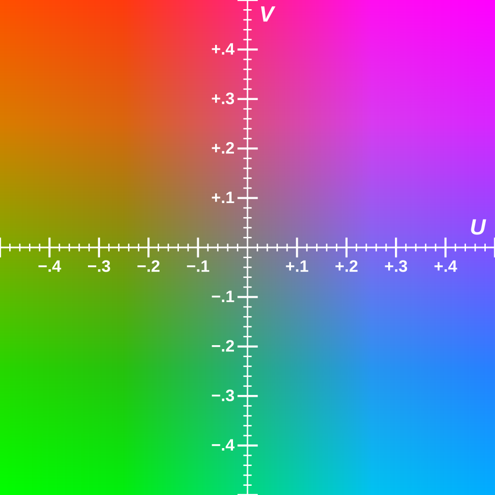

# [YUV](https://en.wikipedia.org/wiki/Y%E2%80%B2UV)与RGB编码格式了解多少

> RGB 是常见的颜色表示方式，用红绿蓝三个分量直接表示颜色；
> YUV 则把图像分为亮度和色度。人眼对亮度比颜色更敏感，所以视频通常用 YUV，这样可以在保持清晰度的同时对色度分量做下采样，显著减少数据量，非常适合压缩和传输。而且 YUV 格式也是 H.264/H.265 等视频编码标准的主流输入

    
	

        <dl>
		  <dt><strong>YUV</strong>，是一种<a href="https://zh.wikipedia.org/wiki/%E9%A1%8F%E8%89%B2">颜色</a><a href="https://zh.wikipedia.org/wiki/%E7%B7%A8%E7%A2%BC">编码</a>方法</dt>
			<dd>YUV是编译true-color颜色空间（color space）的种类，Y'UV, YUV, <a herf="https://zh.wikipedia.org/wiki/YCbCr">YCbCr</a>，<a herf="https://zh.wikipedia.org/wiki/YPbPr">YPbPr</a>等专有名词都可以称为YUV，彼此有重叠</dd>
			<dd>“Y”表示<a herf="https://zh.wikipedia.org/wiki/%E6%B5%81%E6%98%8E">明亮度</a>（Luminance、Luma），“U”和“V”则是<a herf="[https://zh.wikipedia.org/wiki/%E8%89%B2%E5%BA%A6_\(%E8%89%B2%E5%BD%A9%E5%AD%A6\](https://zh.wikipedia.org/wiki/%E8%89%B2%E5%BA%A6_/(%E8%89%B2%E5%BD%A9%E5%AD%A6/)">色度</a>、<a herf="[https://zh.wikipedia.org/wiki/%E6%BF%83%E5%BA%A6_\(%E8%89%B2%E5%BD%A9%E5%AD%B8\)](https://zh.wikipedia.org/wiki/%E6%BF%83%E5%BA%A6_/(%E8%89%B2%E5%BD%A9%E5%AD%B8/))">浓度</a>（Chrominance、Chroma）</dd>
			<dd>Y'代表明亮度(luma; brightness)而U与V存储色度(色讯; chrominance; color)部分; 亮度(luminance)记作Y，而Y'的prime符号记作伽玛校正</dd>
		  </dl>
    

YUV Formats分成两个格式：

- 紧缩格式（packed formats）：将Y、U、V值存储成Macro Pixels数组，和[RGB](https://zh.wikipedia.org/wiki/RGB "RGB")的存放方式类似。
- 平面格式（planar formats）：将Y、U、V的三个分量分别存放在不同的矩阵中。

紧缩格式（packed format）中的YUV是混合在一起的，对于YUV4:2:2格式而言，用紧缩格式很合适的，因此就有了UYVY、YUYV等。平面格式（planar formats）是指每Y分量，U分量和V分量都是以独立的平面组织的，也就是说所有的U分量必须在Y分量后面，而V分量在所有的U分量后面，此一格式适用于采样（subsample）。平面格式（planar format）有I420（4:2:0）、YV12、IYUV等。

### 为什么视频编码一般用 YUV 而不是 RGB

1. **符合人眼视觉特性**
    
    - 人眼对亮度变化比色彩变化敏感
    - 例如黑白电视只传亮度信息，人仍能看清图像细节
2. **方便压缩（色度抽样）**
    
    - 在 YUV 中，可以对色度分量进行下采样，比如 **YUV 4:4:4 → YUV 4:2:0**
    - 这意味着亮度信息每个像素都有，而色度信息每 2×2 像素只存一个
    - 这样能大幅减少数据量，但画质损失很小（人眼不容易察觉）
3. **历史原因 & 兼容性**
    
    - YUV 最初是为彩色电视向下兼容黑白电视设计的（只取 Y 分量就是黑白图像）
    - 视频标准（如 MPEG、H.264、H.265）普遍使用 YUV
4. **存储 & 带宽效率**
    
    - YUV 更适合视频压缩编码，减少数据冗余
    - RGB 直接存储或压缩效率较低，文件会更大

### YUV可能导致的视频问题
- 绿屏
内存没有对齐或者分辨率选择不当会导致内容斜体YUV格式设置不当(实际就是)（eg 设置为 YV12或者NV12等）会导致颜色显示不正常很明显 YUV420P 的U V格式与NV12的不同；

YUV420P 的U V 存放是平面格式， U V分开连续存放；而NV12的存放是打包格式 ，U V交叉存放 ；

大多数YUV格式平均使用的每像素位数都少于24位。YUV444是最逼真的格式，一格不删（24 bits），即每4个Y，配上4个U，还有4个V；YUV422则是在UV格式上减半，即每4个Y，配2个U，2个V；YUV420则是在UV上减至1/4之格式，即每4个Y，配1个U，再配1个V。

这些公式是基于NTSC standard;

$Y′=0.299×R+0.587×G+0.114×B$
$U=−0.147×R−0.289×G+0.436×B$
$V=0.615×R−0.515×G−0.100×B$

*绿屏原因是R和B计算为0, 只有G*

---
----
# 数据库表结构变更导致线上熔断

**场景：**  
你要给 `files` *表加一个新字段* `checksum VARCHAR(64)`，在*业务高峰期*执行了 `ALTER TABLE`，结果几分钟后应用开始报 `Lock wait timeout`，大量请求超时. 为何会出现这种情况？  如何做零停机演进？  

- <strong style="color:e67e80">MySQL 在执行 DDL 时对整表加了元数据锁 MDL，阻塞所有读写；</strong> 高并发下连锁等待导致超时。  

零停机方案 :
   - 使用 **在线DDL** 工具：[Percona Toolkit](https://cloud.tencent.com/developer/article/1533505) 的 [`pt-online-schema-change`](https://docs.percona.com/percona-toolkit/pt-online-schema-change.html) 或阿里的 `gh-ost`，利用触发器和 shadow table 逐步同步数据；  
   - 先创建新表并异步复制全量/增量，再切流量、替换表名、删除旧表；  也就是Percona Toolkit的方案.
   - 或者使用 MySQL 8.0+ 的原生 `ALGORITHM=INPLACE, LOCK=NONE`（若支持）执行在线 DDL

----

# 为什么用OPUS?
- 12.1 了解其他的音频播放吗?

> 实时语音通话我们选择了 Opus。主要原因是它是 IETF 标准化的开源编解码器，在低比特率下音质优于 Speex，并且能在网络条件不稳定时自适应调整比特率，保证实时性和清晰度。同时，它延迟非常低，可以做到 20ms 以内，非常适合语音通话。另外，Opus 不仅能处理语音，也能处理音乐，比 Speex 应用范围更广。我之前也用过 Speex，但它现在基本处于维护状态，社区和 WebRTC 官方都推荐使用 Opus，所以我们切换了
> 
> 除了 Opus，我也了解一些常见编解码器，比如SDL,  G.711、G.729、AMR 系列主要用于传统语音通信；AAC、MP3 更常用于音乐或流媒体；FLAC 用于无损存储。这些各有优劣，但在实时语音场景下，Opus 是目前最优的选择

# 介绍一下C语言面向过程编程, C++面向对象编程, 说说区别

> C 语言是一种典型的面向过程编程语言，核心是通过函数把问题拆解成步骤，数据和操作是分开的。比如银行账户的例子，会用结构体保存数据，用函数去修改它
> 
> C++ 则是面向对象的，它把数据和操作封装在类里，通过对象进行建模，并且支持继承和多态，适合处理复杂系统和扩展需求
> 
> 简单来说：C 更关注“怎么做”，C++ 更关注“对象是谁、能做什么”

# 介绍一下封装继承多态?

`Animal Dog Cat Speak`

> 封装是把数据和方法包装在类里，并通过访问控制隐藏细节，保证对象的独立性；  
> 继承是子类复用父类代码，并能扩展或修改功能，提高代码复用性；  
> 多态是相同接口在不同对象上的不同实现，常用虚函数实现，可以让父类指针调用子类方法，提高扩展性。

# 多态实现原理?

> C++ 的多态分为编译期和运行期。
> *编译期多态*通过函数/函数重载和模板实现，编译时就确定了调用关系。
> *运行期多态*是通过虚函数实现的，编译器会为含有虚函数的类生成虚函数表，每个对象内部有一个虚表指针 `vptr`，指向对应类的虚函数表。当通过父类指针或引用调用虚函数时，实际是通过 `vptr` 查表得到真正的函数地址，从而根据对象的实际类型来执行不同的方法。
> 
> 所以多态的本质是 **通过虚表实现的间接调用**

----

# lamuda表达式何时会失效
Lambda 表达式本身不会失效，但它捕获的变量可能会导致失效。最常见的情况是：

1. **按引用捕获局部变量**，但在 lambda 被调用时变量已销毁，引用悬空
2. **按值捕获指针**，指向的对象被释放，lambda 内部访问悬空指针
3. **返回 lambda** 时捕获了局部变量引用，会导致返回后的 lambda 无效
4. 在多线程场景中，lambda 捕获的引用若超出作用域，也可能失效

所以，本质上 lambda 的有效性取决于 **捕获变量的生命周期**。

----
----
----

# IOCP是阻塞的还是非阻塞的

IOCP是异步IO, 不涉及传统阻塞还是非阻塞. 但工作线程会阻塞在`{c}GetQueuedCompletionStatus()`, 等待完成队列出现事件

-----

# `auto`和`decltype`的区别, `decltype`推导的分类
- auto 自动推导类型, 会丢弃顶层`const`和引用.
- `decltype` 不会丢弃const与引用

分类: `{cpp}decltype(expr) var;` 
1. expr为没有括号的表达式或者变量: 推到为声明类型
2. expr为函数: 推导为函数返回值类型
3. expr为左值表达式`(a)`: 推到为`T&`;
4. expr为右值表达式: 推导为`T`;

结合使用auto占位

----

# ext2文件系统, 最大存多大文件? 用户上传的文件太大存不下怎么办?

|             |          | 文件系统支持单文件最大~~理论~~值                                         |
| ----------- | -------- | ---------------------------------------------------------- |
| Windows文件系统 | 文件系统格式   | 文件大小限制                                                     |
|             | FAT12    | 最大支持8M                                                     |
|             | FAT16    | 最大支持2G                                                     |
|             | FAT32    | 不能大于4G                                                     |
|             | NTFS     | 最大64GB                                                     |
|             | NTFS5.0  | 最大2TB                                                      |
|             |          |                                                            |
| Linux文件系统   | 文件系统格式   | 文件大小限制                                                     |
|             | ext2格式   | *块大小为1024字节的话，单一文件最大容量是16GB；* 块大小为4096字节的话，单一文件最大容量为2TB |
|             | ext3文件系统 | 块大小为4K的时候，其支持的单个文件大小为最大，最大为4TB                             |
|             | ext4文件系统 | 单个文件理论可以大于16TB                                             |

> 目前我们的服务器跑在 Linux 的 ext2 文件系统上，块大小是 1KB，因此单个文件的最大限制是 16GB。所以在当前环境下，用户能够上传的最大文件就是 16GB。如果需要支持更大的文件，有几种方案：
> 
> 1. 从系统层面，可以*升级文件系统*，比如使用 ext4 或 XFS，就可以支持 TB 级文件
> 2. 从应用层面，可以采用*分片上传和存储*，把大文件拆分成小文件存储，再在逻辑层拼接，这和主流对象存储的做法类似

## ext2文件系统,块大小1024字节, 单一文件最大容量16GB是怎么算出来的?

结论先说：
在 ext2、块大小 1 KB 的前提下，单文件可寻址的数据块数大约是
`12 + 256 + 256^2 + 256^3 = 16,843,020` 个数据块；
每块 1 KB，所以最大文件尺寸约为 `16,843,020 KB ≈ 16.06 GiB`。课程或资料里常把它近似为“16 GB”。

- 怎么算出来的

ext2 的 inode 里有 15 个块指针（4 字节/指针，32 位块号）：

* 12 个直接指针（direct）
* 1 个一次间接指针（single-indirect）
* 1 个二次间接指针（double-indirect）
* 1 个三次间接指针（triple-indirect）

块大小 = 1024 B => 一个“间接块”能装的指针数 = 1024 / 4 = **256** 个。

能寻址的数据块总数：

* 直接：`12`
* 一次间接：`256`
* 二次间接：`256 × 256 = 65,536`
* 三次间接：`256 × 256 × 256 = 16,777,216`

合计：`12 + 256 + 65,536 + 16,777,216 = 16,843,020` 数据块
换算容量：`16,843,020 × 1 KB ≈ 16.06 GiB`（≈ 17,233,354,240 B）

> 注：
>
> * 这些是**数据块**。为了索引它们，文件系统还需要额外的“间接块”（元数据）来存放指针，但这些元数据块不计入文件内容大小，只占磁盘空间。
> * 早期 Linux/工具链可能受 32 位 `off_t` 等限制而只能实际创建 ≤2 GiB 的大文件；但从文件系统结构上，在 1 KB 块时可寻址上限就是约 16 GiB。
> * 块越大，上限越高；例如块为 4 KB 时，一个间接块能放 1024 个指针，对应上限会显著增大。

----

# QT事件循环机制

> Qt 的事件循环是通过 `QApplication::exec()` 启动的，本质上是一个*消息循环*，它不断从操作系统取消息，封装为 `QEvent` 并分发到相应对象
> 信号与槽的调用也依赖事件循环来调度
> *Qt 的 UI 必须运行在主线程*，事件循环保证了界面的响应和异步机制
> 如果事件循环被阻塞，界面就会卡死，所以耗时操作一般放在子线程里处理

----

# HTTPS的连接重放, HTTPS是如何解决的

- 连接重放就是指, 在SSL/TLS连接过程中, 如果只是简单的将服务器发来的公钥加密会话密钥, 攻击者就可以利用公钥加密数据发送 到服务器, 也就是冒充客户端向服务器发送相同的报文, 导致服务器一以为是客户端与其通信, 产生又一次连接.
- HTTPS如何解决的: clienthello中的r1与serverhello中的r2 与客户端生成的r3(PMS)构成MS, 将MS切片得到会话密钥和鉴别密钥. 这时生成的密钥不同, 因此攻击者截取了也生成不了正常报文, 服务器自然能够区分

