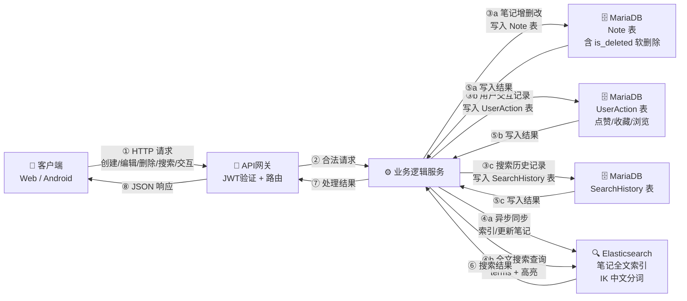
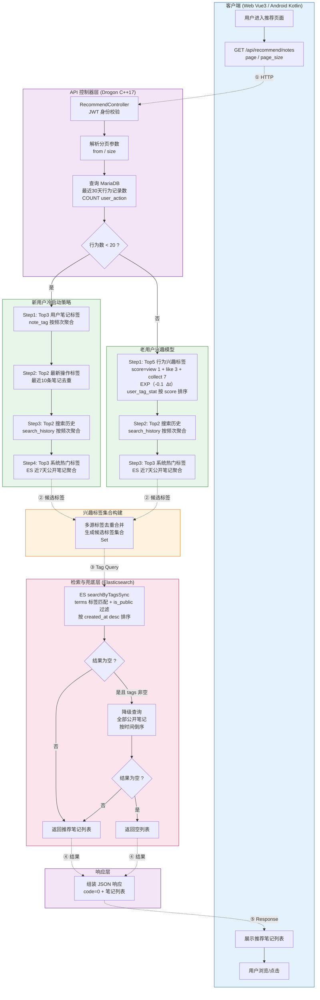
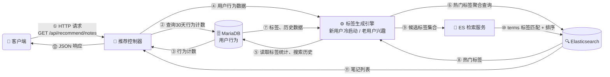

# 登录
以下是为您的毕业论文设计的 **用户登录流程图（图3-1）**，采用 Mermaid 语法绘制，严格结合了 Calcite 项目的实际技术实现（Web 端 `Vue 3 + Axios + localStorage`、Android 端 `Kotlin + Retrofit + DataStore`、服务端 `Drogon C++17 + MariaDB`）以及论文所述的 JWT / HMAC-SHA256 / 密码哈希校验等核心机制。

---

### 图 3-1 用户登录流程图（Mermaid 源码）

```mermaid
flowchart TD
    %% ==================== 客户端层 ====================
    subgraph Client ["客户端 (Web Vue3 / Android Kotlin)"]
        C1([开始]) --> C2[用户输入用户名与密码]
        C2 --> C3{前端表单校验}
        C3 -->|不通过| C4[提示格式错误] --> C2
        C3 -->|通过| C5[Axios / Retrofit<br/>POST /api/auth/login]
        C6[接收服务端响应] --> C7{code == 0 ?}
        C7 -->|否| C8[提示登录失败]
        C7 -->|是| C9[存储 JWT 访问令牌]
        C9 --> C9a[Web: localStorage.setItem<br/>Android: DataStore.saveToken]
        C9a --> C10[跳转首页 / 加载用户数据]
        C10 --> C11([结束])
        C8 --> C11
    end

    %% ==================== 服务端层 ====================
    subgraph Server ["服务端 (Drogon C++17 RESTful API)"]
        S1[AuthController::loginUser<br/>解析请求 JSON] --> S2{参数非空校验}
        S2 -->|不通过| S3[返回 code=1<br/>请求参数错误]
        S2 -->|通过| S4[AuthService::loginUser]
        S4 --> S5[ORM 查询 MariaDB<br/>User 表]
        S5 --> S6{用户记录存在 ?}
        S6 -->|否| S7[返回 code=1<br/>用户名或密码错误]
        S6 -->|是| S8[PasswordUtil::verifyPassword<br/>密码哈希比对]
        S8 --> S9{校验通过 ?}
        S9 -->|否| S7
        S9 -->|是| S10[JwtUtil::generateToken<br/>HMAC-SHA256 签名]
        S10 --> S11[构造 Payload<br/>{user_id, username, exp}]
        S11 --> S12[组装 JWT 字符串<br/>Header.Payload.Signature]
        S12 --> S13[返回 code=0<br/>data: {token, user_id, username}]
    end

    %% ==================== 数据层 ====================
    subgraph DB ["数据库 (MariaDB)"]
        D1[(User 表<br/>username / password_hash / email)]
    end

    %% ==================== 跨层数据流 ====================
    C5 -.->|① HTTP Request| S1
    S5 -.->|② SQL Query| D1
    D1 -.->|③ 返回用户记录| S5
    S3 -.->|④ JSON Response| C6
    S7 -.->|④ JSON Response| C6
    S13 -.->|④ JSON Response| C6

    %% ==================== 样式 ====================
    style Client fill:#e3f2fd,stroke:#1565c0,stroke-width:2px
    style Server fill:#e8f5e9,stroke:#2e7d32,stroke-width:2px
    style DB fill:#fff3e0,stroke:#ef6c00,stroke-width:2px
```

---

### 架构师视角的关键设计说明（可直接作为论文配图文案）

| 阶段 | 本项目实现 | 对应论文技术要点 |
|------|-----------|----------------|
| **① 前端校验** | Web 端使用 Element Plus 表单规则；Android 端在 `LoginViewModel` 中执行非空与长度校验。 | 保证非法请求不进入后端，降低服务端压力。 |
| **② 密码安全** | 服务端使用 `PasswordUtil::verifyPassword` 对用户输入与 MariaDB 中存储的密码哈希进行比对，**不保存、不传输明文密码**。 | 论文所述“通过对用户密码进行哈希校验实现身份认证”。 |
| **③ JWT 生成** | `JwtUtil::generateToken` 基于 **OpenSSL HMAC-SHA256** 签名；Payload 包含 `user_id`、`username` 与 `exp` 过期时间戳；密钥从环境变量 `CALCITE_JWT_SECRET` 读取。 | 论文所述“基于 HMAC-SHA256 算法生成 JWT 令牌，令牌中包含用户标识及过期时间”。 |
| **④ 无状态认证** | 登录成功后服务端仅返回 Token，**不在服务端维护 Session 状态**；后续请求由前端拦截器（Web: `request.js` / Android: `AuthInterceptor`）自动注入 `Authorization: Bearer <token>`。 | 论文所述“基于 JWT 实现无状态认证，避免传统会话机制带来的服务器存储压力”。 |
| **⑤ 客户端持久化** | Web 端写入 `localStorage`；Android 端写入 Jetpack **DataStore**。登录失效（401）时统一清除 Token 并跳转登录页。 | 对应论文“在后续请求中通过请求头进行身份校验”。 |

---

### 使用建议

1. **插入论文**：将上述 Mermaid 源码粘贴到支持 Mermaid 的编辑器（如 Typora、VS Code + 插件、或在线渲染器）即可导出为 `.png` / `.svg` 高清矢量图，作为图 3-1 插入。
2. **如需黑白打印**：去掉 `style` 样式行，Mermaid 默认渲染即为黑白线框，适合论文打印。
3. **如需时序图变体**：若您的导师更偏好“时序图”风格，我可以再提供一个 **Sequence Diagram** 版本，以 `Client → Server → DB` 的交互时序方式呈现同一流程。


# 笔记管理
以下是为您的毕业论文设计的 **笔记管理流程图（图3-2）**，采用 Mermaid 语法绘制，严格结合了 Calcite 项目实现细节：Web 端 `md-editor-v3 + Pinia`、Android 端 `Markwon + Room`、后端 `Drogon ORM`、双存储架构 `MariaDB + Elasticsearch`、以及核心的 **软删除** 与 **异步 ES 同步** 机制。

---

### 图 3-2 笔记管理流程图（Mermaid 源码）

```mermaid
flowchart TD
    %% ==================== 客户端层 ====================
    subgraph Client ["客户端 (Web Vue3 / Android Kotlin)"]
        C1[用户操作入口] --> C2{操作类型}
        C2 -->|创建/编辑| C3[Markdown 编辑器<br/>md-editor-v3 / Markwon<br/>Pinia Store / ViewModel]
        C2 -->|删除| C4[确认删除对话框]
        C2 -->|搜索| C5[搜索框输入关键词<br/>防抖 300ms]
        C2 -->|点赞/交互| C6[点击点赞/收藏]
        C3 --> C7[Axios / Retrofit<br/>Authorization: Bearer Token]
        C4 --> C7
        C5 --> C7
        C6 --> C7
    end

    %% ==================== API 网关层 ====================
    subgraph Controller ["API 网关层 (Drogon C++17)"]
        A1[NoteController<br/>NoteFolderController] --> A2[verifyTokenAndGetUserId<br/>JWT 身份校验]
        A2 --> A3{Token 有效?}
        A3 -->|否| A4[返回 401<br/>清除 Token 跳转登录]
        A3 -->|是| A5[参数解析与<br/>路由分发]
    end

    %% ==================== 业务逻辑层 ====================
    subgraph Service ["业务逻辑层 (Service + ORM)"]
        S1{操作类型} -->|创建/更新| S2[ORM 写入/更新 MariaDB<br/>Note 表<br/>校验笔记所有权]
        S1 -->|删除| S3[ORM 软删除<br/>setIsDeleted = 1<br/>校验笔记所有权]
        S1 -->|搜索| S4[直接查询 Elasticsearch<br/>IK 中文分词 + Highlight 高亮]
        S1 -->|交互| S5[ORM 写入 UserAction<br/>更新 Note 计数统计]

        S2 --> S6{DB 操作成功?}
        S3 --> S7{DB 操作成功?}
        S6 -->|否| S8[返回业务错误]
        S7 -->|否| S8
        S6 -->|是| S9[异步同步 ES<br/>esClient.indexDocument<br/>或 updateDocument]
        S7 -->|是| S10[异步同步 ES<br/>esClient.deleteDocument]

        S4 --> S11[结果按 score 排序分页<br/>公开搜索时异步写入 SearchHistory]
        S5 --> S12[返回操作状态]
    end

    %% ==================== 数据存储层 ====================
    subgraph Data ["数据存储层 (双存储结构)"]
        M1[(MariaDB<br/>Note 表<br/>软删除标记 is_deleted)]
        M2[(MariaDB<br/>UserAction / SearchHistory<br/>NoteTag 关联表)]
        E1[(Elasticsearch<br/>笔记全文索引<br/>IK 分词器)]
    end

    %% ==================== 跨层数据流 ====================
    C7 -.->|① HTTP Request| A1
    A5 -.->|② 路由分发| S1
    S2 -.->|③ SQL| M1
    S3 -.->|③ SQL| M1
    S4 -.->|③ Query DSL| E1
    S5 -.->|③ SQL| M2
    S9 -.->|④ Async Index| E1
    S10 -.->|④ Async Delete| E1
    S11 -.->|⑤ 记录历史| M2

    %% ==================== 响应汇聚 ====================
    S9 --> R1[返回 code=0<br/>data: {note_id, ...}]
    S10 --> R1
    S11 --> R2[返回 code=0<br/>搜索结果列表 + 高亮片段]
    S12 --> R3[返回 code=0<br/>状态信息]
    S8 --> R4[返回 code=1<br/>错误信息]
    A4 --> R4

    R1 -.->|⑥ HTTP Response| C3
    R1 -.->|⑥ HTTP Response| C4
    R2 -.->|⑥ HTTP Response| C5
    R3 -.->|⑥ HTTP Response| C6
    R4 -.->|⑥ HTTP Response| CErr[前端错误提示]

    %% ==================== 样式 ====================
    style Client fill:#e3f2fd,stroke:#1565c0,stroke-width:2px
    style Controller fill:#f3e5f5,stroke:#6a1b9a,stroke-width:2px
    style Service fill:#e8f5e9,stroke:#2e7d32,stroke-width:2px
    style Data fill:#fff3e0,stroke:#ef6c00,stroke-width:2px
```

---

### 架构师视角的关键设计说明（可直接作为论文配图文案）

| 设计特征 | 本项目实现 | 对应论文描述 |
|---------|-----------|-------------|
| **① 双存储架构** | 写操作（创建/更新/删除）先通过 Drogon ORM 写入 **MariaDB**；再由 `esClient_.indexDocument` / `updateDocument` / `deleteDocument` **异步同步**至 Elasticsearch。 | 论文所述“数据库+搜索引擎双存储结构”、“先写入 MariaDB，随后异步同步至 ES”。 |
| **② 软删除策略** | `NoteController::deleteNote` 不执行物理删除，而是调用 `setIsDeleted(true)` 标记状态；`listNotes` 查询时通过 ORM Criteria 强制过滤 `is_deleted = 0`。 | 论文所述“软删除策略，通过标记字段控制数据状态，避免误删除带来的数据丢失”。 |
| **③ 搜索走 ES** | `searchNotes` 直接调用 `esClient_.search()`，使用 **IK 中文分词**与 **Highlight 高亮**；公开搜索时异步写入 `SearchHistory` 表用于后续推荐。 | 论文所述“结合 Elasticsearch 实现全文检索功能”。 |
| **④ 权限隔离** | 所有笔记操作均通过 `verifyTokenAndGetUserId` 校验 JWT，并在 Service 层比对 `note.user_id`，确保用户只能操作自己的笔记（公开笔记除外）。 | 论文接口设计表中“JWT 认证”的体现。 |
| **⑤ 前端状态管理** | Web 端采用 **Pinia Store** 管理编辑器状态（`editingNote`、`saveStatus`、`hasUnsavedChanges`），配合 `md-editor-v3` 实现 Markdown 所见即所得；Android 端通过 **ViewModel + Repository** 模式对接 Room 本地缓存与 Retrofit 远程同步。 | 对应项目 AGENTS.md 中的“数据流：组件 → Store → API → 后端”。 |

---

### 使用建议

1. **关于双存储一致性**：图中特意将 ES 同步画为**异步虚线**（步骤 ④），以强调论文所述“ES 失败不得阻塞主流程”的工程权衡。若需在论文中进一步阐述，可在正文补充“最终一致性”说明。
2. **如需突出单一操作**：若您的导师希望图 3-2 更聚焦，可以删除“点赞/交互”分支（`C6 / S5 / S12`），仅保留 **CRUD + Search** 四条主线，图幅会更紧凑。
3. **如需黑白打印**：删除四个 `style` 样式行即可，Mermaid 默认黑白线框完全适配论文打印要求。


## DS数据流

根据你的要求，我将数据流细化，明确标注了每一类数据最终落到了**MariaDB 的哪张表**还是**Elasticsearch 的哪个索引**。



**数据目的地详解**

| 操作类型 | 数据内容 | 目的地 |
|---------|---------|--------|
| **创建/编辑笔记** | 标题、内容、标签、所有权 | **MariaDB Note 表**（主存储）<br>**Elasticsearch 笔记索引**（异步同步） |
| **删除笔记** | is_deleted = 1 | **MariaDB Note 表**（软删除）<br>**Elasticsearch** 异步删除文档 |
| **搜索笔记** | 关键词查询 | **Elasticsearch** 执行检索，高亮结果 |
| **记录搜索历史** | 搜索词、用户ID | **MariaDB SearchHistory 表** |
| **点赞/收藏** | 用户动作、笔记ID | **MariaDB UserAction 表**（动作记录）<br>同时更新 Note 表计数 |

这样你可以清楚看到：**写操作的核心数据落在 MariaDB，Elasticsearch 仅作为检索副本由异步任务维护；交互与历史记录持久化在 MariaDB，而搜索直接依赖 ES 的索引。**


# OCR

以下是为您的毕业论文设计的 **OCR 处理流程图（图3-3）**，采用 Mermaid 语法绘制，严格结合了 Calcite 项目实现细节：Web 端 `Axios + pollOCRStatus`、Android 端 `Retrofit + 协程轮询`、后端 `Drogon 异步回调`、MinIO 对象存储、外部 OCR 服务调用，以及核心的 **"先响应、后处理"** 异步架构。

---

### 图 3-3 OCR 处理流程图（Mermaid 源码）

```mermaid
flowchart TD
    %% ==================== 客户端层 ====================
    subgraph Client ["客户端 (Web Vue3 / Android Kotlin)"]
        C1[用户选择文件<br/>图片 / PDF] --> C2{操作类型}
        C2 -->|普通文件上传| C3[POST /api/file/upload<br/>multipart/form-data]
        C2 -->|OCR识别| C4[POST /api/ocr/recognize<br/>multipart/form-data]
        C5[接收响应<br/>file_id + status=processing] --> C6[前端轮询查询状态]
        C6 --> C7{status?}
        C7 -->|done| C8[获取 url / note_id<br/>展示或自动打开笔记]
        C7 -->|failed| C9[提示处理失败]
        C7 -->|processing| C6
    end

    %% ==================== 同步响应层 ====================
    subgraph Sync ["同步响应层 (Drogon Controller)"]
        S1[JWT 身份校验] --> S2[解析 Multipart<br/>提取文件数据]
        S2 --> S3{文件类型校验}
        S3 -->|OCR且不通过| S4[返回 400<br/>不支持的文件类型]
        S3 -->|通过| S5[生成 MinIO ObjectKey<br/>userId/yyyy/mm/dd/uuid.ext]
        S5 --> S6[ORM 插入 MariaDB<br/>FileResource 表<br/>status = processing]
        S6 --> S7[立即返回 HTTP 响应<br/>{file_id, status: processing}]
    end

    %% ==================== 异步处理层 ====================
    subgraph Async ["异步处理层 (后台任务)"]
        A1{操作类型} -->|普通上传| A2[异步上传 MinIO<br/>minioClient_.uploadFile]
        A1 -->|OCR识别| A3[调用外部 OCR 服务<br/>OcrService::recognize<br/>Base64 编码 + HTTP POST]
        A3 --> A4{OCR 成功?}
        A4 -->|否| A5[更新 DB<br/>status=failed]
        A4 -->|是| A6[文本清洗 sanitizeText<br/>生成 Markdown]
        A6 --> A7[自动创建笔记<br/>NoteMapper.insert<br/>标题: ocr_YYYYMMDD_HHMMSS]
        A7 --> A8[异步索引 ES<br/>esClient_.indexDocument]
        A7 --> A9[异步上传 MinIO]
        A2 --> A10[更新 FileResource<br/>status=done + url]
        A9 --> A11[更新 FileResource<br/>status=done<br/>关联 note_id + url]
    end

    %% ==================== 状态查询层 ====================
    subgraph Query ["状态查询层"]
        Q1[GET /ocr/status<br/>GET /file/status] --> Q2[ORM 查询 MariaDB<br/>FileResource 表]
        Q2 --> Q3[返回当前状态<br/>及 url / note_id]
    end

    %% ==================== 数据存储层 ====================
    subgraph Storage ["数据存储层"]
        M1[(MariaDB<br/>FileResource 表)]
        M2[(MariaDB<br/>Note 表)]
        E1[(Elasticsearch<br/>笔记全文索引)]
        MINIO[(MinIO 对象存储<br/>bucket: notes-files)]
        OCR_API[外部 OCR 服务<br/>layout-parsing API]
    end

    %% ==================== 跨层数据流 ====================
    C3 -.->|① HTTP| S1
    C4 -.->|① HTTP| S1
    S4 -.->|② Response| C5
    S7 -.->|② Response| C5
    S6 -.->|③ SQL| M1

    S6 -.->|④ 触发| A1
    A2 -.->|⑤ S3 API| MINIO
    A3 -.->|⑤ HTTP| OCR_API
    A7 -.->|⑥ SQL| M2
    A8 -.->|⑦ Async Index| E1
    A9 -.->|⑤ S3 API| MINIO
    A5 -.->|⑧ SQL| M1
    A10 -.->|⑧ SQL| M1
    A11 -.->|⑧ SQL| M1

    C6 -.->|⑨ 轮询 HTTP| Q1
    Q1 -.->|⑩ SQL| M1
    Q3 -.->|⑨ Response| C7

    style Client fill:#e3f2fd,stroke:#1565c0
    style Sync fill:#f3e5f5,stroke:#6a1b9a
    style Async fill:#e8f5e9,stroke:#2e7d32
    style Query fill:#fce4ec,stroke:#c2185b
    style Storage fill:#fff3e0,stroke:#ef6c00
```

---

### 架构师视角的关键设计说明（可直接作为论文配图文案）

| 设计特征 | 本项目实现 | 对应论文描述 |
|---------|-----------|-------------|
| **① 先响应、后处理** | `OcrController::recognize` 在收到请求后，先将文件记录以 `status=processing` 写入 **MariaDB**，**立即返回 `file_id`**；随后通过回调链 `processOcrWorkflow` 在后台执行 OCR、创笔记、传 MinIO。前端通过 `pollOCRStatus`（Web 1.5s / Android 2.5s）轮询结果。 | 论文所述"采用'先响应、后处理'的方式，提高系统响应速度"。 |
| **② MinIO 对象存储** | `MinioClient` 基于 AWS Signature V4 构建 Authorization Header，异步上传至 `notes-files` bucket；ObjectKey 按 `userId/yyyy/mm/dd/uuid.ext` 规则生成，确保文件隔离与可寻址。 | 论文所述"采用 MinIO 进行文件存储，并通过异步方式处理文件上传任务"。 |
| **③ 外部 OCR 服务** | `OcrService::recognize` 将文件 Base64 编码后，HTTP POST 至外部 `layout-parsing` API；解析返回的 JSON 提取 `markdownText`。超时设置为 300 秒以支持大文件。 | 论文所述"调用外部服务对图片或文档进行解析"。 |
| **④ 自动生成笔记** | OCR 成功后，`createNoteFromOcr` 自动创建 Note 记录：标题格式为 `ocr_YYYYMMDD_HHMMSS`，内容经 `sanitizeText` 清洗（去除 null bytes、非法 UTF-8、转义控制字符），默认放入根目录（`folder_id=0`）。 | 论文所述"将识别结果转换为文本内容自动生成笔记"。 |
| **⑤ 双存储一致性** | 笔记创建成功后，同步触发 `esClient_.indexDocument` 将 OCR 生成的笔记索引至 **Elasticsearch**，保证后续可全文检索。 | 与笔记管理模块的"数据库+搜索引擎"双存储架构保持一致。 |

---

### 使用建议

1. **突出异步架构**：图中步骤 ②（立即返回）与步骤 ④~⑧（后台异步处理）在时序上是解耦的，建议在论文正文中用"异步非阻塞"关键词描述 Controller 层的回调链设计。
2. **关于 sanitizeText**：`OcrController` 中对 OCR 返回的原始文本执行了严格的清洗（去除 `\0`、非法 UTF-8、转义控制字符），这是生产环境防止数据库插入失败的关键细节，可在论文"实现要点"中补充说明。
3. **如需聚焦纯 OCR 流程**：若您的导师希望图 3-3 仅聚焦 OCR 而不包含普通文件上传，可以删除 `C3`、`A2`、`A10` 三个节点及与之相关的连线，图幅会更紧凑。


# 推荐

以下是为您的毕业论文设计的 **推荐算法流程图（图4-1）**，采用 Mermaid 语法绘制，严格结合了 Calcite 项目实现细节：后端 `RecommendController` 的新老用户分层逻辑、`user_tag_stat` 行为加权与时间衰减 SQL、新用户多源冷启动标签融合、以及 **Elasticsearch 标签匹配 + 多级兜底** 检索策略。

---

### 图 4-1 推荐算法流程图（Mermaid 源码）



---

### 架构师视角的关键设计说明（可直接作为论文配图文案）

| 设计特征 | 本项目实现 | 对应论文描述 |
|---------|-----------|-------------|
| **① 新老用户分层** | `RecommendController::recommendNotes` 通过 SQL `SELECT COUNT(*) FROM user_action WHERE user_id = ? AND created_at >= DATE_SUB(NOW(), INTERVAL 30 DAY)` 统计最近 30 天行为数；阈值设为 **20**，低于阈值判定为新用户，否则为老用户。 | 论文所述"依据用户在最近30天内的行为记录数量对用户进行分层"。 |
| **② 老用户兴趣模型** | 基于 `user_tag_stat` 表计算：`score = (view_count × 1 + like_count × 3 + collect_count × 7) × EXP(-0.1 × DATEDIFF(NOW(), last_action_time))`，取 Top5。其中浏览/点赞/收藏分别赋权 **1/3/7**，衰减系数 **λ = 0.1**，使近期行为影响更大。 | 论文所述"基于行为加权与时间衰减的兴趣计算模型...收藏权重最高、点赞次之、浏览最低...引入指数衰减函数增强时效性"。 |
| **③ 新用户冷启动** | `fetchNewUserTags` 采用四步流水线（Step1→Step2→Step3→Step4），依次从"用户笔记标签 Top3 → 最新操作标签 Top2 → 搜索历史 Top2 → 系统热门标签 Top3"中提取候选标签，通过 `std::set` 自动去重合并。 | 论文所述"多源信息融合的冷启动策略，从用户已有笔记标签、最新操作标签、搜索历史以及系统热门标签中提取候选标签，去重合并"。 |
| **④ ES 标签匹配检索** | `EsClient::searchByTagsSync` 构造 Elasticsearch `bool` 查询：`must` 子句使用 `terms` 匹配标签，`filter` 子句强制 `is_public = true`，并按 `created_at` 倒序排序。 | 论文所述"基于 Elasticsearch 执行标签匹配查询，从公开笔记库中检索包含相关标签的内容"。 |
| **⑤ 多级兜底机制** | 第一层兜底：若 `searchByTagsSync(tags)` 返回空且 tags 非空，自动降级为 `searchByTagsSync({})` 查询全部公开笔记；第二层兜底：若 ES 查询超时或失败，返回空列表，由前端展示"暂无推荐"。 | 论文所述"当标签匹配结果为空时，自动降级为返回最新公开笔记，以保证推荐结果的可用性"。 |

---

### 使用建议

1. **关于行为加权与衰减的数学表达**：论文正文中的公式建议写为  
   $$Score_{tag} = \sum_{i \in \{view, like, collect\}} (w_i \times count_i) \times e^{-\lambda \cdot \Delta t}$$  
   其中 $w_{view}=1, w_{like}=3, w_{collect}=7, \lambda=0.1$。代码中通过 SQL 直接聚合计算，避免了逐条行为遍历的性能开销。

2. **关于热门标签的实时性**：`getHotTagsSync` 使用 ES `terms` 聚合，仅统计近 7 天（`now-7d/d`）的公开笔记标签，保证热门标签的时效性，避免陈旧标签干扰推荐。

3. **如需突出单一用户路径**：若导师希望图 4-1 仅展示老用户或新用户的单侧流程，可删除对应子图（`NewUser` 或 `OldUser`）及分流判断，仅保留一条垂直主干。但建议保留双侧对比，更能体现"动态选择不同推荐策略"的论文核心思想。

## DS数据流图
基于你给出的详细业务流程图，我提取了核心的数据流向，画了一张更高层次的**简单数据流图**，重点展示组件之间的数据传递，省略内部判断与步骤细节。



**图例说明**  
- 外部实体：客户端  
- 处理过程：推荐控制器、标签生成引擎、ES 检索服务  
- 数据存储：MariaDB（用户行为、标签、搜索历史）、Elasticsearch（笔记索引、热门标签）  
- 数据流用带编号的箭头表示，编号对应原始流程中的关键步骤顺序