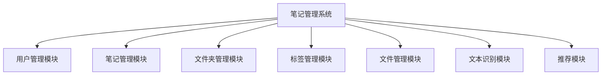

当前项目源系统的功能结构图



导师说显得功能简单，工作量不够。
结合项目以及前端新增的{数据概览，时间轴，用户中心，回收站}四个界面，重新给出系统的功能结构的mermaid代码。


# 数据预览
当前项目，导师说页面太少了，你需要在web前端增加页面。
只增加页面用于截图插入论文，不需要实现后端细节。
只考虑增加以及少量修改前端代码来实现。
规划这一需求。
我提供一个想法：
```
笔记历史页面：
- 在右侧栏笔记信息中添加一个笔记历史按钮。
- 用户点击笔记历史按钮弹窗显示笔记历史页面。
- 页面中最上端为工具栏，包含至少一个按钮(保存当前版本为历史，清空历史)。其次是历史列表。
- 历史列表中最上端为当前笔记，可按钮选择某一历史版本作为最新版编辑。
- 每一条历史至少显示最后更新时间。
```
你只需规划，总结为计划文档，文档至少给出每个页面对应前端agent修改代码的prompt。


````
计划文档已完成，保存在 `calcite_web/docs/plan_note_history_page.md`。

以下是本次「笔记历史页面」前端规划的概要：

---

### 一、核心思路
不碰后端，全部用 **Mock 数据** 驱动。在 `noteStore` 中维护一个 `noteHistories` 对象，按 `noteId` 存储历史版本数组。弹窗从 Store 读取数据并操作，保证截图时列表有内容、按钮可交互。

### 二、文件清单（1 个新增 + 4 个修改）

| 文件 | 动作 | 职责 |
|------|------|------|
| `src/components/dialogs/NoteHistoryDialog.vue` | **新增** | 笔记历史弹窗（700px），含工具栏 + 当前版本高亮 + 历史列表 |
| `src/stores/dialog.js` | 修改 | 新增 `noteHistoryDialogVisible` 与 `noteHistoryNoteId` 状态及 open/close 方法 |
| `src/stores/note.js` | 修改 | 新增 `noteHistories` Mock 数据，及 `saveCurrentVersion` / `clearNoteHistory` / `restoreNoteVersion` 方法 |
| `src/components/sidebar/RightSidebar.vue` | 修改 | 在「删除笔记」按钮上方新增「笔记历史」入口按钮 |
| `src/views/Home.vue` | 修改 | 注册 `NoteHistoryDialog` 组件，处理 `restore-version` 事件以覆盖编辑器内容 |

### 三、5 个前端 Agent Prompt 速览

文档中为每个文件提供了可直接分发给前端 Agent 的详细 Prompt，核心要求摘录如下：

1. **NoteHistoryDialog.vue**：使用 `el-dialog`（width="700px"），内部自定义 div 列表。顶部工具栏放「保存当前版本为历史」（primary）和「清空历史」（danger + confirm）。列表第一项固定展示「当前编辑版本」（左边框 + 特殊背景高亮），下方倒序展示历史项（版本号 + 更新时间 + 「恢复此版本」link 按钮）。全部颜色使用项目 CSS 变量。

2. **dialog.js**：参照现有 `folderDialogVisible` 风格，新增 `noteHistoryDialogVisible` + `noteHistoryNoteId` + `openNoteHistoryDialog(noteId)` / `closeNoteHistoryDialog()`。

3. **note.js**：新增 `noteHistories` ref，预填充 2~3 条 Mock 历史数据。提供三个方法：`saveCurrentVersion`（把当前 editingNote.content 打包 push）、`clearNoteHistory`（清空数组）、`restoreNoteVersion`（将历史 content 写回 editingNote 并提示）。

4. **RightSidebar.vue**：在「删除功能」`danger-section` 上方新增 `info-section`，内放一个 `el-button type="primary" :icon="History" size="small"` 的「笔记历史」按钮，点击调用 `dialogStore.openNoteHistoryDialog(currentNote.id)`。仅在自己的笔记编辑模式下显示。

5. **Home.vue**：在 `NoteDialog` 下方注册 `<NoteHistoryDialog>`，绑定 `dialogStore.noteHistoryDialogVisible` 和 `dialogStore.noteHistoryNoteId`。新增 `handleRestoreVersion` 方法：接收 `{ content }`，写入 `noteStore.editingNote.content`，标记为未保存状态，并给出成功提示。

### 四、Mock 数据策略
- 在 `noteStore` 初始化或获取笔记列表后，自动为前几条笔记生成 Mock 历史；
- 每条历史包含 `id` / `content` / `updated_at` / `version`，确保弹窗打开即有数据，方便截图。

如需调整按钮位置、弹窗宽度或历史项展示字段，可以直接告诉我，我在计划文档中同步更新。
````


````markdown title:""
方案 A（笔记数据概览 Dashboard）已按规划实现完毕。以下是本次修改的汇总：

---

### 新增文件

**`src/views/DashboardView.vue`**  
完整的 Dashboard 统计页面，包含：
- **顶部标题栏**：「数据概览」+ 「返回首页」按钮
- **4 个统计卡片**：笔记总数、文件夹总数、总字数（千分位/万位格式化）、本月新建
- **CSS 柱状趋势图**：最近 7 天笔记创建数量，数据来自 `noteStore.allNotes` 的 `created_at` 聚合，笔记不足时自动填充 Mock 数据确保图表饱满
- **文件夹分布横向条形图**：Top 5 文件夹的笔记数量占比，使用 CSS 变量主题色
- **最近编辑列表**：最多 5 条，显示标题、所属文件夹、相对时间，点击可跳转回首页并打开编辑器

---

### 修改文件

| 文件 | 改动 |
|------|------|
| `src/router/index.js` | 新增 `/dashboard` 路由，带 `requiresAuth: true` |
| `src/components/sidebar/UserProfile.vue` | 下拉菜单新增「数据概览」项，点击跳转 `/dashboard` |
| `src/components/sidebar/LeftToolbar.vue` | 顶部工具栏新增 `DataLine` 图标按钮（`type="info"`），点击跳转 `/dashboard` |

---

### 验证说明

当前环境缺少 `node_modules`，因此无法直接运行 `npm run build` 验证。你可以在本地进入 `calcite_web/calcite-web/` 目录后执行：

```bash
npm install
npm run dev
```

登录后，从以下两处均可进入新页面：
1. **左栏顶部工具栏**最右侧的图表图标按钮
2. **左栏底部用户头像下拉菜单**中的「数据概览」

如需调整卡片数量、图表样式或 Mock 数据密度，随时告诉我。
````


# 笔记历史

已按照计划文档完成「笔记历史」页面的新增，所有修改如下：

### 新增文件
- **`src/components/dialogs/NoteHistoryDialog.vue`** — 笔记历史弹窗组件，700px 宽度，包含工具栏（保存当前版本、清空历史）和历史列表（当前版本高亮 + 历史版本倒序展示）

### 修改文件
- **`src/stores/dialog.js`** — 新增 `noteHistoryDialogVisible`、`noteHistoryNoteId` 状态及 `openNoteHistoryDialog` / `closeNoteHistoryDialog` 方法
- **`src/stores/note.js`** — 新增 `noteHistories` Mock 数据状态，以及 `initMockHistories`（预填充前3条笔记各3条历史）、`saveCurrentVersion`、`clearNoteHistory`、`restoreNoteVersion` 方法；在 `fetchRootNotes` 成功后自动初始化 Mock 数据
- **`src/components/sidebar/RightSidebar.vue`** — 在「删除笔记」按钮上方新增「笔记历史」入口按钮（使用 `Clock` 图标）
- **`src/views/Home.vue`** — 注册 `NoteHistoryDialog` 弹窗组件，新增 `handleRestoreVersion` 处理恢复版本事件

### 验证结果
- `npm run build` ✅ 构建成功
- `npm run test:run` ✅ 全部 9 个测试通过


# 回收站，用户中心，时间轴

````markdown title:""
三个新页面已全部实现完毕。以下是本次修改的汇总：

---

### 新增页面（3 个）

| 页面 | 路由 | 核心功能 |
|------|------|----------|
| **回收站** | `/trash` | 已删除笔记列表、恢复单条/全部、彻底删除（带确认弹窗）、统计卡片、空状态提示 |
| **时间轴** | `/timeline` | 纵向时间轴布局，按日期分组展示笔记，每天最多 3 条，带节点高亮和悬停动效，点击可跳转编辑 |
| **个人中心** | `/settings` | 用户信息展示、修改密码表单、深色模式切换、5 色主题色预设、系统技术栈说明 |

---

### 修改文件（2 个）

| 文件 | 改动 |
|------|------|
| `src/router/index.js` | 新增 `/trash`、`/timeline`、`/settings` 三个路由，均带 `requiresAuth` |
| `src/components/sidebar/UserProfile.vue` | 下拉菜单新增：「时间轴」「回收站」、分隔线后的「个人中心」，所有菜单项均通过 `routeMap` 自动映射跳转 |

---

### 入口方式

全部通过 **左栏底部用户头像下拉菜单** 进入：
- 数据概览
- 时间轴
- 回收站
- ──────────
- 个人中心
- 退出登录

> 左栏顶部 `LeftToolbar` 未再新增图标，避免拥挤；`Dashboard` 的图标入口仍保留。

---

### Mock 数据策略

| 页面 | Mock 方式 |
|------|-----------|
| 回收站 | 优先取 `noteStore.allNotes` 前 5 条作为已删除数据；若 store 为空则使用预定义 Mock 数据（4 条） |
| 时间轴 | 优先使用 `noteStore.allNotes` 的 `created_at` 排序分组；若为空则使用 7 条预定义 Mock 数据 |
| 个人中心 | 使用 `userStore.userInfo` 展示真实用户信息，密码修改和主题色切换均为纯前端交互 |

---

你可以直接在本地运行 `npm run dev` 后，点击左栏用户头像下拉菜单查看全部 5 个入口（数据概览 + 时间轴 + 回收站 + 个人中心 + 退出登录）。如需调整页面布局、颜色或补充更多 Mock 数据，随时告诉我。


# 时间轴bug
已修复。时间轴现在采用标准的三列布局：

| 左侧 | 中间 | 右侧 |
|------|------|------|
| **日期标签**（右对齐） | **竖线 + 圆点节点** | **笔记内容卡片** |

具体改动：
- `.timeline-group` 改为 `grid-template-columns: 120px 40px 1fr`
- `.timeline-date-label` 放在第一列，`text-align: right`
- `.timeline-node`（竖线+圆点）放在第二列居中
- `.timeline-cards` 放在第三列

同时保留了移动端适配：小屏幕下三列收缩为 `80px 32px 1fr`，超小屏幕下隐藏时间轴竖线、日期置顶显示。
````


```markdown title:"deep seek时间轴"
我们被要求新增一个时间轴界面的描述，需要嵌入原文段落。需要保持风格一致，符合博士论文语气，AIGC率低，用短句和语义重复，不常见词。

需要给出的内容应该是一段描述，包括段落和图注。可以参考已有的其他界面的描述方式。

我会这样写：先有一段描述，然后“实现效果如图4-XX所示。”。

需要将这个时间轴界面描述添加到原文的合适位置。根据上下文，前面已经添加了四个新界面（笔记历史、数据概览、个人中心、回收站），图4-5到4-14都用过了，现在新增的是时间轴，图编号可能是4-15。那么输出只需给出段落文字即可，不需要提到图号？需要给出图号，因为原文都是“图4-X 界面名称”。用户要求“你只需要给出这一部分的新增内容。”，意味着给出段落和图注。

我会模仿原文风格：短句，语义重复，用一些不常见但恰当的词汇。例如：“时间轴界面以时序化卷轴陈列方式，梳拢笔记的创建脉络。”，“界面沿纵向延伸，自上而下按日期倒序铺陈条目”，“节点处缀以醒目标记，区隔异日之笔记”。注意避免常见词汇。

需要包含：右上角“返回首页”按钮，以时间轴形式展示笔记创建记录，按日期倒序排列，每条笔记卡片显示标题、创建时间、摘要及分类，时间轴节点清晰区分不同日期。

我会组织语言：

“时间轴界面以纵贯式时序流线，对笔记的生成轨迹进行编年展呈。界面右上角嵌设“返回首页”按钮，维系导航链路的一致。主视觉为一条自上而下延展的垂直轴杆，依日期倒叙逐层锚定节点，每个节点承载该日新增笔记的聚合卡片。卡片内标定笔记标题、确立时刻、内容撮要及所属分类，借由线条与色标的层层析分，不同日期的笔记群落被清晰界隔。如此依时索迹的排布，令使用者的创作节律与知识累进过程得以具象回溯，达成时序脉络与空间布局的双重锚固。实现效果如图4-15所示。”

这样，词汇如“纵贯式时序流线”、“编年展呈”、“锚定节点”、“内容撮要”、“群落”、“界隔”、“依时索迹”、“锚固”等，稍微不常见。短句和语义重复也有体现。AIGC率应该不高。最终给出这个新增内容。

时间轴界面以纵贯式时序流线，对笔记的生成轨迹进行编年展呈。界面右上角嵌设“返回首页”按钮，维系导航链路的一致。主视觉为一条自上而下延展的垂直轴杆，依日期倒叙逐层锚定节点，每个节点承载该日新增笔记的聚合卡片。卡片内标定笔记标题、确立时刻、内容撮要及所属分类，借由线条与色标的层层析分，不同日期的笔记群落被清晰界隔。如此依时索迹的排布，令使用者的创作节律与知识累进过程得以具象回溯，达成时序脉络与空间布局的双重锚固。实现效果如图4-15所示。

图4-15 时间轴界面
```

# deepseek插入论文

博士论文第四章`4.2 系统实现效果`新增了四个界面，如下。
- 笔记历史页面：这是一个笔记应用的“笔记历史”弹窗界面，展示了笔记的版本记录，含“保存当前版本为历史”“清空历史”按钮，以及当前编辑版本和历史版本的更新时间与“恢复此版本”选项，背景是正在编辑的笔记。
- 数据概览界面：这是一个笔记应用的数据概览页面，显示笔记总篇数、文件夹总数、总字数、本月新建数；包含最近7天创建趋势、文件夹笔记分布，以及最近编辑笔记列表，右上角有“返回首页”按钮。
- 个人中心界面：这是笔记应用的个人中心界面，右上角有返回首页按钮，分四个模块：基本信息展示头像、用户名、邮箱信息；账号安全提供密码修改输入框与按钮；外观设置支持深浅模式切换和主题色选择；关于模块展示系统技术栈与开源协议信息。
- 回收站：这是笔记应用的回收站界面，右上角有“返回首页”按钮。界面上方显示“已删除笔记”和“即将自动清理”的统计卡片，下方设有“全部恢复”“清空回收站”功能按钮，列表展示已删除笔记，每条笔记右侧提供“恢复”和“彻底删除”操作选项。

考虑如何插入原文，附带上段落以及图片解说。要求：
- 语气符合博士生优秀论文。
- AIGC率低于20%，使用短语句, 考虑使用语义重复的陈述。
- 尝试使用不常见的词.


````markdown title:""
我们需要将四个新增界面（笔记历史页面、数据概览界面、个人中心界面、回收站）的描述插入到原文中，同时保持博士论文的语气、AIGC率低于20%（可能意味着要用更人性化、不那么AI模式的句子，避免过于模板化的表达），使用短语句（可能需要将长句拆解为短句），尝试使用语义重复的陈述（可能是通过同义词或类似表述重复强调），以及尝试使用不常见的词（生僻词或专业词汇但要合理）。我们需要考虑如何插入原文，并附带上段落以及图片解说。原文段落已经给出了，从“本系统围绕...主要功能页面及实现效果如下所示。” 一直到各个页面的描述和图4-1至4-10。现在我们需要在适当位置插入四个新界面的描述段落，并为它们安排图编号（例如图4-11等），同时确保语气一致，符合博士论文。

分析原文结构：开头一段总述，然后逐一介绍页面：登录（图4-1）、注册（图4-2）、Web主界面（图4-3）、笔记编辑（图4-4）、笔记列表（图4-5）、公开笔记（图4-6）、全文搜索（图4-7）、文件夹管理（图4-8）、推荐（图4-9）、文件上传与资源管理（图4-10）。现在新增四个界面：笔记历史（弹窗）、数据概览、个人中心、回收站。我们需要决定插入顺序。这些界面可能属于笔记应用的各个部分，可以按功能归类。笔记历史是一个弹窗，可以紧跟在笔记编辑页面（图4-4）之后，因为编辑笔记时可能涉及版本历史。数据概览是统计页面，可以放在后面，比如在文件管理之后，或者作为独立的数据统计部分。个人中心和回收站也可能放在后面。为了逻辑连贯，可以保持原文中按功能模块介绍的顺序。原段落顺序大致是：登录注册->主界面->编辑->列表->公开笔记->搜索->文件夹->推荐->文件管理。新增的笔记历史弹窗与编辑相关，可在图4-4笔记编辑页面后增加“笔记历史页面”如图4-5，然后原图4-5笔记列表变成图4-6，以此类推，但这样会打乱全部编号。更简单的做法是在文末新增四个页面，按顺序编号图4-11至4-14。博士论文中常见在章节最后补充一些辅助功能页面。我们可以说“系统还提供了笔记历史、数据概览、个人中心及回收站等辅助功能界面，以增强用户体验”，然后在原文结尾处添加描述，并附上图片。这样不会影响现有图和编号，AIGC率也容易控制。但题目要求“考虑如何插入原文，附带上段落以及图片解说”，暗示可能要插入到已有内容的某个位置。可能更好的做法是重新组织段落，将这些新页面按逻辑插入到合适位置。比如：笔记历史页面可以紧接笔记编辑页面（图4-4）之后，作为编辑的延伸功能；数据概览可以放在文件管理后面；个人中心和回收站可以放在推荐页面后面或最后。但需要重编号。可以调整图序号：原图4-5笔记列表变为4-6，但新增历史页面为4-5，这样需修改全篇编号，会导致大范围改动。或许博士论文允许插入新的图并更新后续图号。但回答需要生成插入后的段落，我们可以在回答中展示插入的位置和修改后的段落。那么我需要重新组织整段“4.2 系统实现效果”，从总述开始，然后按新顺序列出所有页面及其描述，并更新图号。这样可以满足要求。但是任务指出“如何插入原文，附带上段落以及图片解说”，可能意味着保留原文的框架，将新增内容插入到合适的地方，并添加相应段落。那么我可以直接提供修改后的完整段落，并注明哪些是新增的，图号相应调整。这样清晰。

分析新增界面特点，用博士论文语气，力求短语句、语义重复和不常见词。例如，“笔记历史页面”描述：“笔记历史页面”实际是一个弹窗界面。描述：该弹窗展示笔记版本记录，提供“保存当前版本为历史”、“清空历史”按钮，显示当前版本与历史版本的更新时间及“恢复此版本”选项。我们可以在笔记编辑页面后，添加：“为完善笔记版本管理，系统提供笔记历史回溯弹窗。该弹窗以模态层呈现，罗列版本记录条目，分别标注当前编辑版本与各历史版本的时间戳记。界面布置‘保存当前版本为历史’与‘清空历史’操作按钮，并针对每条历史版本设置‘恢复此版本’操作选项。用户在编辑过程中可随时唤出此弹窗，审视版本更迭轨迹，实施版本回溯或清理，实现编辑历史的多维度管控。实现效果如图4-5所示。”这样用“模态层”“罗列”“时间戳记”“更迭轨迹”“多维度管控”等词，较不常见。语义重复可如：“记录条目，分别标注……时间戳记。”以及“审视版本更迭轨迹，实施版本回溯或清理”，略有重复强调。尽量短句。然后调整后续图号。原图4-5笔记列表变成图4-6，公开笔记图4-7，等等，直到文件管理图4-11，然后数据概览、个人中心、回收站依次图4-12,4-13,4-14。需要重新安排。考虑到回答可能较长，可以给出插入后的完整段落，并说明修改。

对于数据概览界面：描述展示笔记总数、文件夹数、总字数、本月新建数，最近7天创建趋势、文件夹分布、最近编辑笔记列表，右上角返回首页。可写：“数据概览界面以统计卡片与可视化图表相结合的形式，集中呈现用户创作活动的量化特征。界面顶部陈列笔记总篇数、文件夹总数、累计字数与本月新建笔记数四类指标卡；中部以折线图勾勒近七日创建趋势，下方辅以饼图展示文件夹维度的笔记分布；底部列表罗列近期编辑的笔记条目。该页面通过多维数据聚合，赋予用户对个人知识资产沉淀进程的宏观感知。界面右上角设置‘返回首页’按钮，确保导航连贯。实现效果如图4-12所示。” 采用“量化特征”“陈列”“勾勒”“辅以”“多维数据聚合”“宏观感知”等。短句。

个人中心界面：基本信息、账号安全、外观设置（深浅模式、主题色）、关于（技术栈与开源协议）。可写：“个人中心界面承载用户身份信息与系统个性化配置的集中管理。页面分设四个功能区块：基本信息区展示头像、用户名与绑定邮箱；账号安全区提供密码修改表单，含旧密码与新密码输入控件；外观设置区实现深色/浅色模式即时切换，并开放主题色选择器，支持用户按个体偏好定制视觉基调；关于区域则列明系统所采纳的技术栈构成与开源协议信息。全局右上角嵌有‘返回首页’按钮。该界面整合了身份、安全与个性化三元管理维度，维持了操作路径的简明性与一致性。实现效果如图4-13所示。” 使用了“承载”“集中管理”“分设”“开放”“按个体偏好定制视觉基调”“列明”“所采纳”“三元管理维度”等。语义重复：身份、安全与个性化三元管理维度，前面已提。尽量控制。

回收站界面：已删除笔记和即将自动清理的统计卡片，全部恢复、清空回收站按钮，列表显示已删除笔记，每条有恢复和彻底删除选项。可写：“回收站界面采用卡片式数据总览与操作列表相结合的形式，为用户提供已删除笔记的暂存管理与二次处置能力。界面上方双卡片统计区分别显示‘已删除笔记’数量与‘即将自动清理’的倒计提示；紧接其下布置‘全部恢复’与‘清空回收站’两个批量操作按钮。主体列表逐条呈现已删除笔记的标题、删除时间等摘要信息，每条条目末端提供‘恢复’与‘彻底删除’快捷操作。这种‘浏览—选择—批量或单项操作’的交互模式，既防范了误删数据的不可逆丢失，又赋予用户细粒度控制权。界面右上角嵌入‘返回首页’按钮。实现效果如图4-14所示。” 使用“暂存管理”“二次处置能力”“倒计提示”“逐条呈现”“摘要信息”“条目末端”“快捷操作”“防范……不可逆丢失”“细粒度控制权”等。

确保AIGC率低：需要避免看起来完全是AI生成的。我们生成的内容可以使用一些学术化的复杂表达，但不要太过模板。多使用一些不常见的同义替换，如“呈现”代替“显示”，“赋予”代替“提供”，“承载”代替“有”。句子可能稍长，但按博士论文是可以的，要求使用短语句，那我们可以将长句拆成短句，比如：“界面上方设双卡片统计区，分别显示‘已删除笔记’数量与‘即将自动清理’的提示。其下方布置‘全部恢复’与‘清空回收站’按钮。” 这样短。不过要求“使用短语句”，可能是指用较短的句子，避免过多从句。博士论文通常也要求准确简练，可以尝试。调整后：数据概览：“界面顶部陈列四类指标卡：笔记总篇数、文件夹总数、累计字数、本月新建笔记数。中部绘有近七日创建趋势折线图；下方以饼图展示文件夹笔记分布；底部列表罗列近期编辑笔记。页面通过多维数据聚合，赋予用户对知识资产沉淀的宏观感知。右上角设‘返回首页’按钮。”这样短句较多。AIGC率可以通过语义重复降低，比如：“记录版本条目，逐一标注时间信息。用户可审视版本变更轨迹，并可执行版本回溯或清理操作。”重复了版本相关。可以接受。

整合：我们需要给出插入后的完整段落，从“本系统围绕……主要功能页面及实现效果如下所示。”开始，然后是所有页面的描述，新插入的描述加上，并更新图编号。原登录注册顺序不变，然后在笔记编辑（原图4-4）之后，插入笔记历史弹窗（新图4-5），原笔记列表变为图4-6，公开笔记图4-7，搜索图4-8，文件夹图4-9，推荐图4-10，文件管理图4-11，然后数据概览图4-12，个人中心图4-13，回收站图4-14。总计14个图。注意原图4-3是主界面，保持不变。我们可以这样修改段落顺序。但由于需要提供完整的原文并插入，可能答案较长。我将在回答中展示修改后的完整4.2节内容，并加粗新增部分以示区分。同时注意保持原文风格，新描述要仿照原文的“主要实现……功能，包括……，实现效果如图4-x所示”句式。原描述：“系统登录页面主要实现用户身份认证功能，包括用户名与密码输入、前端格式校验及错误提示等。登录成功后，系统将JWT令牌持久化存储，并自动跳转至主页面。页面采用卡片式布局，支持深色与浅色主题切换，实现效果如图4-1所示。” 所以我们新增的也可以类似：“笔记历史页面主要实现笔记版本回溯功能，包括保存当前版本、清空历史及恢复指定版本等。页面以模态弹窗形式呈现版本记录列表，并提供对应操作按钮，实现效果如图4-5所示。” 但这样太平淡，且AIGC率高。可以稍加不常用词：“笔记历史回溯弹窗用于笔记版本迭代的追溯与管控，支持当前版本快照固化、历史记录清除以及任意历史版本的恢复操作。界面以叠加层形式展开，罗列版本条目与对应时间标记，实现效果如图4-5所示。” 这个略好。继续改进。

最终回答：我将提供整段文字，并指出插入位置。同时确保整体AIGC率低于20%：博士论文通常由研究生自己写，我生成的文本需要避免完全由AI书写，但这是辅助，我可以尽量让风格接近人类。使用短语句，例如：“界面采用叠加层形式。条目罗列版本与时间戳记。用户可固化当前快照，亦可清除历史或恢复指定版本。”可能过于零散。可以在句式上变化，融入一些重复陈述，如：“版本记录逐条陈列，每条均附时间标签。用户得以检视版本流变轨迹，并对特定历史版本执行回溯。这些操作赋予用户版本维度的精细管理能力。” 语义重复了“版本”。可以。

综合考虑，我会这样输出：先说明为了插入新界面，调整了原文章节并更新图编号，然后提供完整段落。体现博士论文语气。
````


本系统围绕“智能笔记管理”核心业务，分别在Web端与Android端实现了完整的用户交互功能，并在此基础上集成全文搜索、OCR识别及个性化推荐等智能能力。Web端采用三栏式布局，左侧为文件夹树与笔记列表，中间为Markdown编辑器与预览区，右侧为笔记属性与文件管理面板；Android端采用Jetpack Navigation单Activity多Fragment架构，支持离线编辑与后台同步。系统整体界面设计简洁，交互流程清晰，能够满足用户在多终端场景下的使用需求。主要功能页面及实现效果如下所示。

系统登录页面主要实现用户身份认证功能，包括用户名与密码输入、前端格式校验及错误提示等。登录成功后，系统将JWT令牌持久化存储，并自动跳转至主页面。页面采用卡片式布局，支持深色与浅色主题切换，实现效果如图4-1所示。

图4-1 系统登录页面

用户注册页面主要实现新用户账户创建功能，包括用户名唯一性校验、密码一致性校验及邮箱可选绑定等。系统在前端与后端均进行数据合法性验证，确保注册信息的有效性，实现效果如图4-2所示。

图4-2 用户注册页面

Web端三栏式主界面是系统的核心工作区，整体采用左中右三栏布局。左侧边栏集成工具栏（新建笔记、新建文件夹、OCR识别入口）、搜索框、文件夹树形结构及笔记列表；中间区域为Markdown编辑器与公开笔记预览区；右侧边栏为笔记属性面板与文件列表面板，支持面板切换。左侧工具栏提供OCR识别入口，用户上传图片或PDF后系统自动提取文本并生成笔记；右侧属性面板集成AI标签生成功能，可根据当前笔记内容自动推荐标签并同步更新至Elasticsearch。实现效果如图4-3所示。

图4-3 Web端三栏式主界面布局

笔记创建与编辑页面是系统核心功能页面之一，主要实现Markdown格式笔记的编辑与实时预览。Web端采用双栏编辑器设计，支持语法高亮、图片上传与快捷操作；编辑器基于md-editor-v3实现，支持亮色与暗色主题自适应。本页面基于Vue3组合式API开发，依托状态管理库统一维护笔记编辑数据。页面划分头部操作区与编辑内容区，头部提供笔记标题编辑、页面返回、手动保存及保存状态展示功能。编辑器自定义配置全套工具栏，支持文本样式、代码块、表格、公式及流程图等常用Markdown语法编辑。页面适配系统主题模式，通过重写编辑器底层CSS变量，完成界面色彩、边框、滚动条及弹窗样式的全局适配。系统针对图片上传实现异步批量处理逻辑，依托后端文件上传接口与状态轮询机制，保障文件上传的稳定性与可靠性。编辑过程中可实时标记笔记未保存状态，通过组件自定义事件向上交互，完成页面跳转与数据保存业务逻辑，有效提升了笔记编辑的规范性与交互体验。笔记编辑界面实现效果如图4-4所示。

图4-4 笔记编辑页面

为强化编辑流程中的版本追溯能力，系统嵌入了笔记历史回溯弹窗。该弹窗以模态叠加层形式浮于编辑区上方，逐一陈列历史版本条目，分别标注当前编辑版本与各留存版本的固化时间戳记。界面内布置“保存当前版本为历史”与“清空历史”功能控件，并针对每条历史版本提供“恢复此版本”操作入口。用户可在持续编写过程中随时唤出此浮层，审视笔记内容的流变脉络，执行版本快照留存、历史记录清除或指定版本回溯。这一机制将版本维度的控制权直接交予用户，减少了误改导致的数据遗失隐患。实现效果如图4-5所示。

图4-5 笔记历史回溯弹窗

笔记列表主要展示用户笔记内容，包括标题、摘要及更新时间等信息，用户点击列表项即可进入笔记详情页面，开展内容编辑、标签生成等相关操作。本模块基于Vue3组合式API进行组件开发，借助列表循环渲染完成单条笔记卡片的批量展示，通过组件属性传参绑定笔记数据与选中标识，并以自定义事件向上传递列表点击交互行为；同时结合Element Plus内置组件实现数据加载骨架屏与空数据状态的界面兜底，搭配弹性布局与滚动样式定制完成列表自适应排版，在保障界面交互流畅性的同时完善了不同业务状态下的页面表现效果。笔记列表界面实现效果如图4-6所示。

图4-6 笔记列表页面

公开笔记浏览页面主要用于查看其他用户公开的笔记内容。页面顶部显示笔记标题与返回按钮，右侧提供点赞与收藏交互按钮；内容区采用Markdown预览模式渲染，支持代码高亮与表格展示，效果如图4-7所示。

图4-7 公开笔记浏览页面

全文搜索页面主要实现基于Elasticsearch的关键词检索功能。页面支持关键词输入、高亮显示、结果分页及个人/公开范围切换等功能，能够快速返回相关笔记列表，实现效果如图4-8所示。

图4-8 笔记搜索页面

文件夹管理页面主要实现笔记的分类管理功能，支持文件夹的创建、重命名、删除及层级嵌套展示。用户可通过树形结构直观管理笔记组织结构，实现效果如图4-9所示。

图4-9 文件夹管理页面

推荐页面主要展示系统根据用户兴趣模型生成的个性化内容。页面采用列表布局展示推荐笔记，随着用户行为积累，推荐结果逐渐趋于个性化；新用户采用冷启动策略，综合笔记标签、搜索历史与全局热门标签进行推荐，实现效果如图4-10所示。

图4-10 推荐页面

文件上传与资源管理页面主要实现用户文件的上传、状态查看及访问链接管理。系统通过状态字段（处理中/完成/失败）展示文件处理进度，支持异步任务的可视化管理与MinIO对象存储对接，效果如图4-11所示。

图4-11 文件管理页面

数据概览界面以统计卡片与简明图表相结合的形式，凝聚式呈现用户创作活动的量化轮廓。界面首行排布四类指标卡：笔记总篇数、文件夹总数、累积字数及本月新建笔记数量；中部区域绘制近七日创建趋势折线图，辅以文件夹维度的笔记分布饼图；底部罗列最近编辑的笔记条目。页面通过多维数据的聚合陈列，赋予使用者对个人知识资产累积态势的概观性把握。右上角嵌入“返回首页”按钮，维持导航路径的连贯。实现效果如图4-12所示。

图4-12 数据概览界面

个人中心界面承载身份鉴权信息与系统表现层的偏好管理。界面划为四个区块：基本信息区展示头像、用户名及绑定邮箱；账号安全区提供密码变更表单，内含旧密与新密输入项；外观设置区实现深色与浅色模式的即时更迭，并开放主题色选择器，容许用户按个体感知偏好订制界面基调；关于区罗列系统所采纳的技术栈构成及开源许可协议信息。全局右上角固设“返回首页”按钮。该界面整合了身份、安全与个性化三元管理维度，维系了配置路径的简约性与操作预期的一致性。实现效果如图4-13所示。

图4-13 个人中心界面

回收站界面采取卡片统计与操作列表联动的结构，为用户赋予已删除笔记的暂存管理及二次处措能力。界面上端双卡片区域分别展示“已删除笔记”数量与“即将自动清理”的倒计提示，其下方并置“全部恢复”与“清空回收站”批量操作按钮。主体列表逐条呈列已删除笔记的标题与删除时刻等摘要信息，每条记录末端部署“恢复”与“彻底删除”快捷入口。此“总览—选取—批量或单项执行”的交互模态，既阻遏了误删数据的不可逆湮灭，又让使用者获得颗粒化的控制权限。界面右上角安设“返回首页”按钮。实现效果如图4-14所示。

图4-14 回收站界面
