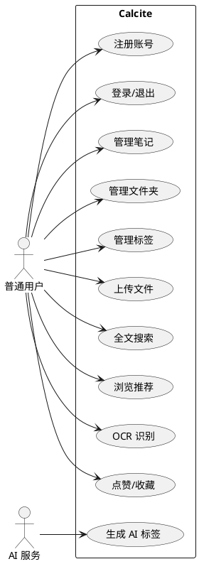

# 开发周志 —— 第3周：功能需求分析与用例设计

## 本周 TODO
- [ ] 梳理系统核心功能模块（用户、笔记、文件夹、标签、文件、搜索、推荐、OCR）
- [ ] 编写用户故事（User Stories）与用例图
- [ ] 定义功能优先级（Must-have / Should-have / Nice-to-have）
- [ ] 制定统一的 API 响应规范与鉴权规范初稿

## 工作内容概括

本周从"产品功能"视角切入，将 Calcite 系统拆分为八大业务域：用户认证、笔记管理、文件夹管理、标签系统、文件存储、全文搜索、智能推荐、OCR 识别。通过用例图梳理出普通用户与系统之间的核心交互路径，明确每个功能域的输入、输出与异常场景。

在需求分级中，将「用户注册/登录」「笔记 CRUD」「文件夹树」「文件上传」「全文搜索」列为 Must-have；「AI 标签生成」「OCR 识别」「个性化推荐」列为 Should-have；「笔记版本历史」「社交化公开笔记广场」列为 Nice-to-have。同步起草了后端统一响应格式 `{"code": 0, "message": "...", "data": {...}}` 与 JWT Bearer Token 鉴权方案。

## 关键产出
- 功能需求规格说明书（SRS）初稿
- 用例图与用户故事清单
- 统一 API 规范草案

---

## 详细工作记录

### 一、需求工程方法论

本周采用「业务域驱动 + 用户故事地图」双轨并行的方式展开需求分析。先自顶向下按业务域拆分系统边界，再自底向上通过用户故事验证每个功能点的真实价值。所有需求文档使用 Markdown 编写，统一存放于 `calcite/docs/requirements/` 目录（后迁移至各子模块 `docs/`）。

### 二、八大业务域详细拆分

#### 2.1 业务域划分过程

初稿曾尝试按「前端页面」划分（登录页、首页、搜索页），但很快发现这种划分会导致后端 API 设计碎片化。经过与导师讨论，改为按「业务能力」划分，确保前后端对同一领域使用统一语言（Ubiquitous Language）。

| 业务域 | 核心实体 | 主要参与者 | 边界说明 |
|--------|----------|------------|----------|
| 用户认证域 | User, UserToken | 普通用户 | 注册、登录、退出、Token 生命周期管理 |
| 笔记管理域 | Note, NoteHistory | 普通用户 | 笔记的 CRUD、软删除、版本回溯、公开/私有状态 |
| 文件夹管理域 | NoteFolder | 普通用户 | 多级树形目录、循环引用检测、级联删除 |
| 标签系统域 | Tag, NoteTag | 普通用户、AI 服务 | 标签去重、笔记-标签关联、AI 自动生成 |
| 文件存储域 | FileResource | 普通用户 | 异步上传、对象存储、状态轮询、元数据管理 |
| 全文搜索域 | Note（ES 索引） | 普通用户 | 多字段加权检索、高亮返回、搜索历史记录 |
| 智能推荐域 | UserAction, UserTagStat | 系统（后台） | 行为收集、兴趣模型、新老用户分群、ES 召回 |
| OCR 识别域 | FileResource, Note | 普通用户 | 文件提交、异步识别、Markdown 生成、笔记自动创建 |

#### 2.2 关键边界决策

- **文件夹与笔记的关系**：一个笔记只能属于一个文件夹（多对一），还是可属于多个？经讨论，参考 Notion 的 Page/Database 模型与印象笔记的「笔记-笔记本」模型，最终选择「单文件夹归属 + 多标签交叉」的组合。理由是文件夹承担「物理归档」职责，标签承担「逻辑分类」职责，两者互补而非替代。
- **公开笔记的权限粒度**：仅支持「完全公开」还是「链接分享」？考虑到毕业设计周期有限，选择「完全公开」（`is_public = 1` 时所有用户可见），后续可扩展为链接分享。
- **OCR 识别后的笔记归属**：OCR 生成的笔记应放入哪个文件夹？决定在识别任务提交时允许用户指定 `folder_id`，若未指定则放入「默认文件夹」（根目录下的一个虚拟文件夹，实际对应 `folder_id = null`）。

### 三、用户故事清单（核心摘录）

共编写用户故事 34 条，按「作为…我希望…以便…」格式书写。以下为每个业务域的代表性故事：

**用户认证域**
- US-001：作为新用户，我希望通过用户名和密码注册账号，以便开始使用系统。
- US-002：作为注册用户，我希望通过用户名和密码登录，以便访问我的笔记数据。
- US-003：作为多端使用者，我希望在手机和电脑上同时保持登录状态，以便无缝切换设备。

**笔记管理域**
- US-010：作为笔记作者，我希望创建 Markdown 格式的笔记，以便保留结构化文本的排版能力。
- US-011：作为笔记作者，我希望编辑笔记时自动保存，以便防止意外丢失内容。
- US-012：作为笔记管理者，我希望删除的笔记进入回收站而非立即消失，以便误删后恢复。
- US-013：作为笔记作者，我希望将笔记设为公开，以便其他用户发现并阅读我的内容。

**全文搜索域**
- US-020：作为知识工作者，我希望通过关键词搜索笔记标题和内容，以便快速定位信息。
- US-021：作为中文用户，我希望搜索支持中文分词，以便「机器学习」能匹配「学习」而非仅完整短语。

**智能推荐域**
- US-030：作为内容消费者，我希望系统根据我的兴趣推荐公开笔记，以便发现有价值的内容。
- US-031：作为新用户，我希望在未积累足够行为时也能看到推荐内容，以便冷启动时不面对空列表。

**OCR 识别域**
- US-040：作为纸质资料持有者，我希望上传 PDF/图片后自动转为可编辑笔记，以便数字化存档。

### 四、用例图设计（文字描述版）

由于尚未进入编码阶段，用例图以 PlantUML 源码形式编写，后由导师评审确认。



评审意见：导师建议在「管理笔记」用例旁补充「笔记版本回溯」扩展用例（Extend），因为版本历史是系统的技术亮点之一，应在用例层面显性化表达。

### 五、功能优先级决策过程

#### 5.1 分级标准

| 级别 | 定义 | 裁减策略 |
|------|------|----------|
| Must-have | 系统不可用就无法交付的核心功能 | 任何情况下不可裁减 |
| Should-have | 显著增强用户体验，缺失会导致竞争力下降 | 时间紧张时可简化实现 |
| Nice-to-have | 锦上添花，有则更好 | 可完全推迟至毕业后 |

#### 5.2 争议点与决策

**争议 1：笔记版本历史（NoteHistory）**
- 初评为 Nice-to-have，认为用户直接 Ctrl+Z 或 Git 管理即可；
- 导师指出：版本历史是展示「数据库设计深度」的关键场景，且与 Drogon ORM 的批量插入/查询能力直接相关；
- **决策**：上调为 Must-have，但简化实现（仅保存最近 10 个版本，不实现 diff 对比）。

**争议 2：AI 标签生成**
- 初评为 Nice-to-have，担心 DeepSeek API 调用成本过高；
- 经核算：单篇笔记平均 2000 字，约 3000 tokens，DeepSeek 价格约 ¥0.009/次；假设月活用户 100 人，每人每月生成 20 次标签，月成本约 ¥18，完全可控；
- **决策**：上调为 Should-have，作为系统差异化的核心卖点。

**争议 3：公开笔记广场与社交互动**
- 初评为 Must-have，认为没有公开内容推荐系统无从推荐；
- 反思后意识到：推荐系统可以仅基于标签匹配，笔记广场只是内容的展示载体，最小可用版本只需一个推荐列表页；
- **决策**：「公开笔记设置」为 Must-have，「点赞/收藏/广场」为 Should-have。

### 六、统一 API 响应规范初稿

#### 6.1 响应格式

```json
{
  "code": 0,
  "message": "success",
  "data": {}
}
```

- `code`：业务状态码，`0` 表示成功，非 `0` 表示具体业务错误（与 HTTP 状态码解耦）；
- `message`：人类可读的错误描述，成功时可为空或默认 "success"；
- `data`：业务数据，类型随接口变化，失败时可为空对象或 null。

#### 6.2 错误码设计（初版）

| code | 含义 | 典型场景 |
|------|------|----------|
| 0 | 成功 | — |
| 1 | 通用错误 | 参数缺失、格式非法 |
| 1001 | Token 无效或过期 | 鉴权失败 |
| 1002 | 用户已存在 | 注册时用户名冲突 |
| 1003 | 用户名或密码错误 | 登录失败 |
| 2001 | 笔记不存在或无权访问 | 查询他人私有笔记 |
| 2002 | 文件夹循环引用 | 移动文件夹时形成闭环 |
| 3001 | 文件上传失败 | MinIO 异常 |
| 4001 | AI 服务调用失败 | DeepSeek API 超时 |

**设计原则**：错误码按业务域分段（1xxx 用户、2xxx 笔记/文件夹、3xxx 文件、4xxx AI/外部服务），便于前端根据前缀做分类处理。

#### 6.3 鉴权规范初稿

- 登录成功后服务端返回 JWT Token，同时写入 `user_token` 表；
- 客户端将 Token 存储于：Web → `localStorage`；Android → `DataStore`；
- 每次请求通过 Header `Authorization: Bearer {token}` 携带；
- Token 有效期 7 天，过期后返回 code=1001，客户端引导重新登录；
- 退出登录时客户端清除本地 Token，服务端删除 `user_token` 记录。

### 七、本周问题与解决

**问题 1：用户故事颗粒度不一致**
- 现象：有的故事仅涉及一个按钮点击（如「我希望点击保存按钮」），有的则跨越多个页面（如「我希望多端同步」）；
- 解决：引入「故事点估算」概念，强制要求每个用户故事在 1-3 天内可独立完成，过大的故事拆分为子故事。

**问题 2：API 规范中 data 字段的类型争议**
- 现象：有同学建议所有接口的 `data` 统一为数组，简化前端解析；但查询详情时返回对象、查询列表时返回数组，类型不统一；
- 解决：参考业界实践（腾讯、阿里开放 API），`data` 保持灵活类型，但要求每个接口文档明确标注 `data` 的 JSON Schema，前端使用 TypeScript 接口约束。

### 八、会议记录

**202X-XX-XX 需求评审会**
- 参与人：导师、本人
- 议题：功能需求规格说明书（SRS）v0.1 评审
- 导师意见：
  1. 需求文档中缺少「非功能需求」章节（性能、安全、兼容性），需在下周补充；
  2. 用户故事 US-030（推荐系统）的描述过于笼统，应明确「根据什么兴趣」「推荐什么内容」；
  3. 建议增加一条 Must-have 级别的需求：系统应支持 1000 并发用户下的正常响应。
- 行动计划：在下周架构设计文档中补充非功能需求与性能指标。

---

## 工作记录（精简版）

### 一、需求拆分

将系统拆分为八大业务域，按业务能力而非页面划分，确保前后端领域语言统一。

| 业务域 | 核心实体 | 边界说明 |
|--------|----------|----------|
| 用户认证 | User, UserToken | 注册/登录/Token 生命周期 |
| 笔记管理 | Note, NoteHistory | CRUD、软删除、版本回溯 |
| 文件夹管理 | NoteFolder | 多级树、循环引用检测 |
| 标签系统 | Tag, NoteTag | 去重、AI 自动生成 |
| 文件存储 | FileResource | 异步上传 MinIO、状态轮询 |
| 全文搜索 | Note（ES 索引） | 多字段加权检索 |
| 智能推荐 | UserAction, UserTagStat | 行为收集、兴趣模型 |
| OCR 识别 | FileResource, Note | 异步识别、Markdown 生成 |

**关键决策**：笔记单文件夹归属 + 多标签交叉；公开笔记采用 `is_public` 布尔字段；OCR 生成笔记允许指定 `folder_id`。

### 二、功能优先级（最终版）

| 级别 | 功能项 |
|------|--------|
| Must-have | 注册/登录、笔记 CRUD、文件夹树、文件上传、全文搜索、笔记版本历史 |
| Should-have | AI 标签生成、OCR 识别、个性化推荐、点赞/收藏 |
| Nice-to-have | 公开笔记广场、社交分享 |

### 三、API 规范初稿

- 统一响应：`{"code": 0, "message": "...", "data": {}}`
- 错误码分段：1xxx 用户、2xxx 笔记/文件夹、3xxx 文件、4xxx AI/外部服务
- 鉴权：JWT Bearer Token，有效期 7 天，同时写入 `user_token` 表支持多端

### 四、本周问题

- **用户故事颗粒度不均**：引入故事点估算，强制 1-3 天内可独立完成
- **data 字段类型争议**：保持灵活类型，接口文档标注 JSON Schema 约束

### 五、会议备忘

导师评审意见：补充非功能需求章节；推荐系统描述需明确兴趣来源与召回方式；增加 1000 并发用户支持指标。
