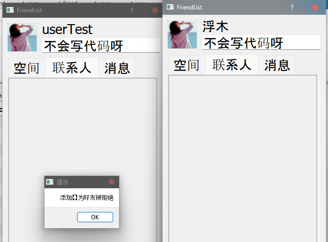

> [!bug] 加好友时好友昵称不能显示正常, 如图
> 能拒绝, 同意后能成功加好友

 

##### 首先想到编码问题
- 测试全英文用户互相加好友, *英文字符转不转码都能正常显示并插入数据库*

> 测试不通，仍然为乱码

##### 再次测试好友互相发消息(并非我写的功能)
- 经测试，也不能正常聊天，仅仅几个字符能显示正常
---
- 登录，注册功能正常，说明客户端与服务器通信收发基本没问题

##### 考虑到显示好友昵称数据来源于服务器转发的添加好友请求结构体

- 服务器转发出问题
- 服务器转发基于中介者转发再由底层转发，但考虑到客户端与服务器在处理登录注册时，每一个字节数据都用上了, 问题不应该出现在这里
- 服务器与客户端每个功能都能定位到准确`PackType`做出正确响应, 说明`PackType`存储正常
- 并且添加好友时客户A添加客户B时, 客户B能够回复到服务器的数据能够插入数据库, 说明回复结构体中至少客户端A的用户id存储是正常的

---

### 并不是服务器转发(发送)出了问题
- 是接收函数`TcpClient::recvData()` 出了问题
- 源码如下
![[../../'attachments/recvData.png]]

- 第一个问题: 138行`recv` 的第三个参数应当为待接收数据的长度即`lastLen` 多写了一个`sizeof` 这有没有影响呢, 在IM目前实现的功能上, 基本没有, 原因是待接收的数据是发送的各种结构体, 然而各种结构体大小均为4的倍数, 基本并不会多发 
- 第二个问题: 149行计算待转发数据长度也用到了`sizeof` 这是不正确的，因为`pack` 定义为指针类型, 指针大小由系统架构决定, 但是为什么那么多功能正常，偏偏弹窗的昵称显示不正确呢

*功能正常原因* :
- 先发包大小，然后按包大小接收数据，因此，在中介者转发数据时，`pack`中内容是正确的, 这些数据到核心类之后由相应处理函数处理, 而这些数据如何处理的呢, 是使用形如`_STRU_REGISTER_RS* rs = (_STRU_REGISTER_RS*)data;` 的强制类型转换的到的数据，结构体相同，数据分布相同，因此数据能够正常使用，并且中介者在传出数据长度len时，在*客户端*各种处理函数中一个都没用到，==除了服务器转发数据时==
- 问题就出现在这里，服务器转发数据只转发了`sizeof(pack)` 大小的数据，而`sizeof(pack)` 大小取决于系统架构，常识为4，这也就是为什么能够正确处理各种业务(结构体前4字节固定为`PackType`), 刚好能正确调用，那么后续数据是不是全都为乱码吗，也并不是，在客户端B处理来自客户端A的好友请求时，同意/拒绝服务器都能正确响应，服务器为什么能正确响应？因为该请求回复由客户端B构造并初始化，那么都初始化了哪些成员呢，

![[../../'attachments/addFriendReply.png]]
可以从下图看到初始化了是否同意的`result`， 用户B`id`, 用户A`id`, 以及双方名字

![[../../'attachments/dealAddFriendRq.png]]

- 如果发回服务器的rs中用户A的id为内存残留数值, 服务器插入数据库时就会因为id为非正常数值无法插入数据库，右或者在通知用户A好友是否同意时因为存储id与socket的map中找不到该id的键而导致用户A这边没有正确响应, 那为什么用户A的id传输过去了呢
### 用户B构造用户A的`id` 来源
- 源于服务器转发而来的请求结构体
- 结构体中用户A`id`理应为乱码, 因为服务器只转发了4字节的`PackType`, 那么这4字节为什么能正确转发呢
- 因为请求结构体中用户A`id`为第二个字段，紧紧跟随在`PackType`之后, 也就是说, 服务器转发的并不是4字节，而是8字节
*原因是在Visual Studio 的该项目属性中为x64* 

---
> [!fail] 我为什么用`sizeof()`算`pack`大小，不知道`pack`作为指针大小吗？
> 写的时候稍微考虑了一下，应当传`offset`，写的时候觉得`offset`作为偏移量当作长度传入==不好看==，一想到数组的内存大小计算，就写成了`sizeof(pack)`

