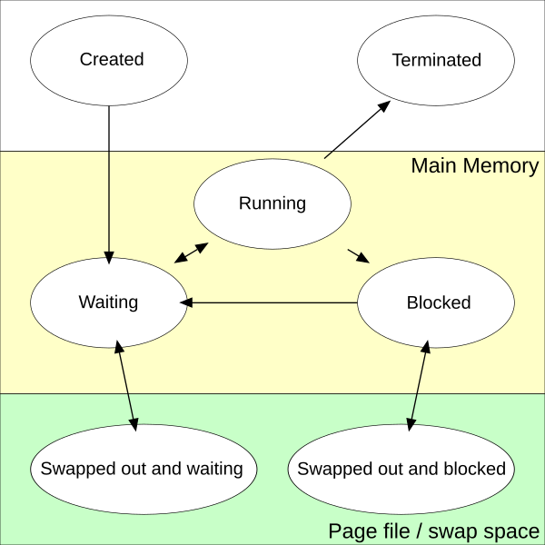
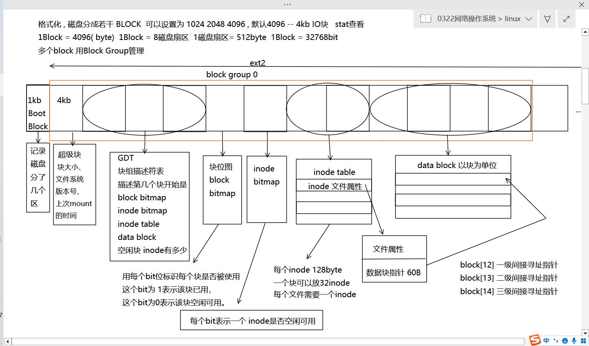
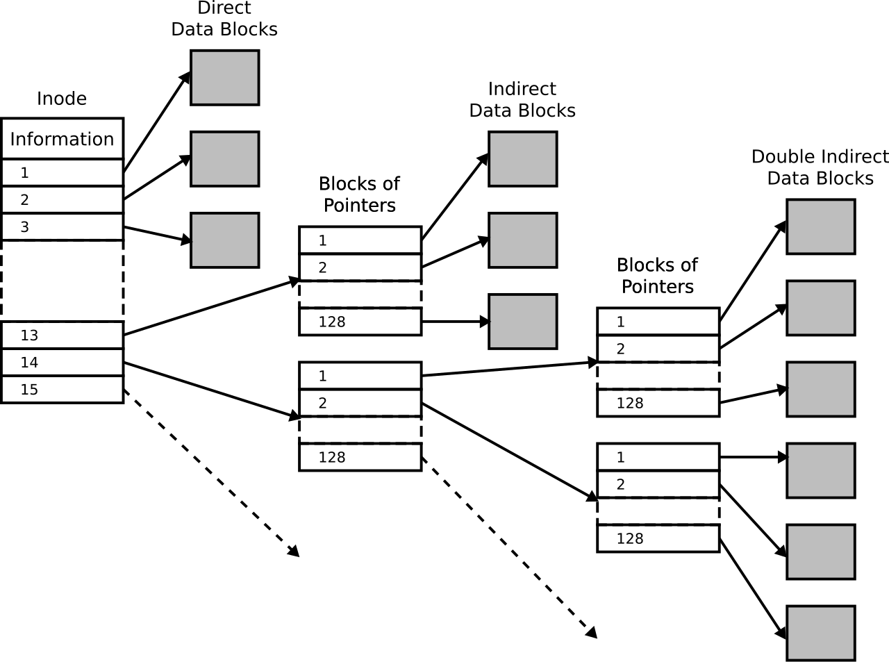

##### 0818

----

# 什么是[线程](https://en.wikipedia.org/wiki/Thread_(computing)), 什么是[进程](https://en.wikipedia.org/wiki/Process_(computing)) 

进程是资源分配的基本单位, 线程是资源调度的基本单位.
也就是说, 一个进程可以有多个线程, 进程是线程的容器. 主要由线程来进行工作.
- 进程通常是独立的，而线程作为进程的子集存在
- 进程比线程携带更多的状态信息，而进程内的多个线程共享进程状态以及内存和其他资源
- 进程具有单独的地址空间，而线程共享其地址空间
- 进程仅通过系统提供的进程间通信机制进行交互
- 同一进程中线程之间的上下文切换通常比进程之间的上下文切换更快

##### 进程/线程状态 [ref](https://en.wikipedia.org/wiki/Process_state)




# 使用线程优点:
1. 线程的资源消耗更低：使用线程，应用程序可以使用比使用多个进程时更少的资源来运行
2. 简化线程的共享和通信：与需要消息传递或共享内存机制来执行进程间通信（IPC）的进程不同，线程可以通过它们已经共享的数据、代码和文件进行通信
3. 线程导致进程崩溃：由于线程共享相同的地址空间，线程执行的非法操作可能会导致整个进程崩溃；
4. 使用多线程提高资源利用率. 


# 什么是上下文切换

首先得了解系统权限: ring0~ring3. 其中最高权限是ring0 即内核态. 而ring3权限最低为用户态.

- *内核态*: 可以操作硬件, 系统函数. 比如对磁盘进行读写操作.
- *用户态*: 没有权限操作内存和硬盘, 得**切换到内核态**然后进行硬件操作, 再切换回用户态.

线程调度/进程调度都是由内核态完成的. 线程由运行切换到挂起等待是用户态到内核态的过程.

其次, 当用户态到内核态时,涉及到旧数据和旧执行程序的地址的保存, 以及新数据和新执行程序地址的保存这就是CPU上下文切换.

简单来说:
-  **保存旧任务的运行现场，并恢复新任务的运行现场**，让 CPU 去执行别的任务的过程.
- 它是实现并发的基础，但频繁的上下文切换也会带来性能损耗
- 操作系统在多任务环境下，<em style="color:#E67E80;">将当前正在运行的进程/线程的运行状态保存下来，并恢复另一个进程/线程的运行状态 </em>的过程

总之, **线程切换时, 会导致很多数据拷贝, 耗费CPU资源**. 


----

# 什么是[协程](https://en.wikipedia.org/wiki/Coroutine) coroutine

- 协程非常类似于[线程](https://zh.wikipedia.org/wiki/%E7%BA%BF%E7%A8%8B "线程"). 协程是一种比线程 **更轻量级的<strong style="color:#e67e80">用户级</strong>并发**
- 协程是[协作式](https://zh.wikipedia.org/wiki/%E5%8D%8F%E4%BD%9C%E5%BC%8F%E5%A4%9A%E4%BB%BB%E5%8A%A1 "协作式多任务")多任务的，而典型的线程是[内核级](https://zh.wikipedia.org/wiki/%E5%86%85%E6%A0%B8 "内核")[抢占式](https://zh.wikipedia.org/wiki/%E6%8A%A2%E5%8D%A0%E5%BC%8F%E5%A4%9A%E4%BB%BB%E5%8A%A1 "抢占式多任务")[多任务](https://zh.wikipedia.org/wiki/%E5%A4%9A%E4%BB%BB%E5%8A%A1 "多任务")的.
- 它运行在 **用户态**，不需要操作系统参与上下文切换. 适用于IO密集型, 并发多
- *稳定性*: 任何一个线程出错, 进程中所有线程一起崩溃. 
- 协程是语言层级的构造，而线程是系统层级的构造
- 协程可以通过`yield`（**主动让出**）来调用其它协程，接下来的每次协程被调用时，从协程上次`yield`返回的位置接着执行，通过`yield`方式转移执行权的协程之间不是调用者与被调用者的关系，而是彼此对称、平等的


```Cpp title:"生产者－消费者 伪代码"
var q := new 队列

coroutine 生产者
    loop
        while q 不满载
            建立某些新产品
            向 q 增加这些产品 
        yield 消费者

coroutine 消费者
    loop
        while q 不空载
            从 q 移除某些产品
            使用这些产品
        yield 生产者
```

   

----


# 什么是线程并发, 怎么解决?

首先我们要知道, 什么是线程并发: 在同一个进程中，**多个线程同时执行并访问共享资源** 的情况.
由于线程之间共享内存，如果不加控制，会出现 **数据竞争**、**脏数据**、**状态紊乱** 等问题

如何解决: 同步 + 通信. 控制访问顺序

| 同步方式                      | 作用                            |
| ------------------------- | ----------------------------- |
| **原子操作**                  | 保证某些简单操作不可分割，例如 `std::atomic` |
| **临界区（critical section）** | 限制同一时间只有一个线程进入代码片段            |
| **互斥量（mutex）**            | 多线程锁，常用的互斥同步方式                |
| **信号量（semaphore）**        | 可以控制**多个**线程的并发数              |
| **条件变量**                  | 配合 mutex 使用，提供线程间的**等待/通知**机制 |
| **事件（event）**             | 类似于通知机制（Windows 下常见）          |


----

# 生产者消费者模型, 线程池约束, 怎么设计, 优化

生产者消费者模型是一种 **典型的多线程并发设计模式**：
主要*角色*有生产者, 消费者以及一个阻塞队列.

*角色作用*:
> 通过一个**共享的同步队列**，把“生产数据”和“消费数据”的两个过程 decouple（解耦）
> 生产者只负责往队列里放任务，消费者只负责从队列里取任务执行


1. **多个生产者线程**生产任务，放入阻塞队列；
2. **多个消费者线程**从队列中取任务并处理；
3. **队列满** → 生产者阻塞；
4. **队列空** → 消费者阻塞；
5. 利用互斥量 + 条件变量/信号量 来实现“阻塞和通知”。


##### 为什么任务队列一般设置成环形缓冲区？

* 环形数组连续分布，**缓存友好**
* 不需要频繁扩容，**效率高**
* 入队/出队只需要两个索引（head、tail），天然实现“满/空”的判断
* 避免链表带来的频繁内存申请

##### 如何优化线程池？

| 优化方向                                        | 说明                             |
| ------------------------------------------- | ------------------------------ |
| **线程数动态调整**                                 | 根据任务量/CPU负载动态增加或减少工作线程         |
| **任务分级/优先级队列**                              | 给不同任务设置优先级，提高重要任务的处理速度         |
| **任务合并批处理**                                 | 对大量小任务合并处理，减少切换和调度开销           |
| **拒绝策略优化**                                  | 队列满时自定义拒绝策略（丢弃/CallerRuns/降级）  |
| **减少锁竞争**                                   | 使用无锁队列、分段队列或多队列模型（MPSC → MPMC） |
| **监控和报警**                                   | 对线程池的等待数、活跃数、队列长度做监控，便于调优      |
| <strong style="color:#e67e80">无锁队列</strong> | *乐观锁*                          |

##### 线程池拒绝策略
1. **拒绝策略**：
    - ***抛出异常***：直接抛出一个异常，通知调用者任务无法被接受
    - ***调用者运行***：让调用者在当前线程中执行任务，而不是提交到线程池
    - ***丢弃任务***：丢弃最旧的任务或最常见的任务，通常用于低优先级的任务
2. **阻塞策略**： 使用阻塞队列，提交任务时如果队列满则阻塞当前线程，直到有空间可用
3. **扩展线程池**： 根据负载情况动态增加线程池的最大线程数（需谨慎使用，以避免资源耗尽）
4. **等待与重试**： 让任务在一定时间后重试提交，增加成功的几率
5. **监控与警报**： 定期监控线程池的状态，设置警报以便及时响应

*Java预制拒绝策略:*
- CallerRunsPolicy，使用线程池的调用者所在的线程去执行被拒绝的任务，除非线程池被停止或者线程池的任务队列已有空缺
- AbortPolicy，直接抛出一个任务被线程池拒绝的异常
- DiscardPolicy，不做任何处理，静默拒绝提交的任务
- DiscardOldestPolicy，抛弃最老的任务，然后执行该任务
- 自定义拒绝策略，通过实现接口可以自定义任务拒绝策略


##### 线程池其他模型 LF领导者与追随者以及工作者

[HS/HA半同步/半异步模式、L/F领导者与跟随者模式](https://zh.wikipedia.org/wiki/%E7%BA%BF%E7%A8%8B%E6%B1%A0)

- 半同步/半异步模式又称为生产者消费者模式，是比较常见的实现方式，比较简单。分为同步层、队列层、异步层三层。同步层的主线程处理工作任务并存入工作队列，工作线程从工作队列取出任务进行处理，如果工作队列为空，则取不到任务的工作线程进入挂起状态。由于线程间有数据通信，因此不适于大数据量交换的场合。
- 领导者跟随者模式，在线程池中的线程可处在3种状态之一：领导者leader、追随者follower或工作者processor。*任何时刻线程池只有一个领导者线程*。事件到达时，领导者线程负责消息分离，并从处于追随者线程中选出一个来当*继任领导者*，然后将自身设置为工作者状态去处置该事件。处理完毕后工作者线程将自身的状态置为追随者。这一模式实现复杂，但避免了线程间交换任务数据，提高了CPU cache相似性。在[ACE](https://zh.wikipedia.org/wiki/ACE%E8%87%AA%E9%80%82%E9%85%8D%E9%80%9A%E4%BF%A1%E7%8E%AF%E5%A2%83 "ACE自适配通信环境")(Adaptive Communication Environment)中，提供了领导者跟随者模式实现。

##### 线程池初始线程数量
- n核处理器: 通过执行业务单线程执行本地的任务计算时间x 等待时间是y
*计算密集型* $工作线程数=N$
*I/O密集型*  $工作线程数=N*(x+y)/x$ ; x == y(无缝衔接) --> 2\*N 核心数的2倍


----


# 什么时候发生进程调度?


> 进程调度其实就是内核把 CPU 从一个进程切换到另一个进程的过程，那它一般在几种情况下会发生：
>
> **第一**，当前进程的时间片用完了，操作系统按照时间片轮转的策略强制切换；
> **第二**，当前进程在等待资源，比如阻塞在 I/O 或者主动 sleep，这时 CPU 会让给其它就绪进程；
> **第三**，如果此时有一个**优先级更高的进程进入就绪队列**，那操作系统会根据调度策略进行切换。
>
> 这里要注意的是，高优进程到来又分两种情况：
> 如果是**可剥夺式调度**，当前进程会被立即打断；
> 如果是**非剥夺式调度**，则必须等当前进程自己释放 CPU 才会切换。
>
> 简单来说：**时间片用完、主动阻塞、以及更高优先级进程到来**，都会触发进程调度。

----
# 进程调度算法有哪些?
> 进程调度算法常见的有五种：
> 
> **第一**是*先来先服务*，它是非抢占式的，谁先进入就绪队列就先执行；  
> **第二**是*时间片轮转*，用于分时系统，每个进程只能运行一个时间片，到时间就被抢占；  
> **第三**是*短作业优先*，它会优先选择运行时间最短的作业，但属于非抢占；  
> **第四**是*最短剩余时间优先*，它是抢占式的，只要有新的进程剩余时间更短，就会立即抢占正在运行的进程；  
> **最后**是*高响应比优先*，计算响应比=(等待时间+服务时间)/服务时间，每次选择响应比最高的作业，也是非抢占的
> 
> 简单来说，**区别主要就是抢占 vs 非抢占**，以及优先级依据是“到达顺序”“服务时间”还是“响应比”


----

# 死锁的概念? 产生的条件. 

> 当多个进程互相占有对方所需要的资源，并且都在**等待**对方释放，从而进入一种**互相等待、永远无法推进**的状态，这种现象称为**死锁**

产生死锁四个必要条件:
	*互斥*: 资源只能被一个进程占用
	*不可剥夺*: 已分配的资源不能被强制释放
	*请求并保持*: 已占有部分资源，又继续请求其他资源
	*循环等待*: 多个进程之间形成环形的资源等待关系


##### 如何预防死锁（破条件）

互斥: 使用可共享资源（很难做到）
不可剥夺: 支持资源抢占 
请求并保持: 采用**一次性申请所有**资源
循环等待: **规定资源获取顺序**（有序分配法

##### 如何处理死锁
- *超时自动放弃/任务*

| 方法          | 说明                        |
| ----------- | ------------------------- |
| **预防**      | 在系统设计阶段就破坏条件，避免死锁发生       |
| **避免**      | 运行时动态检测（银行家算法）判断是否安全      |
| **检测 + 恢复** | 允许死锁发生，定期检测 → 找出死锁 → 回收资源 |
| **鸵鸟策略**    | 直接忽略（例如 Linux）因为概率太低、代价太高 |

> 死锁是指多个进程在竞争资源的过程中相互等待，谁也得不到自己需要的资源，最终都永远阻塞在那儿。
> 它发生有四个必要条件：**互斥、不可剥夺、请求并保持和循环等待**，只要这四个条件同时成立，就有可能发生死锁。
>
> 预防死锁其实就是破坏这四个条件中的一个，例如支持资源抢占、一次性申请全部资源、或者规定统一的资源获取顺序等。
>
> 真正处理死锁一般有三种方式：**预防、避免（比如银行家算法）、以及检测并恢复**。
> 有些系统（比如 Linux）干脆采用“鸵鸟策略”——出现概率太低，直接忽略不处理。


----

# 静态库与动态库的区别
**静态库（Static Library）**：
 * 文件扩展名：Linux / MacOS 为 `.a`，Windows 为 `.lib`。
 * 在编译时，库文件被嵌入到最终的可执行文件中。
 * 静态链接：程序启动时不需要依赖外部的动态库，所有的代码和资源在链接阶段就已经融合。
 * 优点：部署时不需要额外的库文件，启动速度较快。
 * 缺点：程序体积较大，更新库文件需要重新编译所有依赖该库的程序。

**动态库（Dynamic Library）**：
 * 文件扩展名：Linux / MacOS 为 `.so`，Windows 为 `.dll`。
 * 在运行时加载，代码不直接嵌入到可执行文件中。
 * 动态链接：程序启动时需要加载外部动态库，程序和库文件可以独立更新。
 * 优点：程序体积较小，库文件可以共享给多个程序。
 * 缺点：运行时依赖库的存在，库文件若缺失或版本不匹配可能导致程序崩溃。


----

# `[!!process:0819]`  

----

# 内存管理方式 -- windows
##### 连续分配管理
1. *单一连续分配*:
	- 只能用于单用户单任务操作系统
	- 作业一旦进入内存,要等待结束之后释放
	- 无法实现多个进程共享主存

2. *固定分区分配*:
	- 将内存分成若干区 不同分区可以放不同程序
	- 要先确定。运行就不能改变
	- 通常采用静态重定位方式装内存

3. *动态分区分配*
##### 非连续分配管理
1. *页式管理*：将物理内存划分为固定大小的“页框”，把逻辑地址空间划分为相同大小的“页面”。页表负责完成逻辑地址到物理地址的转换，从而实现非连续分配，提高内存利用率，避免外部碎片，但会增加页表开销

2. *段式管理*：将进程的逻辑地址空间划分为若干“段”（代码段、数据段、堆栈段等），每个段具有一段描述符，运行时通过段表将逻辑地址映射成物理地址。优点是便于数据共享和保护，缺点是仍会产生外部碎片

3. *段页式管理*：结合段式和页式管理的优点。先把内存分为段，每个段再划分为页。通过“段表 + 每段对应的页表”实现地址转换。既支持共享和保护，又避免外部碎片，缺点是地址转换过程更复杂


##### 页式管理
* **基本思想**:   把 **逻辑地址空间** 等分成固定大小的**页面（Page）**，把 **物理内存空间** 等分成大小相同的**页框（Page Frame）**. 页面可以装入任意一个空闲页框中，因此逻辑空间对应的物理空间**不要求连续**

**优点**:  无外部碎片; 内存利用率高（页面可以离散分布）
**缺点**:  需要页表，占用内存; 地址转换有额外开销（通常由 MMU 硬件完成）
* **逻辑地址结构（32 位）**

| 字段   | 位数            | 含义       |
| ---- | ------------- | -------- |
| 页号   | 20 位 (31\~12) | 定位页表中的表项 |
| 页内偏移 | 12 位 (11\~0)  | 页内具体地址   |

> 因为页内偏移是 12 位 → 每页 = $2^{12}$ = **4KB**

* **地址转换过程**

逻辑地址 → **页号**\*页大小 + **页内偏移**
页号 → 在页表中查找对应**物理页框号**
物理页框号 + 页内偏移 → **物理地址**

----


# 缺页中断与页面置换算法. 内部碎片 外部碎片

##### 什么是缺页中断
* 页式管理中，**逻辑地址 → 页表 → 物理地址**。
* 如果要访问的**页面不在物理内存中**，MMU 在页表里查不到对应条目，此时会触发 **缺页中断**。
* 操作系统捕获中断 → **从磁盘把该页面加载到内存**。
* 如果内存已满，还需要**先淘汰一个旧页面**再加载新的页面。

> 缺页 → 缺页中断 → 页面置换 → 加载新页
##### 什么是页面置换算法

当物理内存已满时，需要将某个**旧页面**换出去，把新的页面换进来
常见淘汰策略包括：

| 算法   | 思路             |
| ---- | -------------- |
| FIFO | 最先进入内存的页面先淘汰   |
| LRU  | 最近最久未被访问的页面先淘汰 |
##### 内部碎片 vs 外部碎片

| 类型   | 概念                        | 典型场景            |
| ---- | ------------------------- | --------------- |
| 内部碎片 | 固定大小空间分配给你，但**用不满**       | ✅页式管理（每页固定 4KB） |
| 外部碎片 | 多次可变大小分配后，**剩下的零散空间无法利用** | ✅动态分区分配 / 段式管理  |


----

# 什么是段式存储、页式存储、段页式存储？它们之间有什么区别？

---

*段式存储*:

* 将程序的逻辑地址空间划分为若干 **大小不等、具有完整逻辑意义的段**（如：代码段、数据段、栈段、符号表等）。
* 分配内存时以**段为单位**，每个段在物理内存中占据一块**连续**的空间，但不同段之间可以**离散分布**。
* 支持用户的“分段”逻辑视角，便于共享与保护。
* 地址空间是**二维**的：`（段号，段内偏移）`

*页式存储*:
* 将程序的逻辑地址空间划分为若干个**大小固定的页**（例如 4KB），物理内存划分为大小相同的**页框**。
* 页面在物理内存中可以随意分布，不必连续 → **没有外部碎片**（但可能产生内部碎片）。
* 地址空间是**一维**的：逻辑地址 = `（页号，页内偏移）`
* 缺点是仅按固定大小分页，没有逻辑含义区分。

*段页式存储*:
* 将两者结合：**先分段，再对每个段分页**。
* 地址结构为：`段号 → 页号 → 页内偏移`
* 有段式的**逻辑清晰**，也有页式的**内存利用率高**。
* 缺点：地址转换过程更复杂（需要三次访问：段表 → 页表 → 数据）。
![['attachments/段页式存储.png]]

| 特征        | 段式存储          | 页式存储         | 段页式存储             |
| --------- | ------------- | ------------ | ----------------- |
| 划分方式      | 逻辑意义的 **段**   | 固定大小的 **页**  | 先分段，段内再分页         |
| 段/页大小是否固定 | 不固定           | 固定（如 4KB）    | 段不固定，页固定          |
| 地址结构      | （段号，段内偏移）     | （页号，页内偏移）    | （段号 → 页号 → 页内偏移）  |
| 内/外碎片     | 可能出现 **外部碎片** | 无外碎片，可能有内部碎片 | 无外碎片 + 段具有逻辑意义    |
| 地址转换次数    | 2 次（段表→内存）    | 2 次（页表→内存）   | 3 次（段表→页表→内存）     |
| 优点        | 逻辑清晰，易保护和共享   | 实现简单，内存利用效率高 | 综合两者优点，既有逻辑性又无外碎片 |
| 缺点        | 产生外碎片         | 无逻辑结构，只是按块划分 | 地址转换复杂，需要更多表和硬件支持 |

---


# Linux内存管理的发展

* **虚拟内存的作用**
  操作系统为每个进程提供*独立的虚拟地址空间，使不同进程之间互相隔离，程序无需关注底层物理地址。

* **内存交换机制（置换）**
  由于*物理内存只有一份*，而多个进程同时运行会导致内存紧张，操作系统会将*不常用的页面换出到磁盘*，在需要使用时再**换入**物理内存中。

* **段式 → 分页的发展**
  * 早期处理器采用 **段式内存管理**，以段为单位划分内存
  * 段式管理容易产生**外部碎片**
  * Linux 内核主要采用 **页式管理**（分页）来提高内存利用率
  * 由于 Intel 处理器硬件仍保留分段机制，Linux 无法完全绕开分段，因此采用了\*\*“分段 + 分页”\*\*的实现方式

* **Linux 虚拟地址空间结构**

| 区域        | 描述                 |
| --------- | ------------------ |
| 代码段       | 存放程序指令             |
| 数据段（data） | 已初始化的全局变量和静态变量     |
| BSS 段     | 未初始化的全局/静态变量       |
| 堆         | 动态分配内存（malloc/new） |
| 内存映射区     | 映射文件、共享库等          |
| 栈         | 局部变量、函数调用栈         |
| **内核态空间** | 内核代码和数据结构（所有进程共享）  |

----

## 多级页表
- 简单的分页有什么缺陷?

因为操作系统是可以同时运行非常多的进程的,那这不就意味着页表会非常的庞大
比如32位系统100个进程的话,就需要400MB的内存来存储, 页表64位系统会更大

- 为了避免这个问题. 引入了多级页表的解决方案

1. 32位和页大小4KB的环境下,一个进程的页表需要装下100多万个「页表项」
2. 把这个100多万个「页表项」的单级页表再分页, 将页表(一级页表)分为1024个页表(二级页表),每个表(二级页表)中包含1024个「页表项」,形成二级分页
3. 页表一定要覆盖全部虚拟地址空间, 不分级的页表就需要有100多万个页表项来映射, 而二级分页则只需要1024个页表项
4. 64位系统二级页表显然是不够的,是四级目录


##### 为什么多级页表就节省空间了?
- 因为程序要执行就必须覆盖到所有的虚拟地址空间
- 如果只是1级页表, 那么需要100万的页表项, 如果使用二级页表, 一级页表的1024项, 就可以覆盖所有的虚拟地址空间, 然后二级页表是需要的时候, 才会创建. 不需要则不创建
- 用户的进程一般很难将所有的空间都使用到, 那么有很多二级页表是不用创建的,因而节省空间.

##### 多级页表的问题
- 多级页表虽然解决了空间上的问题,但是虚拟地址到物理地址的转换就*多了几道转换*的工序,这显然就降低了这俩地址转换的速度, 也就是带来了时间上的开销
- 把最常访问的几个页表项存储到访问速度更快的硬件, 于是计算机科学家们, 就在CPU 芯片中,加入了一个*专门存放程序最常访问的页表项的Cache*, 这个Cache就是TLB(Translation Lookaside Buffer),通常称为页表缓存、转址旁路缓存、快表等
- 在CPU芯片里面,封装了内存管理单元(Memory Management Unit)芯片,它用来完成地址转换和TLB的访问与交互
- 有了TLB后,那么CPU在寻址时,会先查TLB,如果没找到,才会继续查常规的页表
- TLB的命中率其实是很高的,因为程序最常访问的页就那么几个


----


# 页面置换算法
##### LRU

LRU 最近最少使用淘汰算法
· 使用头添加尾删除的链表作为存储结构
· 链表存在最大缓存容量-链表的最大长度
如何操作?访问节点淘汰节点

*访问节点*
- 未命中->是否达到最大容量
	- 否:头添加
	- 是:尾删除 头添加
- 命中->找到这个节点->将该点移动到头(删除该节点,头添加该点)
*淘汰节点*->尾删除

优化
- 查找节点时,普通链表是 查找o(n) ->这个位置优化.链表 ->双向链表
- 可以使用hash表映射每个节点的地址
- hash表的key-value关系为 关键码(数据) ->节点地址 ->S(不考虑冲突 ->
- 经常头添加尾删除,可以使用伪装头尾节点(dummyHead, dummyTail)
##### FIFO  
- 以尾添加头删除的队列作为数据结构(可以使用链表也可以使用循环队列(数组)实现)
- 队列存在最大缓存容量-队列的最大容量

*访问节点*
- 未命中->是否达到最大容量
	- 否: 尾添加
	- 是: 头删除 尾添加
- 命中->不操作

*淘汰节点*->头删除

可以使用数组来实现(循环队列)

##### 最优页面置换算法(opt)

*基础思路*: 当一个缺页中断发生时, 对于保存在内存当中的每一个逻辑页面, 计算在它的*下一次访问*之前,还需要等待多长时间, 从中选择等待时间最长的那个被置换.
- 这只是一个理想情况, 在实际操作系统中*无法知道需要等待多长时间* 
- 算法很难实现
- 可用于作为其他算法性能评价的依据


----

# C语言编译原理
- <strong style="color:#e67e80">预处理->编译->汇编->链接</strong>

**预处理Preprocess -> `.i` 文件**
处理以 `#` 开头的预处理指令，包括：
* 宏替换（`#define`）
* 条件编译（`#if / #ifdef`）
* 头文件展开（`#include`）
* 删除注释、处理 `#pragma`

**编译Compile -> `.s` 或 `.asm` 文件**
把预处理后的源代码转成汇编代码。内部会经过：
* 词法分析 → 识别关键字、标识符、常量等
* 语法分析 → 语法树
* 语义分析
* 优化（如常量合并、死代码删除等）
* 生成汇编代码

**汇编Assemble -> `.o / .obj` 文件**
把汇编代码翻译成**机器指令**，存入目标文件
> 目标文件是还没有链接的二进制文件

**链接Link -> 可执行文件**
将多个目标文件和库文件连接起来：
* 符号解析（定位函数/变量）
* 地址重定位
* 合并代码段、数据段
  最终生成 `.exe` / 可执行文件  （可分为 **静态链接** 和 **动态链接**）

##### 乐观锁
- 以乐观的态度去看待并发,每次读写数据不变,不考虑冲突, 在更新数据的时候,发现值改变,判定发生并发问题,此次更新失败,等待下次更新
- 实现的方式CAS(比较然后交换)

*CAS* = Compare And Swap，是实现乐观锁的一种原子操作机制. 
- 是一种**原子操作机制**，常用来实现**无锁并发**
- *核心思想*: “只有当内存中的值等于我预期的旧值时，才把它更新成新值，否则就重新尝试”

| 参数  | 说明      |
| --- | ------- |
| V   | 内存中的当前值 |
| A   | 期望值（旧值） |
| B   | 要写入的新值  |

如果 `V == A`，那么将 V 更新成 B；否则不做更新，并返回当前 V

*ABA* 问题
- CAS 在比较的时候，只能比较“值是否相等”，*它无法识别<strong style="color:#E67e80">值虽然相等，但中间是否被改过</strong>*

|时间|线程A 读到的值|其他线程的操作|实际内存中的值|
|---|---|---|---|
|T1|A|（无）|A|
|T2|—|线程B 把 A → B|B|
|T3|—|线程B 又把 B → A|A|
|T4|A 做 CAS 比较|（A == A）成功|A → 新值|
==怎么解决？== 常见的方式是**给值加上“版本号”或者“时间戳”**


----

# `volatile`  关键字 可以修饰变量 作用?

1. 运行时, 保证线程工作内存(cpu寄存器)和主存(物理内存)数据的一致.
2. 当volatile修饰变量, *写值会立即给主存赋值*, 并且每一次读取值,直接到主存读取, 并且写先于读,从而保证 工作内存(缓存)和主存数据的一致
3. 编译时, 避免修饰的变量相关的**编译优化**, 所导致多线程出现运行问题. <strong style="color:#E67e80">并非避免线程并发数据竞争</strong>


----
----

----
# 零拷贝 
- 磁盘可以说是计算机系统最慢的硬件之一, 读写速度相差内存10倍以上, 所以针对优化磁盘的技术非常的多,比如*零拷贝*.
- 这些优化的目的就是为了*提高系统的吞吐量*, 另外操作系统内核中的磁盘高速缓存区, 可以有效的减少磁盘的访问次数

什么是零拷贝?
- [数据没有在不同的内核缓冲区之间重复拷贝](https://www.linuxjournal.com/article/6345?page=0,0)。
- 使用零拷贝除了避免拷贝之外，还能带来其他性能收益:
	1. 更少的上下文切换
	2. 更少的 CPU 数据缓存污染
	3. 无需 CPU 进行校验和计算

## :RiNumber1: 直接IO
```c title:"将磁盘文件通过socket传输"
read(file, tmp_buf, len); 
write(socket, tmp_buf, len);
```

<div style="display: flex; align-items: center;">
    
	<div style="flex: 1; margin-left: 10px;">
		<dl>
		  <dt><strong>图 1. 复制磁盘数据到socket示例系统调用</strong></dt>
		  
			<dd>1. read 系统调用会导致上下文从用户模式切换到内核模式。第一次复制由 DMA 引擎执行，该引擎从磁盘读取文件内容并将其存储到内核地址空间缓冲区中</dd>
			<br>
			
			<dd>2. 数据从内核缓冲区复制到用户缓冲区，然后 read 系统调用返回。该调用的返回会导致上下文从内核模式切换回用户模式。现在，数据已存储在用户地址空间缓冲区中，可以再次开始向下传输</dd>
			<br>
			
			<dd>3. write 系统调用会导致上下文从用户模式切换到内核模式。执行第三次复制，将数据再次放入内核地址空间缓冲区。不过，这次数据被放入另一个缓冲区，这个缓冲区与套接字关联</dd>
			<br>
			
			<dd>4. write 系统调用返回，创建我们的第四次上下文切换。第四次复制独立且异步地发生，当 DMA 引擎将数据从内核缓冲区传递到协议引擎时</dd>
		</dl>
    </div>
</div>
独立且异步: *分叉 DMA 复制说明了最后一次复制可以延迟*
- 调用返回并不能保证传输完成；甚至不能保证传输的开始
- 仅仅意味着以太网驱动程序在其队列中有空闲的描述符，并且已经接受了数据进行传输
- 在我们的数据包之前，可能有许多数据包在排队
- 除非驱动程序/硬件实现了优先级环或队列，否则数据将按照*先进先出*的原则传输


**四次拷贝**. 大量的数据重复并非真正需同时阻碍系统运行. 一些重复数据可以消除，以减少开销并提高性能. *有些硬件可以完全绕过主内存*，直接将数据传输到其他设备. 
- 同时, 来自磁盘的数据必须重新打包才能传输到网络, 这会带来一些复杂性.
 
为了消除开销，我们可以先消除内核和用户缓冲区之间的一些复制操作: <strong style="color:#e67e80">消除复制的一种方法是跳过调用 read 并改为调用 mmap</strong>

## :RiNumber2: `mmap`内存映射
`{c}tmp_buf = mmap(file, len);  write(socket, tmp_buf, len);`

<div style="display: flex; align-items: center;">
    
	<div style="flex: 1; margin-left: 10px;">
		<dl>
		  <dt><strong>调用 mmap</strong></dt>
		  
			<dd>1. mmap 系统调用会导致 DMA 引擎将文件内容复制到内核缓冲区。然后该缓冲区与用户进程共享，不再需要在内核和用户内存空间之间进行复制</dd>
			<br>
			
			<dd>2. write 系统调用会导致内核将数据从原始内核缓冲区复制到与套接字关联的内核缓冲区</dd>
			<br>
			
			<dd>3. 第三次复制发生在 DMA 引擎将数据从内核套接字缓冲区传递到协议引擎时</dd>
			<br>
		</dl>
    </div>
</div>

通过使用 mmap 减少了一半内核必须复制的数据量.

> [!bug] *这种改进也有代价*使用 mmap+write 会有一些隐藏的陷阱: 
> 例如，当映射了一个文件并调用 write 时，如果另一个进程同时截断了这个文件，你的 write 系统调用会被总线错误信号 SIGBUS 中断，因为你执行了错误的内存访问
> 该信号的默认行为是杀死进程并生成 core dump——显然不是网络服务器所期望的操作

1. 屏蔽信号
2. 利用内核的文件租约（在 Windows 中称为“机会锁”）:

```c
if(fcntl(fd, F_SETSIG, RT_SIGNAL_LEASE) == -1) {
    perror("kernel lease set signal");
    return -1;
}
/* l_type 可以是 F_RDLCK F_WRLCK */
if(fcntl(fd, F_SETLEASE, l_type)){
    perror("kernel lease set type");
    return -1;
}
```

## :RiNumber3: `sendfile` 

`{c}sendfile(socket, file, len);`since kernel2.1

<div style="display: flex; align-items: center;">
    
	<div style="flex: 1; margin-left: 10px;">
		<dl>
		  <dt><strong>用 Sendfile 替换 Read 和 Write</strong></dt>
		  
			<dd>1. sendfile 系统调用会使 DMA 引擎将文件内容复制到内核缓冲区中。然后内核将数据复制到与套接字关联的内核缓冲区</dd>
			<br>
			
			<dd>2. 第三次拷贝发生在 DMA 引擎将数据从内核套接字缓冲区传递到协议引擎时</dd>
			<br>
		</dl>
    </div>
</div>


## :RiNumber4: `sendfile`+ SG-DMA 
The Scatter-Gather Direct Memory Access 支持聚集的网卡

`{c}sendfile(socket, file, len);`since kernel2.4
- 等待传输的数据不必位于连续的内存中；它可以分散在各个内存位置

<div style="display: flex; align-items: center;">
    
	<div style="flex: 1; margin-left: 10px;">
		<dl>
		  <dt><strong>支持聚集的硬件可以从多个内存位置组装数据，从而消除另一份拷贝</strong></dt>
		  
			<dd>1. sendfile 系统调用会使 DMA 引擎将文件内容复制到内核缓冲区中</dd>
			<br>
			
			<dd>2. 不会再将数据复制到套接字缓冲区。相反，只有包含数据位置和长度信息的描述符会被附加到套接字缓冲区。DMA 引擎会直接将数据从内核缓冲区传递到协议引擎，从而消除剩下的最后一次拷贝</dd>
		</dl>
    </div>
</div>

操作系统的角度来看，这是零拷贝，因为数据没有在不同的内核缓冲区之间被重复。使用零拷贝除了避免拷贝之外，还能带来其他性能收益，比如更少的上下文切换、更少的 CPU 数据缓存污染，以及无需 CPU 进行校验和计算


----

#### 可移植性问题

- sendfile 系统调用的一个常见问题是缺乏标准化的实现，不像 open 系统调用那样有统一标准
- Linux、Solaris 或 HP-UX 中的 sendfile 实现差别很大

其中一个实现差异是：Linux 提供的 sendfile 定义了一个接口，用于在两个文件描述符之间传输数据（文件到文件）和（文件到套接字）. 而 HP-UX 和 Solaris 只能用于文件到套接字的传输.

第二个差异是：*Linux 没有实现向量化传输*. Solaris sendfile 和 HP-UX sendfile 提供了额外的参数，可以消除在传输数据时添加头部所带来的开销。


Linux 下的零拷贝实现远未完成，并且很可能在不久的将来发生变化，预计会增加更多功能。例如，sendfile 调用不支持向量化传输，而像 Samba 和 Apache 这样的服务器不得不在设置 TCP_CORK 标志的情况下多次调用 sendfile。该标志告诉系统接下来的 sendfile 调用还会有更多数据到来。TCP_CORK 也与 TCP_NODELAY 不兼容，它通常用于在数据前后附加头部。这正是向量化调用可以避免多次 sendfile 调用及当前实现导致的延迟的典型例子。

当前 sendfile 的一个相当不便的限制是，它*不能用于传输大于 2GB 的文件*. 由于 sendfile 和 mmap 方法在这种情况下都不可用，因此未来内核版本中的 sendfile64 将非常有用


----
----

#### nginx配置零拷贝

Nginx支持零拷贝技术, 一般默认是开启零拷贝技术, 这样有利于提高文件传输的效率,
```nginx
http { 
// ...
	sendfile on
// ... 
}
```

- *但对于大文件*: 启用零拷贝会占用高速缓存(Page Cache). 小文件无法充分使用高速缓存

直接I/O: 绕开PageCache的I/O
缓存I/O: 使用PageCache的I/O

- 在高并发的场景下,针对大文件的传输的方式, 应该使用「异步I/O+直接I/O」,即投递异步任务, 不使用Page Cache
- 传输小文件的时候,则使用「零拷贝技术」

在nginx中,我们可以用如下配置,来根据文件的大小来使用不同的方式:
```nginx
location /video/
{
	sendfile on;    // 开启零拷贝
	aio on;         // 开启异步IO
	directio 1024m; // 文件大于1G开启直接IO 
}
```


----

# Linux

##### 基本命令
-  查看进程状态: `{bash}ps aux`显示所有用户的详细进程信息. `{bash}ps aux|grep mysql`显示包含MySQL的进程信息
-  查看负载情况: 
	`{bash}uptime` 显示系统的平均负载和运行时间. 07:10:46 up 10 days, 2:30, 3 users, load average: 0.18, 0.11, 0.09
	`{bash}top` 实时显示系统中运行的进程以及系统资源的使用情况
- 查看内存使用情况
	`{bash}free` 显示系统的内存统计信息
	`{bash}top` 系统资源的使用情况
- 查看磁盘使用情况
	`df` 显示文件系统的磁盘空间使用情况
	`du` 显示目录或文件的磁盘空间使用情
	`fdisk` 显示磁盘分区信息

##### 文件IO
```c title:"文件IO"
// linux 文件IO系统函数
int fd = open( char* path, int flags);
int fd = open( char* path, int flags, mode_t mode );

read();
write();
close();

lseek(); // 超出原始数据, 补充0
fcntl(); 
```

----

# 文件系统 [ext2](https://www.nongnu.org/ext2-doc/ext2.html)
- ext2 中的空间被划分为多个块
- 这些块被分组为块组，类似于 Unix 文件系统中的柱面组. 大型文件系统通常包含数千个块
- 任何给定文件的数据通常尽可能包含在单个块组中. 这样做是为了在读取大量连续数据时最大限度地减少磁盘寻道次数


- 超级块包含对操作系统启动至关重要的重要信息. 因此，文件系统会在多个块组中创建备份副本. 然而，通常只有超级块的第一个副本（位于文件系统的第一个块中）用于启动.
- 组描述符存储每个块组的块位图、inode 位图和 inode 表的起始位置. 这些信息又存储在组描述符表中

##### inode 
- 每个文件或目录都由一个 inode 表示
- “inode”一词源于“索引节点”(随着时间的推移，它逐渐演变为 i-node，然后是 inode)[^2]. inode 包含有关文件或目录的大小、权限、所有权以及磁盘位置的数据



引用 Linux 内核文档中有关 ext2 的内容[^1]：
- 有一些指针指向文件 inode 中前 12 个包含数据的块。此外，还有一个指向间接块（其中包含指向下一组块的指针）、一个指向双重间接块的指针和一个指向三重间接块的指针。
- 也就是: inode节点中12个指向数据, 一个指向一级间接寻址inode, 一个指向二级inode节点, 一个指向三级inode节点.
像deque那样控制器映射到多个等长数组

----

# 符号链接和硬链接


link 注意事项:
*硬链接* `link`函数
1. 硬链接不要跨文件系统的,ntfs是没有这个概念的
2. 符号链接是没有文件系统限制的.
3. 通常情况下不可以创建目录硬链接,某些linux系统下超级用户可以创建目录硬链接.
4. 创建目录项和增加硬链接计数,应该是一个原子操作(不可再分割)因为可能出现多线程操作
5. 连接某个文件, 共用节点号, 文件属性引用计数加一. 即硬链接计数

*软连接*(符号链接) `symlink()`
- 即'快捷方式'

读链接 `readlink()`
- 用来读一个符号链接的,读出符号链接指向的文件名,而不是打开读文件

删除链接 `unlink()`
1. 如果是符号链接 删除符号链接
2. 如果是一个硬链接,会连硬链接计数-1,当减少到0,释放数据块和inode
3. 如果文件硬链接计数为0,但是进程已打开文件,并持有文件描述符,则等待进程关闭该文件时,内核才真正去删除该文件
4. 利用该特性创建临时文件,先open或create创建文件,马上unlink此文件.

----

# Linux 工具链

<strong style="color:d0b2dd">编辑器</strong> ***vim / neovim**：常用快捷键，语法高亮，插件支持

<strong style="color:d0b2dd">编译器</strong> 
* **gcc/g++**
  * `-c` 仅编译不链接
  * `-o` 指定输出文件
  * `-g` 生成调试信息
  * `-O2/-O3` 优化级别
  * `-Wall` 开启警告
  * `-I` 添加头文件路径
  * `-L/-l` 链接库

##### `-fsanitize`

 **`-fsanitize=address`**，它是 GCC 和 Clang 编译器提供的一个功能，能够在程序运行时检测内存错误（如越界访问、使用未初始化的内存、内存泄漏等），并提供详细的堆栈跟踪信息 [[../../../02-Areas/Tools/Valgrind-And-fsanitize#`-fsanitize`]]

* **ld**：链接器
* **ar**：生成静态库（`.a` 文件）
  * `ar rcs libxxx.a obj1.o obj2.o`

<strong style="color:d0b2dd">调试器</strong> 
* **gdb**
  * `start` 程序启动
  * `run` 运行程序
  * `break` 设置断点
  * `delete` 删除断点
  * `list` 查看源码
  * `step` 单步执行（进入函数）
  * `next` 单步执行（跳过函数）
  * `continue` 继续运行
  * `print` 打印变量
  * `backtrace` 查看调用栈

* **strace**：跟踪系统调用
* **ltrace**：跟踪库函数调用

<strong style="color:d0b2dd">项目管理</strong> 
* **makefile**
  * 三要素：目标、依赖、命令
  * 变量定义、隐含规则、伪目标
* **cmake**
  * 跨平台构建工具

<strong style="color:d0b2dd">内存与性能分析</strong> 
* **valgrind**：检测内存泄漏、内存越界
* **perf**：性能分析工具
* **gprof**：函数级性能分析

<strong style="color:d0b2dd">常用工具补充</strong> 
* **objdump**：反汇编
* **readelf**：查看 ELF 文件结构
* **nm**：查看目标文件符号表
* **ldd**：查看动态库依赖

----

# 自旋锁 Spinlock

* 在同一时刻，**仅允许一个进程/线程持有锁**
* 未获得锁的进程会持续循环检测（**忙等**），不做其他操作，不会进入休眠状态

```c
while (1) {
    if (获取到了自旋锁) break;  // 成功才退出循环
}
```

<strong style="color:d0b2dd">特点</strong> 
* *忙等，不休眠*：线程一直占用 CPU 轮询
* *适用场景*：锁持有时间很短的情况
* *效率对比*：短时间锁竞争下，自旋锁比互斥锁效率更高；若等待时间长，反而浪费 CPU
* *与互斥锁区别*：
  * 自旋锁：忙等，占用 CPU
  * 互斥锁：未获取锁时会休眠，让出 CPU

<strong style="color:d0b2dd">潜在问题</strong> 
1. *死锁风险*：若持锁线程无法释放，其他线程会无限自旋。
2. *CPU 资源消耗大*：长期自旋会浪费 CPU 时间片。

<strong style="color:d0b2dd">常见优化</strong> 
* 设置 **最大自旋次数** 或 **超时时间**，超过阈值则放弃，进入等待或重新尝试
* 可结合调度器策略，避免单核下的完全空转

----

# linux 网络编程

#### Linux下网络编程流程
#### 多路IO复用模型 `{c}select, poll, epoll`

###### 阻塞和非阻塞
对于socket的数据读写分为*阻塞式*与*非阻塞式*. 
- 阻塞时: 程序阻塞在`recv`或`send`. 交出CPU时间片
- 非阻塞: 程序读/写一次, 返回对应成功操作数据大小. 不交出时间片, 继续往下执行

*同步IO*与*异步IO*:
- 同步IO: epoll等*就绪*模型, 操作系统告知有数据可操作, 由程序操作数据拷贝, 然后执行下面的操作.
- 异步IO: IOCP等*完成*模型, 操作系统拷贝数据, 程序直接执行下面的操作.

对于同步(IO)阻塞+多线程: 自己调用recv, 调用时阻塞, 一个客户端一个线程. 最多几千连接即最大线程数, 无法完成服务器所需高可用, 高吞吐.
提出IO多路复用模型: 一个线程可同时监听多个文件描述符的读写事件变化.

<strong style="color:d0b2dd">IO多路复用</strong> 
- 单个线程能够打开最大文件描述符为1024, 最多线程数也无法应对高并发. 
- 而IO多路复用技术就是使*单个线程能够完成多个事件的监听*的技术.  
- 在Linux上有SELECT, poll, epoll. macOS, BSD上有kqueue. 这些是同步的就绪模型. 而Windows上的IOCP是异步的完成模型
epoll+多线程: epoll为同步IO模型, 加上多线程可实现同步IO异步处理
##### `{c}int readys = select(int maxfd, &readSet, &writeSet, &errSet, struct timerval* )`
- 最大监听数量1024，实际1021，除去`stdin, stdout, stderr` 
- `fd_set set;` 监听集合类型，文件描述符与监听集合对应，基础描述符占用监听位
- 监听集合中对应socke的位码 1表示监听此socket 0表示不监听
- `FD_ZERO(fd_set* set);`//将监听集合初始化为0
- `FD_SET(int sockfd, fd_set* set);`//对set集合中sockfd对应的位码设置为1
- `FD_CLER(int sockfd, fd_set* set);`//对set集合中,sockfd对应位码设置为0
- `int bitcode=FD_ISSET(int sockfd, fd_set* set);`//查看sockfd在监所集合set中是1或是0并直接返回

##### `{c}int readys = poll(listen_array, int nfds,int timeout);`
- 可以用poll的监听数组,存储所有客户端socket
- poll模型允许用户自定义长度数组,作为监听集合,每个元素都是 `struct pollfd node`
	`struct pollfd listen_array[100000];//自定义长度`

*优点*
1. poll可以监听的事件数量更丰富
2. poll可以对不同的socket进行不同的监听设置,设置方式更灵活
3. 进行了传入传出分离设置,event传入监听的事件,revents传出就绪事件

*弊端*
1. 轮询问题,随着轮询数量的增长,IO处理性能呈线性下降
2. poll只返回就绪的数量,没有反馈就绪的socket,需要用户自行遍历查找,开销较大
3. poll多轮使用会出现大量重复的拷贝开销和挂载监听开销

> [!abstract] 修改进程文件描述符超过1024
> 1. 使用`ulilmit -n x`命令将当前终端会话以及子程序最大文件描述符*暂时修改*为 x
> 2. 修改`/etc/security/limit.conf`文件将`nofile` 选项设置 重启
> 3. 对于WSL 方法2不生效 在`~/.bashrc`中添加方法1 命令

##### `{c}epoll`

###### epoll的ET, LT模式

<strong style="color:e69875">LT模式, level trigger 即水平触发</strong>, 需要一次性把数据读完. 
- 如果一次性通知的数据过大，有可能处理时间过长，导致同一线程其他的事件长时间等待.
- 这个不仅仅是ET模式下，也不仅仅是epoll模型下才有的问题.
- 对于网络接收模块，尽可能不要做额外工作，*应该把数据接收出来，然后放到另一个分发线程*，由分发线程分配到每一个对应的类中再做消息处理，减少接收网络消息使用的时间.
- 不管有什么问题，在接收消息的时候占用过多时间，总归是不正确的做法，会产生各种无法预知的错误


<strong style="color:e69875">ET模式, edge trigger 即边缘触发</strong>, 读写事件到来, 只会通知一次.
- 只有在监听事件变化才会再通知

###### epoll oneshot解决了什么, 原理
<strong style="color:e69875">多个线程同时触发对同一监听结构体的读取事件</strong> 
- 如果使用了同一个epoll，那么在一个线程收到读取事件，开始读取数据之前，又来了一个读取事件，也就是对方又发送了一条数据，这时可能会唤起另一个线程，处理这个读取事件
- 然而第一个线程还没有读，那么第一次触发读取事件的数据会与第二次触发读取事件的数据合并到一起，也就是任何一个线程调用read读取socket的信息，效果都是一样的
- 如果两个线程同时调用read，那么结果可能是未知的，所以为了避免这种歧义的操作，需要设置`EPOLLONESHOT`标识，这个标识的作用就是，每次触发事件，就会把这个socket<strong style="color:e67e80">从epoll的监听列表中删除</strong>，就算*来了新的数据，也不会通知*
- 这样我们就可以安心的处理数据，处理完成后，再*把socket标识重置一下*，放入到epoll的监听列表中，就可以等待下次数据到来的消息了

###### epoll的惊群效应
`EPOLLEXCLUSIVE`是 Linux4.5引入的`epoll`标志，用来*避免多线程同时被唤醒造成的惊群效应*(thundering herd)
- 什么是*惊群效应*: 多个线程创建了多个epoll的实例, 监听同一个socket描述符时, 如果socket描述符可读事件到来, 那么**默认**这多个实例都会响应.

也就是<strong style="color:#e67e80">一次事件唤醒多个等待者</strong>. 而`EPOLLEXCLUSIVE`就是为了减少唤醒的等待者. 好处:*可以减少 CPU 浪费和锁争用*.


---

# 260114

````markdown title:"some OS Q&A"
### 1. Linux启动流程（BIOS、MBR、GRUB、内核加载、init进程）？
**Linux 启动流程可以分为五个阶段：**

1. **BIOS/UEFI**
    - 上电后进行硬件自检（POST）
    - 选择启动设备，把控制权交给启动介质上的引导程序
    - BIOS 和 UEFI 有什么区别？ BIOS 是传统方式，功能简单. UEFI 支持图形界面、GPT、大容量磁盘，启动更快
👉 现在服务器和新 PC 基本都是 UEFI
2. **MBR（或 GPT）**
    - 位于磁盘第一个扇区
    - 作用是加载并跳转到 **GRUB** 启动程序.（现代系统多为 UEFI + GPT，但逻辑类似）
3. **GRUB** 多系统启动选择
    - 提供启动菜单
    - 加载 Linux **内核（vmlinuz）** 和 **initramfs**
    - 将控制权交给内核
4. **Linux 内核加载**
    - 内核解压自身
    - 初始化内存、CPU、驱动
    - 挂载根文件系统
5. **init 进程（PID=1）**
    - 启动第一个用户态进程
    - 传统是 **init**，现在多为 **systemd**
    - 负责启动各种系统服务，系统进入可用状态

👉 至此，Linux 启动完成。 “整体上，Linux 启动流程就是 **固件 → 引导器 → 内核 → 用户态 init/systemd** 的逐级交接过程。”

### 2. Linux内存管理机制（虚拟内存、⻚表、缺⻚中断）？
**Linux 内存管理核心是虚拟内存机制，主要包括虚拟内存、页表和缺页中断。**

1. **虚拟内存**    
    - 每个进程都有**独立的虚拟地址空间**        
    - 虚拟地址通过 **MMU** 映射到物理地址        
    - 好处是：**进程隔离、内存复用、支持更大地址空间**  
    - 为什么要用虚拟内存？实现进程间内存隔离.提高内存利用率（按需加载）.支持 swap 扩展可用内存
2. **页表**    
    - Linux 采用**多级页表**        
    - 页表保存虚拟页到物理页帧的映射关系        
    - MMU 根据页表完成地址转换，提高访问效率（配合 TLB页表项的高速缓存）        
3. **缺页中断（Page Fault）**    
    - 当访问的虚拟页不在物理内存中时触发        
    - 内核从磁盘（swap 或文件）加载页面到内存        
    - 更新页表后，程序继续执行        

👉 通过这套机制，Linux 实现了高效、安全的内存管理。 “Linux 通过 **虚拟内存 + 多级页表 + 缺页中断**，在保证进程隔离的同时，实现了高效的内存利用。”


### 3. select、poll、epoll的区别？为什么epoll效率更⾼？
**select、poll、epoll 都是 I/O 多路复用机制，用来同时监听多个文件描述符。**

1. **select**    
    - 使用位图保存 fd 集合        
    - 每次调用都需要从用户态拷贝到内核态        
    - fd 数量有限（通常 1024）        
    - 返回后需要遍历所有 fd        
2. **poll**    
    - 使用链表结构，没有 fd 数量限制        
    - 仍然需要每次拷贝和遍历全部 fd        
    - 本质是 select 的改进版        
3. **epoll**    
    - 基于事件驱动        
    - fd 通过 `epoll_ctl` 一次性注册        
    - 内核维护就绪事件链表        
    - 应用只拿到**发生事件的 fd**        

👉 **epoll 在大量并发连接下性能最好。** “select 和 poll 是**轮询模型**，epoll 是**事件驱动模型**，在高并发场景下 epoll 性能优势明显。”


### 4. 内核态与⽤户态的切换过程及开销？
**内核态与用户态的切换，主要发生在用户程序需要访问受保护资源时。**

**切换的触发方式主要有三种：**
1. **系统调用（syscall）**    
    - 用户态通过 `syscall` 指令主动进入内核        
    - 常见如 `read / write / epoll_wait`        
2. **中断（Interrupt）**    
    - 硬件事件触发，如时钟中断、IO 中断        
3. **异常（Exception）**    
    - 程序错误，如缺页中断、除零异常        

**切换过程：**
- CPU 保存用户态上下文（寄存器、PC、栈）    
- 切换到内核栈    
- 执行内核代码    
- 恢复上下文，返回用户态
##### 二、切换开销（重点）
**主要开销包括：**
1. **上下文保存与恢复**    
    - 寄存器、栈指针等        
2. **CPU 模式切换**    
    - 特权级变化（ring3 → ring0）        
3. **缓存影响**    
    - TLB / Cache 命中率下降        

👉 频繁切换会明显影响性能。


### 5. 系统调⽤的实现原理（陷⼊内核、中断处理）？
**系统调用的本质是：用户态通过“受控的方式”陷入内核态，执行内核提供的服务。**

**实现原理可以分为三步：**
1. **陷入内核（Trap）**    
    - 用户程序通过专用指令触发陷入        
    - 早期使用 `int 0x80`        
    - 现代 Linux 使用 `syscall / sysenter`        
2. **内核处理**    
    - CPU 切换到内核态（ring3 → ring0）        
    - 保存用户态上下文        
    - 根据系统调用号，从 **sys_call_table** 中找到对应内核函数并执行        
3. **返回用户态**    
    - 将返回值放入寄存器        
    - 恢复上下文        
    - 通过 `sysret / iret` 返回用户态继续执行

### 6. MySQL⽀持的存储引擎（InnoDB、MyISAM）的区别？
### 7. 索引的类型（主键索引、唯⼀索引、普通索引、组合索引）？
### 8. 如何备份和恢复数据库（mysqldump命令）？
### 9. 数据库连接池的作⽤？

````

----


[^1]: https://www.nongnu.org/ext2-doc/ext2.html

[^2]: "Programmer's Journal", Volume 5, 1987, p. 174
