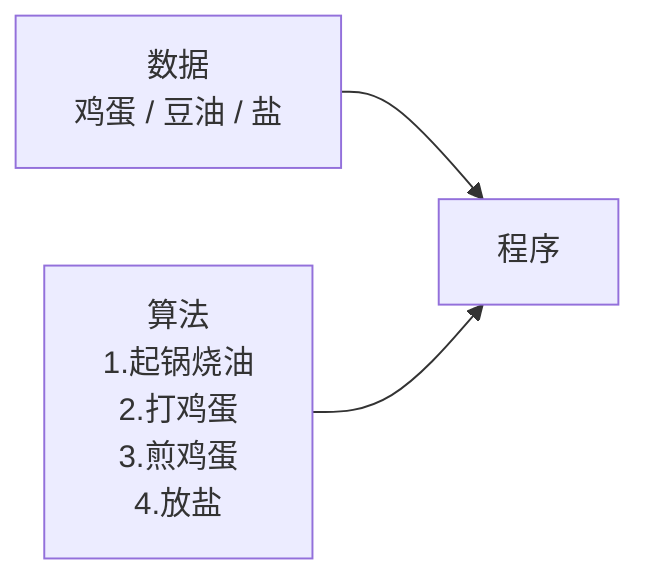
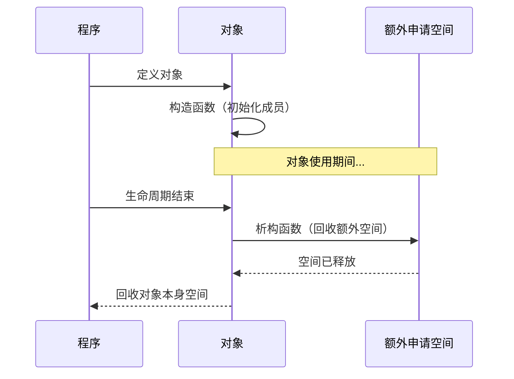

# 2.1 类与对象基础

## 面向过程 vs 面向对象

### 面向过程编程（Procedure-Oriented Programming, POP）

C 语言采用结构化编程：将一个大型程序分解为一个个小型的、易于编写的模块，所有模块有序调动起来形成完整的运行链。这种结构化编程反映出过程性编程的思想——C 语言是一门面向过程的语言，更注重程序实现逻辑，怎么更好、更快、更直接地完成某一功能。

- **主体**：函数（模块），以函数为中心。
- **核心思想**：自上向下，顺序执行、逐步细化。
- **分析步骤**：把问题的步骤、流程分析出来，用函数封装成模块，在主流程中按步骤调用。

> 举例：把大象放进冰箱 → 打开冰箱 → 把大象放进去 → 关上冰箱。

### 面向对象编程（Object-Oriented Programming, OOP）

C++ 是一门面向对象的语言，把问题分解成各个**对象**（变量、数据），而不是各个流程、步骤。建立对象的目的不是为了完成一个步骤，而是为了描述某个事物在整个解决问题步骤中的**属性和行为**，更注重程序的整体设计，方便后期维护、优化和管理，让一个功能尽可能通用。

- **主体**：对象（数据），以对象为中心。
- **核心思想**：分析问题中参与的实体 → 实体有什么属性和方法 → 通过调用实体的属性和方法解决问题。
- **价值**：应对需求的变化，本意是处理大型复杂系统的设计和实现。

> 相关概念：
> - **OOA**（Object-Oriented Analysis）：面向对象的分析
> - **OOD**（Object-Oriented Design）：面向对象的设计

### 优缺点对比

| 对比项 | 面向过程 | 面向对象 |
|--------|----------|----------|
| 优点 | 性能高（无需实例化），适合单片机、嵌入式、Linux/Unix 等性能敏感场景 | 易维护、易复用、易扩展；封装/继承/多态特性可设计低耦合系统 |
| 缺点 | 不易维护、不易复用、不易扩展 | 类调用需实例化，开销较大，消耗资源，性能略低 |

### C++ 的定位

C++ 由 C 衍生而来，兼容 C 语言，同时增加了函数重载、类、继承、多态，支持泛型编程（模板函数、模板类），拥有强大的 STL 库。

**面向对象三大特性：封装、继承、多态。**

---

## 封装、复用性与扩展性

以"煎鸡蛋"为例理解程序的构成：

| 概念 | 说明 |
|------|------|
| **封装** | 将零散的数据和算法放到一个集合里，方便管理和使用 |
| **复用性** | 公共功能、过程的抽象，体现为能被重复使用的类、方法；要求针对某一类功能而非某一个功能去设计 |
| **扩展性** | 增加新的功能不影响原来已经封装好的功能 |

---

## 类的定义

### 命名规则

| 元素 | 规则 | 示例 |
|------|------|------|
| 类名 | `C` 前缀 | `CPeople` |
| 成员属性 | `m_` 前缀 + 类型缩写 | `m_strName`、`m_bSex`、`m_nAge` |

### 访问修饰符

| 修饰符 | 访问范围 |
|--------|----------|
| `public` | 类内、类外均可调用 |
| `protected` | 类内和子类可调用 |
| `private` | 只有类内可使用 |

---

## 构造函数

- **函数名**：与类名相同，参数任意，无返回值。
- **作用**：初始化类中的成员属性。
- **调用时机**：定义对象时由编译器自动调用。
- **重载**：一个类中构造函数可以有多个。
- **默认构造函数**：空类中编译器自动提供 `CPeople(){}`，但不做真正的初始化工作。
- **规则**：一旦手动重构了任何构造函数，默认构造函数不再提供。

---

## 析构函数

- **函数名**：`~类名`，无参数。
- **作用**：回收类中成员额外申请的空间。
- **调用时机**：对象生命周期结束时，由编译器自动调用——在回收对象之前先调用析构函数回收额外空间，再回收对象本身。
- **唯一性**：一个类中只会存在一个析构函数。
- **规则**：空类中编译器提供默认析构函数（什么也不做）；一旦手动重构，默认析构函数不再提供。

---

> 上一篇：[[1.2.函数与引用]] ｜ 下一篇：[[2.2.类成员深入]]
