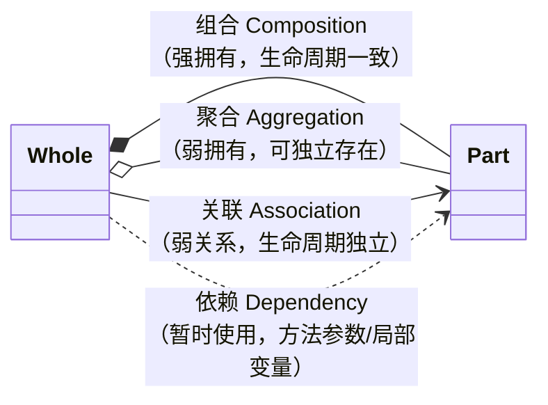

# 2.3 类的横向关系

C++ 中类与类之间的关系可从**横向**和**纵向**两个维度分析：

- **横向关系**：组合（Composition）、依赖（Dependency）、关联（Association）、聚合（Aggregation）
- **纵向关系**：继承（Inheritance）、多态（Polymorphism）



---

## 1. 组合（Composition）

**强拥有关系**，表示一个类"拥有"另一个类，被拥有对象的生命周期与容器类相同。容器对象销毁时，被组合对象也随之销毁。

- 通常使用**成员对象**实现（而非指针）。
- 被组合对象作为成员变量嵌入容器类中。

```cpp
class Engine {
public:
    void start() { /* 启动引擎 */ }
};

class Car {
private:
    Engine engine;  // 引擎是 Car 的组成部分
public:
    void drive() { engine.start(); }
};
```

---

## 2. 依赖（Dependency）

**暂时的使用关系**，一个类依赖于另一个类的功能。通常表现为方法参数、返回值类型或局部变量。

- 依赖关系通常是暂时的，依赖类的生命周期不受影响。
- 通过传递对象或指针/引用来实现。

```cpp
class Engine {
public:
    void start() { /* 启动引擎 */ }
};

class Car {
public:
    void drive(Engine& engine) {  // 通过方法参数依赖 Engine
        engine.start();
    }
};
```

---

## 3. 关联（Association）

**较弱的使用关系**，两个类对象之间存在某种"使用"关系，但生命周期独立。通常表现为一个类包含另一个类的指针或引用，但不负责销毁。

- 可以是单向或双向。
- 通过指针或引用传递，当前对象不负责销毁关联对象。

```cpp
class Engine {
public:
    void start() { /* 启动引擎 */ }
};

class Car {
private:
    Engine* engine;  // 关联关系（指针），不拥有 Engine
public:
    Car(Engine* eng) : engine(eng) {}
    void drive() { engine->start(); }
};
```

---

## 4. 聚合（Aggregation）

**比组合弱的拥有关系**，表示"整体-部分"关系，但整体和部分可以独立存在。被聚合对象可能在多个容器中共享。

- 通常使用指针或引用表示。
- 整体不负责部分的生命周期管理。

```cpp
class Engine {
public:
    void start() { /* 启动引擎 */ }
};

class Car {
private:
    Engine* engine;  // 聚合关系，外部传入，不负责销毁
public:
    Car(Engine* eng) : engine(eng) {}
    void drive() { engine->start(); }
};
```

> [!note] 组合 vs 聚合
> 代码形式可能完全相同（都用指针），区别在于**语义和生命周期管理**：
> - **组合**：整体负责部分的创建和销毁（`new` / `delete` 在类内部完成）。
> - **聚合**：部分由外部创建和管理，整体只持有引用。

---

## 四种横向关系对比

| 关系 | 强度 | 生命周期 | 典型实现 | UML 表示 |
|------|------|----------|----------|----------|
| 组合 Composition | 最强 | 部分与整体同生共死 | 成员对象 / 内部指针 | 实心菱形 `*--` |
| 聚合 Aggregation | 较强 | 部分可独立存在 | 外部指针 / 引用 | 空心菱形 `o--` |
| 关联 Association | 较弱 | 各自独立 | 指针 / 引用成员 | 箭头 `-->` |
| 依赖 Dependency | 最弱 | 暂时使用 | 方法参数 / 局部变量 | 虚线箭头 `..>` |

---

## 纵向关系简述

纵向关系涉及类之间的**父子层次**，将在后续笔记中详细展开：

### 继承（Inheritance）

- "是一个"（Is-A）关系。
- 子类继承父类的公有和保护成员，无法继承私有成员。
- 子类可重写父类方法，也可定义自己特有的方法。
- C++ 支持单继承和多继承。

### 多态（Polymorphism）

- 通过继承和虚函数实现，父类指针或引用可指向子类对象并调用子类重写的方法。

> 详见：[[2.4.继承机制]]、[[2.5.多态与虚函数]]

---

> 上一篇：[[2.2.类成员深入]] ｜ 下一篇：[[2.4.继承机制]]
