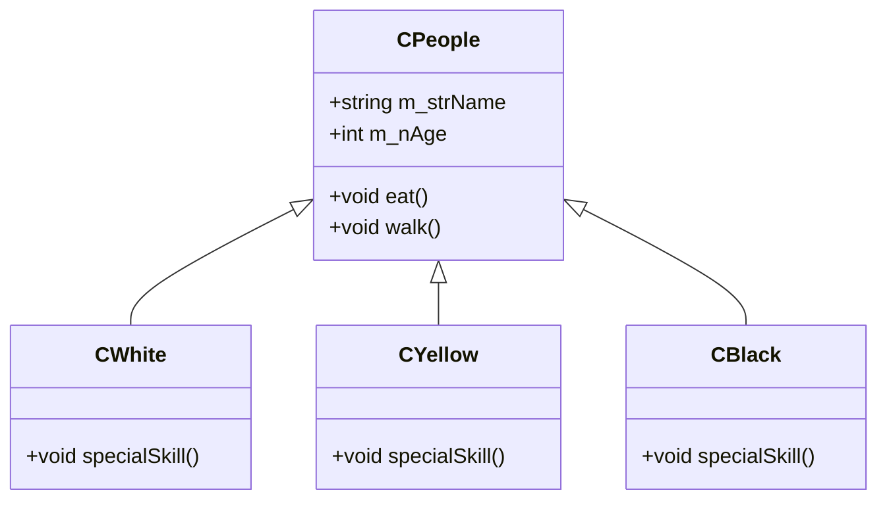
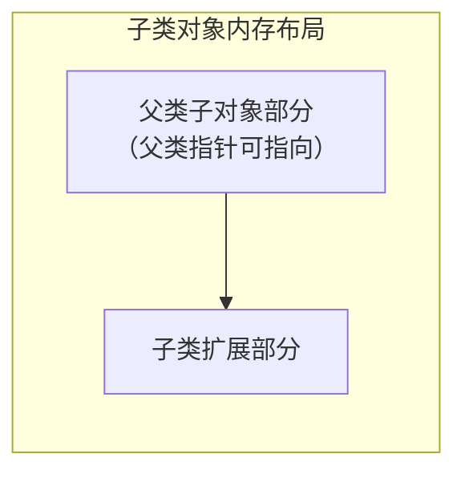

# 2.4 继承机制

## 继承概述

继承允许子类使用父类成员，同时**包含**父类成员——在父类的基础上，子类可视为其延续和扩展。



### 继承的优点

从**功能相似**的多个子类中，抽离出**公共成员**放到父类中，提高：

- **代码复用性**：公共代码只需写一次。
- **扩展性**：新增子类只需继承父类并扩展特有功能。
- **灵活性**：通过父类统一管理子类对象。

> 示例：人有白种人、黄种人、黑人，都有吃、走路、消费等行为，同时都有 money 等属性 → 抽离为 `CPeople` 父类。

---

## 隐藏（Hiding）

在继承关系下，子类定义了与父类**同名**的成员时，子类成员会**隐藏**父类成员。

- 子类成员函数与父类同名函数之间**不是重载**（作用域不同）。
- 通过子类对象直接访问时，默认访问子类版本。
- 如需访问父类版本，需显式加父类作用域：`子类对象.父类::成员`。

```cpp
class CBase {
public:
    void show() { std::cout << "Base\n"; }
};

class CDerived : public CBase {
public:
    void show() { std::cout << "Derived\n"; }  // 隐藏父类 show
};

CDerived d;
d.show();        // "Derived"
d.CBase::show(); // "Base"  —— 显式访问父类版本
```

---

## 父类指针与子类对象

### 父类指针可直接指向子类对象

```cpp
CBase* pBase = new CDerived();  // 合法
```

- 保证子类对象可成功调用父类成员。
- 子类对象中包含一个完整的父类子对象，父类指针指向该子对象部分。

### 子类指针不可直接指向父类对象

```cpp
CDerived* pDerived = new CBase();  // 错误
```

- 子类指针指向的空间更大（包含父类部分 + 子类扩展部分）。
- 若指向父类对象，访问子类特有成员时会出现**越界访问**。



---

## 类成员函数指针

### 定义与使用

```cpp
class Test {
public:
    void fun(int a) { std::cout << a << '\n'; }
};

// 定义类成员函数指针
void (Test::* pFun_class)(int a) = &Test::fun;

// 调用
Test obj;
(obj.*pFun_class)(10);   // 通过对象调用
Test* pObj = &obj;
(pObj->*pFun_class)(20); // 通过指针调用
```

### 语法要点

| 要点 | 说明 |
|------|------|
| `::*` | 定义指针时，指针名前加类名及 `::*`（与普通函数不同，类成员函数隐含 `this` 指针） |
| `&类名::函数` | 赋值时加作用域，函数属于该类作用域 |
| `.*` / `->*` | 调用时的运算符，与 `::*` 同属整体操作符 |

### 应用场景：间接调用子类特有方法

当父类指针指向子类对象，但父类中没有某个子类特有的成员函数时，可通过类成员函数指针间接调用：

```cpp
class CPeople {
public:
    virtual ~CPeople() {}
};

class CYellow : public CPeople {
public:
    void eat() { std::cout << "Yellow eating\n"; }
};

// 父类指针指向子类对象
CPeople* p = new CYellow();

// 通过成员函数指针间接调用子类特有方法
void (CYellow::* pEat)() = &CYellow::eat;
(static_cast<CYellow*>(p)->*pEat)();
```

> [!warning] 更安全的做法是在父类中声明虚函数，由子类重写，利用多态机制调用。成员函数指针适用于无法修改父类接口的场景。

---

> 上一篇：[[2.3.类的横向关系]] ｜ 下一篇：[[2.5.多态与虚函数]]
