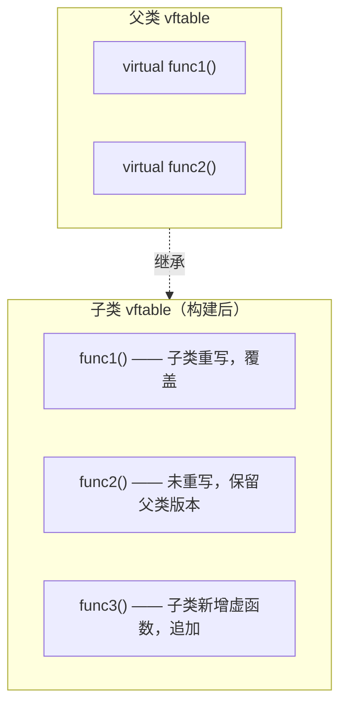

# 2.5 多态与虚函数

## 多态概述

**多态（Polymorphism）**：相同行为方式导致不同结果，同一行代码展现不同表现形态。

在继承的基础上，父类指针可以指向任何继承于该类的子类对象，多种子类具有多种形态且由父类统一管理，父类指针也就有了多态性。

### 多态的条件

1. 在**继承的基础**上，父类指针指向子类（或孙子类）对象。
2. 在父类中定义了**虚函数**，子类**重写**这个虚函数。

> **重写（Override）**：在虚函数的前提下，子类定义了和父类中虚函数**函数原型完全相同**的函数。

### 静态多态 vs 动态多态

| 类型 | 实现方式 | 绑定时机 | 示例 |
|------|----------|----------|------|
| 静态多态 | 函数重载 | 编译期绑定（静态绑定） | `add(int, int)` / `add(double, double)` |
| 动态多态 | 虚函数 | 运行期绑定（动态绑定） | 父类指针调用子类重写的虚函数 |

> 引用同样可以实现多态：`Base& ref = derivedObj;`

---

## 虚函数（`virtual`）

### 虚函数对对象内存的影响

> [!quote] 定义虚函数会使对象内存空间增加
> 对象内存空间增加的成员与虚函数有关，但**与虚函数的数量无关**。

当类中存在虚函数时，定义对象会多分配一个**指针大小**的空间，用于存放虚函数列表指针。

### `__vfptr` 与 `vftable`

| 概念 | 说明 |
|------|------|
| `__vfptr` | 虚函数列表指针，类型为 `void**`（二级指针）。定义对象时存在，由编译器增加在对象内存空间的**前面**（指针大小的空间）。执行构造函数初始化列表时，由编译器默认初始化，指向虚函数列表。 |
| `vftable` | 虚函数列表，是一个虚函数指针数组，**属于类**。编译期存在，只有一份，多个对象共用。每个元素为虚函数地址，顺序为虚函数在类中声明的先后顺序。 |

### 虚函数调用流程


1. 通过对象找到内存前部的 `__vfptr`。
2. 通过虚函数列表指针找到 `vftable`。
3. 通过下标定位到具体元素，找到虚函数真正的地址。
4. 跳转到函数入口执行虚函数代码。

### 虚函数与普通成员函数的区别

| 对比项 | 虚函数 | 普通成员函数 |
|--------|--------|-------------|
| 调用流程 | 通过 `__vfptr` → `vftable` → 函数地址 | 直接定位函数地址 |
| 效率 | 调用流程复杂，效率略低 | 直接定位，效率高 |
| 使用场景 | 实现动态多态 | 不能实现动态多态 |

### `__vfptr` 指向哪个类的虚函数列表？

取决于**定义的对象的实际类型**，与指向对象的指针类型无关。

```cpp
CBase* p = new CDerived();  // p 是 CBase*，但对象是 CDerived
// __vfptr 指向 CDerived 的 vftable
```

### 子类虚函数列表的构建过程

1. **继承**：子类不但继承父类的成员，也会继承父类的虚函数列表（复制一份）。
2. **检查重写**：如果子类重写了父类的虚函数，原位置**覆盖**；如果没有重写，原位置**保留**。
3. **依次添加**：如果子类有自己单独的虚函数，按声明先后顺序依次添加到结尾。



---

## 多态应用规则

### 哪些函数可以/不可以为虚函数

| 可以为虚函数 | 不可以为虚函数 |
|-------------|---------------|
| 常成员函数 | 构造函数（对象未构造完成，无 `__vfptr`） |
| 析构函数 | 静态函数（无 `this` 指针） |

### 函数参数默认值

函数参数默认值是**编译期概念**：父类定义了默认值，通过父类指针调用时取父类默认值，不再取子类默认值。

> [!quote] 结构体中同样可以使用虚函数，同时也有虚函数列表。

---

## 虚析构函数

```cpp
virtual ~CBase() {}  // 虚析构函数
```

- **作用**：避免内存泄漏。
- **原理**：`delete` 调用的是**指针指向类型**的析构函数。若析构函数非虚，`delete 父类指针` 只会调用父类析构函数，子类部分资源不会被释放。
- **规则**：当类作为父类且可能通过父类指针 `delete` 子类对象时，析构函数应声明为 `virtual`。

```cpp
class CBase {
public:
    virtual ~CBase() { std::cout << "Base destructor\n"; }
};

class CDerived : public CBase {
    int* m_pData;
public:
    CDerived() : m_pData(new int[100]) {}
    ~CDerived() {
        delete[] m_pData;  // 虚析构保证此处被调用
        std::cout << "Derived destructor\n";
    }
};

CBase* p = new CDerived();
delete p;  // 先调用 CDerived::~CDerived()，再调用 CBase::~CBase()
```

---

## 纯虚函数与抽象类

### 纯虚函数

```cpp
virtual 返回类型 函数名(参数列表) = 0;
```

- 子类**必须重写**实现父类的纯虚函数，否则子类也是抽象类，无法实例化。

### 抽象类 vs 具体类

| 类型 | 定义 | 能否实例化 |
|------|------|-----------|
| 抽象类 | 定义了纯虚函数的类 | 不能实例化对象 |
| 具体类 | 不存在纯虚函数（所有纯虚函数都已被重写实现） | 可以实例化 |

---

## 多态的缺点

> [!bug] 多态的代价
> 1. **效率**：调用虚函数需经过 `__vfptr` → `vftable` 间接寻址，效率低、速度慢。
> 2. **空间**：每个含虚函数的对象都有一个 `__vfptr` 指针占用空间；虚函数列表随继承层级递增，虚表大小只增不减。
> 3. **安全**：类中的私有函数不能为虚函数，否则通过虚函数表可能被外部调用，存在安全隐患。

---

> 上一篇：[[2.4.继承机制]] ｜ 下一篇：[[2.6.拷贝控制]]
