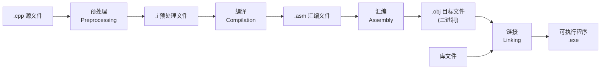

# 3.1 编译预处理与内联

## 头文件与源文件

| 文件类型 | 内容 | 编译行为 |
|----------|------|----------|
| **头文件**（`.h`） | 变量的声明、函数的声明、类的声明与定义 | 单独的头文件**不参与编译**，通过 `#include` 被源文件包含 |
| **源文件**（`.cpp`） | 变量的定义、函数的定义、成员属性定义及初始化、成员函数的定义 | 自上而下，独立进行编译 |

---

## 头文件重复包含保护

### 方案一：`#pragma once`

```cpp
#pragma once
```

- 直接与编译器沟通，告诉编译器当前头文件在其他源文件中只会包含一次。
- **优点**：代码简单、方便快捷、编译效率高。
- **缺点**：并非 C++ 标准支持，适用范围没那么广（但主流编译器均支持）。

### 方案二：基于宏的逻辑判断

```cpp
#ifndef __A_H__
#define __A_H__

// 头文件内容

#endif
```

- **优点**：C++ 标准，所有编译器都支持；可以做到部分代码去重（置于 `#endif` 之后的代码不受保护）。
- **缺点**：写法麻烦，编译速度略慢。

---

## 头文件互相包含

当两个头文件互相 `#include` 时，会导致**循环依赖**问题。解决方法：

1. 在头文件中使用**前向声明**（forward declaration）代替 `#include`：
   ```cpp
   class B;  // 前向声明，只需知道 B 是一个类
   ```
2. 在源文件（`.cpp`）中再 `#include` 对应的头文件。

> 前向声明只能用于声明指针或引用，不能用于定义对象（编译器需要知道完整类型大小）。

---

## 程序生成过程



### 1. 预处理（Preprocessing）

将源文件（`.cpp`）初步处理，生成预处理文件（`.i`）：

1. 解析 `#include`，头文件展开替换。
2. 宏定义指令：`#define` 宏的替换、`#undef` 等。
3. 预处理指令：解析 `#if`、`#ifndef`、`#ifdef`、`#else`、`#elif`、`#endif` 等。
4. 删除所有注释。

### 2. 编译（Compilation）

将预处理后的文件（`.i`）进行词法分析、语法分析、语义分析及优化，产生相应的汇编代码文件（`.asm`）。

### 3. 汇编（Assembly）

将汇编代码文件（`.asm`）中的汇编指令逐条翻译成目标机器指令，生成可重定位目标程序的 `.obj` 文件。该文件为二进制文件，字节编码是机器指令。

### 4. 链接（Linking）

通过链接器将多个目标文件（`.obj`）和库文件链接在一起，生成一个完整的可执行程序。

---

## 编译期 vs 运行期

| 概念 | 定义 |
|------|------|
| **编译期** | 把源程序交给编译器编译、生成的过程，最终得到可执行文件 |
| **运行期** | 将可执行文件交给操作系统执行、直到程序退出；把磁盘中的程序二进制代码放到内存中执行，目的是实现程序的功能 |

---

## 宏定义（`#define`）

### 宏 vs 函数

| 对比项 | 宏 | 函数 |
|--------|-----|------|
| 效率 | 比函数高（直接替换，无函数调用开销） | 有函数调用开销 |
| 参数类型 | 宏参数没有类型，不做类型校验 | 有参数类型校验 |
| 表达式求解 | 不能自动计算表达式的求解 | 自动计算表达式的求解 |

### 多行宏定义

在行末加上 `\` 表示续行：

```cpp
#define Print(container) \
    for (auto& v : container) { \
        std::cout << v << ' '; \
    } \
    std::cout << '\n';

#undef XXX  // 取消宏绑定
```

### 宏的特殊操作符

| 操作符 | 作用 | 示例 |
|--------|------|------|
| `#` | 将宏参数转换为**字符串**，加双引号 | `#define D(ARG) #ARG` → `D(hello)` → `"hello"` |
| `#@` | 将宏参数转换为**字符**，加单引号 | `#define E(ARG) #@ARG` → `E(a)` → `'a'` |
| `##` | 单纯拼接，相当于字符串自加 | `#define F(ARG) int aaa##ARG = 456;` → `F(1)` → `int aaa1 = 456;` |

> 宏名与函数名可以相同，调用函数时函数名可以加括号区分。

---

## 内联函数（`inline`）

内联函数结合了**宏的高效**和**函数的参数校验、自动计算参数表达式**的优点。

```cpp
inline int max(int a, int b) {
    return a > b ? a : b;
}
```

> [!bug] 内联函数的适用与限制
> - **适用场景**：适合代码量少、短小精悍的函数，避免复杂逻辑、复杂循环（`for`、`while`、`switch`）。是**空间换时间**的做法。
> - **缺点**：过度使用会导致代码量膨胀，内存增加。
> - **建议性关键字**：`inline` 只是建议编译器将函数作为内联函数，编译器有自己的检查规则，判断其是否真正内联。
> - **一定不能内联**：递归函数、实现多态的虚函数。
> - **默认内联**：在类、结构体中声明且定义的函数，默认为内联函数；在类、结构体中声明但在类外定义的函数，默认为非内联函数。

---

> 上一篇：[[2.6.拷贝控制]] ｜ 下一篇：[[4.1.迭代器与运算符重载]]
