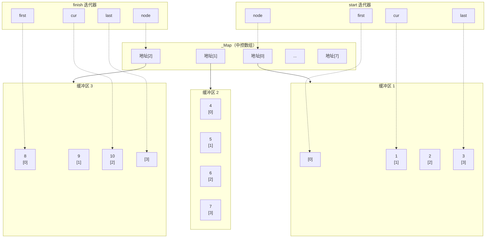

# 4.2 STL 容器

## `std::vector` 动态数组

`std::vector` 是连续空间的动态数组，支持随机访问。

### 容量管理

| 操作 | 说明 |
|------|------|
| `resize(int used, int val)` | 重置使用量，能扩容（新增元素初始化为 val） |
| `shrink_to_fit()` | 重置容量为当前使用量（释放多余空间） |
| `std::vector<int>(int cap).swap(vec)` | 重置容量为 cap（利用临时对象交换） |

### `vector` vs `list`

| 对比项 | `vector` | `list` |
|--------|----------|--------|
| 存储方式 | 连续性空间，顺序存储 | 链式结构体，链式存储 |
| 非尾部插入/删除 | 会导致其他元素拷贝移动 | 不影响其他节点 |
| 内存分配 | 一次性分配，不够时重新申请并拷贝 | 每次插入新节点时申请内存 |
| 随机访问 | 性能好（O(1)） | 性能差（O(n)） |
| 插入/删除 | 性能差（非尾部 O(n)） | 性能好（O(1)） |
| 容量概念 | 有容量（capacity）和使用量（size） | 只有使用量（size） |

---

## `std::deque` 双端队列

`deque` 是一种**双向开口的连续性空间**，可以在头尾两端分别做元素的插入和删除操作。

### 内部结构

`deque` 没有容量的概念，它由**分段连续空间**组合而成。一旦有必要在前端或尾端增加新空间，就串接在整个 `deque` 的头端或尾端。

### 迭代器结构

`deque` 的迭代器不是普通指针，比 `vector` 复杂得多，包含四个指针：

| 成员 | 作用 |
|------|------|
| `first` | 指向当前缓冲区的头部 |
| `cur` | 指向当前缓冲区中的当前元素 |
| `last` | 指向当前缓冲区的尾部（含保留空间） |
| `node` | 指向中控数组 `_Map` 中的对应项 |

### 使用建议

除非必要（需要频繁在头尾两端插入删除），应尽量选择使用 `vector` 而非 `deque`，因为 `deque` 的迭代器复杂度更高，随机访问性能不如 `vector`。

---

## `std::map` 映射表

`map` 的所有元素都会根据**键值（key）**自动排序。所有元素都是 `pair`，同时拥有键值（key）和实值（value）。

- `pair` 的第一元素视为键值，第二元素视为实值。
- `map` 不允许两个元素拥有相同的键值。
- 键值关系到元素的排列规则，任意改变键值将严重破坏 `map` 的组织，因此**不可以通过迭代器改变键值**，但可以修改实值。
- 查找效率：$O(\log_2 n)$，内部实现为**红黑树**。

### 红黑树中的 `_Head` 节点

- 与根节点由 `parent` 指针形成环。
- 左孩子指向最小元素，右孩子指向最大元素，值为空。
- 所有终端节点（叶子节点的空指针）都由 `_Head` 节点替代。

---

## `std::set` 集合

`set` 的所有元素根据键值自动排序。与 `map` 不同，`set` 的元素**键值就是实值，实值就是键值**。

- 不允许两个元素有相同的键值。
- 任意改变元素值会严重破坏 `set` 组织，因此不能通过迭代器修改元素值。
- 查找效率：$O(\log_2 n)$，内部实现为红黑树。
- 头文件：`#include <set>`

---

## `std::unordered_map` 哈希表

`unordered_map` 基于**哈希表**实现，元素不排序。

| 对比项 | `std::map` | `std::unordered_map` |
|--------|-----------|----------------------|
| 内部实现 | 红黑树 | 哈希表 |
| 有序性 | 按键值排序 | 无序 |
| 查找效率 | $O(\log n)$ | 平均 $O(1)$，最坏 $O(n)$ |
| 空间开销 | 较小 | 较大（哈希桶） |

---

## STL 算法 `<algorithm>` / `<numeric>`

STL 中的算法头文件位于 `<algorithm>` 和 `<numeric>`（以 `<algorithm>` 为主）。

| 算法 | 签名 | 说明 |
|------|------|------|
| `for_each` | `for_each(First, Last, Func)` | 对范围内每个元素执行 Func |
| `count` | `count(First, Last, Val)` | 统计指定范围内等于 Val 的元素数量 |
| `equal` | `equal(First1, Last1, First2)` | 比较两个范围是否逐个相等，First2 容器元素数不能小于 First1~Last1 |
| `find` | `find(First, Last, Val)` | 查找第一个等于 Val 的元素，返回迭代器 |
| `sort` | `sort(First, Last, comp)` | 排序，**不能对链表排序**（链表自带 `sort` 成员函数） |
| `max` | `max(Left, Right)` | 返回较大者（复制一份） |
| `min` | `min(Left, Right)` | 返回较小者（复制一份） |

---

> 上一篇：[[4.1.迭代器与运算符重载]] ｜ 下一篇：[[5.1.设计模式]]
