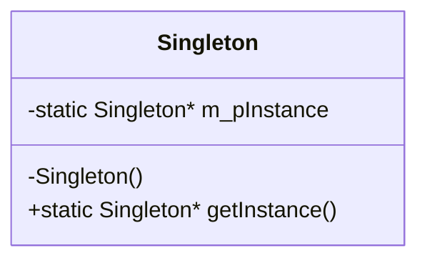
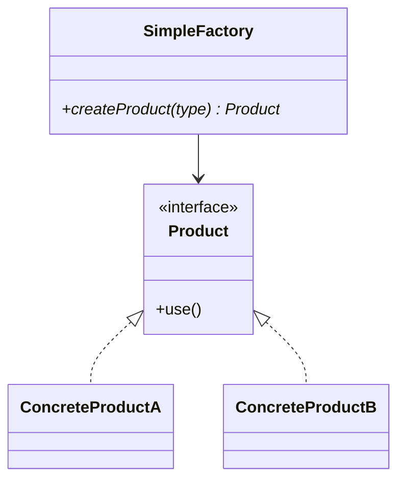
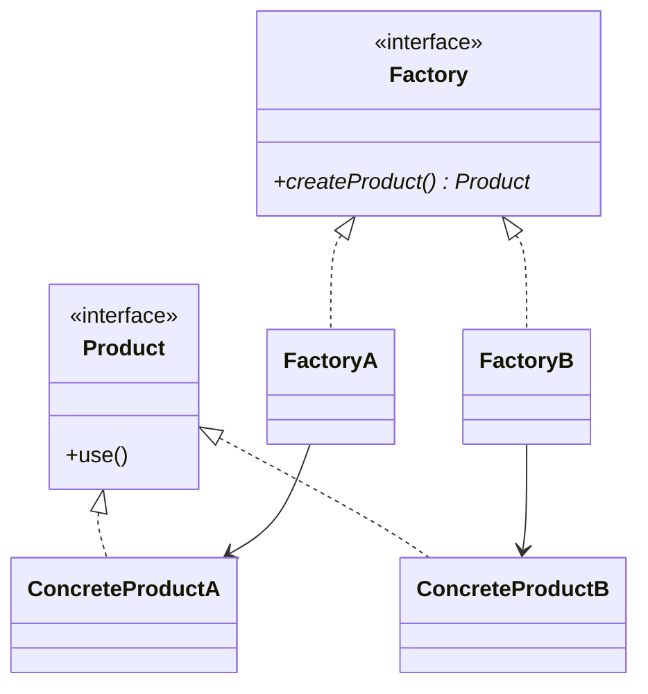
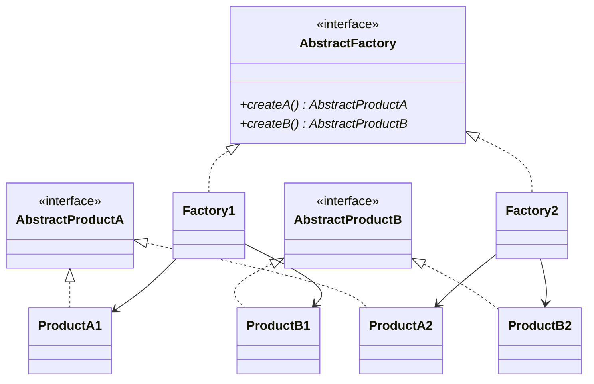

# 5.1 设计模式

## 单例模式（Singleton Pattern）

单例模式属于**创建型模式**，确保一个类只有一个实例，并提供全局访问点。

### 三个要点

1. 当前类最多只能创建**一个实例**。
2. 它必须**自己创建**这个实例（而不是由调用者创建）。
3. 它必须自己向整个系统提供**全局访问点**。



---

### 懒汉式（Lazy Initialization）

**延迟创建**：第一次使用时才创建实例。

#### 方式一：指针 + 手动回收

```cpp
class Singleton {
private:
    static Singleton* m_pInstance;
    Singleton() {}  // 构造函数私有
public:
    static Singleton* getInstance() {
        if (m_pInstance == nullptr) {
            m_pInstance = new Singleton();
        }
        return m_pInstance;
    }
    static void destroy() {  // 手动回收
        delete m_pInstance;
        m_pInstance = nullptr;
    }
};
Singleton* Singleton::m_pInstance = nullptr;
```

#### 方式二：静态局部对象（保底回收）

利用 C++ 静态局部对象在程序结束时自动析构的机制：

```cpp
class Singleton {
private:
    Singleton() {}
public:
    static Singleton& getInstance() {
        static Singleton instance;  // 第一次调用时创建，程序结束自动回收
        return instance;
    }
};
```

> 申请一个静态对象返回，该对象将在程序结束时自动回收。

#### 懒汉式优缺点

| 方式 | 优点 | 缺点 |
|------|------|------|
| 指针 + 手动回收 | 可自行选择何时回收该单例对象 | 多线程下需加锁；需手动回收 |
| 静态局部对象 | 创建简单，自动回收 | 只能等到程序结束才能回收；多线程安全（C++11 起） |

> [!warning] 线程安全
> 懒汉式在多线程环境下，`if (m_pInstance == nullptr)` 可能出现多个线程同时通过判断、创建多个实例的问题。需加锁或使用静态局部对象方式（C++11 保证线程安全）。

---

### 饿汉式（Eager Initialization）

**提前创建**：程序启动时就创建实例。

```cpp
class Singleton {
private:
    static Singleton m_instance;  // 静态成员对象，程序启动时创建
    Singleton() {}
public:
    static Singleton& getInstance() {
        return m_instance;
    }
};
Singleton Singleton::m_instance;  // 类外定义
```

- 使用**静态类成员**，在程序进入 `main` 之前就完成初始化。
- **不会因为多线程创建多个实例**（初始化发生在单线程阶段）。
- 缺点：无论是否使用，实例都会创建，占用资源；如果有多个单例且存在依赖关系，初始化顺序不确定。

---

### 懒汉式 vs 饿汉式

| 对比项 | 懒汉式 | 饿汉式 |
|--------|--------|--------|
| 创建时机 | 第一次使用时 | 程序启动时 |
| 线程安全 | 需注意（静态局部对象方式安全） | 天然安全 |
| 资源占用 | 延迟占用 | 始终占用 |
| 初始化顺序 | 可控 | 不可控（静态初始化顺序问题） |

---

## 工厂模式（Factory Pattern）

工厂模式属于**创建型模式**，将对象的创建与使用分离，由专门的工厂类负责对象的创建。

### 简单工厂（Simple Factory）

由一个工厂类根据参数决定创建哪一种产品。



```cpp
class Product {
public:
    virtual void use() = 0;
    virtual ~Product() {}
};

class ProductA : public Product {
public:
    void use() override { /* ... */ }
};

class ProductB : public Product {
public:
    void use() override { /* ... */ }
};

class SimpleFactory {
public:
    Product* createProduct(int type) {
        switch (type) {
            case 1: return new ProductA();
            case 2: return new ProductB();
            default: return nullptr;
        }
    }
};
```

- 优点：客户端不需要直接创建对象，只需知道参数。
- 缺点：新增产品时需要修改工厂类，违反**开闭原则**。

---

### 工厂方法（Factory Method）

定义一个创建对象的接口，让子类决定实例化哪一个类。每个产品对应一个工厂。



```cpp
class Factory {
public:
    virtual Product* createProduct() = 0;
    virtual ~Factory() {}
};

class FactoryA : public Factory {
public:
    Product* createProduct() override { return new ProductA(); }
};

class FactoryB : public Factory {
public:
    Product* createProduct() override { return new ProductB(); }
};
```

- 优点：新增产品时只需新增对应工厂类，符合开闭原则。
- 缺点：每增加一个产品就需要增加一个工厂类，类的数量成倍增加。

---

### 抽象工厂（Abstract Factory）

提供一个接口，创建一系列**相关或相互依赖**的产品族，而不需要指定具体类。



- 适用于需要创建**产品族**（多个相关产品）的场景。
- 例如：不同操作系统下的按钮、文本框、菜单等一组 UI 组件。

---

### 三种工厂模式对比

| 模式 | 核心角色 | 适用场景 | 开闭原则 |
|------|----------|----------|----------|
| 简单工厂 | 一个工厂类根据参数创建产品 | 产品种类少且稳定 | 违反（新增产品需改工厂） |
| 工厂方法 | 每个产品对应一个工厂子类 | 产品种类可能扩展 | 符合 |
| 抽象工厂 | 创建一组相关产品（产品族） | 有多组相关产品需统一创建 | 新增产品族符合，新增产品等级违反 |

---

> 上一篇：[[4.2.STL容器]] ｜ 下一篇：[[6.1.宠物小屋项目]]
