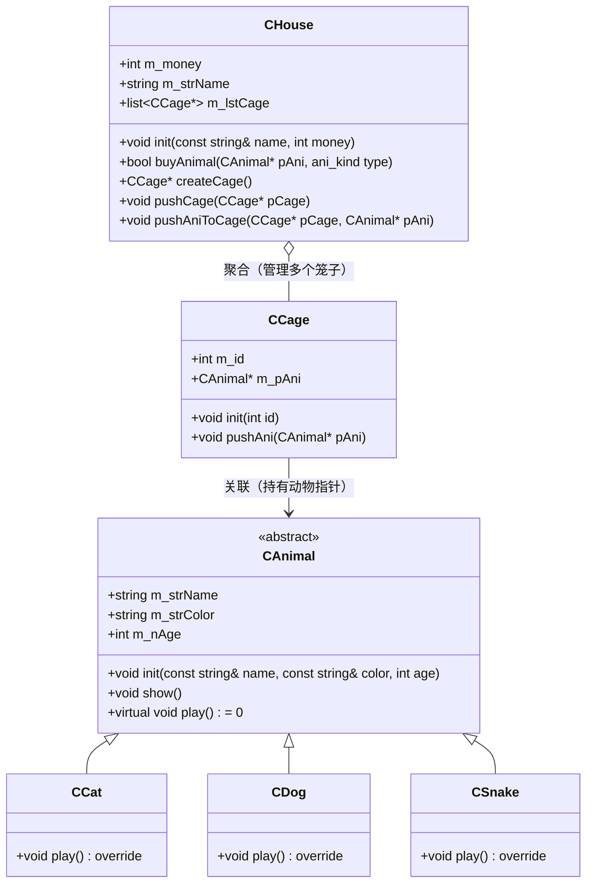

# 6.1 宠物小屋项目

## 项目概述

一个面向对象的宠物管理系统，综合运用**封装、继承、多态、组合**等面向对象特性，以及 STL 容器。

涉及的宠物类型：猫、狗、蛇等。

---

## 类设计



### 类职责说明

| 类 | 职责 |
|----|------|
| `CAnimal` | 抽象基类，定义动物的公共属性（名字、颜色、年龄）和纯虚函数 `play()` |
| `CCat` / `CDog` / `CSnake` | 具体动物类，继承 `CAnimal` 并实现 `play()` |
| `CCage` | 笼子类，持有一个动物指针，负责管理单个宠物 |
| `CHouse` | 宠物屋类，管理多个笼子（`list<CCage*>`），负责购买动物、创建笼子等 |

---

## 核心设计要点

### 1. 多态的运用

`CAnimal` 中声明纯虚函数 `virtual void play() = 0`，使 `CAnimal` 成为抽象类。各子类重写 `play()` 实现不同动物的玩耍行为：

```cpp
class CAnimal {
public:
    virtual void play() = 0;  // 纯虚函数
    virtual ~CAnimal() {}      // 虚析构函数
};

class CCat : public CAnimal {
public:
    void play() override { /* 猫的玩耍方式 */ }
};

class CDog : public CAnimal {
public:
    void play() override { /* 狗的玩耍方式 */ }
};
```

通过 `CAnimal*` 指针统一管理不同动物，调用 `play()` 时自动分派到对应子类的实现。

### 2. 组合与聚合

- `CHouse` 聚合多个 `CCage`（`list<CCage*>`）：笼子可以独立存在，宠物屋不负责笼子的创建细节。
- `CCage` 关联一个 `CAnimal`（`CAnimal*`）：笼子持有动物指针，但不拥有动物的生命周期。

### 3. STL 容器的运用

使用 `std::list<CCage*>` 管理笼子列表，支持高效的插入和删除操作。

---

## 类接口定义

### `CAnimal`

```cpp
class CAnimal {
public:
    std::string m_strName;
    std::string m_strColor;
    int m_nAge;

    void init(const std::string& name, const std::string& color, int age);
    void show();
    virtual void play() = 0;
    virtual ~CAnimal() {}
};
```

### `CCage`

```cpp
class CCage {
public:
    int m_id;
    CAnimal* m_pAni;

    void init(int id);
    void pushAni(CAnimal* pAni);
};
```

### `CHouse`

```cpp
class CHouse {
public:
    int m_money;
    std::string m_strName;
    std::list<CCage*> m_lstCage;

    void init(const std::string& name, int money);
    bool buyAnimal(CAnimal* pAni, ani_kind type);
    CCage* createCage();
    void pushCage(CCage* pCage);
    void pushAniToCage(CCage* pCage, CAnimal* pAni);
};
```

---

## 知识点总结

本项目综合运用了以下 C++ 面向对象特性：

| 特性 | 在项目中的体现 |
|------|---------------|
| 封装 | 各类将属性和方法封装在一起，通过访问修饰符控制可见性 |
| 继承 | `CCat` / `CDog` / `CSnake` 继承自 `CAnimal` |
| 多态 | 纯虚函数 `play()` + 父类指针统一管理子类对象 |
| 组合/聚合 | `CHouse` 管理 `CCage` 列表，`CCage` 持有 `CAnimal` 指针 |
| 虚析构 | `CAnimal` 声明虚析构函数，防止内存泄漏 |
| STL | `std::list` 容器管理笼子集合 |

---

> 上一篇：[[5.1.设计模式]] ｜ 下一篇：[[6.2.飞机大战项目]]
