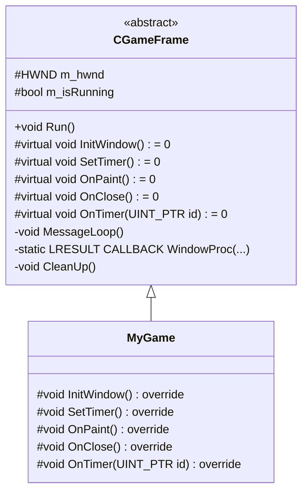
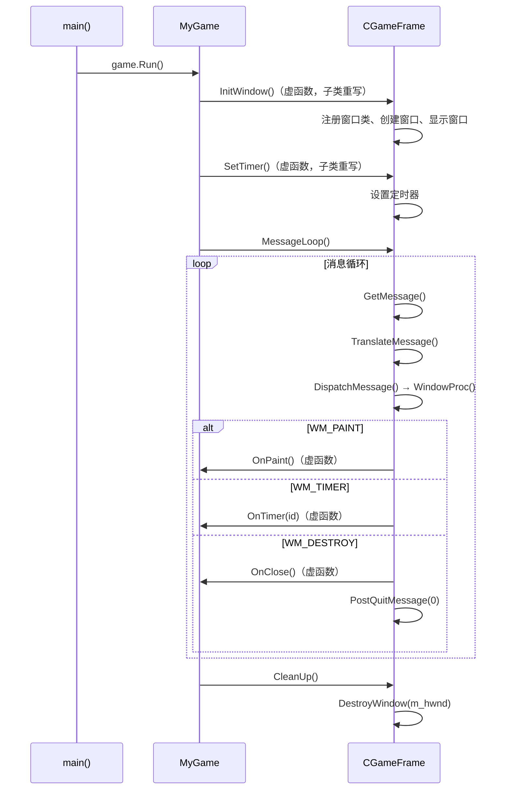

# 6.2 飞机大战项目

## 项目概述

基于 Windows API 的飞机大战游戏框架，运用**继承、多态、虚函数**等面向对象特性，将窗口创建、消息循环、定时器等通用逻辑封装在基类中，子类只需重写游戏逻辑相关的虚函数。

---

## 框架设计

### 类结构



### 框架流程



---

## 框架基类实现

### `CGameFrame.h`

```cpp
#pragma once
#include <windows.h>

class CGameFrame {
public:
    CGameFrame() : m_hwnd(nullptr), m_isRunning(true) {}
    virtual ~CGameFrame() {}

    void Run() {
        InitWindow();
        SetTimer();
        MessageLoop();
        CleanUp();
    }

protected:
    // 子类必须实现的虚函数
    virtual void InitWindow() = 0;        // 初始化窗口
    virtual void SetTimer() = 0;           // 设置定时器
    virtual void OnPaint() = 0;            // 重绘窗口
    virtual void OnClose() = 0;            // 关闭窗口
    virtual void OnTimer(UINT_PTR id) = 0; // 定时器处理

    HWND m_hwnd;   // 窗口句柄
    bool m_isRunning;

private:
    void MessageLoop() {
        MSG msg;
        while (GetMessage(&msg, nullptr, 0, 0)) {
            TranslateMessage(&msg);
            DispatchMessage(&msg);
        }
    }

    // 静态窗口过程（Windows API 要求）
    static LRESULT CALLBACK WindowProc(HWND hwnd, UINT uMsg,
                                        WPARAM wParam, LPARAM lParam) {
        CGameFrame* pThis = reinterpret_cast<CGameFrame*>(
            GetWindowLongPtr(hwnd, GWLP_USERDATA));

        switch (uMsg) {
            case WM_CREATE:
                pThis = reinterpret_cast<CGameFrame*>(
                    reinterpret_cast<LPCREATESTRUCT>(lParam)->lpCreateParams);
                SetWindowLongPtr(hwnd, GWLP_USERDATA, (LONG_PTR)pThis);
                return 0;

            case WM_PAINT:
                if (pThis) pThis->OnPaint();
                return 0;

            case WM_TIMER:
                if (pThis) pThis->OnTimer(wParam);
                return 0;

            case WM_DESTROY:
                pThis->OnClose();
                PostQuitMessage(0);
                return 0;
        }
        return DefWindowProc(hwnd, uMsg, wParam, lParam);
    }

    void InitWindow() {
        WNDCLASS wc = {0};
        wc.lpfnWndProc   = WindowProc;
        wc.hInstance     = GetModuleHandle(nullptr);
        wc.lpszClassName = L"GameWindowClass";
        RegisterClass(&wc);

        m_hwnd = CreateWindowEx(
            0, L"GameWindowClass", L"Game", WS_OVERLAPPEDWINDOW,
            CW_USEDEFAULT, CW_USEDEFAULT, 800, 600,
            nullptr, nullptr, GetModuleHandle(nullptr), this);

        ShowWindow(m_hwnd, SW_SHOW);
        UpdateWindow(m_hwnd);
    }

    void CleanUp() {
        DestroyWindow(m_hwnd);
    }
};
```

### 关键技术点

| 技术点 | 说明 |
|--------|------|
| `WM_CREATE` 中传递 `this` | 通过 `CreateWindowEx` 的最后一个参数将 `this` 传入，在 `WM_CREATE` 中保存到 `GWLP_USERDATA` |
| 静态 `WindowProc` | Windows API 要求窗口过程为静态函数或全局函数，通过 `GWLP_USERDATA` 找回 `this` 指针 |
| 纯虚函数 | 子类必须实现游戏逻辑相关的虚函数，实现框架与业务逻辑的分离 |
| 模板方法模式 | `Run()` 定义了算法骨架（初始化→定时器→消息循环→清理），具体步骤由子类实现 |

---

## 子类实现示例

### `MyGame.h`

```cpp
#pragma once
#include "CGameFrame.h"

class MyGame : public CGameFrame {
protected:
    void InitWindow() override {
        CGameFrame::InitWindow();  // 调用基类方法创建窗口
    }

    void SetTimer() override {
        ::SetTimer(m_hwnd, 1, 1000, nullptr);  // 每秒触发一次
    }

    void OnPaint() override {
        PAINTSTRUCT ps;
        HDC hdc = BeginPaint(m_hwnd, &ps);
        // 绘制游戏内容（飞机、子弹、敌机等）
        EndPaint(m_hwnd, &ps);
    }

    void OnClose() override {
        m_isRunning = false;
    }

    void OnTimer(UINT_PTR id) override {
        if (id == 1) {
            // 每秒执行的逻辑：移动敌机、检测碰撞等
            InvalidateRect(m_hwnd, nullptr, TRUE);  // 触发重绘
        }
    }
};
```

### `main.cpp`

```cpp
#include "MyGame.h"

int main() {
    MyGame game;
    game.Run();
    return 0;
}
```

---

## 使用方法

1. **继承** `CGameFrame` 创建新的游戏类。
2. **实现**必要的虚函数，定义游戏逻辑：
   - `InitWindow()`：窗口初始化（可调用基类版本）。
   - `SetTimer()`：设置游戏帧率定时器。
   - `OnPaint()`：绘制游戏画面。
   - `OnTimer()`：更新游戏状态（移动、碰撞检测等）。
   - `OnClose()`：清理游戏资源。
3. 在 `main` 函数中**实例化**子类并调用 `Run()` 方法。

---

## 知识点总结

| 特性 | 在项目中的体现 |
|------|---------------|
| 继承 | `MyGame` 继承 `CGameFrame`，复用窗口创建和消息循环逻辑 |
| 多态 | 基类指针/引用调用虚函数，实际执行子类重写版本 |
| 纯虚函数 | `CGameFrame` 定义接口，强制子类实现游戏逻辑 |
| 模板方法模式 | `Run()` 定义算法骨架，具体步骤由子类实现 |
| Windows API | 窗口创建、消息循环、定时器、GDI 绘制 |
| 静态成员函数 | `WindowProc` 为静态函数，通过 `GWLP_USERDATA` 关联对象 |

---

> 上一篇：[[6.1.宠物小屋项目]] ｜ 下一篇：[[7.1.进程与线程]]
