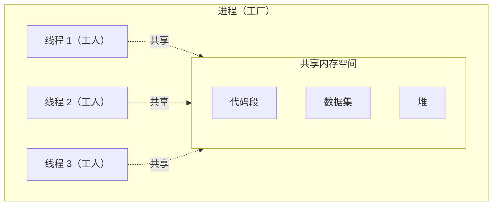
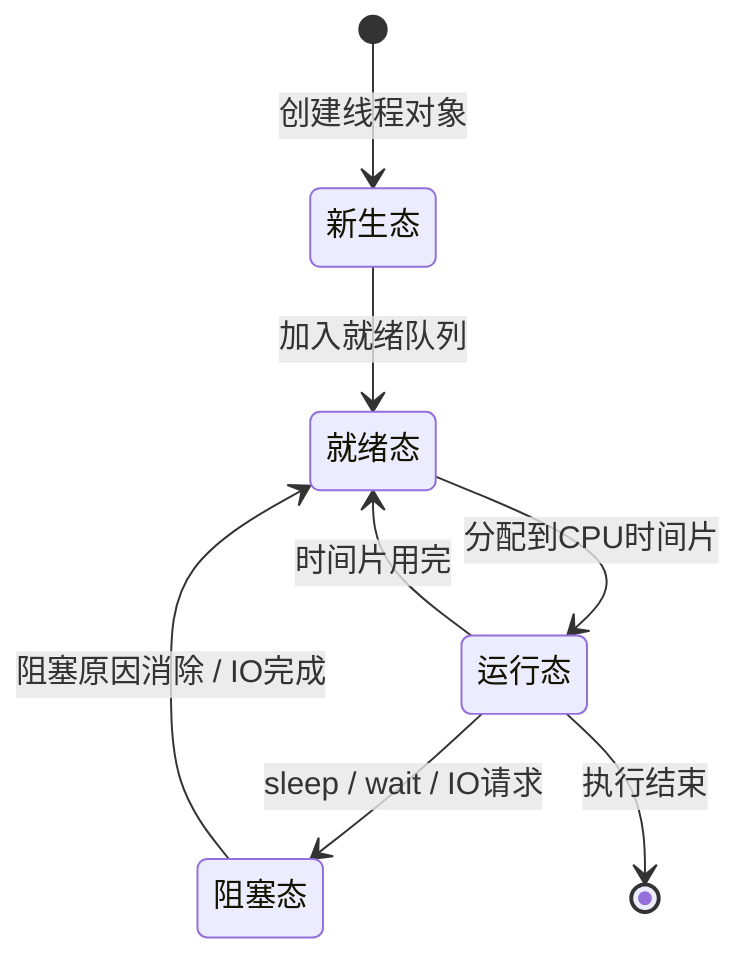

# 7.1 进程与线程

## 进程（Process）

**进程概念**：是一个具有一定独立功能的程序在一个数据集上的一次**动态执行的过程**，是操作系统进行**资源分配和调度**的一个独立的基本单元，是应用程序运行的载体。

进程是一种抽象的概念，从来没有统一的标准定义。

---

## 线程（Thread）

### 线程的由来

在早期的操作系统中并没有线程的概念，进程是拥有资源和独立运行的最小单位，也是程序执行的最小单位。后来，随着计算机的发展，对 CPU 的要求越来越高，进程之间的切换开销较大，已经无法满足越来越复杂的程序的要求，于是就发明了线程。

### 线程概念

**线程**是 CPU 能够进行调度、分配、执行、运算的**最小基本单位**，是程序执行中一个单一的顺序控制流程。

- 一个进程可以有一个或多个线程。
- 各个线程之间**共享进程的内存空间**。

### 进程与线程的关系



| 对比项 | 进程 | 线程 |
|--------|------|------|
| 类比 | 工厂 | 工厂中的工人 |
| 角色 | 系统分配资源的基本单元 | CPU 调度和执行工作的基本单元 |
| 组成 | 由一个或多个线程组成 | 进程内的执行流 |
| 内存 | 进程之间相互独立 | 同一进程下的线程共享内存空间（代码段、数据集、堆等） |
| 切换开销 | 上下文切换开销大 | 上下文切换比进程快得多 |

> 为了更快速地完成任务，或者某些场景需要同时做多件事情，就需要使用线程，因为线程可以"同时"执行任务。

---

## 线程的状态



| 状态 | 说明 |
|------|------|
| **新生态** | 创建出新的线程对象 |
| **就绪态** | 创建后进入就绪态，加入就绪队列，等待分配到 CPU 时间片 |
| **运行态** | 获得 CPU 时间片后执行；时间片用完后回到就绪态。遇到 `sleep`、`wait`、`suspend`、IO 请求时进入阻塞态 |
| **阻塞态（挂起状态）** | 正在运行的线程在特殊情况下（被挂起或执行耗时 IO），让出 CPU 并暂时中止执行。处于阻塞态的线程不能进入排队队列，只有阻塞原因消除后才转入就绪态 |

> 一般来说，就绪态和运行态不需要人为参与，由操作系统进行调度。

---

## 串行、并行与并发

| 概念 | 定义 |
|------|------|
| **串行** | 按照顺序，一个执行完再执行下一个 |
| **并行** | 同一个时刻，同时执行（需要多核 CPU） |
| **并发** | 在同一个时间间隔内发生，交替执行（单核通过时间片轮转实现） |

在单线程下，采用串行的方式执行。大部分操作系统的任务调度采用**轮换时间片的抢占式调度**：一个线程执行一小段时间后暂停休息并等待被唤醒，下一个线程被唤醒并开始执行，每个线程交替轮流执行。线程执行的一小段时间叫做**时间片**。

由于 CPU 的执行速度非常快，时间片非常短，在各个线程之间快速地切换，给人的感觉就是多个线程在"同时进行"，这就是常说的**并发**。

---

## Windows API 创建线程

头文件：`<windows.h>`

```cpp
HANDLE hThread = ::CreateThread(
    nullptr,          // 安全属性（默认）
    0,                // 栈大小（默认）
    ThreadFunc,       // 线程函数地址
    nullptr,          // 传递给线程函数的参数
    0,                // 创建标志（0 表示立即运行）
    &dwThreadId       // 接收线程 ID
);
```

线程函数原型：

```cpp
DWORD WINAPI ThreadFunc(LPVOID lpParam);
```

---

## 内核对象（Kernel Object）

### 概念

内核是操作系统提供底层服务的一个模块，而**内核对象**则是内核分配的一个内存块，它是一种**数据结构**。不同的内核对象具有不同的结构，负责维护对象相关的信息。少数成员（如安全描述符、使用计数等）是所有内核对象都有的，其他多数成员因对象类型而异。

### 生命周期

- 内核对象的**所有者是操作系统而非进程**。
- 内核对象的生命周期并不一定会随着创建该对象的进程的消亡而消亡，可以比创建该对象的进程存在更久。
- 内核对象的回收通过**使用计数**实现：
  - 被创建时，使用计数为 1。
  - 另一个进程访问该内核对象后，使用计数加 1。
  - 进程终止时，使用计数减 1。
  - 手动关闭内核对象时，使用计数再减 1。
  - 最终使用计数为 0 时，操作系统销毁该内核对象。

### `CloseHandle`

```cpp
bool CloseHandle(HANDLE hObject);
```

- 并不是调用这个函数内核对象就被销毁了，而是使**使用计数器减 1**。
- 如果忘记调用 `CloseHandle`，程序运行期间会发生**内存泄漏**，直到进程结束，操作系统才会回收所有资源。

---

## 线程并发与同步

当多个线程同时访问共享资源时，需要同步机制来保证数据一致性。

### 原子访问（Atomic Access）

**原子操作**是指不可被中断的一个或一系列操作。在多线程环境下，对共享变量的简单读写（如 `i++`）实际上包含"读取→修改→写回"三个步骤，可能被线程切换打断，导致数据竞争。

Windows 提供 `Interlocked` 系列函数实现原子操作：

```cpp
InterlockedIncrement(&counter);   // 原子递增
InterlockedDecrement(&counter);   // 原子递减
InterlockedExchangeAdd(&counter, 5);  // 原子加法
```

### 关键段 / 临界区（Critical Section）

**临界区**是一种用户态的同步机制，用于保护共享资源，确保同一时间只有一个线程访问临界区中的代码。

```cpp
CRITICAL_SECTION cs;
::InitializeCriticalSection(&cs);  // 初始化

::EnterCriticalSection(&cs);       // 进入临界区（加锁）
// 访问共享资源
::LeaveCriticalSection(&cs);       // 离开临界区（解锁）

::DeleteCriticalSection(&cs);      // 销毁
```

| 特性 | 说明 |
|------|------|
| 工作模式 | 用户态，不进入内核，速度快 |
| 适用范围 | 同一进程内的线程同步 |
| 是否可超时 | 否（`EnterCriticalSection` 无限等待） |
| 递归进入 | 支持（同一线程可多次进入，需对应次数离开） |

> 其他同步机制还包括：互斥量（Mutex）、事件（Event）、信号量（Semaphore）等，这些属于内核对象，可跨进程使用。

---

> 上一篇：[[6.2.飞机大战项目]]
