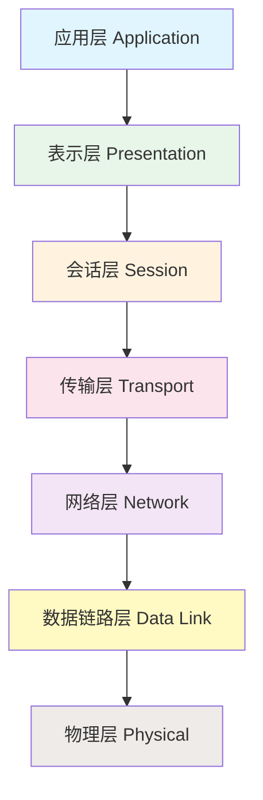

> **协议（protocol）** 就是通信双方必须遵守的**规则**集合。

---

# ISO/OSI 七层模型

**ISO/OSI**（International Organization for Standardization / Open System Interconnection）开放式系统互连**理论参考模型**。

- **系统**：功能完善，可二次开发
- **开放式**：标准化、非专有，不同厂商设备可互通

## 七层模型结构

![['attachments/OSI七层模型.png]]

---

## 应用层

> 提供不同设备间相同应用程序的通信服务，是用户与网络的接口。

**常用协议**：

| 协议 | 全称 | 端口 | 说明 |
|------|------|------|------|
| HTTP/HTTPS | 超文本传输协议 | 80 / 443 | HTTPS 含 SSL/TLS 加密，更安全 |
| FTP | 文件传输协议 | 20（数据）/ 21（控制） | 用于文件上传下载 |
| DNS | 域名系统 | 53 | 域名与 IP 地址相互解析 |
| DHCP | 动态主机配置协议 | 67（服务器）/ 68（客户端） | 终端设备动态获取 IP 地址等网络配置 |
| Telnet | 远程登录协议 | 23 | 明文传输，不安全 |
| SSH | 安全外壳协议 | 22 | 加密的远程登录 |
| SMTP | 简单邮件传输协议 | 25 | 发送邮件 |
| POP3/IMAP | 邮件接收协议 | 110 / 143 | 接收邮件 |

## 表示层

> 提供数据格式转换服务，确保一个系统应用层发出的信息能被另一个系统的应用层理解。

- **数据加解密**：发送端加密，接收端解密
- **数据压缩/解压缩**：减小数据量，提高传输效率
- **图片/视频编解码**：对多媒体数据进行压缩与解压缩

## 会话层

> 建立、管理和维护会话（session），负责在两个节点间建立、维护和终止通信。

- **会话管理**：Web 页面跳转时账户信息存储在会话中
- **用户认证**：服务器验证用户登录状态
- **断点续传**：传输中断后可从断点继续，无需重新开始

## 传输层

> 到达操作系统，为上层提供端到端的通信服务。

**核心协议**：

- **TCP（传输控制协议）**：面向连接的、可靠的、基于字节流的传输层通信协议，提供流量控制和差错控制，适用于对数据稳定性和完整性要求高的场景
- **UDP（用户数据报协议）**：无连接的、高效率、低可靠性的数据传输服务，适用于对时效性要求高的场景

**关键概念**：

- **线程**：解决"同时"问题，实现并发与同步处理
- **端口**：区分数据应传递给哪个应用程序，一个程序可使用多个端口号。网络设备上也有端口，但那是物理意义上的端口。使用 `netstat -ano` 可查看端口号、PID 等信息，配合 `tasklist` 可查看进程详情
- **Socket（套接字）**：通信的基石，包含进行网络通信必须的五种信息：连接协议、源 IP、目的 IP、源端口、目的端口

## 网络层

> 并非所有网络设备都具有完整的 OSI 七层，例如路由器和防火墙工作在网络层。负责**寻址**和**路由转发**。

- **IP（网际协议）**：提供不可靠、无连接的数据报传送服务
- 查看网络配置：Windows 使用 `ipconfig`，Linux 使用 `ifconfig` / `ip addr`

## 数据链路层

> 网络设备：交换机、网卡。提供链路管理、物理寻址、差错检测与重发。

- **MAC 地址**：设备物理编号标识，全球唯一
- 交换机通过 MAC 地址表进行数据交换，实现简单内部转发

**MAC 地址表示例**：

| MAC 地址 | 端口 | 老化时间 |
|----------|------|----------|
| AA:BB:CC:DD:EE:01 | 1 | 300s |
| AA:BB:CC:DD:EE:02 | 2 | 280s |

![['attachments/macAddrTable.png]]

## 物理层

> 传输介质：光纤、网线等，负责传输原始比特流。

- **光纤**：传播光信号，传播速度快，远距离消耗小
- **网线**：传播电信号，有损耗，传输距离有限（通常 100 米以内）

> [!tip] 数据封装与各层名称
> - 应用层 → 报文（message）
> - 传输层 → 段（segment）
> - 网络层 → 数据报（datagram / IP 数据报）
> - 数据链路层 → 帧（frame）
> - 物理层 → 比特流（bit）

---

# TCP/IP 网络模型

**实际应用**模型，分为四层（也有五层分法）：

| TCP/IP 四层 | 对应 OSI 层 |
|-------------|------------|
| 应用层 | 应用层 + 表示层 + 会话层 |
| 传输层 | 传输层 |
| 网络层 | 网络层 |
| 网络接口层（物理接口层） | 数据链路层 + 物理层 |

---

# C/S 与 B/S 模型

## C/S（Client/Server）模型

- 客户端固定，需要安装专用客户端软件
- 通信可使用任意协议
- 优点：响应速度快，界面丰富，安全性可控
- 缺点：维护成本高，需逐台升级客户端

## B/S（Browser/Server）模型

- 客户端不固定，通过通用浏览器访问
- 协议通常只有 HTTP/HTTPS
- 优点：无需安装客户端，维护方便，跨平台
- 缺点：对服务器压力大，浏览器兼容性问题

---

Next Note : [[1.2.静态库动态库与UDP套接字编程]]
