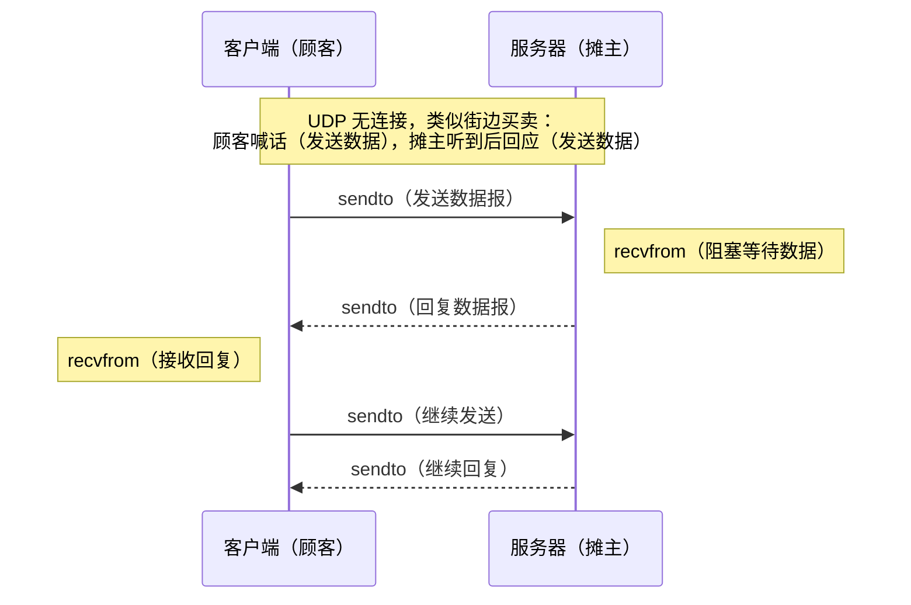

# 静态库与动态库

## 基本概念

- **静态库**：编译时直接将库代码拷贝到可执行文件中
- **动态库**：编译时只拷贝动态链接库（导入库）到可执行文件中，运行时才加载实际的动态库

例如有静态库 `st.lib`、动态库 `dy.dll` 及其对应的导入库 `dyLink.lib`：
- 可执行文件 `app.exe` 调用 `st.lib` 时是直接拷贝代码
- 调用 `dy.dll` 时则是拷贝导入库 `dyLink.lib`，其类似指针，指向动态库中的函数

## 静态库与动态库对比

| | 优点 | 缺点 |
|---|------|------|
| **静态库** | 1. 调用速度快<br>2. 发布方便，只需一个可执行文件 | 1. 导致可执行文件变大<br>2. 库文件修改后需重新编译整个可执行文件，耗时长<br>3. 多个应用程序同时运行时，内存中存在多份库代码 |
| **动态库** | 1. 库文件修改后只需重新编译库文件，节省时间<br>2. 多个应用程序共享同一份库代码，节省内存 | 1. 调用速度相对较慢（需间接寻址）<br>2. 发布时需同时提供可执行文件和动态库文件 |

## 使用方法

**静态库使用**：
1. 包含头文件
2. 导入依赖库

**动态库使用**（隐式链接）：
1. 包含头文件
2. 导入依赖库（动态链接库/导入库）
3. 将 dll 文件放到可执行文件相同路径下

> Windows 下动态库还支持**显式链接**：通过 `LoadLibrary` 加载 dll，`GetProcAddress` 获取函数地址，`FreeLibrary` 释放，无需导入库。

---

# 基于 UDP 的 C/S 通信案例

> 参考文档：[Winsock2 API](https://learn.microsoft.com/en-us/windows/win32/api/winsock2/)

## UDP 通信流程类比——"做小买卖的一天"



![['attachments/ASmallStore.png]]

## UDP 服务器

> 服务器模板

```cpp
int main() {
  // 1. 加载库 WSAStartup
  // 2. 创建套接字（UDP: SOCK_DGRAM）
  // 3. 绑定端口和IP bind
  while (true) {
    // 4. 接收数据 recvfrom
    // 5. 发送数据 sendto
  }
  // 6. 关闭套接字、卸载库 closesocket / WSACleanup
  return 0;
}
```

**常用宏与函数**：

- `HIBYTE`：取高字节
- `LOBYTE`：取低字节
- `#pragma comment(lib, "Ws2_32.lib")`：导入 Ws2_32.lib 库

**地址结构体**：

```cpp
// 通用地址结构体
struct sockaddr {
    ushort  sa_family;       // 地址族
    char    sa_data[14];     // 地址数据
};

// IPv4 地址结构体
struct sockaddr_in {
    short   sin_family;      // 协议类型（AF_INET）
    u_short sin_port;        // 端口号，htons(25565) 转为网络字节序
    struct  in_addr sin_addr; // IP 地址
    char    sin_zero[8];     // 填充，保持与 sockaddr 大小一致
};

// 点分十进制字符串 → 网络字节序整数
unsigned long WSAAPI inet_addr(_In_z_ const char FAR * cp);

// 网络字节序整数 → 点分十进制字符串
char FAR * WSAAPI inet_ntoa(_In_ struct in_addr in);
```

> **网络字节序**：大端模式（高字节存低地址）。Intel x86 为小端模式，因此跨网络传输时需用 `htons`/`htonl`（主机→网络）和 `ntohs`/`ntohl`（网络→主机）转换。

## UDP 客户端

> 客户端模板

```cpp
int main() {
  // 1. 加载库 WSAStartup
  // 2. 创建套接字（UDP: SOCK_DGRAM）
  while (true) {
    // 3. 发送数据 sendto（指定服务器地址）
    // 4. 接收数据 recvfrom
  }
  // 5. 关闭套接字、卸载库 closesocket / WSACleanup
  return 0;
}
```

> 客户端通常不需要 `bind`，操作系统会自动分配可用端口。详见 [[1.3.网络数据传输与ARP_DNS协议#客户端为何不绑定 bind]]。

---

Prev Note : [[1.1.OSI七层模型与网络体系结构]]
Next Note : [[1.3.网络数据传输与ARP_DNS协议]]
