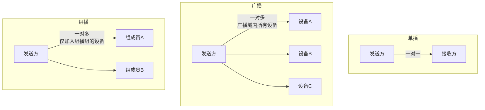
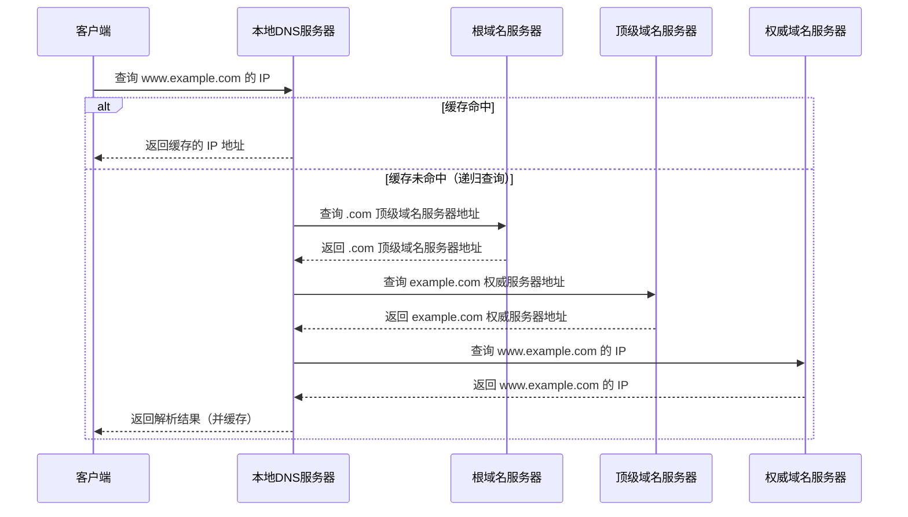

# 客户端为何不绑定 bind

> 端口号的作用：根据目的端口将数据送达指定应用程序。

- **服务器**需要首先接收消息，因此必须指定程序在哪个 IP 和端口上监听数据的到来，所以必须 `bind`
- **客户端**可绑定也可不绑定：不绑定时操作系统会自动分配一个可用端口；客户端向指定 IP 和端口发送数据后，该端口即可接收回复

---

# 数据包在传输过程中的变化

![['attachments/数据包在传输过程中的变化过程.png]]

---

# 单播、组播与广播

![['attachments/单播广播组播.png]]

- **单播**：一对一通信
- **广播**：广播域中所有设备都能收到数据，一对多，强调"在哪儿"（本地广播域）
- **组播**：一对多，目的设备可在不同路由器下，强调"是谁"（加入组播组的设备）

---

# ARP 协议

**ARP（Address Resolution Protocol，地址解析协议）**：根据 IP 地址获取物理地址（MAC 地址）的协议，属于 TCP/IP 协议族。

## ARP 报文格式

| 字段 | 长度 | 说明 |
|------|------|------|
| 硬件类型 | 2 字节 | 硬件地址类型，以太网为 1 |
| 协议类型 | 2 字节 | 要映射的协议地址类型，IPv4 为 0x0800 |
| 硬件地址长度 | 1 字节 | MAC 地址长度，6 |
| 协议地址长度 | 1 字节 | IP 地址长度，4 |
| 操作类型 | 2 字节 | 1=ARP 请求，2=ARP 响应 |
| 发送端 MAC | 6 字节 | 发送方硬件地址 |
| 发送端 IP | 4 字节 | 发送方协议地址 |
| 目标 MAC | 6 字节 | 接收方硬件地址（请求时为全 0） |
| 目标 IP | 4 字节 | 接收方协议地址 |

![['attachments/ARP报文格式.png]]

## 局域网内 ARP 工作流程

1. 发送方发送**广播** ARP 请求（单播需要知道目标 MAC，而此时尚未获取），目的 MAC 填充为 `FF:FF:FF:FF:FF:FF`
2. 目标主机收到 ARP 请求后，回复一个 ARP 响应（单播）
3. 非目标主机收到 ARP 请求后丢弃

## ARP 代理

> 当发送端广播 ARP 请求时，若目标 IP 地址属于外网，本地网络上不会有主机回应。此时路由器会回应该请求，发送源误认为路由器就是目的主机，将报文全部转发给路由器，再由路由器转发到外网。该路由器称为 **ARP 代理**。

> 路由数据转发过程中，**目的 MAC 地址不断变化**（每跳路由器的接口 MAC），而**目的 IP 地址始终不变**。

## 免费 ARP

> 主机开机配置 IP 时，会发送一个目的 IP 地址为自己 IP 地址的 ARP 请求报文，称为**免费 ARP（Gratuitous ARP）**。

作用：
1. **IP 冲突检测**：确认本地网络上是否有与自己 IP 地址相同的主机，若有则会收到回应，提示冲突
2. **更新 ARP 缓存**：告诉整个广播域当前 IP 对应的 MAC 地址——类似发宣传单，无需回应。若接收主机 ARP 缓存中已有该 IP-MAC 对则更新，否则缓存该映射

---

# DNS 协议

**DNS（Domain Name System，域名系统）**：将域名解析为 IP 地址的分布式数据库系统。

![['attachments/DNS.png]]

> DNS 使用 UDP 协议（端口 53）进行查询，当响应长度超过 512 字节时会切换到 TCP。

---

Prev Note : [[1.2.静态库动态库与UDP套接字编程]]
Next Note : [[1.4.IP编址与子网划分]]
