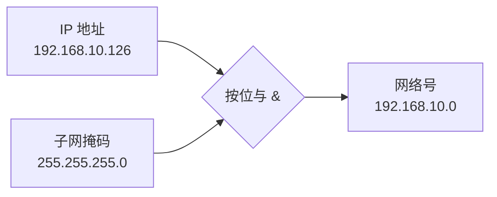

# IP 地址分类与子网划分

## IP 地址分类

IPv4 地址采用**点分十进制**表示，共 32 位，分为网络号和主机号两部分。

| 类型 | 范围 | 首位特征 | 作用 |
|------|------|----------|------|
| A 类 | 1.0.0.0 ~ 127.255.255.255 | `0xxxxxxx` | 大量主机，公网 |
| B 类 | 128.0.0.0 ~ 191.255.255.255 | `10xxxxxx` | 国际大公司、政府 |
| C 类 | 192.0.0.0 ~ 223.255.255.255 | `110xxxxx` | 小公司、校园网、科研单位 |
| D 类 | 224.0.0.0 ~ 239.255.255.255 | `1110xxxx` | 组播 |
| E 类 | 240.0.0.0 ~ 255.255.255.255 | `1111xxxx` | 保留 |

### 私网（专用）地址

| 类别 | 私网地址范围 |
|------|-------------|
| A 类 | 10.0.0.0 ~ 10.255.255.255 |
| B 类 | 172.16.0.0 ~ 172.31.255.255 |
| C 类 | 192.168.0.0 ~ 192.168.255.255 |

**特殊地址**：
- `0.0.0.0/8`：本网络（保留）
- `127.0.0.0/8`：系统回环测试地址，`localhost` = `127.0.0.1`，无需连接到任何网络，自发自收
- `169.254.0.0/16`：链路本地地址（DHCP 失败时自动分配）

---

## 子网掩码

> 又叫网络掩码、地址掩码，用于区分 IP 地址中的网络号和主机号。

**工作原理**：子网掩码与 IP 地址进行**按位与（&）**运算（有 0 为 0），即可得到**网络号**（主机号部分变为 0）。

例如：24 位子网掩码 `255.255.255.0` 与 IP 地址 `192.168.10.126` 按位与，得到网络号 `192.168.10.0`。



![['attachments/子网掩码.png]]

---

## 网关

> 网间连接器、协议转换器，是连接两个子网之间的**设备或软件**。

- 路由器具有网关功能
- 网关地址是具有路由功能的 IP 地址
- 默认网关的主机号通常为 1（如 `192.168.1.1`），但并非强制

---

## 广播地址

> 用于向网络中的所有设备发送数据。具有正常的网络号部分，而**主机号部分全为 1** 的 IP 地址称为**（直接）广播地址**。

- **有限广播地址**：32 位全为 1（`255.255.255.255`），只能在本网段广播，路由器不转发
- **直接广播地址**：可在其他指定广播域发送广播，路由器可转发
- 主机号全为 0 的地址表示**网络地址**（如 `192.168.1.0`）

---

## 非默认子网掩码（子网划分）

> 网络号比该类默认子网掩码长，从主机号借用若干位作为**子网号**。


![['attachments/非默认子网掩码.png]]

> [!bug] 子网划分常见问题
>
> 1. **选定的子网掩码将创建多少个子网？**
>    $2^X$ 个，其中 $X$ 是从主机号借用的位数。
>    例如 `192.168.10.32/28`，C 类默认 24 位网络号，借用 4 位作为子网号，实际子网掩码 `255.255.255.240`，可创建 $2^4 = 16$ 个子网。
>
> 2. **每个子网可包含多少台主机？**
>    $2^Y - 2$ 台，其中 $Y$ 是剩余主机位数。减 2 是因为主机位全 0 为网络地址，全 1 为广播地址，均不可分配给主机。
>
> 3. **有哪些子网？**
>    计算子网步长（增量）：$256 - \text{子网掩码最后一段}$。例如掩码 248 时步长为 $256 - 248 = 8$，从 0 开始递增：0、8、16、24、32……

---

# IPv4 首部格式

IP 工作在网络层。参考：[IPv4 Header](https://networklessons.com/cisco/ccna-routing-switching-icnd1-100-105/ipv4-packet-header)

| 字段 | 长度（位） | 说明 |
|------|-----------|------|
| 版本（Version） | 4 | IP 协议版本，IPv4=4，IPv6=6 |
| 首部长度（IHL） | 4 | IP 首部长度，以 4 字节为单位，最小值 5（20 字节），最大值 15（60 字节） |
| 区分服务（DS） | 8 | 用于 QoS，包含 DSCP 和 ECN |
| 总长度（Total Length） | 16 | IP 数据报总长度（首部+数据），最大 65535 字节 |
| 标识（Identification） | 16 | 标记当前数据报属于哪个原始大包，分片时同一包的标识相同 |
| 标志（Flags） | 3 | DF（Don't Fragment，禁止分片）、MF（More Fragment，更多分片） |
| 片偏移（Fragment Offset） | 13 | 当前分片在原始数据报中的偏移位置，以 8 字节为单位 |
| 生存时间（TTL） | 8 | 最大生存跳数，每经过一个路由器减 1，为 0 时丢弃 |
| 协议（Protocol） | 8 | 标识上层协议：ICMP=1，TCP=6，UDP=17 |
| 首部校验和（Header Checksum） | 16 | 仅校验 IP 首部，每跳重新计算 |
| 源 IP 地址 | 32 | 发送方 IP 地址 |
| 目的 IP 地址 | 32 | 接收方 IP 地址 |
| 选项（Options） | 0~320 | 可选字段，长度可变，必须为 4 字节倍数 |
| 填充（Padding） | 可变 | 填充 0，使首部长度为 4 字节的整数倍 |

![['attachments/IPv4首部.png]]

> - 每行 4 字节（32 位）
> - 首部长度 20~60 字节：固定部分 20 字节，可选部分 0~40 字节，且必须为 4 字节倍数
> - **可变部分**：TVL（Type-Value-Length）格式，某些设备无传输层但需要传数据时使用

---

# 以太网 II 帧结构

| 字段 | 长度（字节） | 说明 |
|------|-------------|------|
| 目的 MAC | 6 | 接收方物理地址 |
| 源 MAC | 6 | 发送方物理地址 |
| 类型/长度 | 2 | >1536 为类型（如 0x0800=IPv4，0x0806=ARP），≤1500 为长度 |
| 数据（载荷） | 46~1500 | 网络层数据报 |
| 帧校验序列（FCS） | 4 | CRC 校验，检测传输错误 |

![['attachments/以太网帧结构.png]]

- 以太网帧大小范围：**64~1518 字节**（不含前导码）
- **MTU（Maximum Transmission Unit）**：一个网络包的最大载荷长度，以太网中一般为 **1500 字节**
- **MSS（Maximum Segment Size）**：除去 IP 首部和 TCP 首部后，一个网络包所能容纳的最大 TCP 数据长度
  - $\text{MSS} = \text{MTU} - \text{IP 首部} - \text{TCP 首部}$
  - 默认情况下：$\text{MSS} = 1500 - 20 - 20 = 1460$ 字节

---

## 为 Socket 申请广播权限

```cpp
// 为 SOCKET s 申请广播权限
BOOL val = true;
setsockopt(s, SOL_SOCKET, SO_BROADCAST, (char*)&val, sizeof(val));
```

---

Prev Note : [[1.3.网络数据传输与ARP_DNS协议]]
Next Note : [[1.5.套接字缓冲区与TCP服务器模型]]
