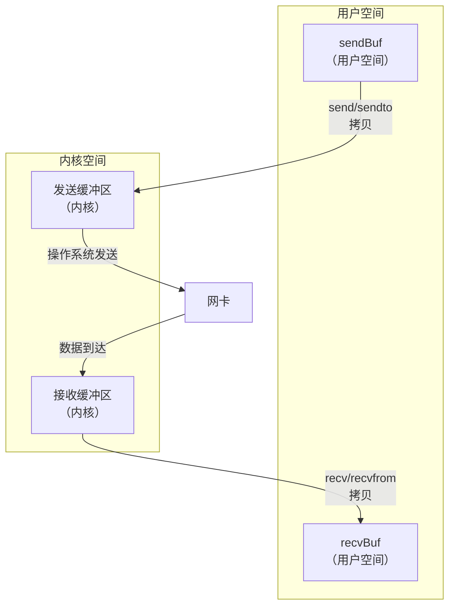
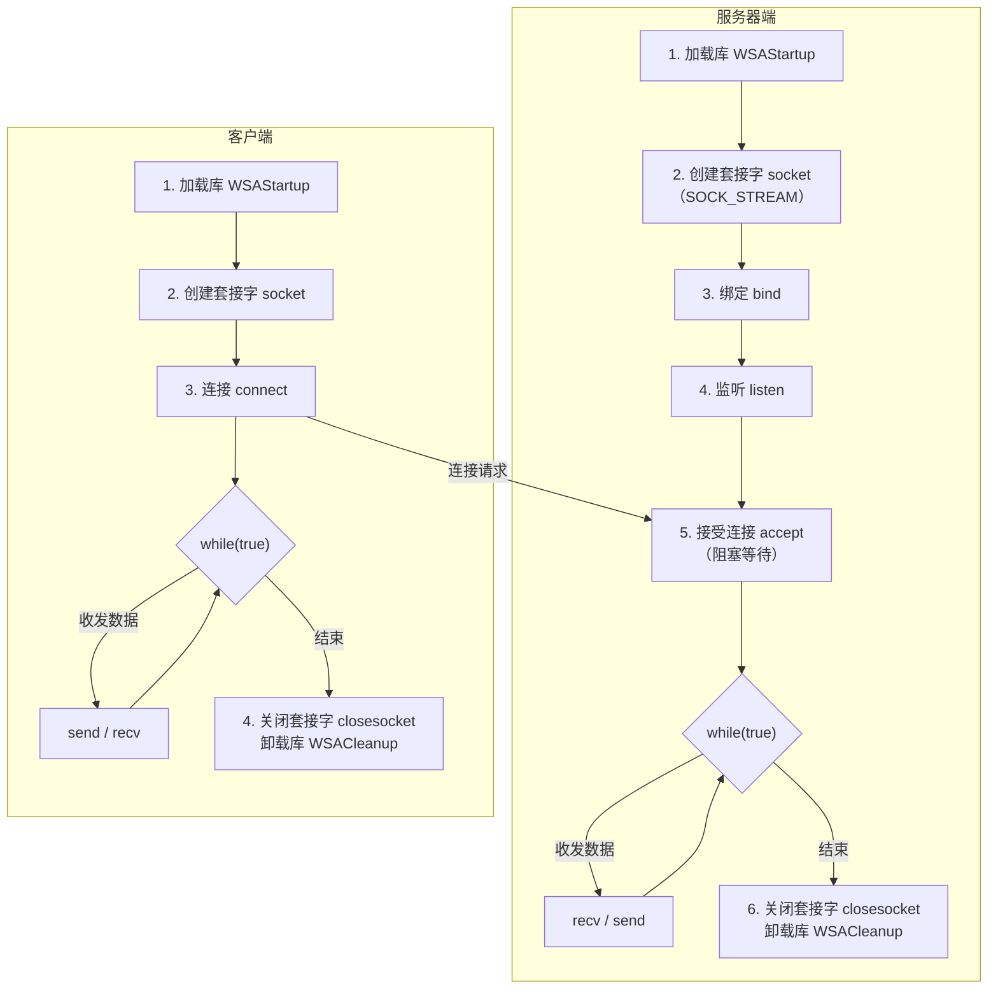

# 套接字发送/接收缓冲区

UDP 和 TCP 协议的数据都通过内核缓冲区进行发送和接收。

> 1. 操作系统会给每个进程分配 4GB 的**虚拟**内存空间（32 位 Windows 默认：0~2GB 内核空间，2~4GB 用户空间；32 位 Linux 默认：0~3GB 用户空间，3~4GB 内核空间）
>    - **虚拟**：大小是虚拟的（应用程序以为有），实际按需分配
>    - 实际地址也是虚拟的（通过页表映射到物理地址）
> 2. 进程创建 socket 时，操作系统会在内核空间为该 socket 分配一个发送缓冲区和一个接收缓冲区（默认大小因系统而异，通常为几十 KB）
> 3. 进程中定义的 `recvBuf` 和 `sendBuf` 是在**用户空间**申请的内存
> 4. 当数据到达操作系统时，根据 socket 绑定的端口号，将数据写入到对应 socket 的接收缓冲区中
> 5. 进程调用 `recvfrom`/`recv` 时，将接收缓冲区中的数据拷贝到用户空间的 `recvBuf` 中
> 6. 进程调用 `sendto`/`send` 时，将 `sendBuf` 中的数据拷贝到内核发送缓冲区中，由操作系统通过网卡发送出去



**获取缓冲区大小**：

```cpp
// 获取接收/发送缓冲区大小
int recvBufLen = 0;
int sendBufLen = 0;
int size = sizeof(int);
getsockopt(s, SOL_SOCKET, SO_RCVBUF, (char*)&recvBufLen, &size);
getsockopt(s, SOL_SOCKET, SO_SNDBUF, (char*)&sendBufLen, &size);
```

---

# 阻塞与非阻塞

- **阻塞**：老王烧水，把水壶放在炉子上，就在旁边等着水烧开
  1. 等待的事情发生时第一时间知道
  2. 等待过程中不占用 CPU（进程挂起）
- **非阻塞**：老王烧水，把水壶放在炉子上，就去看电视了，每隔一段时间回来看看水开没开
  1. 等待的事情发生时不能第一时间知道
  2. 等待过程中占用 CPU（轮询），**不推荐单独使用**

> socket 默认是**阻塞**的，接收和发送数据默认都是阻塞的。

**将 SOCKET 设置为非阻塞**：

```cpp
u_long iMode = 1;  // 1=非阻塞，0=阻塞
int rt = ioctlsocket(s, FIONBIO, &iMode);
```

**发送函数的阻塞与非阻塞**（面试常问）：
1. **阻塞发送**：发送缓冲区空间不足时，等待直到有足够空间，再往里拷贝数据
2. **非阻塞发送**：发送缓冲区空间不足时，有多大空间就拷贝多少数据，剩余数据由进程自行处理（通常返回 `WSAEWOULDBLOCK`）

---

# UDP 协议特点

**UDP（User Datagram Protocol，用户数据报协议）**：不可靠传输协议。

- 支持 1 对 1、1 对多（组播、广播）
- 发送效率高（相对 TCP，无需建立连接、无需确认）
- 不保证可靠传输，可能出现丢包和乱序
  - UDP 有校验和字段（IPv4 中可选，IPv6 中强制），但校验失败后直接丢弃，不重传

---

# TCP 服务器模型

TCP 是**面向连接**的协议。



![['attachments/TCP.png]]

> 相对 UDP：
> - 服务器端多了 **监听（listen）** 和 **接受连接（accept）**
> - 客户端多了 **连接（connect）**

**TCP 服务器代码模板**：

```cpp
int main() {
  // 1. 加载库 WSAStartup
  // 2. 创建套接字（TCP: SOCK_STREAM）
  // 3. 绑定端口和IP bind
  // 4. 监听 listen
  while (true) {
    // 5. 接受连接 accept（返回新的通信套接字）
    // 6. 接收数据 recv
    // 7. 发送数据 send
  }
  // 8. 关闭套接字、卸载库
  return 0;
}
```

---

Prev Note : [[1.4.IP编址与子网划分]]
Next Note : [[1.6.TCP报文与连接管理]]
