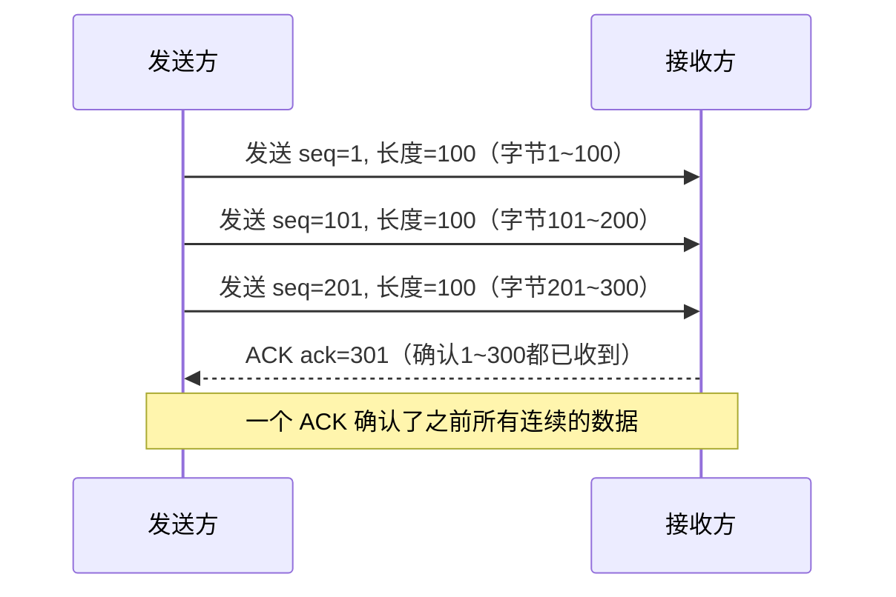
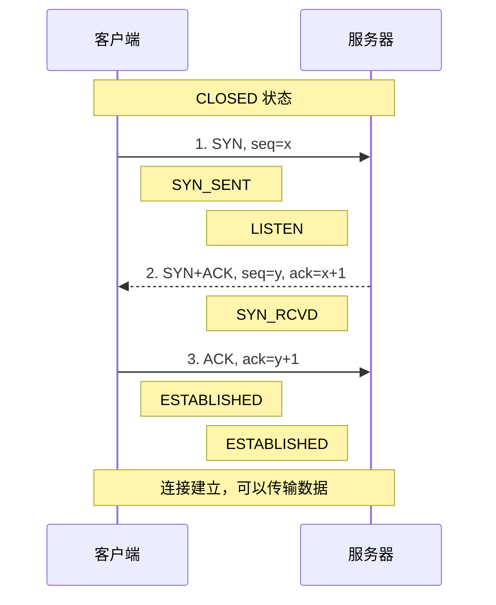
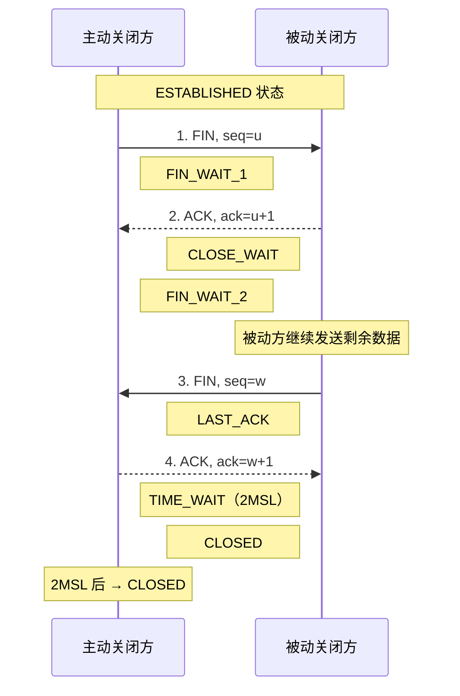
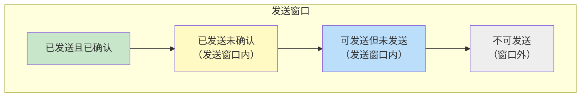

# TCP 首部格式

TCP（Transmission Control Protocol，传输控制协议）工作在传输层，提供一种**面向连接的、可靠的、基于字节流**的传输层通信协议。

TCP 首部长度：**20~60 字节**（固定部分 20 字节 + 可选部分 0~40 字节，且必须为 4 字节倍数）。

| 字段 | 长度（位） | 说明 |
|------|-----------|------|
| 源端口（Source Port） | 16 | 发送方端口号 |
| 目的端口（Destination Port） | 16 | 接收方端口号 |
| 序号（Sequence Number） | 32 | 本报文段所发送的数据的第一个字节的序号 |
| 确认号（Acknowledgment Number） | 32 | 期望收到对方下一个报文段的第一个数据字节的序号；**若确认号=N，则表明到序号 N-1 为止的所有数据都已正确收到** |
| 数据偏移（Data Offset） | 4 | TCP 首部长度，以 4 字节为单位，最小值 5（20 字节） |
| 保留（Reserved） | 6 | 保留为 0 |
| 控制位（Flags） | 6 | URG / ACK / PSH / RST / SYN / FIN |
| 窗口（Window） | 16 | 接收窗口大小，用于流量控制，单位为字节 |
| 校验和（Checksum） | 16 | 校验 TCP 首部+数据+伪首部 |
| 紧急指针（Urgent Pointer） | 16 | URG=1 时有效，指示紧急数据的末尾位置 |
| 选项（Options） | 0~320 | 可选字段，如 MSS、窗口缩放、时间戳等 |
| 填充（Padding） | 可变 | 填充 0，使首部长度为 4 字节的整数倍 |

![['attachments/TCPHeader.png]]

## 控制位（Flags）详解

| 标志位 | 名称 | 说明 |
|--------|------|------|
| URG | Urgent | 紧急指针有效，紧急数据应优先处理 |
| ACK | Acknowledgment | 确认号有效，建立连接后所有报文都应置位 |
| PSH | Push | 接收方应立即将数据交给应用层，不要等待缓冲区填满 |
| RST | Reset | 重置连接，用于异常断开 |
| SYN | Synchronize | 同步序号，用于建立连接 |
| FIN | Finish | 发送方已完成数据发送，请求关闭连接 |

---

# TCP 确认机制——累计应答（ACK）

TCP 使用**累计确认（累计应答）**机制：确认号表示该序号之前的所有数据都已正确收到。

![['attachments/累计应答.png]]
![['attachments/ACK机制.png]]

---

# TCP 三次握手

![['attachments/TCP三次握手.png]]

**过程详解**：
1. 客户端向服务器发送 SYN 报文，序列号为 x，进入 `SYN_SENT` 状态
2. 服务器回复 SYN+ACK 报文，序列号为 y，确认号为 x+1，进入 `SYN_RCVD` 状态
3. 客户端回复 ACK 报文，确认号为 y+1，双方进入 `ESTABLISHED` 状态

**为什么需要三次握手（为什么不是两次）**：
1. **防止已失效的连接请求突然又传到服务器**：如果客户端的一个旧 SYN 延迟到达服务器，服务器回复 SYN+ACK 后，客户端不会发送第三次 ACK，服务器就不会建立无效连接
2. **同步双方的初始序列号（ISN）**：双方都需要确认对方的起始序列号
3. **协商连接参数**：如 MSS、窗口缩放因子等

---

# TCP 四次挥手

![['attachments/TCP四次挥手.png]]

**过程详解**：
1. 主动方发送 FIN，序列号为 u，进入 `FIN_WAIT_1`
2. 被动方回复 ACK，确认号为 u+1，进入 `CLOSE_WAIT`；主动方收到后进入 `FIN_WAIT_2`
3. 被动方发送完剩余数据后，发送 FIN，序列号为 w，进入 `LAST_ACK`
4. 主动方回复 ACK，确认号为 w+1，进入 `TIME_WAIT`；被动方收到 ACK 后关闭

**为什么需要四次挥手（为什么不是三次）**：
TCP 是全双工的，两个方向的数据流需要分别关闭。被动方收到 FIN 时，可能还有数据未发送完，所以先回复 ACK，等数据发送完毕后再发送 FIN，因此 FIN 和 ACK 不能合并为一次。

## 2MSL 等待时间

> **MSL（Maximum Segment Lifetime）**：报文最大生存时间，RFC 建议为 2 分钟，实际系统通常为 30 秒~2 分钟。

主动方在发送最后一个 ACK 后进入 `TIME_WAIT` 状态，持续 **2MSL** 时间。

**原因**：
1. **保证最后一个 ACK 能到达对方**：如果最后一个 ACK 丢失，被动方会超时重传 FIN，主动方在 2MSL 内还能收到并重传 ACK；如果没有 TIME_WAIT，主动方直接关闭，被动方收不到 ACK 会一直重传 FIN
2. **让本次连接的所有报文在网络中消失**：避免旧连接的延迟报文影响下一个使用相同端口的新连接

---

# RTT 与 RTO

## RTT（Round-Trip Time，往返时间）

> 从发送一个报文段到收到对该报文段的确认所经历的时间。

- RTT 不是固定的，会随网络拥塞程度动态变化
- TCP 使用**加权平均往返时间（SRTT）**来平滑 RTT 波动
- $\text{SRTT} = \alpha \times \text{SRTT} + (1-\alpha) \times \text{RTT}$（α 通常为 0.875）

## RTO（Retransmission Timeout，重传超时时间）

> 发送方在发送数据后，等待确认的超时时间。超时后未收到确认则重传。

- $\text{RTO} \approx 2 \times \text{RTT}$（粗略估计）
- 实际使用 Jacobson 算法，综合考虑 SRTT 和 RTT 偏差（RTTVAR）：
  - $\text{RTO} = \text{SRTT} + 4 \times \text{RTTVAR}$
- RTO 过短会导致不必要的重传，过长会导致网络利用率低

---

# 滑动窗口与流量控制

## 滑动窗口

TCP 使用滑动窗口机制实现流量控制和可靠传输。

- **发送窗口**：发送方已发送但未收到确认，以及可以发送但尚未发送的数据范围
- **接收窗口**：接收方愿意接收的数据范围，通过 TCP 首部的窗口字段通知发送方
- **发送方发送数据大小 ≤ min(接收窗口, 拥塞窗口)**

![['attachments/发送窗口.png]]
![['attachments/接收窗口.png]]

## 流量控制

> 接收方通过调整窗口大小来控制发送方的发送速率，防止发送方发送过快导致接收方缓冲区溢出。

- 接收方缓冲区满时，将窗口字段设为 0，通知发送方停止发送
- 接收方处理完数据后，通过 ACK 报文通知新的窗口大小
- 为防止窗口为 0 后 ACK 丢失导致死锁，发送方会定期发送**窗口探测报文**（1 字节数据）

---

# 粘包问题与解决方案

TCP 是**面向字节流**的，没有消息边界，因此可能出现粘包问题：发送方发送的多个数据包被接收方当作一个包接收，或者一个包被拆成多个包接收。

**解决方案**：
1. **先发包大小再发数据**：在每个数据包前加一个固定长度的头部，标明数据长度
2. **添加开始/结束标志**：使用特殊字符作为消息边界（如换行符 `\n`）
3. **固定包大小**：每个数据包长度固定，不足时填充
4. **短连接**：每次通信建立新连接，连接关闭即表示消息结束

> 应用层保证 UDP 不丢包（借鉴 TCP 机制）：
> 1. 实现 seq/ack 机制 → 数据写入消息队列，收到确认后再发送下一个包
> 2. 加上滑动窗口 → 累计应答

---

Prev Note : [[1.5.套接字缓冲区与TCP服务器模型]]
Next Note : [[1.7.TCP拥塞控制与协议对比]]
