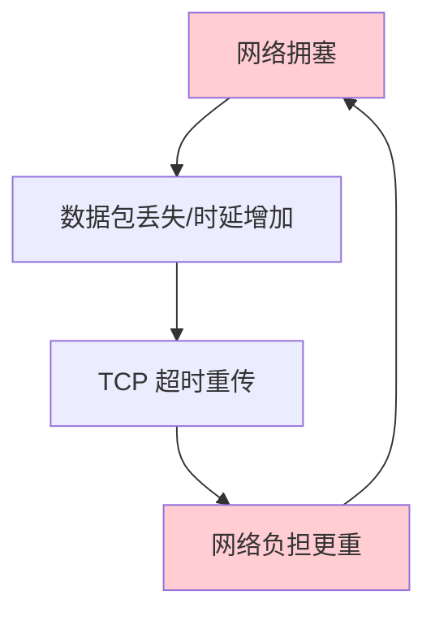
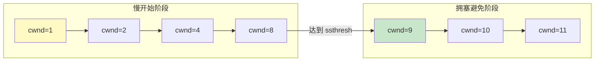
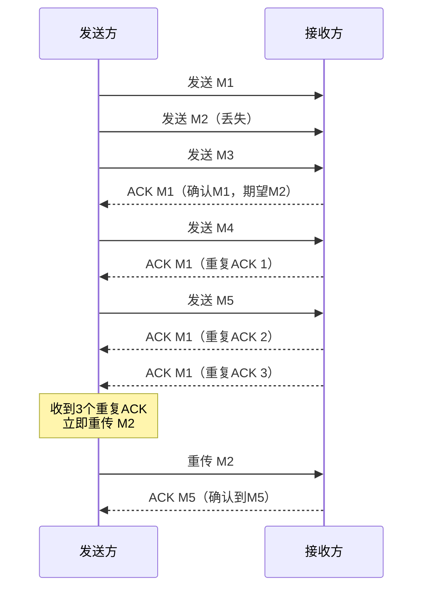
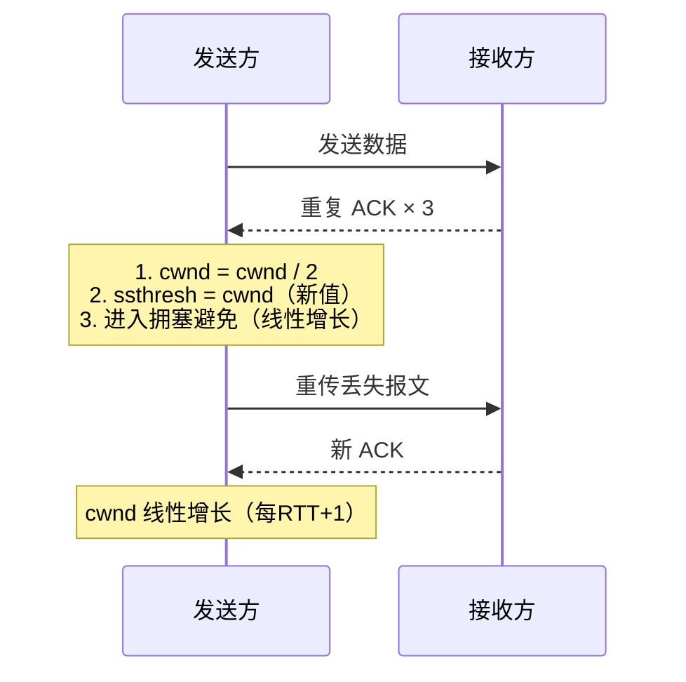

# 心跳机制

- **应用场景**：在长连接下，可能很长一段时间都没有数据往来（如聊天软件）。理论上连接一直保持，但实际中如果中间节点出现故障难以察觉；有的节点（如防火墙）会自动把一定时间内没有数据交互的连接断掉。此时需要**心跳包**用于维持长连接、保活。
- **什么是心跳机制**：每隔一段时间发送一个固定信息给服务端，服务端收到后回复一个固定信息；如果服务端几分钟内没有收到客户端信息则视客户端断开。
- **心跳包的发送通常有两种技术**：
  1. **应用层实现心跳包**（更灵活，可自定义心跳内容和超时逻辑）
  2. 使用 `SO_KEEPALIVE` 套接字选项（TCP 层内置保活，默认 2 小时无数据后发送探测包）

---

# Nagle 算法

> Nagle 算法的目的是**尽可能发送大块数据**，避免网络中充斥着许多小数据块。

**Nagle 算法的规则**：
1. 如果包长度达到 MSS（最大报文段长度），则允许发送
2. 如果该包含有 FIN，则允许发送
3. 设置了 `TCP_NODELAY` 选项，则允许发送
4. 未设置 `TCP_CORK` 选项时，若所有发出去的小数据包（包长度小于 MSS）均被确认，则允许发送
5. 上述条件都未满足，但发生了超时（一般为 200ms），则立即发送

- Nagle 算法**默认是打开的**。对于需要小数据包交互的场景（如 telnet、ssh 等交互性强的程序），需要关闭 Nagle 算法。
- Nagle 算法与**延迟 ACK（Delayed ACK）** 配合时可能产生额外延迟：发送方等 ACK，接收方等数据凑齐再发 ACK，导致双方互相等待。

**关闭 Nagle 算法的方法**：

```cpp
int value = 1;
setsockopt(sock_fd, IPPROTO_TCP, TCP_NODELAY, (char*)&value, sizeof(int));
```

---

# 拥塞控制

> 网络中的链路容量和交换节点中的缓存、处理机都有工作极限。当网络需求超过它们的工作极限时，就出现了**拥塞**。

- 网络出现拥塞时，如果继续发送大量数据包，可能导致数据包时延、丢失等，TCP 会重传数据，但重传会导致网络负担更重，形成恶性循环。



![['attachments/拥塞控制.png']]

**四种拥塞控制算法**：
1. 慢开始（慢启动）
2. 拥塞避免
3. 快重传
4. 快恢复

## 慢开始与拥塞避免

- 发送方维持一个叫做**拥塞窗口 cwnd（congestion window）**的状态变量
- 拥塞窗口的大小取决于网络的拥塞程度，动态变化
- 发送方让自己的发送窗口等于拥塞窗口；另外考虑到接收方的接收能力，发送窗口可能小于拥塞窗口

$$\text{发送方发送数据大小} \le \min(\text{接收窗口（滑动窗口）}, \text{拥塞窗口 cwnd})$$

> 慢开始算法的思路：不要一开始就发送大量数据，先探测网络拥塞程度，由小到大逐渐增加拥塞窗口大小。

为防止 cwnd 增长过大引起网络拥塞，还需设置一个**慢开始门限 ssthresh** 状态变量：
- 当 `cwnd < ssthresh` 时，使用慢开始算法（指数增长：每 RTT 翻倍）
- 当 `cwnd > ssthresh` 时，改用拥塞避免算法（线性增长：每 RTT 加 1）
- 当 `cwnd = ssthresh` 时，慢开始与拥塞避免算法任意



![['attachments/慢开始与拥塞避免.png']]

- **慢开始**：指一开始向网络注入的报文段少，并不是指 cwnd 增长速度慢（实际是指数增长）
- **拥塞避免**：并非指完全能避免拥塞，而是指在拥塞避免阶段将 cwnd 控制为线性增长（加一），使网络较不容易出现拥塞

**发生超时重传时**（判断网络**一定**出现拥塞）：
1. 将 `ssthresh` 更新为发生拥塞时 `cwnd` 的一半
2. 将 `cwnd` 重置为 1，重新开始慢开始算法

## 快重传

> 收到三个连续的重复确认后，立即重传丢失的报文段，而不必等待重传计时器超时。



![['attachments/快重传.png']]

## 快恢复

> 快重传触发后（收到三个重复 ACK），网络不是非常拥堵（只是个别包丢失），因此不执行慢开始，而是执行快恢复。



![['attachments/快恢复.png']]

**快恢复的拥塞窗口变化**：
1. `cwnd = cwnd / 2`
2. `ssthresh = cwnd`（更新后的 cwnd）
3. 执行拥塞避免算法（线性增长），而非慢开始

---

# TCP 总结

- **面向连接的**：通信前必须通过三次握手建立连接
- **可靠传输**：通过以下机制保证可靠性
  1. 三次握手、四次挥手
  2. 重传和确认机制（超时重传、快重传）
  3. 合理的分段（MSS、MTU）
  4. 校验和与重新排序
  5. 滑动窗口（流量控制）
  6. 拥塞窗口（4 种拥塞控制算法）
- **基于字节流的**：没有消息边界，存在**粘包问题**
  - 解决方法：
    1. 先发包大小再发数据
    2. 添加开始/结束标志
    3. 固定包大小
    4. 短连接

> **TCP 可以发广播吗？** 理论上不行，因为 TCP 是一对一（面向连接）的传输协议。

> 应用程序保证 UDP 不丢包（借鉴 TCP 机制）：
> 1. 实现 seq/ack 机制 → 数据写入消息队列，收到确认后发送其他包
> 2. 加上滑动窗口 → 累计应答

---

# TCP 与 UDP 对比

| 性能 | UDP | TCP |
|------|-----|-----|
| 是否连接 | 无连接 | 面向连接 |
| 是否可靠 | 不可靠传输，不使用流量控制和拥塞控制 | 可靠传输，使用流量控制和拥塞控制 |
| 连接对象个数 | 支持一对一、一对多、多对一和多对多交互通信 | 只能是一对一通信 |
| 传输方式 | 面向报文 | 面向字节流 |
| 首部开销 | 首部开销小，仅 8 字节 | 首部最小 20 字节，最大 60 字节 |
| 适用场景 | 实时应用（IP 电话、视频会议、直播等） | 要求可靠传输的应用（文件传输、网页浏览等） |

---

Prev Note : [[1.6.TCP报文与连接管理]]
Next Note : [[2.1.数据库基础与关系范式]]
