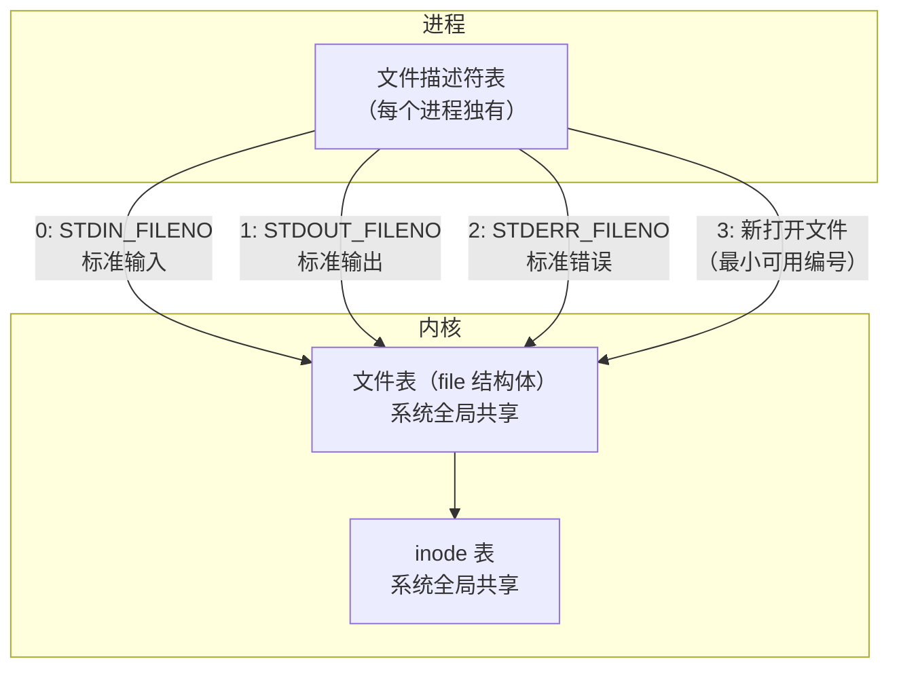
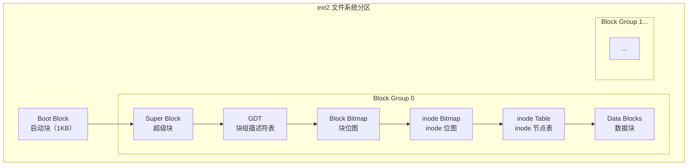

# Linux 文件 I/O

操作系统级别函数（系统调用）相较于 C 语言标准库函数：
- 更灵活，可操作的更多
- 调用更快（无用户态缓冲区，直接进入内核）

> 每一个 `FILE` 文件流都有一个缓冲区 buffer，默认大小 8192 Byte（标准库 I/O 的用户态缓冲）。

## 文件描述符



![['attachments/linuxThread.png']]

- 默认打开三个文件描述符：
  - `STDIN_FILENO`（0）：标准输入
  - `STDOUT_FILENO`（1）：标准输出
  - `STDERR_FILENO`（2）：标准错误
- 新打开的文件取用**最小可用编号**
- 文件描述符是进程内的索引，指向内核中的 file 结构体

---

## open 函数——打开文件

```c
#include <sys/types.h>
#include <sys/stat.h>
#include <fcntl.h>

int open(const char *pathname, int flags);
int open(const char *pathname, int flags, mode_t mode);
```

- `pathname`：要打开或创建的文件名
- `flags`：一系列常数值，可用按位或 `|` 连接（都以 `O_` 开头，表示 or）

**必选项**（三选一）：

| 标志 | 说明 |
|------|------|
| `O_RDONLY` | 只读打开 |
| `O_WRONLY` | 只写打开 |
| `O_RDWR` | 可读可写打开 |

**可选项**：

| 标志 | 说明 |
|------|------|
| `O_APPEND` | 追加模式，每次写都在文件末尾 |
| `O_CREAT` | 若文件不存在则创建，需提供第三个参数 mode 表示权限 |
| `O_EXCL` | 与 `O_CREAT` 同时使用时，若文件已存在则出错返回 |
| `O_TRUNC` | 若文件已存在且以只写/读写打开，则将长度截断为 0（删除旧内容） |
| `O_NONBLOCK` | 非阻塞 I/O（主要用于设备文件） |

> [!note] open 与 fopen 的区别
> - `fopen` 以可写方式打开文件时，文件不存在会自动创建；`open` 必须明确指定 `O_CREAT` 才会创建，否则文件不存在则出错返回
> - `fopen` 以 `w`/`w+` 方式打开已存在文件时会截断为 0；`open` 必须明确指定 `O_TRUNC` 才会截断，否则直接在原数据上改写
> - 第三个参数 `mode` 指定文件权限，可用八进制数（如 `0644`）或 `S_IRUSR`/`S_IWUSR` 等宏定义。实际权限由 `mode` 参数和当前进程的 `umask` 掩码共同决定

---

## read / write 函数

### read——读取数据

```c
#include <unistd.h>
ssize_t read(int fd, void *buf, size_t count);
```

- **返回值**：成功返回读取的字节数；出错返回 -1 并设置 `errno`；到达文件末尾返回 0
- `count`：请求读取的字节数，数据保存在缓冲区 `buf` 中，文件当前读写位置向后移
- 注意：这个读写位置记在**内核中**，与 C 标准 I/O 库的读写位置（在用户空间缓冲区中）不同
  - 例如 `fgetc` 读一个字节，可能从内核预读 1024 字节到 I/O 缓冲区，再返回第一个字节。此时内核记录的读写位置是 1024，而 `FILE` 结构体中记录的是 1
- 返回值类型 `ssize_t`：有符号的 `size_t`，可返回正数、0（EOF）或 -1（错误）
- 实际读到的字节数可能小于请求的字节数 `count`：
  - 读常规文件时，在读到 count 字节前已到达文件末尾
  - 从终端设备读，通常以行为单位，读到换行符就返回
  - 从网络读，根据传输层协议和内核缓存机制，返回值可能小于请求字节数

### write——写入数据

```c
#include <unistd.h>
ssize_t write(int fd, const void *buf, size_t count);
```

- **返回值**：成功返回写入的字节数；出错返回 -1 并设置 `errno`
- 写常规文件时，返回值通常等于请求字节数 `count`；向终端设备或网络写则不一定

> [!example] 利用 read/write 实现 `cp` 命令
> ```c
> #include <unistd.h>
> #include <fcntl.h>
> 
> int main(int argc, char *argv[]) {
>     int fd_src = open(argv[1], O_RDONLY);
>     int fd_dst = open(argv[2], O_WRONLY | O_CREAT | O_TRUNC, 0644);
>     char buf[1024];
>     ssize_t n;
>     while ((n = read(fd_src, buf, sizeof(buf))) > 0) {
>         write(fd_dst, buf, n);
>     }
>     close(fd_src);
>     close(fd_dst);
>     return 0;
> }
> ```

![['attachments/cp.png']]

---

## 最大打开文件个数

| 命令 | 说明 |
|------|------|
| `cat /proc/sys/fs/file-max` | 查看系统级最大打开文件个数（内核限制） |
| `ulimit -a` | 查看当前用户的所有限制（含最大打开文件数） |
| `ulimit -n` | 查看/临时修改当前进程最大打开文件个数 |

![['attachments/file-max.png']]

---

## lseek 函数——移动文件读写位置

每个打开的文件都记录着当前读写位置，打开时默认为 0（文件开头）。读写多少字节就将位置后移多少字节。例外：以 `O_APPEND` 方式打开时，每次写操作都会在文件末尾追加。

```c
#include <sys/types.h>
#include <unistd.h>
off_t lseek(int fd, off_t offset, int whence);
```

- `offset` 和 `whence` 的含义与 `fseek` 完全相同
- 偏移量允许超过文件末尾，此时对该文件的下一次写操作将延长文件，**中间空洞的部分读出来都是 0**
- 成功返回新的偏移量，失败返回 -1

**whence 取值**：

| 值 | 说明 |
|----|------|
| `SEEK_SET` | 从文件开头计算偏移 |
| `SEEK_CUR` | 从当前位置计算偏移 |
| `SEEK_END` | 从文件末尾计算偏移 |

> 获取当前文件偏移量：
> ```c
> off_t currpos = lseek(fd, 0, SEEK_CUR);
> ```
> 这种方法也可用来确定文件或设备是否支持设置偏移量：常规文件支持，设备一般不支持（返回 -1，errno 设为 `ESPIPE`）。

> [!example] lseek 实现查看文件大小
> ```c
> off_t size = lseek(fd, 0, SEEK_END);
> ```

![['attachments/lseek.png']]

---

## 阻塞与非阻塞 I/O

文件默认以**阻塞**方式打开进行读写：
- 读常规文件**不会阻塞**，不管读多少字节，`read` 一定会在有限时间内返回
- 从终端设备或网络读则**不一定**：如果终端输入没有换行符，调用 `read` 会阻塞；如果网络上没有数据包，调用 `read` 也会阻塞，阻塞时间不确定

**阻塞读**：


![['attachments/block.png']]

## fcntl 函数——改变已打开文件的属性

`STDIN_FILENO` 在程序启动时已自动打开。若需要在不重新 `open` 的情况下改变文件属性（如设置非阻塞），可使用 `fcntl`。

```c
#include <unistd.h>
#include <fcntl.h>

int fcntl(int fd, int cmd);
int fcntl(int fd, int cmd, long arg);
int fcntl(int fd, int cmd, struct flock *lock);
```

**常用 cmd**：

| cmd | 说明 |
|-----|------|
| `F_GETFL` | 获取文件状态标志 |
| `F_SETFL` | 设置文件状态标志（如 `O_NONBLOCK`、`O_APPEND`） |
| `F_GETFD` | 获取文件描述符标志 |
| `F_SETFD` | 设置文件描述符标志 |
| `F_GETLK` / `F_SETLK` / `F_SETLKW` | 文件记录锁 |

> [!note] fcntl 设置非阻塞读
> ```c
> int flags = fcntl(fd, F_GETFL);
> flags |= O_NONBLOCK;
> fcntl(fd, F_SETFL, flags);
> ```

![['attachments/nonblock.png']]

---

# ext2 文件系统

- 磁盘格式化实际上是将磁盘分为若干个 Block，块大小可设置为 1K/2K/4K，默认为 4K（可用 `stat` 查看）
- 1 Block = 4096 byte = 8 个磁盘扇区（1 扇区 = 512 字节）



![['attachments/ext2.png']]

**各部分说明**：

| 部分 | 说明 |
|------|------|
| **Boot Block** | 启动块，PC 组织规定，存储磁盘分区信息和引导程序，固定 1KB |
| **Super Block** | 超级块（4KB），记录块大小、文件系统版本号、上次 mount 时间、空闲块/inode 数量等 |
| **GDT（Group Descriptor Table）** | 块组描述符表，描述每个块组中 Block Bitmap、inode Bitmap、inode Table、Data Blocks 的起始位置，以及空闲 inode 个数 |
| **Block Bitmap** | 块位图，每个 bit 位标识一个块是否被使用 |
| **inode Bitmap** | inode 位图，每个 bit 位标识一个 inode 节点是否空闲可用 |
| **inode Table** | inode 节点表，每个 inode 节点存储文件属性（128 字节）和数据块指针（15 个地址，60 字节） |
| **Data Blocks** | 数据块，存储文件内容，以块为单位 |

## 数据块寻址

inode 中的 15 个数据块指针：

| 指针 | 类型 | 说明 |
|------|------|------|
| `Blocks[0]` ~ `Blocks[11]` | 直接寻址 | 直接指向数据块，共 12 个 |
| `Blocks[12]` | 一级间接寻址 | 指向一个间接寻址块，该块中存储指向数据块的指针 |
| `Blocks[13]` | 二级间接寻址 | 指向一级间接块，一级间接块指向二级间接块，二级间接块指向数据块 |
| `Blocks[14]` | 三级间接寻址 | 三级间接寻址，最多可表示 $(b/4)^3 + (b/4)^2 + b/4 + 12$ 个数据块 |

> 其中 $b$ 为块大小（字节），每个指针占 4 字节。
> - 对于 1K 块大小，二级间接寻址最大可表示 64.26 MB 文件
> - 对于 1K 块大小，三级间接寻址最大可表示 16.06 GB 文件


![['attachments/数据块寻址.png']]

- 访问不超过 12 个数据块的小文件非常快，只需两次读盘：一次读 inode，一次读数据块
- 访问大文件最多需要五次读盘：inode → 一级间接块 → 二级间接块 → 三级间接块 → 数据块
- 实际上 inode 和数据块常被内核缓存，大文件效率也不会太低

---

## 硬链接与符号链接

| 特性 | 硬链接 | 符号链接（软链接） |
|------|--------|-------------------|
| inode | 与原文件共享同一个 inode | 申请一个新的 inode 节点 |
| 本质 | 相当于增加了一个指针（目录项） | 一个独立的文件，存储目标文件的路径 |
| 删除原文件 | 硬链接仍能访问文件内容（硬链接计数减 1，减为 0 才真正删除） | 符号链接失效（指向的文件不存在） |
| 跨文件系统 | 不允许（通常要求同一文件系统） | 允许 |
| 目录链接 | 通常不允许创建目录的硬链接 | 允许 |

> 当 `rm` 删除文件时，只是删除了目录下的记录项，并把 inode 的硬链接计数减 1；当硬链接计数减为 0 时，才会真正释放数据块和 inode。

---

Prev Note : [[3.2.Linux开发工具链]]
Next Note : [[3.4.VFS与系统调用及内存管理]]
