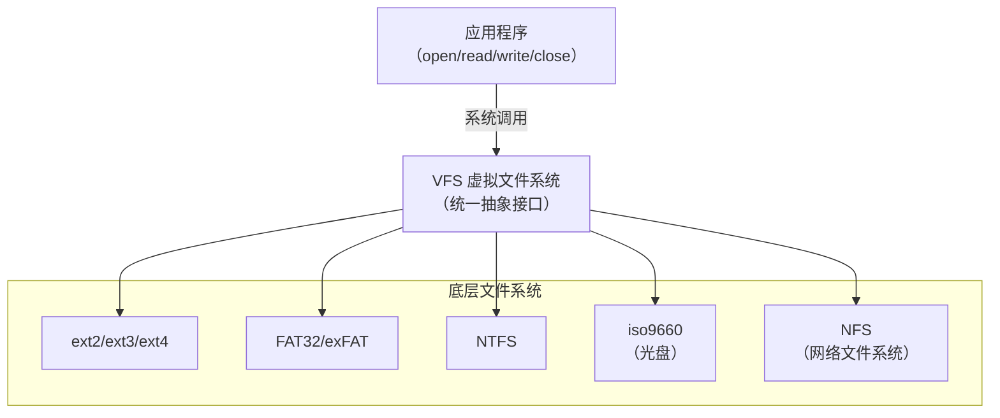
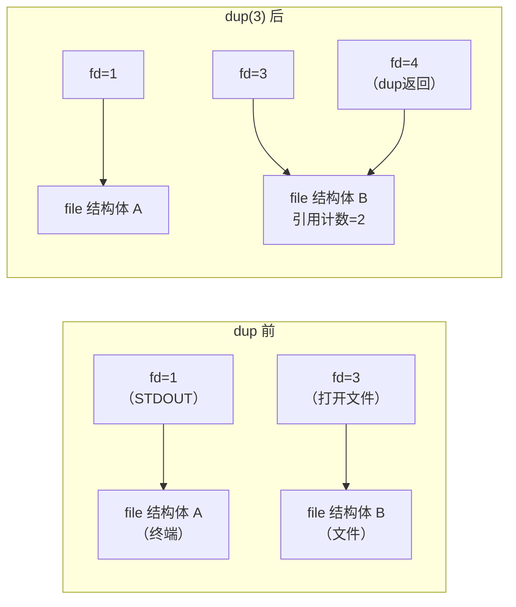
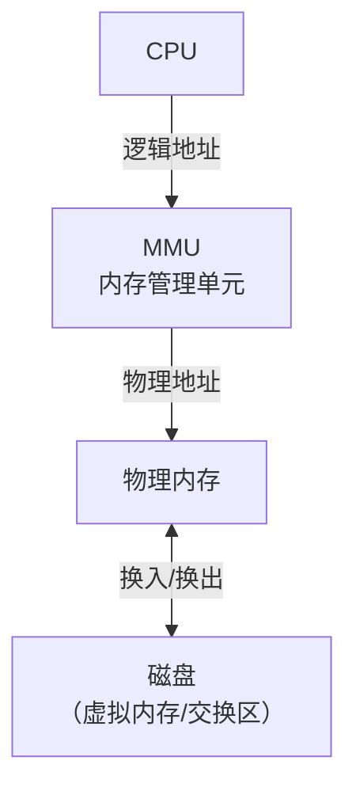

# 虚拟文件系统 VFS

- **作用**：Linux 原生支持 ext2、ext3 等文件系统，但不同的文件系统（如 U 盘的 FAT、NTFS）可以插上就用，正是基于虚拟文件系统（VFS）
- VFS 支持各种各样的文件系统格式：ext2、ext3、reiserfs、FAT、NTFS、iso9660 等
- VFS 提供统一的抽象接口，上层应用通过 VFS 访问不同的底层文件系统



![['attachments/VFS.png']]

## file 结构体

- **读写指针位置**：写到哪儿走到哪儿
- **`f_op`**：指向驱动层结构体，存储文件系统对应的操作函数（驱动层函数），知道如何操作硬件
- **`f_dentry`**：指向磁盘文件（目录项），知道文件在什么位置；磁盘文件类似 inode，由文件属性和数据块组成，会指向文件系统驱动 `inode_operations`，里面有操作文件属性的函数（如 `chmod`、`link`、`unlink` 等）
- **引用计数器**：标记打开该文件的文件描述符个数

---

## dup / dup2——复制文件描述符

`dup` 和 `dup2` 都可用来复制一个现存的文件描述符，使两个文件描述符指向同一个 `file` 结构体。

```c
#include <unistd.h>
int dup(int oldfd);
int dup2(int oldfd, int newfd);
```

- 如果两个文件描述符指向同一个 `file` 结构体，File Status Flag 和读写位置只保存一份，引用计数为 2
- 如果两次 `open` 同一文件得到两个文件描述符，则每个描述符对应一个不同的 `file` 结构体，可以有不同的 File Status Flag 和读写位置



![['attachments/dup.png']]

> [!example] 将标准输出重定向到文件
> ```c
> int fd = open("output.txt", O_WRONLY | O_CREAT | O_TRUNC, 0644);
> close(STDOUT_FILENO);       // 关闭标准输出
> dup(fd);                     // 复制 fd 到最小可用编号（即 1）
> printf("hello world\n");    // 输出到文件而非终端
> ```

---

## chmod——更改文件权限

```c
#include <sys/stat.h>
int chmod(const char *path, mode_t mode);
int fchmod(int fd, mode_t mode);
```

- `chmod`：通过文件路径更改权限
- `fchmod`：通过文件描述符更改权限

![['attachments/chmod.png']]

---

## chown——更改文件所有者

> 需要 root 权限。

```c
#include <unistd.h>
int chown(const char *path, uid_t owner, gid_t group);   // 通过路径
int fchown(int fd, uid_t owner, gid_t group);              // 通过文件描述符
int lchown(const char *path, uid_t owner, gid_t group);    // 不追踪符号链接
```

---

## truncate——截断文件长度

```c
#include <unistd.h>
#include <sys/types.h>
int truncate(const char *path, off_t length);
int ftruncate(int fd, off_t length);
```

- 将文件长度截断为指定长度（可变长也可变短）
- 变长时，新增部分读出来为 0（文件空洞）

---

## chdir / getcwd——改变/获取当前工作目录

```c
#include <unistd.h>
int chdir(const char *path);
int fchdir(int fd);

char *getcwd(char *buf, size_t size);
```

- `chdir`：改变当前进程的工作目录
- `getcwd`：获取当前进程的工作目录，存储到 `buf` 中

---

## pathconf——获取路径配置

```c
#include <unistd.h>
long fpathconf(int fd, int name);
long pathconf(char *path, int name);
```

- 获取文件系统的配置限制，如最大文件名长度、最大路径长度等

---

## link / symlink / readlink / unlink——链接操作

### link——创建硬链接

```c
#include <unistd.h>
int link(const char *oldpath, const char *newpath);
```

- 当 `rm` 删除文件时，只是删除目录下的记录项，并把 inode 硬链接计数减 1；减为 0 时才真正释放数据块和 inode
- 硬链接通常要求位于同一文件系统中（POSIX 允许跨文件系统）
- 通常不允许创建目录的硬链接（某些 UNIX 系统下超级用户可以）
- 创建目录项及增加硬链接计数应当是一个原子操作

### symlink——创建符号链接

```c
int symlink(const char *oldpath, const char *newpath);
```

- 符号链接没有文件系统限制
- 申请新的 inode 节点，存储目标文件的路径

### readlink——读取符号链接内容

```c
ssize_t readlink(const char *path, char *buf, size_t bufsiz);
```

- 读符号链接所指向的文件名字（路径），不读文件内容

### unlink——取消链接

```c
int unlink(const char *pathname);
```

1. 如果是符号链接，删除符号链接本身
2. 如果是硬链接，硬链接数减 1；减为 0 时释放数据块和 inode
3. 如果文件硬链接数为 0，但有进程已打开该文件并持有文件描述符，则等该进程关闭文件时，内核才真正删除该文件
4. 利用特性 3 可创建临时文件：先 `open`/`creat` 创建文件，马上 `unlink` 此文件，进程关闭时文件自动删除

---

## 目录操作

```c
#include <sys/stat.h>
#include <sys/types.h>
int mkdir(const char *pathname, mode_t mode);  // 创建目录
#include <unistd.h>
int rmdir(const char *pathname);                 // 删除空目录

#include <sys/types.h>
#include <dirent.h>
DIR *opendir(const char *name);                  // 打开目录
DIR *fdopendir(int fd);                          // 通过文件描述符打开目录
```

### readdir——读取目录项

`readdir` 每次返回一条记录项，`DIR*` 指针指向下一条记录项。

```c
#include <dirent.h>
struct dirent *readdir(DIR *dirp);

struct dirent {
    ino_t d_ino;            /* inode number */
    off_t d_off;             /* offset to the next dirent */
    unsigned short d_reclen; /* length of this record */
    unsigned char d_type;    /* type of file（并非所有文件系统都支持） */
    char d_name[256];        /* filename */
};

#include <sys/types.h>
#include <dirent.h>
void rewinddir(DIR *dirp);   // 把目录指针恢复到目录起始位置
```

> [!example] 实现 `ls` 命令（readdir）
> ```c
> #include <dirent.h>
> #include <stdio.h>
> 
> int main(int argc, char *argv[]) {
>     DIR *dir = opendir(argv[1] ? argv[1] : ".");
>     struct dirent *entry;
>     while ((entry = readdir(dir)) != NULL) {
>         printf("%s\n", entry->d_name);
>     }
>     closedir(dir);
>     return 0;
> }
> ```

![['attachments/ls.png']]

---

# Windows 内存管理

## 计算机体系结构



![['attachments/计算机体系结构.png']]

## 连续分配管理

申请的空间为连续的。

### 单一连续分配

- 用于单用户单任务操作系统
- 作业一旦进入内存，要等待结束之后才释放
- 无法实现多个进程共享主存

### 固定分区分配

- 将内存分成若干个大小固定的分区，不同分区可放不同程序
- 分区大小需预先确定，运行时不能改变
- 通常采用静态重定位方式装入内存
- 会产生内部碎片

### 动态分区分配

- 可变分区分配，根据作业大小动态创建分区
- 会产生外部碎片

## 非连续分配管理

**逻辑地址**映射到操作系统管理的**物理地址**。

- **内部碎片**：程序内部的碎片（分配的内存大于实际需要）
- **外部碎片**：操作系统的内存碎片（太小无法利用的空闲块）

### 页式存储

- 将内存分为大小相等的页框（帧），将程序分为大小相等的页
- 页大小与块大小相同（1K/2K/4K）
- 不会产生外部碎片，只会产生内部碎片


![['attachments/页式管理.png']]

**缺页中断与置换算法**：
- **缺页中断**：程序根据页表找不到自己的数据（操作系统将数据换出以运行更多程序）
- **置换算法**：操作系统选择将哪个页面换出的算法

| 算法 | 名称 | 说明 |
|------|------|------|
| OPT | 最优页面置换算法 | 发生缺页中断时，计算内存中每个逻辑页下次访问前的等待时间，选择等待最长的页置换（理论最优，无法实现） |
| FIFO | 先进先出算法 | 选择在内存中驻留时间最长的页面置换 |
| LRU | 最近最久未使用算法 | 选择最久未使用的页面置换 |

**优点**：
- 很好地解决外部碎片问题，只会产生内部碎片
- 打破内存分配的连续性需求
- 提高主存利用率

**缺点**：
- 程序需要全部装入内存，需要相应硬件支持
- 会有内部碎片产生
- 动态地址转换需要耗用额外的系统资源

### 段式存储

- 用户编制的程序由若干段组成（主程序、子程序、符号表、栈、数据等）
- 每一段有独立、完整的逻辑意义，可独立编制
- 每一段的长度可以不同


![['attachments/段式管理.png']]

**优点**：
- 没有内部碎片
- 可以以段为单位编写和编译，各段修改互不影响
- 可以针对不同类型的段采取不同的保护
- 可以以段为单位进行共享，包括通过动态链接进行代码共享

**缺点**：会产生外部碎片（由于进程被分为多个小块，外部碎片通常较小）

### 段页式存储

- 用户程序先分段，每个段内部再分页
- 结合了段式和页式的优点，但增加了表（段表和页表）的存储开销和查询开销
- 只在大型计算机系统中使用
- 会产生外部碎片，还会产生内部碎片


![['attachments/段页式存储.png']]

### 页式、段式、段页式存储比较

| 特性 | 页式存储 | 段式存储 | 段页式存储 |
|------|---------|---------|-----------|
| 划分单位 | 固定大小的页 | 不定长的逻辑段 | 段内分页 |
| 地址空间 | 一维（页间逻辑地址连续） | 二维（段间逻辑地址不连续） | 二维 |
| 内部碎片 | 有 | 无 | 有 |
| 外部碎片 | 无 | 有（较小） | 有 |
| 访问内存次数 | 2 次（页表+数据） | 2 次（段表+数据） | 3 次（段表+页表+数据） |
| 共享与保护 | 不便（页不是逻辑单位） | 方便（段是逻辑单位） | 方便 |

> - **页式存储**：页大小固定，根据页面大小强硬地将程序切割开
> - **段式存储**：分段灵活，只有一段程序有了完整的意义才将这一段切割开
> - 在页式、段式存储管理中，获得一条指令或数据须两次访问内存；段页式则须三次访问内存

---

Prev Note : [[3.3.Linux文件IO与ext2文件系统]]
