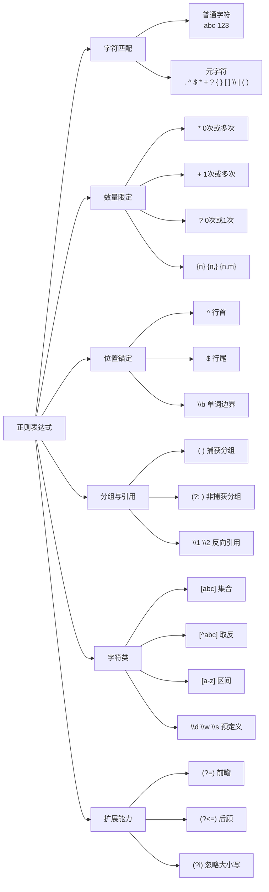
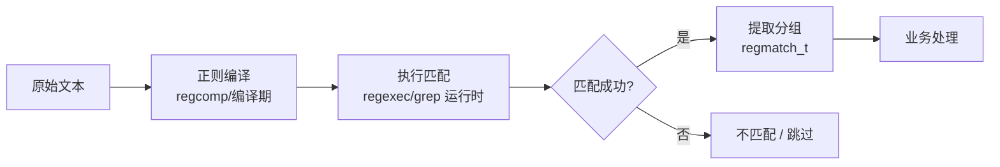

# 1.1 正则表达式

> 来源：`0330.github_regex.md`、`0413..md`（原笔记仅有链接占位，正文为整理补充）

正则表达式（Regular Expression，简称 Regex）是描述字符串匹配模式的一套规则，广泛用于文本搜索、数据校验、日志分析与代码开发。Linux 下几乎所有文本工具（`grep`、`sed`、`awk`、`vim`）以及 C/C++、Python、Java 等语言都支持正则。

## 1. 正则表达式语法分类



## 2. 元字符详解

| 元字符 | 含义 | 示例 | 匹配结果 |
| --- | --- | --- | --- |
| `.` | 匹配除换行外的任意单个字符 | `a.c` | `abc`、`a1c`、`a_c` |
| `*` | 前一个字符出现 0 次或多次 | `ab*c` | `ac`、`abc`、`abbc` |
| `+` | 前一个字符出现 1 次或多次 | `ab+c` | `abc`、`abbc`（不含 `ac`） |
| `?` | 前一个字符出现 0 次或 1 次 | `ab?c` | `ac`、`abc` |
| `{n}` | 恰好 n 次 | `a{3}` | `aaa` |
| `{n,}` | 至少 n 次 | `a{2,}` | `aa`、`aaa`… |
| `{n,m}` | n 到 m 次 | `a{2,4}` | `aa`、`aaa`、`aaaa` |
| `^` | 行首锚定 | `^abc` | 行首的 `abc` |
| `$` | 行尾锚定 | `abc$` | 行尾的 `abc` |
| `[ ]` | 字符集合（一个位置匹配集合内任一字符） | `[aeiou]` | 任意一个元音字母 |
| `[^ ]` | 字符集合取反 | `[^0-9]` | 任意非数字字符 |
| `|` | 或 | `cat|dog` | `cat` 或 `dog` |
| `( )` | 分组与捕获 | `(ab)+` | `ab`、`abab` |
| `\` | 转义符 | `\.` | 字面量 `.` |

## 3. 预定义字符类（简写）

| 简写 | 等价写法 | 含义 |
| --- | --- | --- |
| `\d` | `[0-9]` | 数字 |
| `\D` | `[^0-9]` | 非数字 |
| `\w` | `[A-Za-z0-9_]` | 单词字符 |
| `\W` | `[^A-Za-z0-9_]` | 非单词字符 |
| `\s` | `[ \t\r\n\f\v]` | 空白字符 |
| `\S` | `[^ \t\r\n\f\v]` | 非空白字符 |
| `\b` | — | 单词边界 |
| `\B` | — | 非单词边界 |

## 4. POSIX 字符类（Linux 工具常用）

在 `grep`、`sed`、`awk` 中使用的 POSIX 字符类，必须写在中括号内：`[[:alnum:]]`。

| 字符类 | 含义 |
| --- | --- |
| `[[:alpha:]]` | 字母 `[A-Za-z]` |
| `[[:digit:]]` | 数字 `[0-9]` |
| `[[:alnum:]]` | 字母数字 |
| `[[:space:]]` | 空白字符 |
| `[[:upper:]]` / `[[:lower:]]` | 大写 / 小写字母 |
| `[[:punct:]]` | 标点符号 |
| `[[:xdigit:]]` | 十六进制数字 |

## 5. 贪婪与懒惰匹配

- **贪婪匹配（默认）**：尽可能多地匹配。`a.*b` 匹配 `"a123b456b"` 时得到整个 `"a123b456b"`。
- **懒惰匹配**：在量词后加 `?`，尽可能少地匹配。`a.*?b` 对同样字符串只匹配 `"a123b"`。

```text
输入:   a123b456b
贪婪:   a.*b      -> a123b456b
懒惰:   a.*?b     -> a123b
```

## 6. Linux 三剑客中的正则

### 6.1 grep（文本过滤）
```bash
grep -E '^[0-9]{3}-[0-9]{4}$' phones.txt   # 扩展正则 -E
grep -P '\d{3}-\d{4}' phones.txt           # Perl 正则 -P
grep -i 'error' server.log                 # 忽略大小写
grep -r 'TODO' src/                        # 递归搜索
```

### 6.2 sed（流编辑）
```bash
sed -n 's/^#\(.*\)$/注释: \1/p' config.ini   # 捕获分组并替换打印
sed -i 's/old/new/g' file.txt                # 全文替换
```

### 6.3 awk（文本分析）
```bash
awk '/^Error/ {print $1, $NF}' app.log      # 匹配行首为 Error 的行
awk -F: '$1 ~ /^user[0-9]+$/ {print $2}' passwd
```

## 7. C/C++ 正则开发样例（POSIX regex 库）

```c
#include <stdio.h>
#include <regex.h>
#include <string.h>

int main(void) {
    regex_t reg;
    regmatch_t match[2];
    const char *pattern = "^([0-9]{4})-([0-9]{2})-([0-9]{2})$";
    const char *str = "2026-09-05";

    // 编译正则：REG_EXTENDED 扩展正则 / REG_ICASE 忽略大小写
    if (regcomp(&reg, pattern, REG_EXTENDED) != 0) {
        fprintf(stderr, "regcomp failed\n");
        return -1;
    }

    // 执行匹配：0 表示成功，REG_NOMATCH 表示不匹配
    if (regexec(&reg, str, 2, match, 0) == 0) {
        printf("匹配成功\n");
        for (int i = 0; i < 2 && match[i].rm_so != -1; i++) {
            int len = match[i].rm_eo - match[i].rm_so;
            printf("分组%d: %.*s\n", i, len, str + match[i].rm_so);
        }
    } else {
        printf("不匹配\n");
    }

    regfree(&reg); // 释放正则资源
    return 0;
}
```

编译运行：`gcc regex_demo.c -o regex_demo && ./regex_demo`

## 8. 常见应用场景

- 日志分析：`grep -E '(ERROR|FATAL)' app.log`
- 数据校验：手机号、邮箱、IP、日期格式
- 文本提取：`sed -n 's/.*id=\([0-9]*\).*/\1/p'`
- 代码审查：搜索 `TODO`、危险函数调用
- 配置解析：INI / properties 文件键值对提取



> [!tip] 注意事项
> - 正则回溯在极端输入下可能造成性能退化（ReDoS），服务端用户输入校验需限制长度或使用确定性自动机实现。
> - 不同工具正则方言略有差异：`grep` 基础正则（BRE）中 `+ ? {} |` 需转义，`grep -E` 扩展正则（ERE）无需转义。
> - 分组捕获数量过多或嵌套过深会降低可读性与性能，优先使用非捕获分组 `(?:...)`。

## 相关笔记

- [[1.8.信号Signal]]（信号与 sed/awk 场景关联）
- [[1.4.IPC进程间通信]]（日志与管道处理常用正则）
