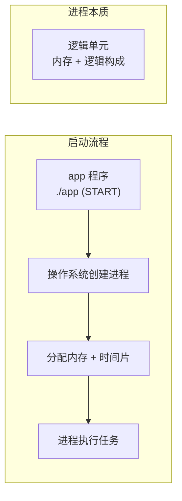
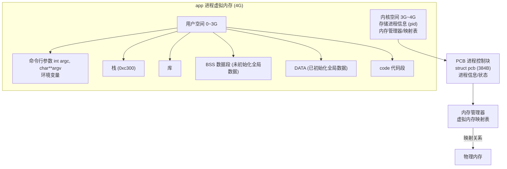
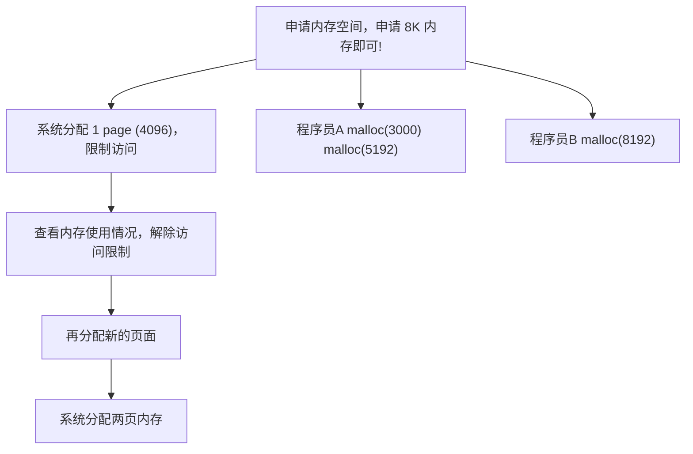
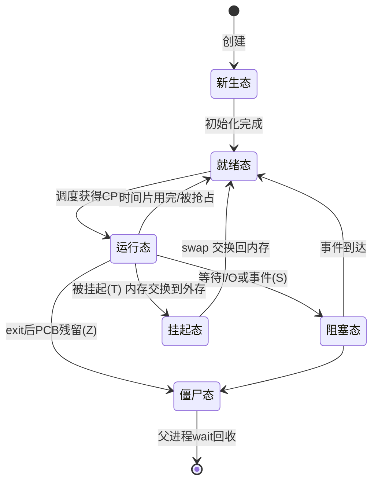
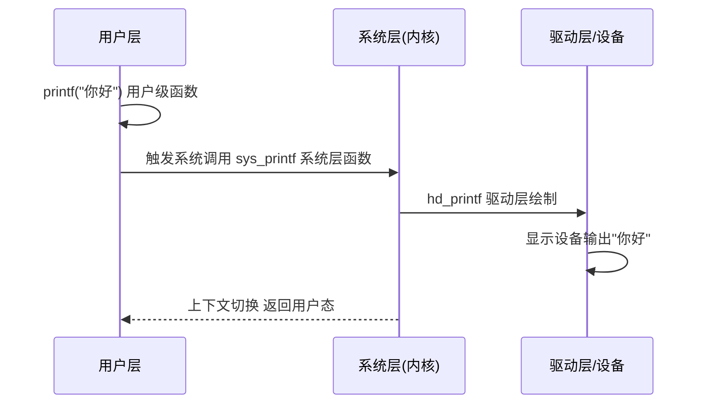
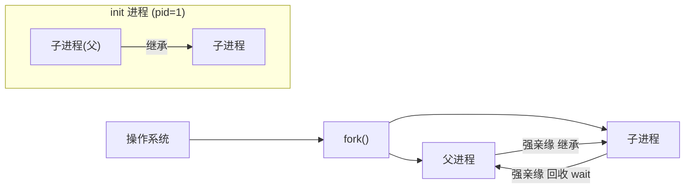
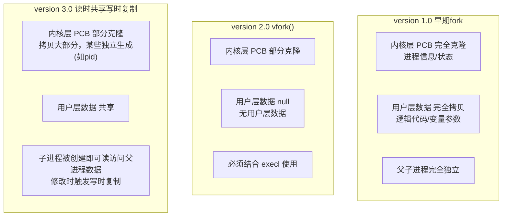
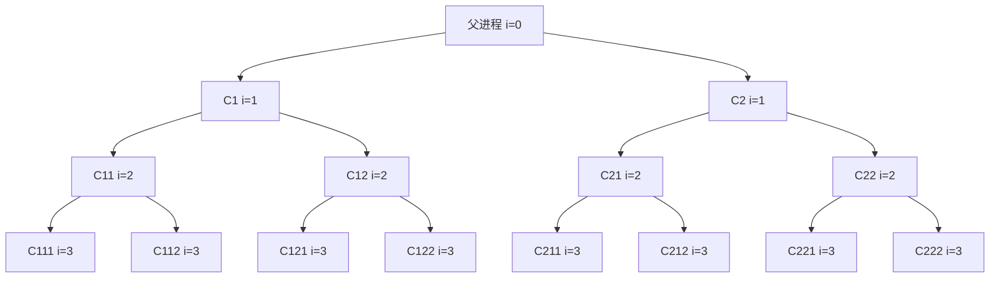

# 1.2 Linux进程与C/C++开发样例

> 来源：`0419.进程Process.md` + `'attachments/0419.jpg`（原图已嵌入下方，正文为图片识别 + 知识补充整理）

## 0. 原图

![[../'attachments/0419.jpg]]

## 1. 进程（Process）基础概念

- 当程序启动后，系统会为程序创建一个**进程**（执行单元），进程会被分配系统资源，完成特定任务。
- 进程是一种系统的**逻辑单元**，没有实体，由**内存**与**逻辑**构成。
- 进程是**最小的资源分配单位**（内存），线程是更小的调度单位。
- 进程被分配可用内存以及**时间片**资源，完成指定任务。



## 2. 虚拟内存与物理内存

- **物理内存**：内存条上的内存空间。
- **虚拟内存**：进程看到的地址空间，与物理内存存在**映射关系**，通过虚拟内存访问物理地址。
- **多任务操作系统虚拟内存设计**：
  1. 避免进程直接访问物理内存（隔离与安全）；
  2. 提高物理内存的可用性与重用性。
- x86 系统：0~3G 用户空间，3G~4G 内核空间；x64 系统：0~8T 用户层，8T~16T 内核层。



### 2.1 内存的基本单位与权限

- 内存基本单位是 **Page（页）**，大多数系统 1 页 = **4096 bytes**。
- 三级间接寻页 `1024*1024*1024`（32 位系统支持三级寻页）；四级寻页 `1024^4`（64 位系统支持四级）。
- 内存四个基本权限：`PROT_READ`（读）、`PROT_WRITE`（写）、`PROT_EXEC`（执行）、`PROT_NONE`（无权限）。

### 2.2 内存申请与系统调用开销



### 2.3 CPU 与硬盘、内存的交互


## 3. CPU 权限等级与执行模式

- intel x86 单核处理器 16 寄存器版本：
  - **level 0**：最高级别 CPU 执行权限，可任意访问系统软件资源和任意硬件设备（内核级）。
  - **level 3**：最低权限，只能访问系统允许访问的部分资源（用户级）。
- **用户级**是 CPU 在低权限下的执行模式；**内核级**是 CPU 在高权限下的执行模式。
- 系统调用事件可以引发**上下文切换**，即 CPU 权限转换。

## 4. 进程运行状态与状态转换



- 5 种常态：**新生态、就绪态(A)、运行态(R)、阻塞态(S)、挂起态(T)**，另有**僵尸态(Z)、孤儿态(O)**。
- **阻塞态**：放弃 CPU 资源，阻塞过程中可能被强制中断，阻塞的进程内存保留在系统中，需要一个契机恢复继续执行。
- **挂起态**：放弃 CPU 资源，挂起态**不可被中断**，挂起的进程内存被**交换到外存**中，想要继续执行需要先进行 **swap 交换**，否则无法继续。
- 时间片：4.2GHz 处理器 1 秒处理的指令数量很多，切割的时间片足够使用（如 10ms）。

## 5. 系统调用（事件）

- 只要执行系统函数或系统方法，都会触发系统调用事件。
- 用户级函数无法访问高级的系统设备，系统触发**系统调用**完成切换，访问其他设备完成任务，最终返回。



## 6. Linux 进程函数：fork / execl / wait / waitpid

### 6.1 fork() 创建子进程

```c
pid_t pid = fork(void); // 调用后创建一个子进程
// 父进程中返回子进程的 pid，子进程中返回 0，创建子进程失败返回 -1
```

- Linux 和 Unix 操作系统进程具备**亲缘关系**，分为强亲缘和弱亲缘。
- 所有进程都是 **init 进程**的子级（早期 pid=0/pid=1），它没有父进程。
- `ps aux` 查看详细信息。



**fork 版本演进**：



- 早期工程师大量使用 fork 后 exec 重载；因为 exec 存在，很多时候不需要拷贝继承，拷贝开销变得无意义 → vfork。
- **多进程共享栈帧**的方式，可以让不同进程共享相同函数栈帧，执行同一任务。
- **多进程模式常见是二级结构**：一个父进程 + 多个子进程，区分父子进程工作通过 **pid**。

**fork 子进程数量计算**：

```c
for (int i = 0; i < 3; i++) {
    fork();
}
// 一共创建 2^3 - 1 = 7 个子进程
```



### 6.2 execl() 进程重载

- 进程可以通过重载方式获得新功能：可重载自定义程序，也可重载系统命令，扩展性更强。
- 一般使用重载都是**创建子进程后**使用。
- **重载之后进程信息不变，但进程功能变更**（PCB 保留，用户层数据被替换）。
- 进程重载只能进行一次，而且重载成功**不可逆转**。
- 如果要让子进程执行自定义代码，必须在 **fork 之后、execl 之前**完成。

```c
execl("/bin/date", "date", NULL);        // 重载 date 命令
execl("/bin/ls", "ls", "-l", NULL);      // 重载 ls -l
```

```c
// 子进程重载流程
if (fork() == 0) {                        // 子进程
    printf("child running\n");
    execl("/bin/date", "date", NULL);     // 重载
    printf("execl success\n");            // 重载成功不会执行到这里
    return 0;
}
// 父进程: wait 回收
```

### 6.3 wait / waitpid 进程回收

- 当进程退出后，会残留部分内存没有释放，导致**内存泄漏**，称为**僵尸进程**。
- Linux 操作系统进程退出后**必然变为僵尸进程**，无法避免，只能通过**回收**处理。
- 僵尸进程处理：**父进程回收子进程的 PCB**（使用 wait 函数）；**兄弟之间无法回收**，只有父进程可以回收子进程。


- `pid_t zid = wait(int *status)`：wait 释放 PCB 后，获取 PCB 中的 pid 通知用户。
- **wait() 两种返回值**：回收成功返回僵尸进程 pid，失败返回 -1；如果子进程无需回收，wait **阻塞等待**。

```c
// waitpid 非阻塞回收
pid_t zid;
while ((zid = waitpid(-1, NULL, WNOHANG)) > 0) {
    // 回收一个僵尸进程
}
```

- **waitpid 参数**：`-1` 回收任意子进程；`>0 (3000)` 回收指定子进程；`0` 同组回收（父子进程在同一进程组）；`<-1 (-8000)` 跨组回收。
- **waitpid 三种返回值**：回收成功返回 zpid(>0)；回收失败返回 -1；非阻塞返回 0（子进程无需回收时立即返回不阻塞）。
- **非阻塞回收优势**：提高父进程可用性。传统阻塞回收导致父进程在回收完毕之前无法执行任务代码；非阻塞回收可在回收过程中交替穿插自身任务代码。

## 7. C/C++ 开发样例代码

### 7.1 完整样例：fork + execl + waitpid 组合

```c
#include <stdio.h>
#include <unistd.h>
#include <sys/wait.h>
#include <stdlib.h>

int main(void) {
    pid_t pid = fork();

    if (pid == -1) {
        perror("fork");
        exit(EXIT_FAILURE);
    } else if (pid == 0) {
        // 子进程：重载为 ls 命令
        printf("子进程 pid=%d，执行 exec 重载\n", getpid());
        execl("/bin/ls", "ls", "-l", NULL);
        perror("execl");   // 只有 exec 失败才会执行到这里
        exit(EXIT_FAILURE);
    } else {
        // 父进程：非阻塞回收所有子进程
        printf("父进程 pid=%d，等待子进程...\n", getpid());
        pid_t zid;
        while ((zid = waitpid(-1, NULL, WNOHANG)) == 0) {
            // 非阻塞回收：期间可穿插父进程自身任务
            usleep(100 * 1000);
        }
        if (zid > 0) {
            printf("已回收子进程 %d\n", zid);
        }
    }
    return 0;
}
```

### 7.2 样例：多进程拷贝骨架（详见 1.3）

```c
// 父进程按块划分文件，创建 pronum 个子进程分别拷贝
int process_create(char *src, char *dest, int block, int pronum) {
    for (int i = 0; i < pronum; i++) {
        pid_t pid = fork();
        if (pid == 0) {
            // 子进程通过 exec 重载拷贝程序 copy
            execl("./copy", "copy", src, dest, strpos, strblocksize, NULL);
            perror("execl");
            exit(EXIT_FAILURE);
        }
    }
    // 父进程非阻塞回收
    pid_t zid;
    while ((zid = waitpid(-1, NULL, WNOHANG)) > 0);
    return 0;
}
```

## 8. 补充知识点（原图之外）

- **孤儿进程**：父进程异常退出后，子进程被 init（托管进程）收养，退出后由托管进程回收 PCB。人为创建的孤儿进程通常是后台守护进程（见 1.5）。
- **写时复制（COW）**：fork 后父子进程共享物理页，只有一方修改时才复制该页，显著降低 fork 开销（fork 版本 3.0 的核心机制）。
- **进程组与会话**：进程组由组长进程和组员进程构成，`pgid == pid` 则为组长；会话由一个发起者和若干参与者构成（详见 1.5 守护进程）。
- **上下文切换开销**：进程切换涉及寄存器保存、内存映射切换、TLB 刷新，比线程切换开销大，这是多进程并发模型的主要成本。

## 相关笔记

- [[1.3.并发应用(多进程拷贝)]]
- [[1.4.IPC进程间通信]]
- [[1.5.守护进程Daemon]]
- [[1.8.信号Signal]]
