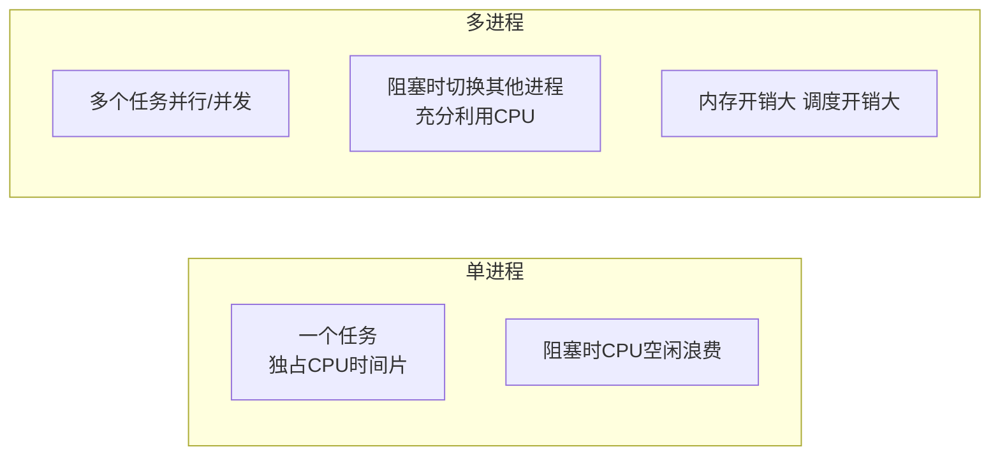
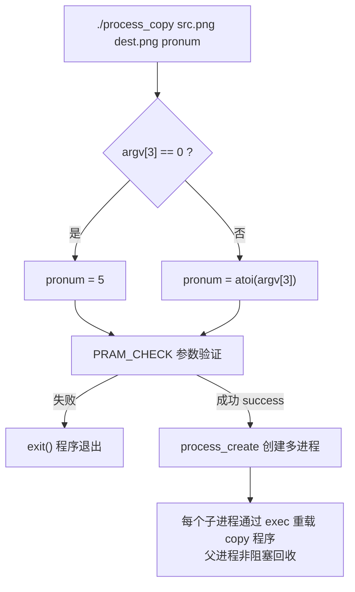
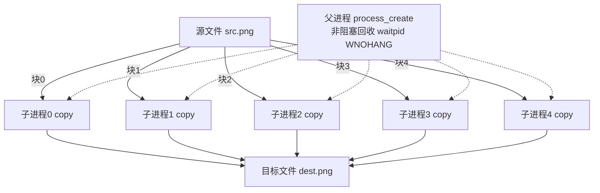

# 1.3 并发应用开发（多进程拷贝）

> 来源：`0420.并发应用开发(多进程拷贝).md` + `'attachments/0420.jpg`（原图已嵌入下方，正文为图片识别 + 代码补充）

## 0. 原图

![[../'attachments/0420.jpg]]

## 1. 为什么用多进程

相比传统的单进程，多进程程序拥有更强的处理能力以及处理速度，可以大大提高任务完成效率，这离不开多进程的**并发**与**并行**。

- **并行特性**：如果任务是多进程模型，且电脑是多核处理器，多个进程可被同时分配到多个处理器核心，提高 CPU 使用率。
- **并发特性**：当进程陷入阻塞或挂起，单进程模式下 CPU 可能直接分配给其他任务；多进程模式下根据就近原则，进程 A 放弃时间片直接分配给进程 B，从而更好地使用 CPU 资源。
- **弊端**：多进程模型开销庞大，无论是**内存开销**还是**系统调度开销**。



## 2. 多进程拷贝（process_copy）设计

命令行格式：`./process_copy src.png dest.png pronum`

- `pronum` 表示进程数量，如果用户不传递，**缺省值为 5**。



### 2.1 参数验证 PRAM_CHECK

```c
// PRAM_CHECK(char *srcfile, int pronum, int argc) 参数验证
// 1. 验证参数数量不能 < 3:  if(argc < 3) 失败
// 2. 验证源文件是否存在:    access(src, F_OK) != 0 表示文件不存在
// 3. 进程数量是否合法:      限定进程数量范围 5~100
//                           if(pronum <= 5 || pronum > 100) 失败
// 任何一项失败，程序退出 exit()
```

```c
void PRAM_CHECK(char *srcfile, int pronum, int argc) {
    if (argc < 3) {                          // 1. 参数数量不足
        fprintf(stderr, "参数数量不足\n");
        exit(EXIT_FAILURE);
    }
    if (access(srcfile, F_OK) != 0) {        // 2. 源文件不存在
        perror("access");
        exit(EXIT_FAILURE);
    }
    if (pronum <= 5 || pronum > 100) {       // 3. 进程数量越界
        fprintf(stderr, "进程数量必须在 5~100 之间\n");
        exit(EXIT_FAILURE);
    }
}
```

### 2.2 进程创建 process_create

```c
// process_create(char *src, char *dest, int blocksize, int pronum)
// 创建多进程并让每个子进程通过重载的方式完成拷贝
// 1. 根据 pronum 循环创建子进程
// 2. 子进程通过 exec 重载拷贝程序 copy
// 3. 父进程进行非阻塞回收操作
int process_create(char *src, char *dest, int blocksize, int pronum) {
    pid_t pid;
    for (int i = 0; i < pronum; i++) {
        pid = fork();
        if (pid == 0) {
            // 子进程: 计算本块偏移
            char strpos[16], strblocksize[16];
            sprintf(strpos, "%ld", (long)i * blocksize);
            sprintf(strblocksize, "%d", blocksize);
            // exec 重载拷贝程序
            execl("./copy", "copy", src, dest, strpos, strblocksize, NULL);
            perror("execl");
            exit(EXIT_FAILURE);
        } else if (pid < 0) {
            perror("fork");
            exit(EXIT_FAILURE);
        }
    }
    // 父进程: 非阻塞回收所有子进程
    pid_t zid;
    while ((zid = waitpid(-1, NULL, WNOHANG)) > 0) {
        printf("回收子进程 %d\n", zid);
    }
    return 0;
}
```

### 2.3 拷贝子程序 copy.c

```c
// copy.c —— 每个子进程独立执行的拷贝任务
#include <stdio.h>
#include <fcntl.h>
#include <unistd.h>
#include <stdlib.h>

int main(int argc, char *argv[]) {
    // argv: copy src dest pos blocksize
    int sfd = open(argv[1], O_RDONLY);                    // 打开源文件
    int dfd = open(argv[2], O_WRONLY | O_CREAT, 0664);   // 创建/打开目标文件
    off_t pos = (off_t)atol(argv[3]);                     // 本块起始偏移
    int blocksize = atoi(argv[4]);                        // 本块大小

    lseek(sfd, pos, SEEK_SET);   // 定位到本块偏移
    lseek(dfd, pos, SEEK_SET);

    char buf[4096];
    size_t total = blocksize;
    while (total > 0) {
        size_t n = total < sizeof(buf) ? total : sizeof(buf);
        ssize_t len = read(sfd, buf, n);   // 读取一段
        if (len <= 0) break;
        write(dfd, buf, len);              // 写入目标
        total -= len;
    }

    close(sfd);
    close(dfd);
    return 0;
}
```

### 2.4 Makefile 项目管理脚本

```makefile
# Makefile 项目管理脚本
CC = gcc
FLAGS = -Wall -g

all: process_copy copy

process_copy: process_copy.c
	$(CC) $(FLAGS) $< -o $@

copy: copy.c
	$(CC) $(FLAGS) $< -o $@

clean:
	rm -f process_copy copy
```

## 3. 多进程拷贝执行示意



## 4. 补充知识点（原图之外）

- **为什么用 exec 重载而不是子进程直接执行拷贝逻辑**：fork 会完整继承父进程用户层数据，若子进程直接写拷贝代码会导致父进程内存被无意义复制；exec 重载用轻量的 `copy` 程序替换子进程镜像，节省内存（对应 fork 版本 2.0/3.0 的设计动机，见 1.2）。
- **按块划分（block）**：文件按进程数等分，每块大小 = 文件总大小 / pronum，子进程通过 `lseek` 定位到自己的块，互不冲突。
- **非阻塞回收的意义**：父进程在 waitpid 循环之间可穿插管理逻辑；若用阻塞 wait，父进程会卡在第一个子进程结束前。
- **并发上限**：进程数量受文件描述符、内存、CPU 核心数限制，故 PRAM_CHECK 限定 5~100。
- 更优方案：大文件拷贝可结合 `mmap` 与 `sendfile` 减少拷贝次数（见 1.4），多进程 + 共享内存 + 信号量可进一步做增量同步。

## 相关笔记

- [[1.2.Linux进程与C_C++开发样例]]
- [[1.4.IPC进程间通信]]
- [[2.3.多进程服务器开发]]
