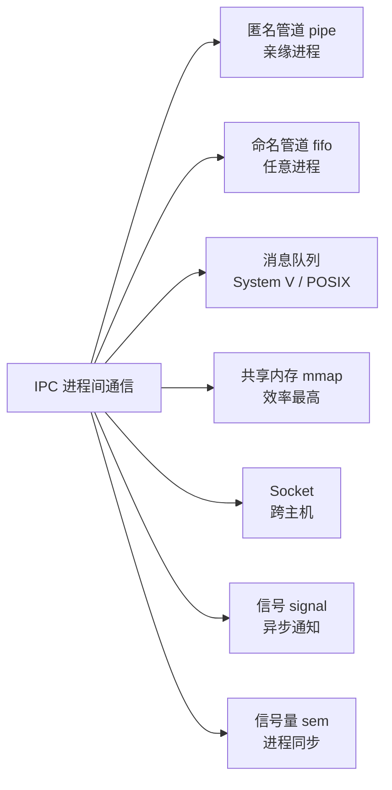
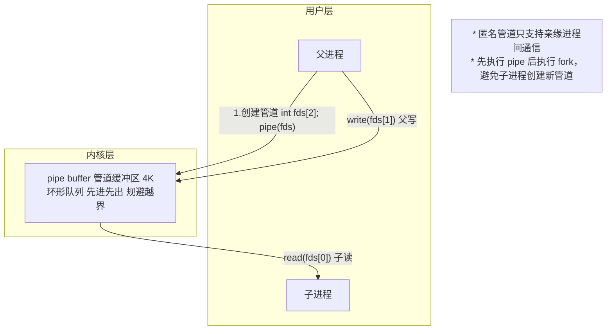
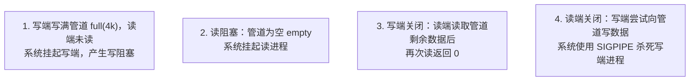
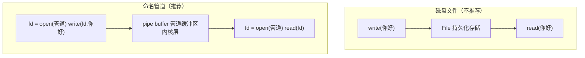
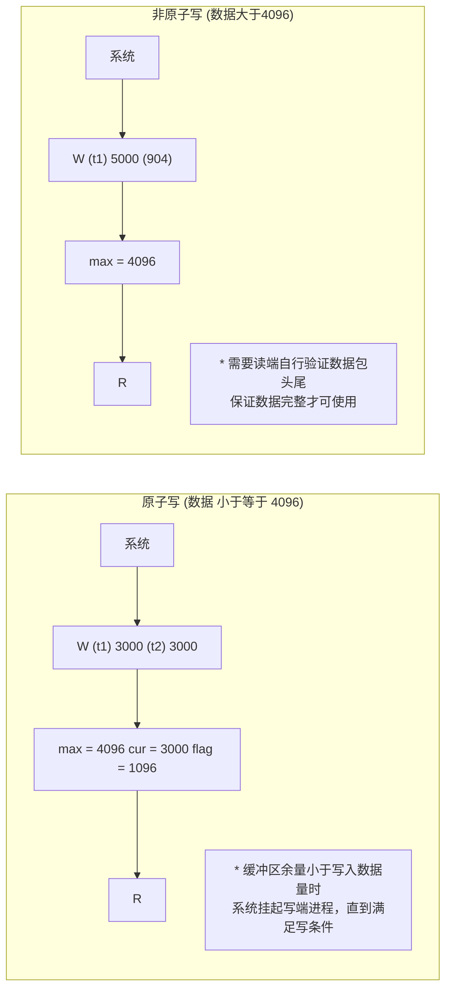
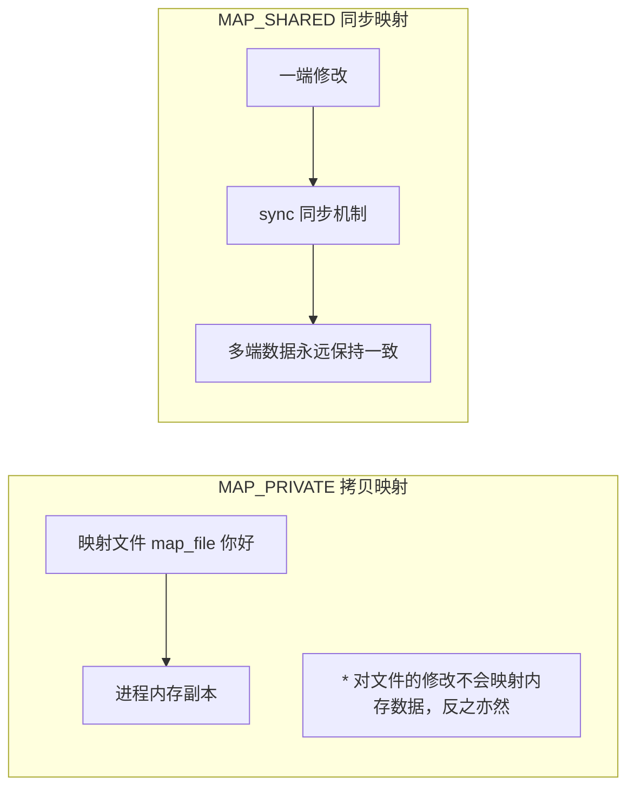

# 1.4 ICP进程间通信（IPC, Inter-Process Communication）

> 来源：`0426.ICP进程间通信.md` + `'attachments/0426.jpg`（原图已嵌入下方，正文为图片识别 + 知识补充）
>
> 说明：ICP 即 IPC（Inter-Process Communication，进程间通信）。多进程并发应用中，多个进程之间需要消息或数据传递，必须使用进程间通信技术。

## 0. 原图

![[../'attachments/0426.jpg]]

## 1. IPC 技术总览

- 多进程并发应用，可能多个进程之间需要消息或数据传递，必须了解并使用进程间通信技术。
- 常用手段：**匿名管道（pipe）、命名管道（fifo）、System V 消息队列、POSIX 消息队列、mmap（文件映射）、socket、信号（signal）**。
- 工具类手段：学会后，需要时使用即可。
- **绝大多数进程间通信技术都依赖内核层实现**。



## 2. PIPE 匿名管道

### 2.1 管道的特征

1. 传输介质（传属性）；
2. 方向性（读写）；
3. 可以暂时存储少量数据。

- 使用管道需要确定通信方向，例如**父写子读**。



- `pipe(fds)` 创建成功会将访问管道的两个描述符传出：`fds[0]` 读端、`fds[1]` 写端。
- 管道缓冲区大小默认 **4K**，采用**环形队列**（先进先出，规避越界）。
- 匿名管道**只支持亲缘进程**间通信，无关的进程无法使用；必须先 `pipe` 后 `fork`，避免子进程创建新管道。

### 2.2 关于管道的销毁

- 每个指向管道的描述符（如 `fds[]`）都会使管道的**引用计数 +1**；当管道引用计数为 0，系统自动释放管道。
- `close()`：引用计数 -1。
- `shutdown()`：可以将描述符的引用计数直接清零，保证管道使用完毕再调用。

### 2.3 通信方式

| 方式 | 说明 |
| --- | --- |
| 单工传输 | 一个时刻内非读即写，任意时刻不允许修改 |
| 半双工传输（可调节单工） | 一个时刻内非读即写，不同时刻切换读写 |
| 双工传输 | 同时读写传输 |

> 如果变更读写时出现异常，可能导致同时写或同时读。

### 2.4 匿名管道使用的四种特殊情况（普遍意义）



- 第 4 种情况对应 socket 编程：`send(sock, buf, strlen(buf), MSG_NOSIGNAL)` 可避免被 SIGPIPE 杀死。

```c
#include <unistd.h>
#include <stdio.h>
#include <string.h>
#include <sys/wait.h>

int main(void) {
    int fds[2];
    pipe(fds);                      // 先创建管道
    pid_t pid = fork();             // 后 fork

    if (pid == 0) {
        close(fds[1]);              // 子进程关闭写端
        char buf[64] = {0};
        ssize_t n = read(fds[0], buf, sizeof(buf));  // 子进程读
        printf("子进程收到: %s\n", buf);
        close(fds[0]);
    } else {
        close(fds[0]);              // 父进程关闭读端
        write(fds[1], "hello pipe", 11);             // 父进程写
        close(fds[1]);
        wait(NULL);
    }
    return 0;
}
```

## 3. FIFO 命名管道

- 使用命名管道**必须先创建管道文件**，管道文件需要命名。
- 命令：`mkfifo name`；函数：`mkfifo(char *name, 0664)`。
- 管道文件是**设备文件**，类型是 **p**。

### 3.1 为什么不能用磁盘文件做消息缓存

- 磁盘文件**不适合作为消息缓存**：磁盘读写效率低下，不适合作为传输介质。



- 管道文件本身**没有读写能力，不能存储数据**；简单理解管道文件**指向内核层的管道缓冲区**，所有对管道文件的读写都会重定向到管道缓冲区内。
- 命名管道的缓冲区**随管道文件持续**；管道文件删除，缓冲区被系统释放。
- 删除文件：`rm file -rf`；函数：`unlink(char *filename)` 将文件的硬连接计数 -1。

### 3.2 命名管道使用时的特殊情况

1. 匿名管道的四种情况同样适用命名管道。
2. 想要成功打开访问命名管道文件，必须**满足读写两种权限**；如果只有一种，那么 `open` 阻塞等待另外一种。只要满足读写打开即可，即使是单进程依然可以成功。
3. 如果一个进程中有多个读序列，**阻塞只对第一个读序列生效**，其他读序列系统设置为**非阻塞**。
4. 管道模式切换：
   - **原子模式**访问：慢，保证数据传输完整性；
   - **非原子模式**访问：速度快，但是完整性要用户自行校验。
   - 写入数据**大于**管道大小为**非原子写**；**小于等于**管道大小**原子写**。



- 非原子写最大化提高传输效率，相比原子写**阻塞频率更低**，最大化利用缓冲区大小。

```c
// 命名管道示例：写端
int fd = open("myfifo", O_WRONLY);   // 需同时具备读写权限打开
write(fd, "hello fifo", 11);
close(fd);

// 命名管道示例：读端
int fd = open("myfifo", O_RDONLY);
char buf[64] = {0};
read(fd, buf, sizeof(buf));
close(fd);
```

## 4. MMAP 文件映射

- mmap 技术可以**快速地将磁盘数据加载到进程内存**。
- mmap 可以通过**共享映射**的方式完成进程间通信，但很少有人这样使用。

### 4.1 函数原型与参数

```c
#include <sys/mman.h>
void *ptr = mmap(NULL, filesize,
                 PROT_READ | PROT_WRITE | PROT_EXEC | PROT_NONE,
                 MAP_SHARED | MAP_PRIVATE, fd, offset);
munmap(void *ptr, int size);   // 释放映射内存
```

| 参数 | 说明 |
| --- | --- |
| pram1 | 传 NULL 表示系统在进程中找到无人占用的内存当作映射内存 |
| pram2 | 映射大小，一般是映射文件大小，不能为 0 |
| pram3 | 映射内存权限指定 |
| pram4 | 映射方式：私有映射 MAP_PRIVATE / 共享映射 MAP_SHARED |
| pram5 | 映射文件的描述符 |
| pram6 | 映射偏移量，不偏移为 0 |

- RETURN：成功返回映射内存地址，失败返回 **MAP_FAILED** 关键字。
- **映射内存大小一定要小于等于文件实际大小**，否则访问越界（总线错误）。
- **映射权限必须小于等于 open 权限**，否则映射失败。
- **offset 必须是 4K 或 4K 的倍数**，可用于分段映射。

### 4.2 私有映射与共享映射



- **私有映射（拷贝映射）**：将文件内容拷贝一份到内存中，拷贝的副本，对文件的修改不会映射内存数据，反之亦然。
- **共享映射（同步映射）**：任何一端的数据修改都会通过 sync 同步机制同步给另一端，多端数据永远保持一致。

### 4.3 read / mmap / sendfile 对比（零拷贝策略）


- **read 方式**：read() 触发系统调用事件、上下文切换，数据经用户缓冲区中转，存在**多次 CPU 拷贝**（4 次拷贝、4 次上下文切换）。
- **mmap 方式**：**减少一次 CPU 拷贝开销**（映射后直接从内核缓冲区拷入 socket 缓冲区），但仍需用户态参与。
- **sendfile 零拷贝策略**：最大减少 CPU 拷贝次数，减少系统调用开销（2 次拷贝、2 次上下文切换）。
- mmap 比较适合处理文件数据，无论是映射还是大文件处理。

```c
// mmap 分段映射示例
int pos = 0;
int size = 4096;
while ((ptr = mmap(NULL, size, PROT_READ | MAP_PRIVATE, fd, pos * size)) != MAP_FAILED) {
    // 处理映射段数据
    pos++;
}
// offset 必须是 4K 或 4K 的倍数
```

## 5. 补充知识点（原图之外）

### 5.1 消息队列（Message Queue）

- 内核维护的消息链表，进程通过 `msgget/msgsnd/msgrcv` 收发，**不依赖亲缘关系**。
- 优点：有界缓冲、天然的消息边界（按类型读取）；缺点：需要内核参与拷贝。

### 5.2 System V 共享内存（shm）

- `shmget/shmat/shmdt`，直接映射同一物理页，**无拷贝、效率最高**，需配合**信号量**做同步。

### 5.3 信号量（Semaphore）

- 用于**进程/线程同步**与互斥，PV 操作（`sem_wait/sem_post`），可与共享内存配合实现高性能 IPC。

### 5.4 IPC 方式对比

| 方式 | 亲缘要求 | 数据量 | 是否需要同步 | 适用场景 |
| --- | --- | --- | --- | --- |
| 匿名管道 | 必须亲缘 | 小（4K 缓冲） | 半双工 | 父子进程简单数据流 |
| 命名管道 | 无 | 中 | 原子/非原子模式 | 任意进程间流式数据 |
| 消息队列 | 无 | 中 | 不需要 | 结构化消息、按类型分发 |
| mmap 共享映射 | 无（同机） | 大 | 需要（信号量） | 大文件、高频共享数据 |
| Socket | 无（可跨机） | 大 | TCP 自带流控 | 网络通信、跨主机 |
| 信号 | 无 | 极低 | 异步 | 事件通知、异常处理 |

> [!tip]
> - 进程间通信**绝大多数依赖内核层实现**，通信数据需经过内核缓冲区，因此存在拷贝与上下文切换开销。
> - 选择原则：简单数据流用管道；结构化消息用消息队列；大文件/高性能用 mmap+信号量；跨主机用 socket；通知用信号。

## 相关笔记

- [[1.2.Linux进程与C_C++开发样例]]
- [[1.8.信号Signal]]
- [[2.1.SOCKET套接字编程]]
- [[1.3.并发应用(多进程拷贝)]]
