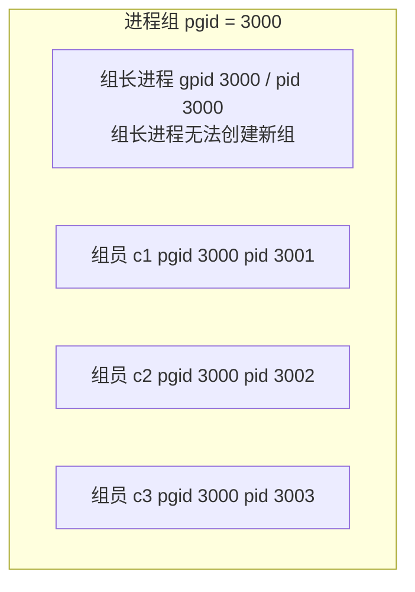
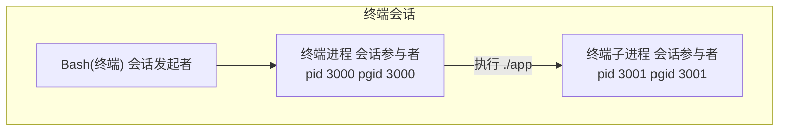
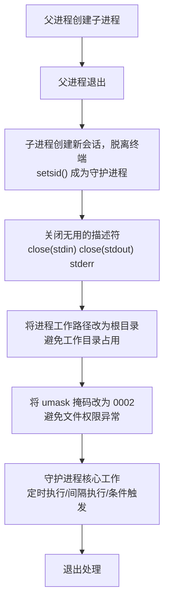
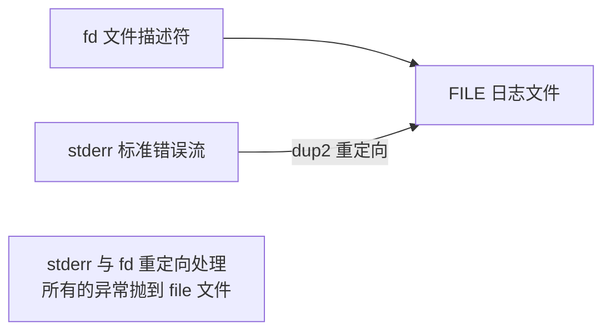
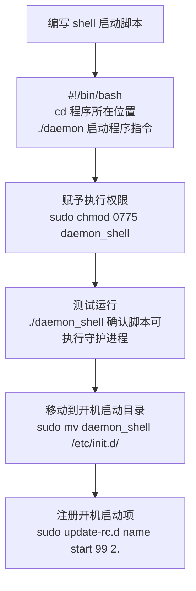

# 1.5 守护进程 Daemon

> 来源：`0510.守护进程Deamon.md` + `'attachments/0510.jpg`（原图已嵌入下方，正文为图片识别 + 知识补充）

## 0. 原图

![[../'attachments/0510.jpg]]

## 1. 守护进程基础概念

- 守护进程，又名**精灵进程**，无论是 Windows 还是 Linux 都是**后台服务程序**：不参与前台任务，不占用前台资源，在后台执行，低开销工作模式，完成特定任务。

### 1.1 守护进程与普通进程的差异

| 对比项 | 普通进程 | 守护进程 |
| --- | --- | --- |
| 生命周期 | 随用户使用持续 | **随系统持续**，开机自动启动、关机结束 |
| 工作模式 | 占据各类系统资源，大多数时间处于运行态 | 低开销，处于**睡眠态** |
| 执行方式 | 持续运行 | 间隔执行（sleep）、定时执行、条件触发模式，不会全速运行 |
| 定位 | 业务主体 | 某种**辅助程序**，帮助系统或软件完成特定任务 |

- 守护进程是一种**孤儿进程**（人为创建的孤儿进程一般都是后台的守护进程）。

## 2. 进程组概念

- 一个进程组由一个**组长进程**和若干个**组员进程**构成。



- 如果进程的 **pgid == pid**，此进程为**组长进程**；组员随时可以创建新组。
- 进程组的生命周期：直到组中**最后一个进程终止或转移**，组为空，系统回收释放组 id。
- 进程组关系与亲缘关系**没有必然联系**。

```c
getpgrp();                        // 返回进程组 id
setpgid(getpid(), getpid());      // 创建新组，或转移组
setpgid(getpid(), 8000);          // 将当前进程转移到 8000 组
// * 转移的目标必须存在，且对目标组有足够的权限
```

## 3. 会话（Session）与脱离控制终端

- 终端子进程都会被创建组，此进程为组长。
- 在终端中执行 `./app`，app 进程是终端的子进程。
- **会话关系**：由一个**会话发起者**和若干个**会话参与者**构成，当发起者退出会**以组为单位杀死参与者**。
- 也就是说在终端中执行的软件，**终端关闭会杀死该软件**，必须学会**脱离控制终端**。



- 脱离控制终端的两种方式：**1. 创建新组；2. 创建新会话**。
- 终端的子进程**无法脱离会话**，无法脱离控制终端。
- `setsid()`：**创建新组 + 创建会话**（一次性完成脱离）。
- 相关命令：`ps ajx` 查看系统中亲缘关系；`getsid(getpid())` 返回当前进程的会话 id。

```c
setsid(); // 创建组的同时创建新会话（要求调用进程不是进程组长）
```

## 4. 守护进程创建步骤



- 标准错误流会将错误信息打印到显示器，可通过 **dup2 重定向**，将 stderr 关联到日志文件。



## 5. 完整守护进程 C 开发样例

```c
#include <stdio.h>
#include <stdlib.h>
#include <unistd.h>
#include <fcntl.h>
#include <sys/stat.h>
#include <sys/types.h>
#include <string.h>
#include <time.h>

void daemonize(void) {
    pid_t pid = fork();       // 1. 父进程创建子进程
    if (pid < 0) {
        perror("fork");
        exit(EXIT_FAILURE);
    }
    if (pid > 0) {
        exit(EXIT_SUCCESS);   // 2. 父进程退出
    }
    setsid();                 // 3. 子进程创建新会话，脱离终端

    // 4. 关闭无用的描述符
    close(STDIN_FILENO);
    close(STDOUT_FILENO);
    close(STDERR_FILENO);

    // 5. 将进程工作路径改为根目录，避免工作目录占用
    chdir("/");

    // 6. 将 umask 掩码改为 0002，避免文件权限异常
    umask(0002);

    // 7. 重定向标准错误到日志文件
    int fd = open("/var/log/daemon_err.log", O_WRONLY | O_CREAT | O_APPEND, 0664);
    if (fd >= 0) {
        dup2(fd, STDERR_FILENO);
        close(fd);
    }
}

int main(void) {
    daemonize();

    // 守护进程核心工作：每间隔 3s 向 time.log 写入系统时间
    FILE *fp = fopen("/var/log/time.log", "a");
    if (fp == NULL) {
        perror("fopen");
        return -1;
    }

    while (1) {
        time_t now = time(NULL);
        char buf[64] = {0};
        strftime(buf, sizeof(buf), "%Y-%m-%d %H:%M:%S\n", localtime(&now));
        fputs(buf, fp);
        fflush(fp);
        sleep(3);            // 间隔执行
    }

    fclose(fp);              // 退出处理
    return 0;
}
```

编译运行：`gcc daemon.c -o daemon && ./daemon`

## 6. 银行服务器部署场景（原图补充）

- 开发机编写 `bank_server_app` → 通过 USB 挂载（`mount`）→ 银行服务器。
- 银行服务器将程序**默认工作路径改为根目录**；程序权限 `mode 0666`、`umask 0002` → **最终权限 0664**。
- 进程运行在对应工作路径下，创建 `time.log` 文件，守护进程每 3 秒写入系统时间。

## 7. Linux 开机启动配置



- **开机启动队列**：自定义脚本一般启动编号设置为 **>= 99**；脚本放置 `/etc/init.d` 目录。
- `sudo update-rc.d name start 99 2.`：将脚本添加到开机启动序列（`2` 为运行级别）。
- `sudo update-rc.d name remove`：移除开机启动项。
- 启动脚本内的启动块信息：脚本名修改（`/etc/init.d/acpid`）、跳转位置到程序（`cd 程序所在位置`，`pwd` 查看）、启动程序指令（`./daemon`）。

```bash
#!/bin/bash
# /etc/init.d/daemon_shell
cd /opt/bank_server_app        # 跳转到程序所在位置
./daemon                        # 启动守护进程
```

## 8. 补充知识点（原图之外）

- **setsid 前提**：调用进程不能是进程组组长，否则 setsid 失败。因此守护进程必须先 fork，让子进程成为非组长进程后再 setsid。
- **单实例守护进程**：可通过 `flock` 或 PID 文件（`/var/run/xxx.pid`）防止重复启动。
- **日志滚动**：生产环境守护进程通常配合 `logrotate` 或自实现日志大小轮转，避免日志无限增长。
- **信号处理**：守护进程应捕获 `SIGTERM` 优雅退出（见 1.8 信号），释放资源后再结束。
- 查看守护进程：`ps ajx | grep daemon` 观察 PPID=1（被 init 收养）、无控制终端 TTY=?。

## 相关笔记

- [[1.2.Linux进程与C_C++开发样例]]
- [[1.8.信号Signal]]
- [[2.3.多进程服务器开发]]
