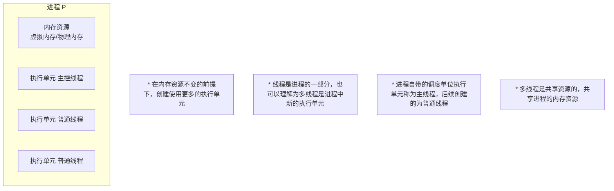
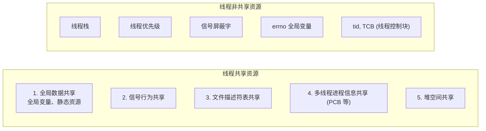
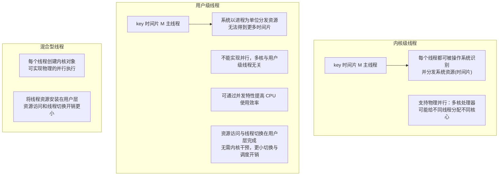
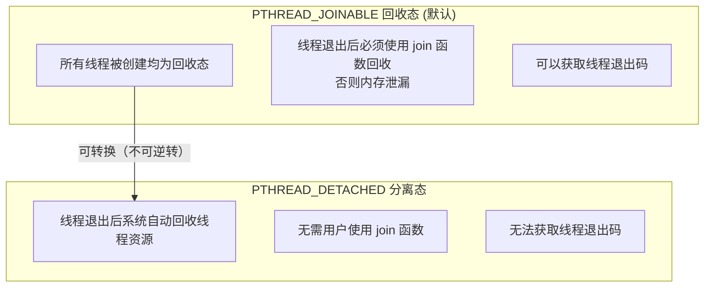
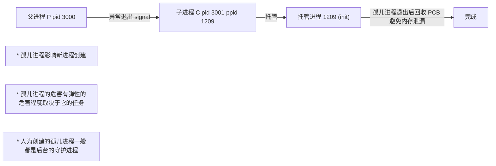
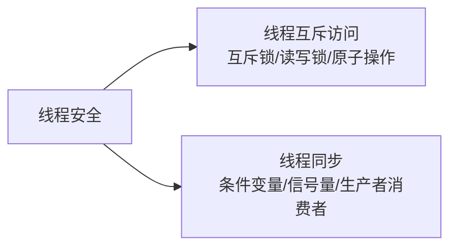

# 1.6 pthread线程基础

> 来源：`0511.pthread线程基础.md` + `'attachments/0511.jpg`（原图已嵌入下方，正文为图片识别 + 知识补充）

## 0. 原图

![[../'attachments/0511.jpg]]

## 1. 线程基础

- 线程与进程一样是大多数操作系统支持的**执行单元、调度单位**，但线程相比于进程**内存开销更小**，多线程模型是比多进程**更轻量**的模型。



- **线程是进程的一部分**：多线程是进程中新的执行单元。
- 进程自带的调度单位称为**主线程**，后续创建的是**普通线程**。
- 多线程**共享进程的内存资源**。

### 1.1 线程共享资源与非共享资源



- 线程拥有独立的错误处理方式，**并不需要使用 errno 或 perror**。
- 命令：`ps -elf` 查看系统中所有线程；`ps -Lf pid` 查看指定进程中的所有线程。

## 2. 内核级线程与用户级线程



- **内核级线程**：每个线程都可以被操作系统识别，并分发系统资源（时间片），支持**物理并行**。
- **用户级线程**：在某些不支持线程的系统中可安装第三方线程库（多为用户级线程）；系统以进程为单位分发资源，用户级线程虽然不会被系统主动分发时间片，但可以使用时间片，**不能实现并行**。
- **混合型线程**：每个线程创建内核对象，可以实现物理的并行执行；同时将线程资源安装在用户层，资源访问和线程切换开销更小。

## 3. NPTL 线程库（Native POSIX Thread Library）

- NPTL 是 Linux 的**内核级线程库**。
- 头文件：`#include <pthread.h>`。

```c
pthread_t tid;   // pthread_t 为 unsigned long int
// 一般不使用十进制输出线程 tid
printf("thread 0x%x\n", (unsigned int)tid);   // 十六进制显示线程 tid
```

### 3.1 线程创建 pthread_create

```c
#include <pthread.h>

void *thread_wk(void *arg) {     // 线程函数
    printf("xxxx\n");
    return NULL;
}

int main(void) {
    pthread_t tid;
    int code = 1000;
    // 创建一个普通线程
    int err = pthread_create(&tid, NULL, thread_wk, (void *)&code);
    if (err > 0) {
        // 返回值为错误号，不是 -1
        printf("pthread_create error: %s\n", strerror(err));
        return -1;
    }
    // ...
}
```

- 返回值：成功返回 0，失败返回**错误号**（可用 `strerror(err)` 转字符串）。
- `pthread_t tid = pthread_self(void);` 返回当前线程 tid。
- 线程内部通过 self 函数获取 tid，与主线程创建传出的 tid 值相等但是**不等价**（有效性不同）。
- 编译时必须连接库：`gcc xxx.c -lpthread -o app`。

### 3.2 线程回收与取消

- **线程需要回收**：线程退出后不回收会导致**内存泄漏，TCB 残留**。

```c
pthread_join(tid, void **retval);   // 线程回收函数
// * 阻塞回收函数，等待线程退出后回收，调用一次回收一个线程，必须指定要回收的线程

pthread_cancel(pthread_t tid);      // 线程取消，根据线程 tid 杀死某个线程
```

## 4. 线程两种退出状态



- 线程只能保持一种退出状态：**回收或分离**。
- 可以将回收线程改为分离态，此操作**不可逆转**。
- **不允许对分离线程调用 join 函数**，join 会失败，失败原因：无效的参数。
- 如果 join 函数已经在阻塞回收某个线程，**不能对那个线程设置分离**（已处于回收阶段，分离设置会失败）。
- `pthread_detach(pthread_t tid);` 线程分离态设置函数。

### 4.1 线程的几种退出方式

| 退出方式 | 影响范围 |
| --- | --- |
| `return xxx` | 主线程执行 return → **进程退出**；普通线程执行 return → 当前线程退出 |
| `exit()` | 所有线程执行 exit → **进程退出释放** |
| `cancel()` | 普通线程可以杀死主线程，主线程可以杀死普通线程 |
| `pthread_exit()` | 执行后结束当前线程，**不影响进程** |

- 所有普通线程都是**内核线程**，依然可以完成线程创建、回收、分离设置等操作。
- 后续 join 线程回收时得到 -1，表示此线程被 cancel 杀死，需要使用 `pthread_testcancel` 函数触发系统调用检测处理 cancel 事件。

## 5. 线程属性 pthread_attr

- 大多数情况下使用**默认属性**可以满足绝大多数需求。
- **随意修改线程属性**（例如线程栈大小）可能频繁导致溢出问题。

```c
pthread_attr_t attr;                      // 1. 自定义线程属性结构体
pthread_attr_init(&attr);                 // 2. 初始化线程属性结构体(默认线程属性)
// 3. 根据需求修改属性中的成员
pthread_attr_destroy(&attr);              // 5. 使用完毕释放属性结构体
```

### 5.1 线程属性 API

```c
pthread_attr_getdetachstate(&attr, int *detachstate);   // 从 attr 获取退出状态到 detachstate
pthread_attr_setdetachstate(&attr, int detachstate);
// PTHREAD_CREATE_DETACHED 分离态 | PTHREAD_CREATE_JOINABLE 回收态

pthread_attr_getstack(&attr, void **stackaddr, size_t *stacksize);   // 获取栈地址与大小
pthread_attr_setstack(&attr, void *stackaddr, size_t stacksize);     // 设置栈地址与大小
// * 修改线程栈需要用户自行申请栈地址，设置到属性中，用属性创建线程
// * 线程栈修改，对 x64 系统无效
```

- 线程属性成员：**优先指针（不改）、警戒缓冲区（4096）、退出状态（创建线程前决定分离）、线程栈地址与大小（提高线程创建数量）**。
- Ubuntu 线程数量计算：`linux ubuntu stack size = 8MB`，32 位 ubuntu 用户空间 0~3G，`3G 用户空间余量 / 8MB 栈大小 ≈ 381 个线程`。

```c
// 使用属性创建分离线程示例
pthread_attr_t attr;
pthread_attr_init(&attr);
pthread_attr_setdetachstate(&attr, PTHREAD_CREATE_DETACHED);

pthread_t tid;
pthread_create(&tid, &attr, thread_wk, NULL);   // 创建即分离，无需 join
pthread_attr_destroy(&attr);
```

## 6. 孤儿进程（线程笔记补充内容）

- **孤儿进程介绍**：多进程模型中，父进程异常关闭，所有的子进程转变为**孤儿进程**，引发异常。



- **匿名管道可以作为孤儿进程检测和处理模式**（子进程持有管道写端，父进程异常退出后读端关闭，子进程 read 返回 0 即可感知）。

## 7. 线程安全引子

- 线程安全包含**线程互斥访问**与**线程同步**两个领域（详见 1.7）。



## 相关笔记

- [[1.7.线程安全与线程互斥访问]]
- [[2.4.多线程服务器开发]]
- [[1.2.Linux进程与C_C++开发样例]]
