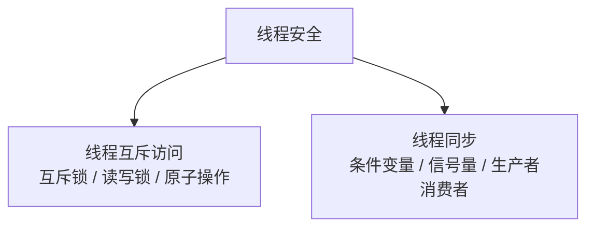
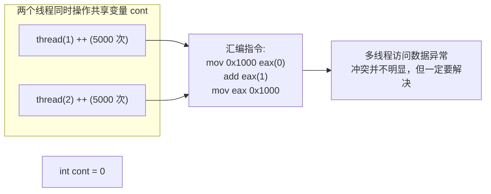
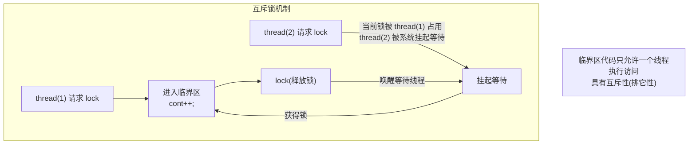
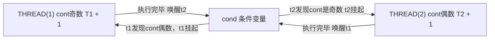
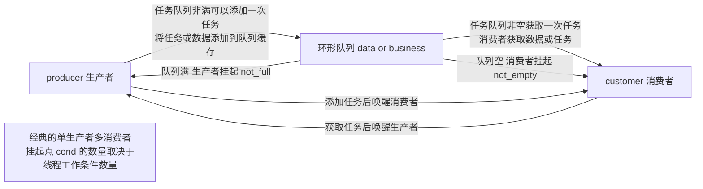
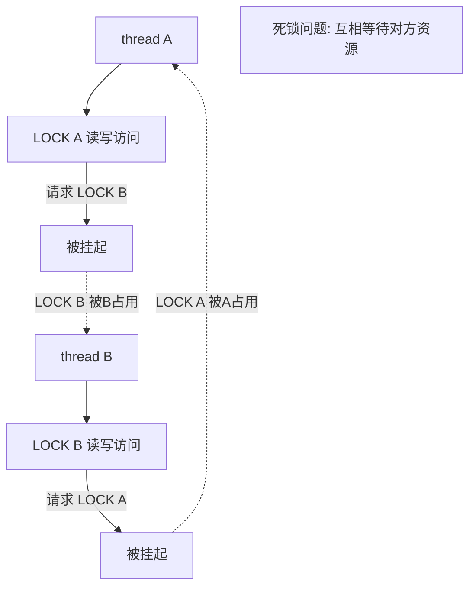
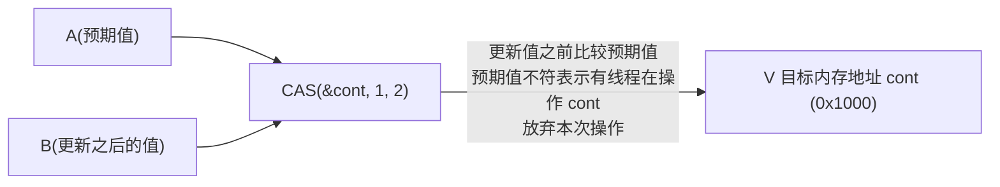
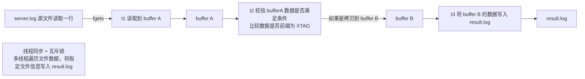

# 1.7 线程安全与线程互斥访问

> 来源：`0518.线程安全4线程互斥访问_线程同步.md` + `'attachments/0518.jpg` + `'attachments/0517.jpg` + `生产者消费者.md`（原图已嵌入下方，正文为图片识别 + 知识补充）

## 0. 原图

![[../'attachments/0518.jpg]]

![[../'attachments/0517.jpg]]

![[../'attachments/CustomerAndProducerWorkModel.png]]

## 1. 线程安全背景

- 在多线程工作过程中经常遇到**多线程访问共享资源冲突**的情况，甚至线程需要按照用户的安排执行，完成线程调度与控制，需要学习线程安全这个领域。
- 线程可以共享进程资源，很多资源可以直接访问修改，但如果**多线程同时执行访问修改**，会引发**数据异常**。
- 线程安全包含两个领域：**线程互斥访问** 与 **线程同步**。



## 2. 互斥技术（多线程访问资源互斥）lock

### 2.1 数据异常的产生



- `cont++` 在汇编层面是三步操作（mov/add/mov），**不具备原子性**，多线程交错执行时数据异常。

### 2.2 互斥锁 pthread_mutex_t



- `pthread_mutex_t lock;` 互斥锁类型。
- **互斥锁明显的缺陷**：资源的利用率不高，只要一个线程占用，其他所有线程都不能读写访问。
- 锁有三种请求模式：**阻塞请求、非阻塞请求、定时阻塞请求**。

```c
pthread_mutex_t lock = PTHREAD_MUTEX_INITIALIZER;  // 静态初始化
pthread_mutex_init(&lock, NULL);                   // 初始化互斥锁
pthread_mutex_destroy(&lock);                      // 释放锁资源
pthread_mutex_lock(&lock);                         // 上锁 (阻塞请求)
pthread_mutex_unlock(&lock);                       // 解锁
```

- 建议在读写访问**全局资源**时加锁，但是要考虑锁开销；如果多线程交替执行，代码例子中**不能对 fork 加锁**。

### 2.3 惊群效应与优化

- 当占用线程解除占用，等待的线程被系统唤醒，尝试使用资源。
- **早期互斥锁**将所有等待的线程都唤醒，先获取资源的线程可以直接使用锁。
- **惊群效应**：因为资源有限，大量的线程被唤醒后无法获取资源而被重新挂起，这种频繁挂起唤醒的开销要系统承担。
- **优化方向**：采用**标记唤醒**，线程被分发唤醒标记，锁被释放时只有获得标记的线程可以唤醒。
- 唤醒标记在 t1 占用锁时发放；但如果 t1 解锁后立即请求锁，大概率还是 t1 继续使用锁——**锁的分配更看重使用效率，而不是均匀**。

## 3. 读写锁

- **允许多个线程同时读访问资源**，提高资源读效率；与互斥锁一样**同一时刻只允许一个线程写数据**。
- 特性：**读共享、写独占、读写互斥**。

```c
pthread_rwlock_t lock;                    // 读写锁类型
pthread_rwlock_init(&lock, NULL);         // 初始化读写锁
pthread_rwlock_destroy(&lock);            // 释放锁
pthread_rwlock_rdlock(&lock);             // 请求读锁（读锁如果被耗尽，新线程要阻塞等待读锁）
pthread_rwlock_wrlock(&lock);             // 请求写锁（只能被一个线程占用，其他线程请求等待）
pthread_rwlock_unlock(&lock);             // 解锁
```

## 4. 进程互斥锁（跨进程互斥）

- 多进程间访问共享资源，需要**修改互斥锁属性**，将线程锁变为进程锁供进程间使用。

```c
pthread_mutexattr_t attr;                                  // 1. 定义互斥锁属性
pthread_mutexattr_init(&attr);                             // 2. 初始化锁属性
pthread_mutexattr_setpshared(&attr, PTHREAD_PROCESS_SHARED);// 3. 修改锁属性，改为进程锁
pthread_mutex_init(&lock, &attr);                          // 4. 使用自定义锁属性创建进程锁
```

## 5. 线程同步（条件变量、信号量等）

- 多线程的协同配合要步调一致，经典的条件变量机制。
- 两种工作模式：
  - **多线程独立任务**（如多线程拷贝）：每个线程分配一定任务量，线程只需负责完成任务，无需线程间配合；
  - **多线程同步**：需要线程执行任务后的结果，线程间有比较强的依赖关系。例如线程 A 执行产生结果 A，B 期待 A 的结果再执行，产生结果 B。
- **条件变量技术必须结合锁使用（互斥锁）**。

```c
pthread_cond_t cond;                        // 条件变量类型
pthread_cond_init(&cond, NULL);             // 初始化条件变量
pthread_cond_destroy(&cond);                // 释放条件变量
pthread_cond_wait(&cond, &lock);            // 挂起并解锁 lock
pthread_cond_signal(&cond);                 // 唤醒任意一个挂起在 cond 的线程
pthread_cond_broadcast(&cond);              // 唤醒所有挂起在 cond 的线程
```

### 5.1 cond_wait 挂起执行与唤醒执行

- 线程第一次执行 `pthread_cond_wait` 时称为**挂起执行**：在挂起线程前**解锁互斥锁**；当线程被唤醒后再次执行 cond_wait 时**上锁**。
- `pthread_cond_signal` 唤醒的线程数量取决于 **CPU 核心数量**。
- 一般线程同步的场景：某个线程执行完毕后，结果满足其他线程的执行条件，所以需要**唤醒其他线程**。



```c
void *t1(void *arg) {
    pthread_mutex_lock(&lock);
    while (cont % 2 == 0) {                 // 条件不满足
        pthread_cond_wait(&cond, &lock);    // 挂起并解锁 lock
    }
    // 线程被唤醒后上锁，表示满足执行条件
    pthread_mutex_unlock(&lock);
    pthread_cond_signal(&cond);
    return NULL;
}
```

## 6. 生产者消费者工作模式

- **生产者**：负责生成数据或任务，并将其放入共享缓冲区；
- **消费者**：从缓冲区中取出数据并进行处理；
- **缓冲区**：用于存储生产者生成的数据，通常采用**环形队列**（链表或队列实现）；
- 有效解决多线程环境中的资源共享问题，避免资源竞争和数据不一致。



### 6.1 环形队列偏移计算

```c
int front = 0;
front = (front + 1) % max;   // 环形队列偏移计算（max 为队列容量）
int rear = 0;
```

### 6.2 上锁机制与具体流程

- **生产者上锁**：准备插入数据之前先获取锁，确保其他线程（消费者）无法在此期间修改缓冲区；放入数据后释放锁并通过条件变量通知消费者。
- **消费者上锁**：准备取出数据之前先获取锁；成功取出数据后释放锁，并通过条件变量通知生产者可以继续生产。


### 6.3 生产者消费者完整代码样例

```c
#include <stdio.h>
#include <pthread.h>
#include <stdlib.h>
#include <unistd.h>

#define MAX 10

pthread_mutex_t lock = PTHREAD_MUTEX_INITIALIZER;
pthread_cond_t not_full = PTHREAD_COND_INITIALIZER;
pthread_cond_t not_empty = PTHREAD_COND_INITIALIZER;

int buffer[MAX];
int front = 0, rear = 0, count = 0;

void *producer(void *arg) {
    for (int i = 0; i < 20; i++) {
        pthread_mutex_lock(&lock);
        while (count == MAX) {               // 队列满，挂起
            pthread_cond_wait(&not_full, &lock);
        }
        buffer[rear] = rand() % 100;         // 生产者添加随机数
        rear = (rear + 1) % MAX;
        count++;
        pthread_cond_signal(&not_empty);     // 通知消费者
        pthread_mutex_unlock(&lock);
    }
    return NULL;
}

void *customer(void *arg) {
    for (int i = 0; i < 20; i++) {
        pthread_mutex_lock(&lock);
        while (count == 0) {                 // 队列空，挂起
            pthread_cond_wait(&not_empty, &lock);
        }
        printf("消费者获取并打印: %d\n", buffer[front]);
        front = (front + 1) % MAX;
        count--;
        pthread_cond_signal(&not_full);      // 通知生产者
        pthread_mutex_unlock(&lock);
    }
    return NULL;
}

int main(void) {
    pthread_t tid1, tid2;
    pthread_create(&tid1, NULL, producer, NULL);
    pthread_create(&tid2, NULL, customer, NULL);
    pthread_join(tid1, NULL);
    pthread_join(tid2, NULL);
    return 0;
}
// 编译: gcc pc.c -lpthread -o pc
```

## 7. 关于死锁（哲学家就餐问题）

- 多线程执行最怕死锁问题（BUG），死锁导致线程**永久挂起（无法执行）**。
- 多线程共享资源有限的情况下，线程使用大量的共享资源。



### 7.1 死锁产生的四个必要条件

1. **请求与保持**：在占用资源的情况下请求新资源；
2. **互斥条件**：当锁资源被占用，所有线程挂起等待锁；
3. **不可剥夺**：当线程占用资源，只有自己可以解除占用；
4. **环路等待条件**：每个线程可能在等待相邻线程的资源。

> 四个条件都满足，死锁必然发生，否则可以规避死锁。

- 可以采用**非阻塞请求锁**规避死锁，但是一直无法得到锁资源，任务无法正常继续推进。
- **有向图检测**：点为线程，边为资源请求，如果图中产生**环**，表示死锁发生。
- 死锁处理：**预防为主，处理为辅**；杀死某个线程可以破除死锁环路。

### 7.2 哲学家就餐问题解决方案

| 方案 | 说明 |
| --- | --- |
| 礼貌策略 | 尝试获取资源时发现被占用，释放自己占用的资源给别人使用；若五人同步触发，资源频繁获取释放但无人使用 → **活锁（饿死）** |
| 高优先级措施 | 给某个哲学家高级权限，进餐时相邻者释放资源，但此类哲学家必须有数量限制 |
| 服务者模式 | 记录当前资源使用情况，每次尝试获取资源都要向服务者申请，最大化利用资源且避免死锁 |
| 银行家算法 | 经典风险评估模式，计算资源使用情况及资源分配风险 |

## 8. 原子操作

- 原子操作在各个操作系统和语言中均有支持。
- 使用互斥锁需要创建临界区，而且上锁和解锁都是**系统调用**，包含大量的**上下文切换开销**。

```c
__sync_fetch_and_add(&cont, 1);   // 原子操作 +1
__sync_fetch_and_sub(&cont, 1);   // 原子操作 -1
```

### 8.1 CAS（比较与交换）



- **CAS 是硬件支持的原子操作**，无法被其他线程中断干扰。
- 比较与交换（Compare And Swap）：先比较预期值与内存当前值，一致才更新为 B，否则放弃。

### 8.2 旋转锁（自旋锁）

- 旋转锁请求时发现锁被占用，线程**不会陷入阻塞或挂起**，保持运行态**持续请求锁**，直到可以占用为止。
- 旋转有较大的开销，但**锁效率较高**（适合临界区极短的场景）。

### 8.3 文件读写锁（fcntl）

- 通过**修改文件属性**的方式，实现对文件上锁或解锁。

```c
struct flock {
    short l_type;    // 上锁方式: F_RDLCK(读锁) | F_WRLCK(写锁) | F_UNLCK(解锁)
    short l_whence;  // 上锁绝对位置: SEEK_SET | SEEK_CUR | SEEK_END
    off_t l_start;   // 相对偏移量，以 whence 为基准
    off_t l_len;     // 上锁长度，传 0 表示对整个文件上锁
};
fcntl();   // 使用此函数完成文件属性结构体的获取与设置，实现对文件上锁
```

- 用户定义新的 flock 结构体，设置后**对文件原有的结构体进行替换**即可。

## 9. 流水线多线程处理模式



- 用户决定条件变量数量以及锁数量，**不能产生死锁**。
- 文件操作：`FILE *fds = fopen(...); fgets(buf, sizeof(buf), fds);`。

## 10. 补充知识点（原图之外）

- **锁的选择原则**：临界区极短且竞争少 → 自旋锁/原子操作；读多写少 → 读写锁；临界区较长或竞争激烈 → 互斥锁（让出 CPU）。
- **条件变量虚假唤醒**：`pthread_cond_wait` 可能被虚假唤醒，因此判断条件必须使用 `while` 循环而非 `if`（示例代码已采用 while）。
- **信号量**：`sem_t` 提供计数同步，可视为互斥锁的推广，用于控制资源数量（多生产者/多消费者更自然）。
- **内存序与编译器优化**：并发编程中 volatile 不能保证原子性；C11 提供 `<stdatomic.h>` 原子类型；C++11 提供 `std::atomic`、`std::mutex`、`std::condition_variable`、`std::lock_guard`。

## 相关笔记

- [[1.6.pthread线程基础]]
- [[2.4.多线程服务器开发]]
- [[2.5.IO多路复用与三种模型对比]]
- [[2.6.Epoll线程池与负载均衡]]
