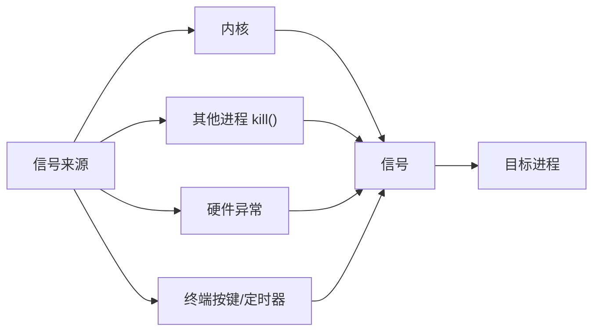
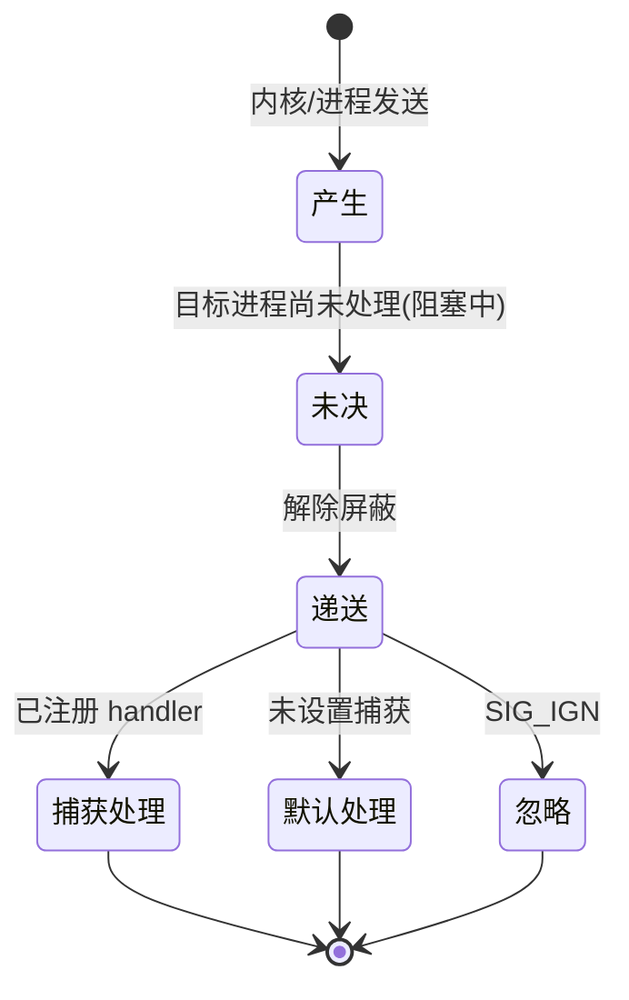
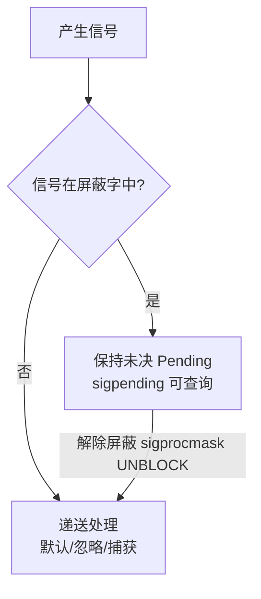

# 1.8 信号 Signal

> 来源：`0525.信号.md`（原笔记仅有标题 `#信号 Linux`，正文为整理补充）

## 1. 信号基础概念

- **信号（Signal）**是 Linux 下进程间**异步事件通知**的一种机制：内核或进程可以随时向目标进程发送信号，目标进程收到后执行对应的处理动作。
- 信号是 IPC 手段之一（见 1.4），特点是**数据量极小、异步**，适合事件通知与异常处理。
- 信号可以来自：硬件异常（段错误 SIGSEGV）、终端按键（Ctrl+C → SIGINT）、定时器（alarm → SIGALRM）、其他进程（kill）、内核（子进程退出 → SIGCHLD）。



## 2. 常见信号一览

| 信号 | 编号 | 默认动作 | 触发场景 |
| --- | --- | --- | --- |
| `SIGINT` | 2 | 终止 | 终端 Ctrl+C |
| `SIGQUIT` | 3 | 终止+转储 | 终端 Ctrl+\ |
| `SIGKILL` | 9 | 终止（不可捕获） | kill -9 |
| `SIGSEGV` | 11 | 终止+转储 | 非法内存访问 |
| `SIGPIPE` | 13 | 终止 | 向已关闭的管道/套接字写 |
| `SIGALRM` | 14 | 终止 | alarm 定时器到点 |
| `SIGTERM` | 15 | 终止 | kill 默认信号，可捕获 |
| `SIGCHLD` | 17 | 忽略 | 子进程停止/退出 |
| `SIGUSR1/2` | 10/12 | 终止 | 用户自定义 |
| `SIGSTOP` | 19 | 停止（不可捕获） | Ctrl+Z |
| `SIGCONT` | 18 | 继续 | 恢复停止的进程 |

## 3. 信号生命周期



- **产生**：事件发生，内核向进程登记信号。
- **未决（Pending）**：信号已产生但尚未被进程处理（信号被屏蔽字阻塞时停留在未决队列）。
- **递送（Delivery）**：进程被调度时检查并处理信号。
- **处理方式**：默认动作 / 忽略（SIG_IGN）/ 捕获（调用用户注册的处理函数）。

## 4. 信号处理：signal() 与 sigaction()

### 4.1 signal() 简单注册

```c
#include <signal.h>
#include <stdio.h>
#include <unistd.h>

void handler(int sig) {
    printf("捕获到信号 %d\n", sig);
}

int main(void) {
    // 捕获 Ctrl+C，不退出进程
    signal(SIGINT, handler);
    // 忽略 SIGPIPE，避免向关闭的管道写时进程被杀
    signal(SIGPIPE, SIG_IGN);

    while (1) {
        pause();   // 挂起等待信号
    }
    return 0;
}
```

### 4.2 sigaction() 高级注册（推荐）

- `sigaction` 比 `signal` 更可靠：支持信号屏蔽、标志位、可携带信息（siginfo_t）。

```c
#include <signal.h>
#include <stdio.h>
#include <string.h>

struct sigaction act, oldact;
memset(&act, 0, sizeof(act));
act.sa_handler = handler;           // 处理函数
sigemptyset(&act.sa_mask);          // 处理期间不额外屏蔽信号
act.sa_flags = 0;                   // SA_RESTART 可让被中断的系统调用自动重启

sigaction(SIGINT, &act, &oldact);   // 注册，保存旧动作
```

## 5. 信号的发送

```c
#include <signal.h>
#include <sys/types.h>
#include <unistd.h>

kill(getpid(), SIGUSR1);   // 向指定进程发送信号
raise(SIGUSR1);            // 向自己发送信号
abort();                   // 向自己发送 SIGABRT，异常终止
alarm(3);                  // 3 秒后向自己发送 SIGALRM（定时器，只能设定一个）
```

## 6. 信号集与信号屏蔽字

- **信号集**：用 `sigset_t` 描述一组信号。
- **信号屏蔽字（mask）**：进程级属性，屏蔽的信号在解除屏蔽前**不递送**（保持未决）。
- 线程的信号屏蔽字**不共享**（见 1.6），主线程设置的屏蔽只对自身有效。

```c
sigset_t set;
sigemptyset(&set);          // 清空信号集
sigfillset(&set);           // 全部置位
sigaddset(&set, SIGINT);    // 添加 SIGINT
sigdelset(&set, SIGINT);    // 删除 SIGINT
sigismember(&set, SIGINT);  // 判断是否在集合中

// 设置进程信号屏蔽字
sigprocmask(SIG_BLOCK, &set, NULL);    // 屏蔽 set 中的信号
sigprocmask(SIG_UNBLOCK, &set, NULL);  // 解除屏蔽

// 查询未决信号
sigpending(&set);  // 未决信号集写入 set
```



## 7. SIGCHLD 回收僵尸进程（多进程服务器关键用法）

- 子进程退出时内核自动向父进程发送 **SIGCHLD**。
- 父进程注册 SIGCHLD 捕获函数，在回调中**尽可能回收所有僵尸进程**（一个信号回收多个），避免阻塞 wait 干扰主流程。

```c
#include <signal.h>
#include <sys/wait.h>
#include <unistd.h>
#include <stdio.h>

void sigchld_handler(int sig) {
    pid_t zid;
    // 一个 SIGCHLD 信号可能对应多个子进程退出，用非阻塞循环尽量回收
    while ((zid = waitpid(-1, NULL, WNOHANG)) > 0) {
        printf("回收僵尸进程 %d\n", zid);
    }
}

int main(void) {
    struct sigaction act;
    act.sa_handler = sigchld_handler;
    sigemptyset(&act.sa_mask);
    act.sa_flags = SA_RESTART | SA_NOCLDSTOP;   // 只关心退出，不关心暂停
    sigaction(SIGCHLD, &act, NULL);

    // 创建子进程...
    return 0;
}
```

> [!tip] 多进程服务器注意点（见 2.3）
> - **不允许主线程/主进程处理信号**：会导致 `accept` 等阻塞函数被信号强制中断，影响连接。
> - 正确做法：主线程**屏蔽 SIGCHLD**，设置屏蔽字让**普通线程**处理信号；捕捉设定完毕后再解除屏蔽。
> - 信号行为为共享（进程级），但**屏蔽字非共享**（每线程独立）。

## 8. 可靠信号与不可靠信号

- **不可靠信号（1~31）**：可能丢失（同一信号多次产生只记录一次）；处理函数执行期间再来的信号可能被丢弃。
- **可靠信号（实时信号 34~64）**：排队递送不丢失，支持传递附加数据（sigqueue + siginfo）。
- 现代 Linux 对标准信号也做了优化（位图未决），但**不排队**仍是标准信号的特点。

## 9. 补充知识点（原图之外）

- **系统调用与 EINTR**：进程执行阻塞系统调用（如 accept、read）时收到信号，系统调用可能被**强制中断**返回 -1 且 errno=EINTR。处理方式：设置 `SA_RESTART` 让内核自动重启系统调用，或代码中手动重试。
- **SIGKILL/SIGSTOP 不可捕获**：这是内核保证管理员能力的兜底设计。
- **守护进程**通常捕获 SIGTERM 做优雅退出（释放资源、写日志后再结束），见 1.5。
- **SIGPIPE**：向已关闭的管道/套接字写数据会触发，默认终止进程；网络编程建议 `send(..., MSG_NOSIGNAL)` 或 `signal(SIGPIPE, SIG_IGN)`（见 2.1）。
- **SIGSEGV 排查**：配合 `core dump` 与 gdb 定位段错误位置。

## 相关笔记

- [[1.4.ICP进程间通信]]
- [[2.3.多进程服务器开发]]
- [[1.5.守护进程Daemon]]
- [[2.1.SOCKET套接字编程]]
