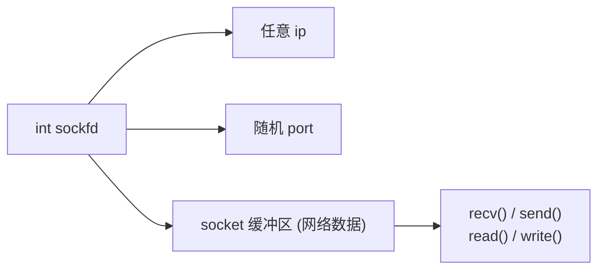
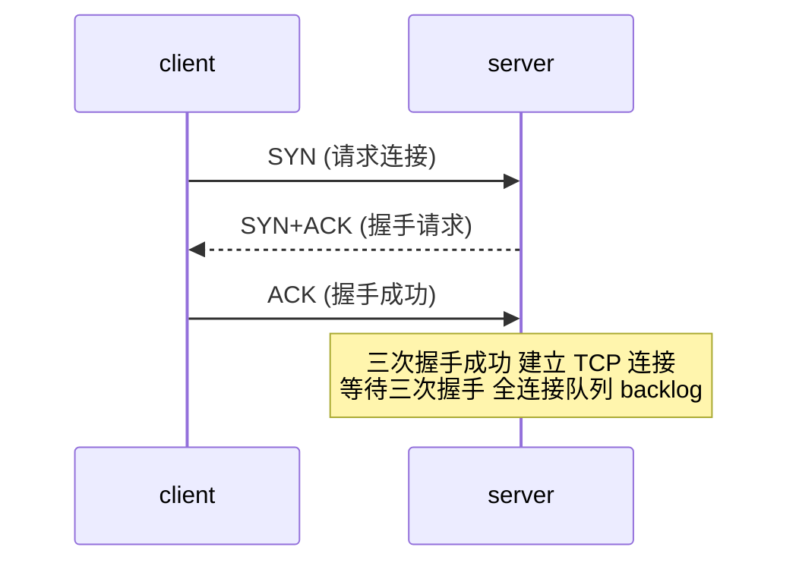

# 2.1 SOCKET套接字编程

> 来源：`0606.SOCKET.md` + `'attachments/0607.jpg`（补充原图，正文为笔记整理 + 图片识别 + 代码补充）

## 0. 补充原图

![[../'attachments/0607.jpg]]

## 1. 套接字基础概念

- 套接字（Socket）一般用于**网络应用开发**，是操作系统提供的一套 API 函数接口，称为**套接字函数**，具有很高的跨平台和兼容性，任何语言和系统都支持套接字函数。网络应用开发是软件开发工程师必备技能。
- Linux 中 **everything is file**：将所有的设备访问方式抽象为文件，可以通过文件描述符访问大多数 Linux 设备，**socket 也为文件**。
- 一个 `sockfd` 被创建后直接可以使用，里面包含**任意 IP 和随机端口**以及 **socket 缓冲区（网络数据）**。
- `recv()、send()、read()、write()` 这四个函数都可以对 sockfd 进行读写操作，但建议使用 **recv 和 send**。



## 2. 地址族与端口

- `socket_fd` 含有 **IP 地址** 与 **端口（Port）**。
- IPv4 `AF_INET`；IPv6 `AF_INET6`。
- 常见端口：80(http)、443(https)、53(dns)、20、21(ftp)；自定义端口大于 1024（如 5000、8080）。

## 3. 网络信息结构体与大小端

```c
struct sockaddr_in addr;   // 网络信息结构体类型

addr.sin_family = AF_INET;         // 地址族 AF_INET / AF_INET6
addr.sin_port = htons(8080);       // 端口 (大端序)
addr.sin_addr.s_addr = htonl(INADDR_ANY);  // IP 地址 (大端序)

// 大小端转换
htons();  // 小端转大端端口 (host to network short)
htonl();  // 小端转大端 IP   (host to network long)
ntohs();  // 大端转小端端口
ntohl();  // 大端转小端 IP

// 字符串 IP 与二进制互转
inet_pton(AF_INET, "192.168.10.1", &addr.sin_addr.s_addr);  // "192.168.10.1" -> 大端序二进制
inet_ntop(AF_INET, &addr.sin_addr.s_addr, ip, 16);          // 二进制 -> "192.168.10.1"
inet_addr("192.168.1.1");  // 字符串 IP 直接转大端序 IP
```

- 网络信息结构体可以对 sockfd 进行设置或初始化。
- 当服务端接收新连接时，可以用网络信息结构体**传出客户端的连接信息**。

## 4. 核心 API

```c
// 1. 创建套接字
int sockfd = socket(AF_INET, SOCK_STREAM, 0);
//   IP版本, 流/数据报(SOCK_STREAM TCP | SOCK_DGRAM UDP), 协议号0
//   成功返回 sockfd，失败返回 -1，errno 被设置

// 2. 绑定
int bind(int sockfd, struct sockaddr *addr, socklen_t addrlen);
//   成功返回 0，失败返回 -1
//   绑定可以对 socket 设置自定义的 ip 和端口号
//   当绑定某端口的进程退出，可以临时禁用端口号，时长为 2MSL
//   常见失败: socket 异常 / 端口被占用

// 3. 监听 (TCP)
int listen(int sockfd, int backlog);
//   成功返回 0，失败返回 -1
//   backlog: 监听序列数，默认 128
//   BACKLOG 是两个序列（半连接+全连接）的共享大小

// 4. 请求连接 (客户端)
int connect(int sockfd, struct sockaddr *dest, socklen_t addrlen);
//   请求连接到 dest，成功返回 0，失败返回 -1
//   目标信息不准确导致连接被拒绝；服务端无法连接被复位

// 5. 接受连接 (服务端)
int Csockfd = accept(int Ssockfd, struct sockaddr *addr, socklen_t *addrlen);
//   成功返回 sockfd，失败返回 -1；通过 Ssockfd 获取通信 Csockfd
//   addrlen 传入传出参数：传入可接收的结构体大小，成功后传出实际大小
//   每次连接前都要初始化 addrlen
//   阻塞函数：如果没有连接请求，accept 阻塞等待连接，每执行一次建立一个连接

// 6. 收发数据
ssize_t recv(int sockfd, void *buf, size_t size, int flag);
//   MSG_DONTWAIT 非阻塞接收；成功返回读取的数据量，失败返回 -1
ssize_t send(int sockfd, void *buf, size_t size, int flag);
//   MSG_NOSIGNAL 避免信号杀死；成功返回发送数据量，失败返回 -1
```

### 4.1 TCP 三次握手与 backlog



- 服务器的 socket 最大数怎么计算（10w 连接）：连接数量 + 1（ssock 服务器监听 socket 也要占用一个描述符）。

### 4.2 非阻塞套接字设置（fcntl）

```c
int sockfd;
int flag;
flag = fcntl(sockfd, F_GETFL);   // 获取当前标志
flag |= O_NONBLOCK;              // 加上非阻塞标志
fcntl(sockfd, F_SETFL, flag);    // 设置

accept(sockfd);                  // 非阻塞等待连接，无连接时立即返回 -1
recv(sockfd, buf, size, MSG_DONTWAIT);  // 非阻塞接收
```

## 5. 套接字的二次包裹（封装）

### 5.1 SOCKET 封装（扩展错误处理）

```c
int SOCKET(int domin, int type, int protocol) {
    int sockfd;
    if ((sockfd = socket(domin, type, protocol)) == -1) {
        perror("err");
        return -1;
    }
    return sockfd;
}

// 使用
if ((sockfd = SOCKET(AF_INET, SOCK_STREAM, 0)) == -1) {
    perror("socket create failed");
    exit(0);
}
```

### 5.2 recv 功能扩展包裹

```c
// recvlen() / recvchar() / recvdatesize() / recvsize —— 功能扩展的包裹
// 将定长/变长报文读取逻辑封装，简化业务层调用
ssize_t recvlen(int sockfd, void *buf, size_t len) {
    size_t total = 0;
    while (total < len) {
        ssize_t n = recv(sockfd, (char *)buf + total, len - total, 0);
        if (n <= 0) return -1;
        total += n;
    }
    return total;
}
```

## 6. 完整服务端/客户端开发样例

### 6.1 服务端

```c
#include <stdio.h>
#include <string.h>
#include <unistd.h>
#include <stdlib.h>
#include <arpa/inet.h>

int main(void) {
    // 1. 创建 socket
    int ssock = socket(AF_INET, SOCK_STREAM, 0);
    if (ssock == -1) { perror("socket"); exit(EXIT_FAILURE); }

    // 2. 绑定 ip 和端口
    struct sockaddr_in addr;
    addr.sin_family = AF_INET;
    addr.sin_port = htons(8080);
    addr.sin_addr.s_addr = htonl(INADDR_ANY);   // 任意网卡
    if (bind(ssock, (struct sockaddr *)&addr, sizeof(addr)) == -1) {
        perror("bind"); exit(EXIT_FAILURE);
    }

    // 3. 监听
    if (listen(ssock, 128) == -1) {
        perror("listen"); exit(EXIT_FAILURE);
    }
    printf("server listening on 8080...\n");

    while (1) {
        // 4. accept 获取通信 socket
        struct sockaddr_in caddr;
        socklen_t clen = sizeof(caddr);        // 每次连接前初始化
        int csock = accept(ssock, (struct sockaddr *)&caddr, &clen);
        if (csock == -1) { perror("accept"); continue; }

        // 5. 收发数据
        char buf[1024] = {0};
        recv(csock, buf, sizeof(buf), 0);
        printf("收到: %s\n", buf);
        send(csock, "hello client", 13, MSG_NOSIGNAL);

        close(csock);   // 6. 关闭通信 socket
    }
    close(ssock);
    return 0;
}
```

### 6.2 客户端

```c
#include <stdio.h>
#include <string.h>
#include <unistd.h>
#include <stdlib.h>
#include <arpa/inet.h>

int main(void) {
    int csock = socket(AF_INET, SOCK_STREAM, 0);
    if (csock == -1) { perror("socket"); exit(EXIT_FAILURE); }

    struct sockaddr_in dest;
    dest.sin_family = AF_INET;
    dest.sin_port = htons(8080);
    inet_pton(AF_INET, "127.0.0.1", &dest.sin_addr.s_addr);

    // 请求连接
    if (connect(csock, (struct sockaddr *)&dest, sizeof(dest)) == -1) {
        perror("connect"); exit(EXIT_FAILURE);
    }

    send(csock, "hello server", 12, MSG_NOSIGNAL);
    char buf[1024] = {0};
    recv(csock, buf, sizeof(buf), 0);
    printf("收到: %s\n", buf);

    close(csock);
    return 0;
}
```

编译运行：`gcc server.c -o server && gcc client.c -o client && ./server & ./client`

## 7. 补充知识点（原图之外）

- **TCP 状态流转**：服务端 `listen → SYN_SENT(半连接) → ESTABLISHED`；客户端 `connect → SYN_SENT → ESTABLISHED`。`backlog` 是半连接与全连接队列的共享大小。
- **2MSL**：主动关闭方端口进入 TIME_WAIT 2MSL 时长，`bind` 时端口可能被占用；可设置 `SO_REUSEADDR` 复用。
- **socket 选项**：`setsockopt` 可设置 `SO_REUSEADDR`、`SO_SNDBUF`、`SO_RCVBUF`、`SO_KEEPALIVE`、`TCP_NODELAY` 等。
- **粘包问题**：TCP 是字节流，无消息边界；需业务层定义报文长度（可用上文 recvlen 封装解决）。
- **UDP 无连接**：`sendto/recvfrom`，无需 listen/accept，不保证可靠。
- **SIGPIPE 防护**：对端关闭后继续 send 会触发 SIGPIPE 杀死进程，务必 `MSG_NOSIGNAL` 或忽略信号（见 1.8）。

## 相关笔记

- [[2.2.单机服务器开发]]
- [[1.4.ICP进程间通信]]
- [[1.8.信号Signal]]
