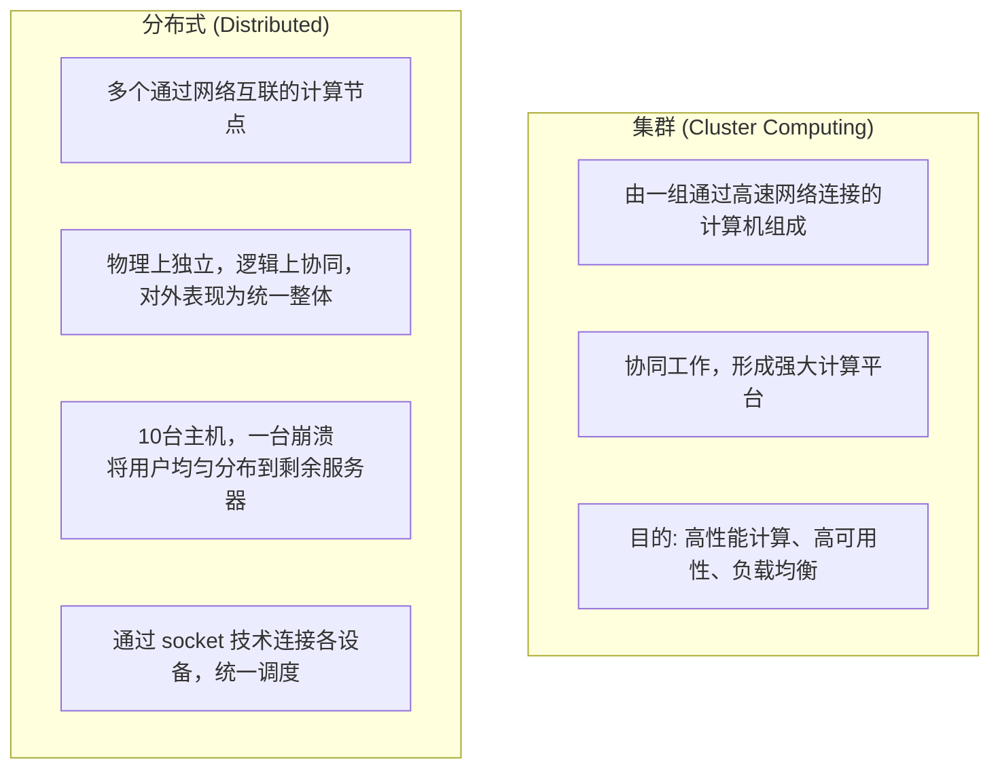
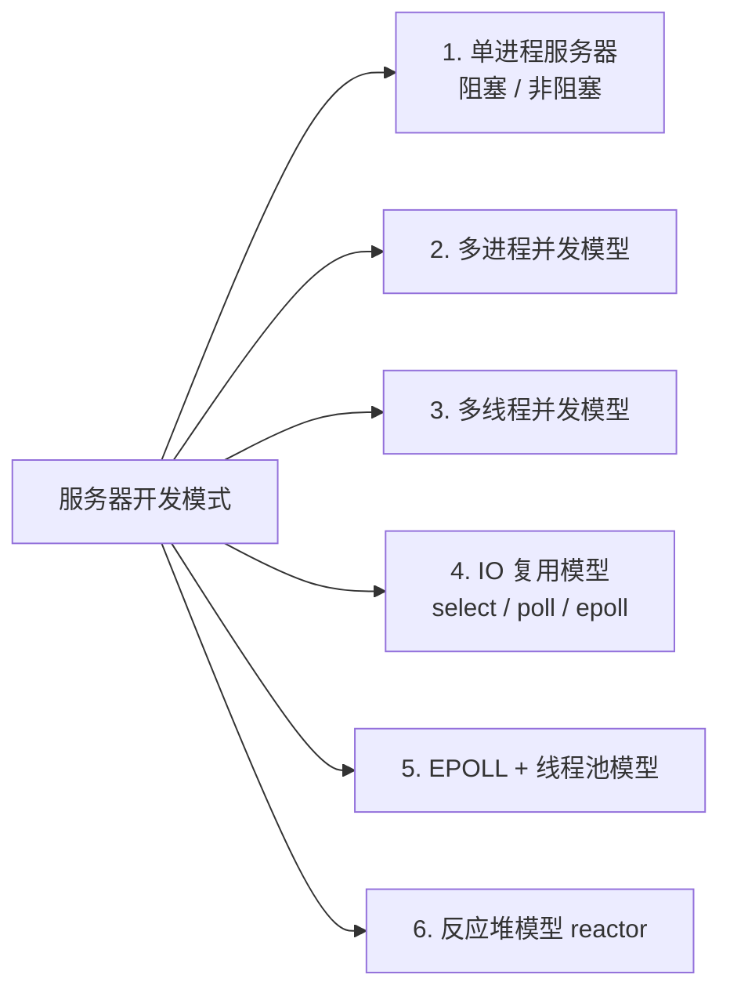
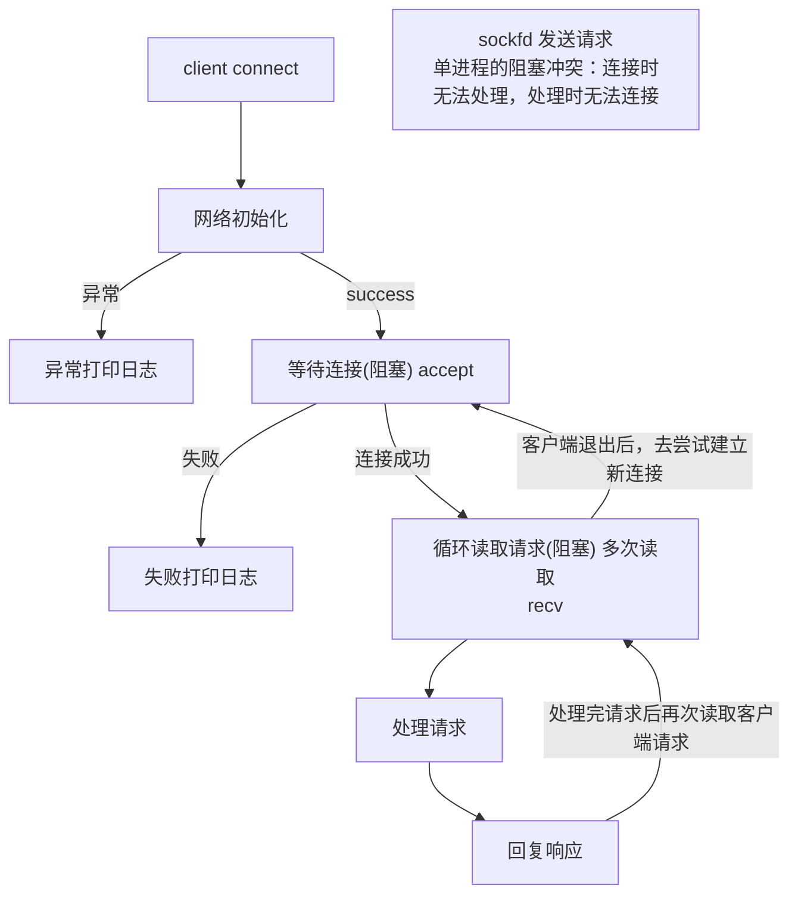
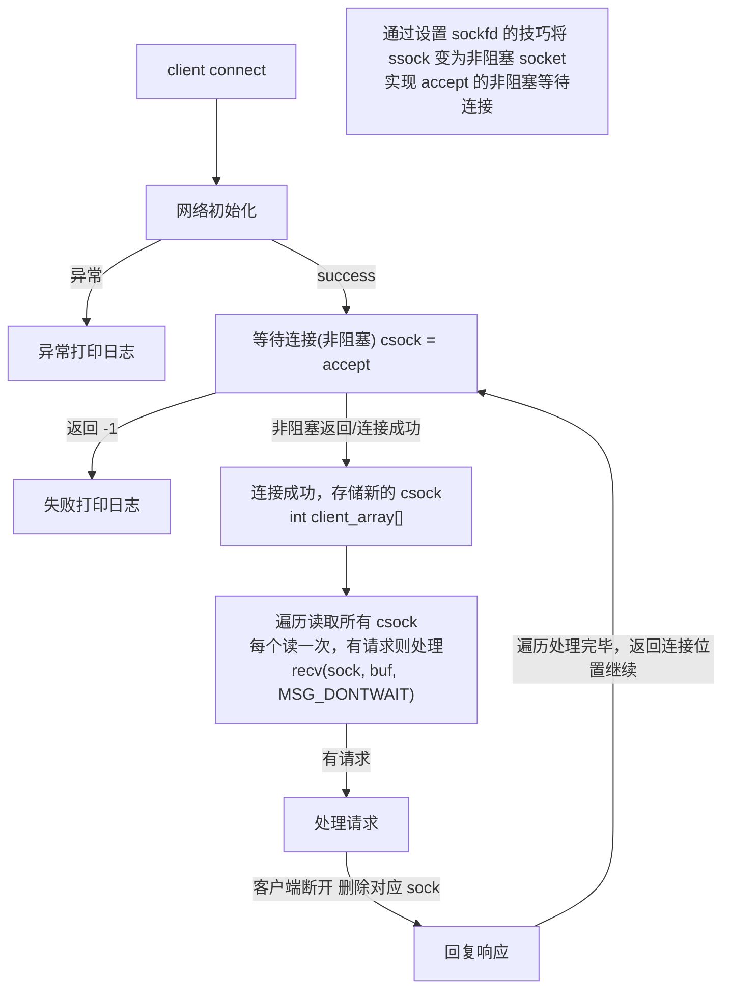

# 2.2 单机服务器开发

> 来源：`0606.服务器01.md` + `0607.服务器02.md` + `'attachments/0608.jpg` + `'attachments/单进程阻塞服务器.png` + `'attachments/单进程非阻塞服务器.png`（原图已嵌入下方，正文为笔记整理 + 图片识别 + 代码补充）

## 0. 原图

![[../'attachments/0608.jpg]]

![[../'attachments/单进程阻塞服务器.png]]

![[../'attachments/单进程非阻塞服务器.png]]

## 1. 服务器基础概念

- 服务器是经典的后台服务软件，各个互联网公司与产品都需要后台服务器进行支持，提供业务支持、数据支持等；服务后台相关领域提供大量就业岗位，服务器概念是互联网不可或缺的一部分。
- 服务器是一个**程序（进程）**，开发服务器主流语言是 **C/C++**。

### 1.1 服务器的作用

- 提供**数据中转**；
- **存储支持**（数据持久化：文件系统 / 数据库）；
- 多连接能力；
- **高并发处理能力**（并行处理）；
- IO 处理（如何更好更高效地处理 sockfd）；
- 日志系统 log；
- 安全层。

> 服务器拥有强大的**吞吐能力**：CDN 分流加速器是提升吞吐的一种方式；强大的**并发能力与并发处理能力**。

## 2. 服务器操作系统与开源服务器

- 服务器操作系统主要有 **Linux**、Unix、Windows Server；在服务器基础系统领域，Linux 和 Unix 占据较大的市场份额。
- 开源服务器：
  - **Apache (C)**、**Nginx (C)**、**Tomcat (Java)** —— 经典 Web 服务器，用于网页网站的后台支持。

| 服务器类型 | 语言 | 特点 |
| --- | --- | --- |
| Apache | C | 老牌 Web 服务器，模块丰富 |
| Nginx | C | 高并发、事件驱动、反向代理 |
| Tomcat | Java | Java Servlet 容器 |

## 3. 集群概念 / 分布式结构

### 3.1 服务器种类（按设备）

- **算力服务器**：GPU；
- **处理服务器**：CPU；
- **存储服务器**：堆叠固态和机械硬盘；
- **数据库服务器**：Oracle 等；
- **代理服务器**：负载均衡，处于用户与主服务器之间（安全考虑等）。

### 3.2 集群 vs 分布式



- **集群**：集群计算（Cluster Computing），由一组通过高速网络连接的计算机组成的系统，协同工作形成一个强大的计算平台，主要目的是通过整合多台计算机的资源，实现**高性能计算、高可用性和负载均衡**等功能。
- **分布式**：硬件的**横向扩展策略**，可以提高集群主机的物理性能；分布式策略可以通过 socket 技术将各种设备连接起来，统一调度。多个通过网络互联的计算节点组成的系统，物理上独立、逻辑上协同工作，对外表现为一个统一的整体；每个节点都可以独立运行，但它们之间通过消息传递、数据共享等方式进行通信和协作。10 台主机，一台崩溃，将用户均匀分布到剩余服务器。

## 4. APUE 经典的几种服务器软件开发模式

1. 单进程服务器
2. 多进程并发模型
3. 多线程并发模型
4. I/O 复用模型
5. EPOLL + 线程池模型
6. 反应堆模型（reactor）



## 5. 单进程服务器 —— 阻塞模型（1v1）

- 服务器是**阻塞结构**：在 accept 与收发数据间阻塞。
- **主要问题**：单进程的阻塞冲突——等待连接时无法与已经连接的用户进行数据交互；与用户进行数据交互时无法建立新连接。



### 5.1 单进程阻塞服务器代码骨架

```c
#include <stdio.h>
#include <unistd.h>
#include <stdlib.h>
#include <string.h>
#include <arpa/inet.h>

int main(void) {
    int ssock = socket(AF_INET, SOCK_STREAM, 0);
    struct sockaddr_in addr;
    addr.sin_family = AF_INET;
    addr.sin_port = htons(8080);
    addr.sin_addr.s_addr = htonl(INADDR_ANY);
    bind(ssock, (struct sockaddr *)&addr, sizeof(addr));
    listen(ssock, 128);

    // 1v1：accept 一个客户端后，阻塞处理其全部请求
    struct sockaddr_in caddr;
    socklen_t clen = sizeof(caddr);
    int csock = accept(ssock, (struct sockaddr *)&caddr, &clen);   // 阻塞等待连接

    char buf[1024];
    while (1) {
        ssize_t n = recv(csock, buf, sizeof(buf), 0);              // 阻塞循环读取
        if (n <= 0) break;                                         // 客户端退出
        // 处理请求...
        send(csock, "ok", 2, MSG_NOSIGNAL);                        // 回复响应
    }
    close(csock);
    close(ssock);
    return 0;
}
```

## 6. 单进程服务器 —— 非阻塞模型（1vN）

- `accept`、`recv` 设置为**非阻塞**；
- 可以有效改善服务器的连接和处理能力；
- **无法解决冲突**：连接时无法处理，处理时无法连接。



- `client_array[]` 数组用来存储 csock，所有连接的客户端 sock 缓存在这里。
- 单进程非阻塞模式可以有效改善服务器的连接和处理能力，但**无法解决冲突**；如果处理的任务过于复杂，连接的频率会特别小。

### 6.1 单进程非阻塞服务器代码骨架

```c
#include <stdio.h>
#include <unistd.h>
#include <stdlib.h>
#include <string.h>
#include <fcntl.h>
#include <arpa/inet.h>

#define MAX_CLIENT 1024

int main(void) {
    int ssock = socket(AF_INET, SOCK_STREAM, 0);
    struct sockaddr_in addr;
    addr.sin_family = AF_INET;
    addr.sin_port = htons(8080);
    addr.sin_addr.s_addr = htonl(INADDR_ANY);
    bind(ssock, (struct sockaddr *)&addr, sizeof(addr));
    listen(ssock, 128);

    // 将监听 socket 设为非阻塞
    int flag = fcntl(ssock, F_GETFL);
    fcntl(ssock, F_SETFL, flag | O_NONBLOCK);

    int client_array[MAX_CLIENT];      // 存储所有客户端 csock
    int cnt = 0;

    while (1) {
        // 非阻塞等待连接
        struct sockaddr_in caddr;
        socklen_t clen = sizeof(caddr);
        int csock = accept(ssock, (struct sockaddr *)&caddr, &clen);
        if (csock == -1) {
            // 没有新连接，继续处理已有客户端
        } else {
            int f2 = fcntl(csock, F_GETFL);
            fcntl(csock, F_SETFL, f2 | O_NONBLOCK);   // 通信 socket 也设为非阻塞
            client_array[cnt++] = csock;              // 存储新的 csock
        }

        // 遍历所有客户端，每个读一次
        for (int i = 0; i < cnt; i++) {
            char buf[1024];
            ssize_t n = recv(client_array[i], buf, sizeof(buf), MSG_DONTWAIT);
            if (n > 0) {
                // 处理请求...
                send(client_array[i], "ok", 2, MSG_NOSIGNAL);
            } else if (n == 0) {
                // 客户端断开，删除对应 sock
                close(client_array[i]);
                client_array[i] = client_array[--cnt];
                i--;
            }
        }
        usleep(1000);   // 遍历处理完毕，返回连接位置继续
    }
    return 0;
}
```

## 7. 高并发场景划分与负载均衡

- **负载均衡**：大量的用户请求可能导致任务分发不均匀，导致资源浪费，不能很好地处理和响应；通过预先设定的分发策略，最大程度均匀分发业务（详见 2.6）。
- **连接冷处理**：某些连接仅保持不活跃，需超时清理。
- **高并发低活跃**：连接基数大，但客户端请求数量少、活跃度不高（适合 epoll，见 2.5/2.6）。
- **高并发高活跃**：连接基数大，用户频繁请求（适合多线程/多进程 + 线程池）。

| 场景 | 特点 | 推荐模型 |
| --- | --- | --- |
| 低并发 | 少量客户端 | 单进程阻塞/非阻塞 |
| 高并发低活跃 | 连接多、请求少 | epoll（IO 多路复用） |
| 高并发高活跃 | 连接多、请求频繁 | epoll + 线程池 / 多进程 |

## 8. 补充知识点（原图之外）

- **单进程模型的适用边界**：开发简单、无共享数据竞争，但并发能力最弱；只适合教学或极低并发场景。
- **非阻塞 + 轮询的代价**：单进程非阻塞需要不断遍历所有 socket，空转浪费 CPU；这正是 IO 多路复用（select/poll/epoll）要解决的问题（见 2.5）。
- **服务器部署**：租用轻量级云服务器（华为云、腾讯云、百度云等），选择租用机型系统；私服搭建可用 IP 过滤、内网穿透、设备指纹绑定等，实现网络共享、设备共享。
- **测试请求业务**：写测试请求业务时可用时间响应，关键字 `localtime`。

## 相关笔记

- [[2.1.SOCKET套接字编程]]
- [[2.3.多进程服务器开发]]
- [[2.4.多线程服务器开发]]
- [[2.5.IO多路复用与三种模型对比]]
