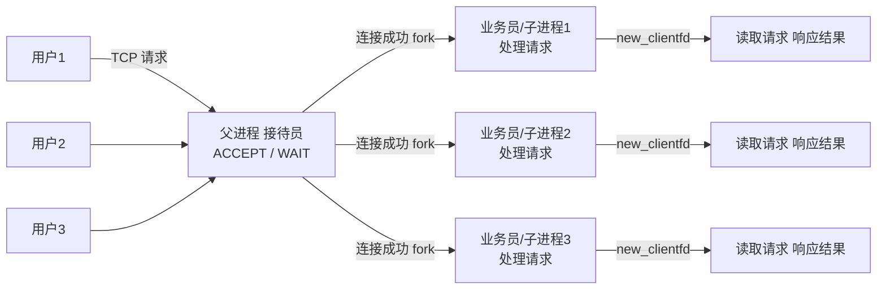
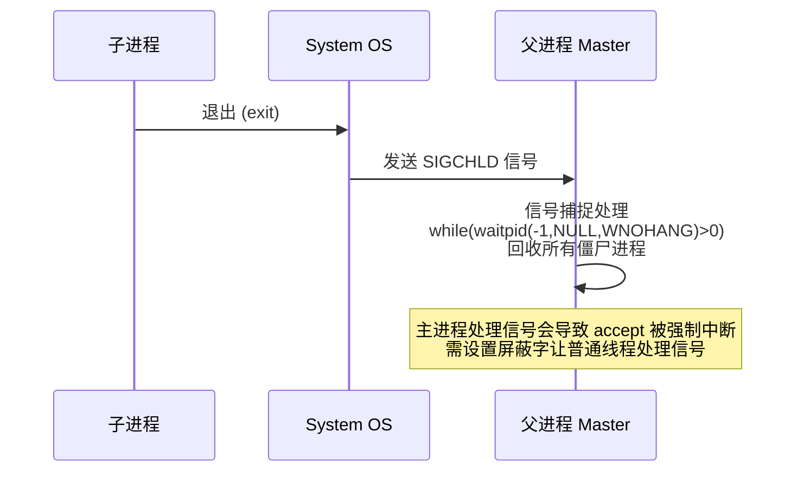
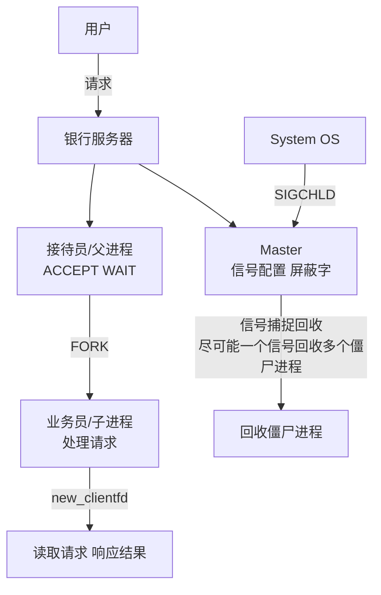

# 2.3 多进程服务器开发

> 来源：`0607.服务器02.md` + `'attachments/多进程服务器.png` + `'attachments/0608.jpg`（多进程细节部分，原图已嵌入下方，正文为笔记整理 + 图片识别 + 代码补充）

## 0. 原图

![[../'attachments/多进程服务器.png]]

## 1. 多进程并发模型

*实现一对多处理业务*

- 使用 `fork`、`signal` 实现（原笔记记为 pthread/signal，进程场景下核心是 **fork + SIGCHLD 信号回收**）。
- **父子进程实现业务分离**：父进程负责连接，子进程负责处理。
- 多进程**稳定性更强**（进程间内存隔离，一个子进程崩溃不影响父进程与其他子进程）。
- 系统开销较大（进程开销），处理进程随用户递增持续递增，频繁创建销毁进程开销大。
- 僵尸回收较为麻烦（需要 wait/waitpid 或 SIGCHLD 信号回收）。
- 缺乏进程管理，**并发数量 = 进程数量**。



- 每个子进程缓存一个 csock（连接单元）。
- 当前模型**子进程的生命周期随客户端持续**：客户端连接则子进程创建，客户端退出子进程结束。
- 缺陷：多进程模型**最大连接数量取决于进程数**；如果进程数量过多，到达 CPU 处理瓶颈，导致系统异常。

## 2. SIGCHLD 信号回收僵尸进程

- 子进程退出时内核发送 **SIGCHLD** 给父进程。
- 父进程注册信号捕捉，**利用信号尽可能回收所有僵尸进程**（被动回收）。



- **不允许主线程/主进程处理信号**：会导致 `accept` 函数被强制中断，影响连接。
- 正确做法：设置屏蔽字（sigprocmask）屏蔽 SIGCHLD，让**普通线程**处理信号；捕捉设定完毕，解除屏蔽。

```c
// 父进程注册 SIGCHLD 信号捕捉
struct sigaction act;
act.sa_handler = sigchld_handler;       // 回收所有僵尸
sigemptyset(&act.sa_mask);
act.sa_flags = SA_RESTART | SA_NOCLDSTOP;
sigaction(SIGCHLD, &act, NULL);
```

## 3. 完整多进程服务器代码样例

```c
#include <stdio.h>
#include <stdlib.h>
#include <string.h>
#include <unistd.h>
#include <signal.h>
#include <sys/wait.h>
#include <arpa/inet.h>

// SIGCHLD 处理函数：尽可能回收所有僵尸进程
void sigchld_handler(int sig) {
    pid_t zid;
    while ((zid = waitpid(-1, NULL, WNOHANG)) > 0) {
        printf("回收僵尸进程 %d\n", zid);
    }
}

int main(void) {
    // 1. 注册 SIGCHLD 信号捕捉
    struct sigaction act;
    act.sa_handler = sigchld_handler;
    sigemptyset(&act.sa_mask);
    act.sa_flags = SA_RESTART | SA_NOCLDSTOP;
    sigaction(SIGCHLD, &act, NULL);

    // 2. 创建监听 socket
    int ssock = socket(AF_INET, SOCK_STREAM, 0);
    struct sockaddr_in addr;
    addr.sin_family = AF_INET;
    addr.sin_port = htons(8080);
    addr.sin_addr.s_addr = htonl(INADDR_ANY);
    bind(ssock, (struct sockaddr *)&addr, sizeof(addr));
    listen(ssock, 128);
    printf("多进程服务器启动...\n");

    while (1) {
        // 3. 父进程只负责 accept 连接
        struct sockaddr_in caddr;
        socklen_t clen = sizeof(caddr);
        int csock = accept(ssock, (struct sockaddr *)&caddr, &clen);
        if (csock == -1) {
            perror("accept");
            continue;
        }
        printf("新连接: %d\n", csock);

        // 4. 创建子进程处理业务
        pid_t pid = fork();
        if (pid == 0) {
            // 子进程：处理请求，生命周期随客户端
            close(ssock);            // 子进程不需要监听 socket
            char buf[1024];
            while (1) {
                ssize_t n = recv(csock, buf, sizeof(buf), 0);
                if (n <= 0) break;   // 客户端退出，子进程结束
                printf("[child %d] 收到: %s\n", getpid(), buf);
                send(csock, "ok", 2, MSG_NOSIGNAL);
            }
            close(csock);
            exit(0);                 // 子进程退出 → 内核发 SIGCHLD
        } else if (pid > 0) {
            close(csock);            // 父进程关闭通信 socket，交给子进程
        } else {
            perror("fork");
        }
    }
    return 0;
}
```

## 4. 与银行服务器场景对照（原图）

- 用户发起请求 → 银行服务器**接待员（父进程）**通过 ACCEPT / WAIT 监听连接；
- **Master** 接收信号相关配置；通过 **FORK** 创建**业务员（子进程）**处理用户业务；
- System OS 发送 **SIGCHLD**，Master 处理信号并**回收僵尸进程**；
- 业务员进程生命周期随用户持续，业务处理完成后用户退出。



## 5. 补充知识点（原图之外）

- **僵尸进程的两种回收方式**：
  1. `wait/waitpid` 阻塞或非阻塞回收（见 1.2）；
  2. **SIGCHLD 信号被动回收**（本节方案），无需父进程专门等待。
- **进程数上限**：受 `ulimit -u`（最大用户进程数）与内存限制；每连接一进程的模型适合中小并发。
- **更优的多进程模型**：**prefork**——预先 fork 固定数量子进程，通过 socket 传递新连接（如 Nginx worker 进程、Apache prefork），避免频繁 fork 开销。
- **进程间共享数据**：子进程不共享内存，需要跨进程通信（见 1.4：共享内存、消息队列、socketpair）。
- **与多线程模型对比**：进程稳定（隔离性好）但开销大；线程轻量但需注意线程安全（见 2.4）。

## 相关笔记

- [[1.2.Linux进程与C_C++开发样例]]
- [[1.8.信号Signal]]
- [[2.2.单机服务器开发]]
- [[2.4.多线程服务器开发]]
