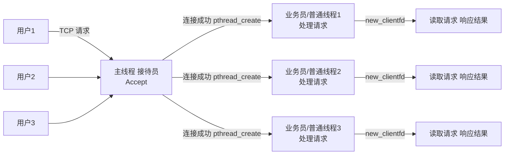
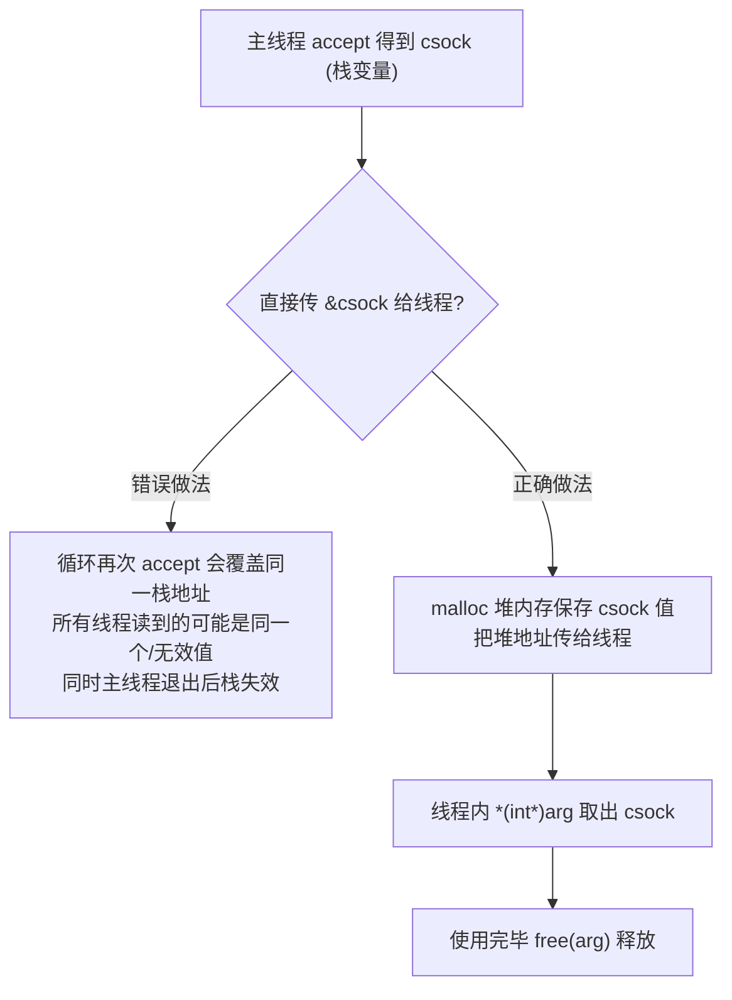

# 2.4 多线程服务器开发

> 来源：`0607.服务器02.md` + `'attachments/多线程服务器.png`（原图已嵌入下方，正文为笔记整理 + 图片识别 + 代码补充）

## 0. 原图

![[../'attachments/多线程服务器.png]]

## 1. 多线程并发模型

- 与多进程类似：**主线程处理连接，子线程处理数据**。
- 主线程 `accept` 获取连接后 `pthread_create` 创建业务线程，实现一对多处理业务。
- 比多进程**更轻量**（线程共享进程内存，无 fork 拷贝开销、无独立地址空间），切换开销更小。
- 需要注意**线程安全**：多线程共享全局资源，处理请求中的共享数据访问需加锁（见 1.7）。
- 连接单元 `csock` 通过参数传递；**线程中不能使用栈地址值**，需申请**局部变量（堆内存）保存**。



- 每个子线程缓存一个 csock（连接单元）。
- 当前模型**线程的生命周期随客户端持续**：客户端连接则创建业务线程，客户端退出线程结束。
- 业务线程设置为**分离态**（`pthread_detach`）无需回收，退出后系统自动回收线程资源。

## 2. 完整多线程服务器代码样例

```c
#include <stdio.h>
#include <stdlib.h>
#include <string.h>
#include <unistd.h>
#include <pthread.h>
#include <arpa/inet.h>

// 线程处理函数：负责与单个客户端通信
void *client_handler(void *arg) {
    int csock = *(int *)arg;      // 从堆上取出 csock
    free(arg);                    // 释放堆内存（避免泄漏）

    // 业务线程分离：退出后系统自动回收，无需 join
    pthread_detach(pthread_self());

    char buf[1024];
    while (1) {
        ssize_t n = recv(csock, buf, sizeof(buf), 0);
        if (n <= 0) break;        // 客户端退出，线程结束
        printf("[thread %lu] 收到: %s\n", pthread_self(), buf);
        send(csock, "ok", 2, MSG_NOSIGNAL);
    }
    close(csock);
    return NULL;
}

int main(void) {
    int ssock = socket(AF_INET, SOCK_STREAM, 0);
    struct sockaddr_in addr;
    addr.sin_family = AF_INET;
    addr.sin_port = htons(8080);
    addr.sin_addr.s_addr = htonl(INADDR_ANY);
    bind(ssock, (struct sockaddr *)&addr, sizeof(addr));
    listen(ssock, 128);
    printf("多线程服务器启动...\n");

    while (1) {
        struct sockaddr_in caddr;
        socklen_t clen = sizeof(caddr);
        int csock = accept(ssock, (struct sockaddr *)&caddr, &clen);
        if (csock == -1) {
            perror("accept");
            continue;
        }

        // 关键：csock 是主线程栈上的局部变量，不能直接把 &csock 传给线程
        // 必须 malloc 一份堆内存保存 csock 值，线程内取用后 free
        int *p_csock = (int *)malloc(sizeof(int));
        *p_csock = csock;

        pthread_t tid;
        pthread_create(&tid, NULL, client_handler, (void *)p_csock);
    }
    return 0;
}
```

## 3. 为什么线程参数必须 malloc（关键知识点）



- 线程函数运行在自己的线程栈上，不能访问主线程栈变量地址（生命周期与有效性无法保证）。
- `client_fd` 通过参数传递，**线程中不能使用地址值，需申请局部变量保存**——这是多线程服务器最常见的坑。

## 4. 补充知识点（原图之外）

- **线程安全**：多线程共享进程全局资源（见 1.6），若处理业务访问共享数据结构（如计数器、日志、连接表），必须加互斥锁/读写锁（见 1.7）。
- **线程数上限**：默认每线程 8MB 栈，32 位系统约 381 个线程（见 1.6）；每连接一线程模型同样有上限，高并发需线程池（见 2.6）。
- **与多进程模型对比**：

| 对比项 | 多进程 | 多线程 |
| --- | --- | --- |
| 开销 | 大（fork 拷贝/调度） | 小（共享内存、轻量切换） |
| 稳定性 | 强（内存隔离） | 弱（一个线程崩溃影响整个进程） |
| 数据共享 | 需 IPC | 直接共享全局变量 |
| 同步 | 信号量/消息队列 | 互斥锁/条件变量 |
| 适用 | 稳定优先、CPU 密集 | 轻量优先、IO 密集 |

- **升级路径**：每连接一线程 → **线程池 + 任务队列**（见 2.6），避免频繁创建销毁线程的开销。

## 相关笔记

- [[1.6.pthread线程基础]]
- [[1.7.线程安全与线程互斥访问]]
- [[2.2.单机服务器开发]]
- [[2.6.Epoll线程池与负载均衡]]
