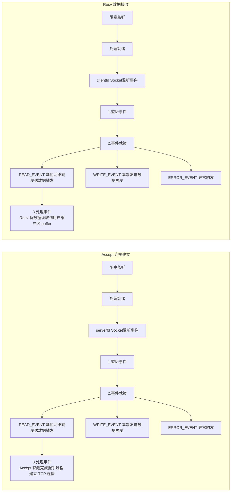
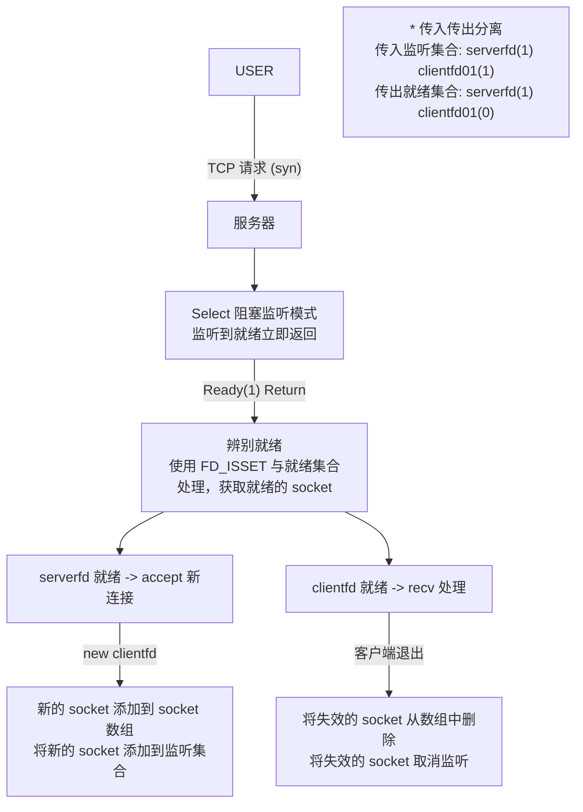
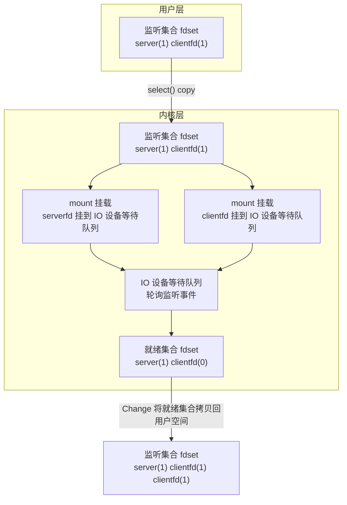
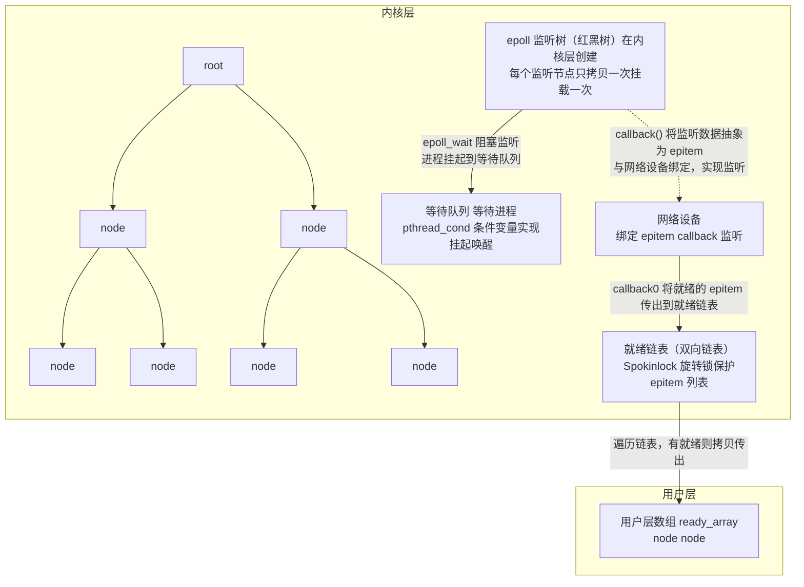
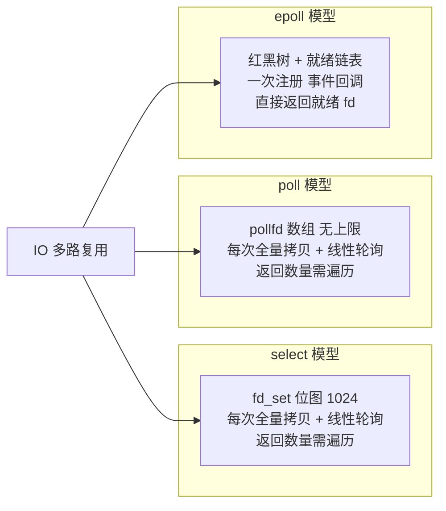

# 2.5 IO多路复用与三种模型对比

> 来源：`0608.服务器03.md`（select）+ `0609.服务器04.md`（poll/epoll）+ `0611.服务器567.md`（LT/ET 部分）+ `'attachments/accept与recv工作流程.png` + `'attachments/SELECT服务器.png` + `'attachments/select底层.png` + `'attachments/epoll底层.png`（原图已嵌入下方，正文为笔记整理 + 图片识别 + 代码补充）

## 0. 原图

![[../'attachments/accept与recv工作流程.png]]

![[../'attachments/SELECT服务器.png]]

![[../'attachments/select底层.png]]

![[../'attachments/epoll底层.png]]

## 1. IO 多路复用概念

- IO 多路复用又称**多路 IO 转接**，是**可同时监听多个 socket 网络事件**的模型。
- 采用多线程或进程的原因是 `accept` 与 `recv` 的阻塞；而 accept 与 recv 工作流程高度相似，**可采用一个模型对其处理**。



IO 多路复用三大模型：**select、poll、epoll**（另有完成端口 IOCP、Kqueue、信号驱动 IO 等平台相关模型）。

## 2. select 模型

### 2.1 函数与宏

- **最大监听数量 1024**，实际 1021（除去 `stdin, stdout, stderr` 三个基础描述符占用监听位）。
- `fd_set set;` 监听集合类型，文件描述符与监听集合对应；监听集合中对应 socket 的位码 **1 表示监听此 socket，0 表示不监听**。

```c
FD_ZERO(fd_set *set);                    // 将监听集合初始化为 0
FD_SET(int sockfd, fd_set *set);         // 对 set 集合中 sockfd 对应的位码设置为 1
FD_CLR(int sockfd, fd_set *set);         // 对 set 集合中 sockfd 对应位码设置为 0
int bitcode = FD_ISSET(int sockfd, fd_set *set);  // 查看 sockfd 在集合中是 1 或是 0 并直接返回

int readys = select(int maxfd, &readSet, &writeSet, &errSet, struct timeval *timeout);
// maxfd     : 最大监听数（所有 fd 最大值 + 1）
// readSet   : 监听读 / 写 / 错误集合
// timeval*  : NULL 阻塞监听 / 0 非阻塞 / 其他值定时监听
```

### 2.2 select 工作流程



### 2.3 select 底层实现



- select 多轮使用会出现**大量重复的拷贝和挂载监听开销**（每次 select 都要把集合拷贝到内核、把 fd 挂到设备等待队列、轮询）。

### 2.4 select 模型利弊

| 优点 | 缺点 |
| --- | --- |
| 代码简单，比较轻量，实现一对多效果 | 监听数量较小，最大 1024，无法满足高并发需求 |
| 兼容性强，各平台和语言都有实现 | 轮询问题：轮询数量增长，IO 处理性能线性下降 |
| 支持微妙级定时阻塞监听（时间精度） | 用户需要对传入传出监听集合进行分离设置 |
| 适合监听数量较小（局域网）等场景 | 只返回就绪数量，不反馈就绪的 socket，需自行遍历查找，开销大 |
| | 监听事件较少；以集合为单位批处理，无法对不同 socket 设置不同事件 |

## 3. poll 模型

- 与 `select` 模型相似；可以用 poll 的监听数组存储所有客户端 socket。
- poll 模型允许用户**自定义长度数组**作为监听集合，每个元素都是 `struct pollfd node`。

```c
struct pollfd listen_array[100000];   // 自定义长度

struct pollfd node;
node.fd = sockfd;          // 存储监听的 socket，取消监听设置 -1
node.events = POLLIN | POLLOUT | POLLERR;   // 设置要监听的 socket 事件
// (node.revents == POLLIN)  // socket 就绪后传出就绪事件，后续用 revents 判断

int ready = poll(listen_array, int nfds, int timeout);
// timeout: (-1 阻塞) (>0 定时阻塞 ms) (0 非阻塞)
// poll 默认阻塞监听，监听到就绪后返回就绪数量，用户处理就绪即可
```

> [!abstract] poll 文件描述符超过 1024
> 1. 使用 `ulimit -n x` 命令将当前终端程序以及子程序最大文件描述符*暂时修改*为 x；
> 2. 修改 `/etc/security/limits.conf` 文件将 `nofile` 选项设置，重启生效；
> 3. 对于 WSL 方法 2 不生效，在 `~/.bashrc` 中添加方法 1 的命令。

### poll 模型利弊

| 优点 | 缺点 |
| --- | --- |
| 监听事件数量更丰富 | 轮询问题：轮询数量增长，IO 处理性能线性下降 |
| 可对不同 socket 进行不同监听设置，更灵活 | 只返回就绪数量，不反馈就绪的 socket，需自行遍历查找，开销大 |
| 传入传出分离：events 传入监听事件，revents 传出就绪事件 | 多轮使用有大量重复的拷贝开销和挂载监听开销 |

## 4. epoll 模型

### 4.1 三个核心 API

- **底层红黑树存储**监听节点。

```c
int epfd = epoll_create(int maxNode);   // 创建红黑树，成功返回描述符，失败 -1

// epoll_ctl: 管理监听树
epoll_ctl(int epfd, EPOLL_CTL_ADD /*| EPOLL_CTL_DEL | EPOLL_CTL_MOD*/, int sockfd, struct epoll_event *node);
//   参数1 待修改的树
//   参数2 操作方式: EPOLL_CTL_ADD | EPOLL_CTL_DEL | EPOLL_CTL_MOD
//   参数3 索引 (sockfd)
//   参数4 节点
// 修改时不可修改节点 data.fd（因其作为索引），只可修改监听的事件
// * 自带互斥锁：多线程对树访问，无需担心线程安全问题

struct epoll_event node;
node.data.fd;                  // 存储 socket 节点
node.events;                   // 监听的事件
node.epoll_item_callback;      // 回调函数

int readys = epoll_wait(int epfd, struct epoll_event *ready_arr, int rfds, int timeout);
//   参数1 监听树描述符
//   参数2 就绪队列（传出 readys 个就绪的节点）
//   参数3 最大就绪数（监听数）
//   参数4 timeout(-1 阻塞) (>0 定时阻塞 ms) (0 非阻塞)
```

### 4.2 epoll 底层：一树一链表一队列



1. **避免重复拷贝**：监听集合（红黑树）定义到内核中，每个监听节点只拷贝一次、挂载一次。
2. **避免轮询**：不借用 IO 设备等待队列，直接借用网卡监听。工作时将当前节点抽象为监听项 `epitem`，将监听项传给网络设备（网卡）绑定，网络设备监听。
3. epoll 有强大监听能力，而且没有额外开销，理论上可以监听**系统最大描述符数量**。
4. epoll 监听到就绪**直接传出就绪的 socket 到用户层**，用户直接处理即可（无需遍历全部）。
5. epoll 有丰富的监听事件，设置监听的灵活性更好。

### 4.3 epoll 水平触发（LT）与边缘触发（ET）

- 两种送餐员比喻：送到门口就走（ET），不管吃没吃就送下一餐；送到本人手里看着吃完（LT），才送下一餐。
- `epoll_wait` 默认**水平触发（LT）**：数据未处理完，不能处理第二次监听；若调用第二次（事件未处理完），**不会阻塞，直接返回上一次结果**。
- **边缘触发（ET）**：监听到就绪后，只会发送**一次**处理通知，后续用户是否处理与 epoll 无关；一次就绪事件未处理完毕，可以再次 epoll_wait 进行第二轮监听。
- 设置监听模式**以 socket 为单位**，比较灵活，不同的 socket 可以用不同的监听模式。

```c
node.events = EPOLLIN | EPOLLET;   // 设置边缘触发（EPOLLLT 水平触发 | EPOLLET 边缘触发）
```

> [!tip] epoll 适用场景
> - **epoll 较为适合：高并发低活跃**场景（连接基数大、请求频率低，如 IM 长连接、监控连接）。
> - select 适用于低监听量、高活跃的场景。

## 5. select / poll / epoll 三种模型对比

| 对比项 | select | poll | epoll |
| --- | --- | --- | --- |
| 底层结构 | fd_set 位图（数组） | pollfd 数组 | 红黑树 + 就绪链表 |
| 最大连接数 | 1024（内核限制） | 无上限（受 fd 数限制） | 无上限（系统最大 fd 数） |
| fd 从用户到内核 | 每次调用全部拷贝 | 每次调用全部拷贝 | 注册时拷贝一次（mmap 共享） |
| 遍历方式 | 线性扫描全部 fd | 线性扫描全部 fd | 事件回调，只处理就绪 fd |
| 就绪返回 | 只返回数量，需遍历查找 | 只返回数量，需遍历查找 | 直接返回就绪 fd 列表 |
| 事件类型 | 读/写/异常（粗粒度） | 丰富（POLLIN/POLLOUT/POLLERR 等） | 丰富（EPOLLIN/OUT/ERR/ET 等） |
| 对不同 fd 设不同事件 | 不支持（集合批处理） | 支持 | 支持 |
| 监听模式 | — | — | LT（默认）/ ET |
| 性能 | 随 fd 数线性下降 | 随 fd 数线性下降 | 高并发下 O(1) 处理就绪 |
| 线程安全 | 一般 | 一般 | 自带互斥锁 |
| 平台 | 所有平台 | 几乎所有平台 | Linux 专用（2.6+） |



## 6. 三种模型完整代码样例

### 6.1 select 服务器

```c
#include <stdio.h>
#include <string.h>
#include <unistd.h>
#include <stdlib.h>
#include <arpa/inet.h>

int main(void) {
    int ssock = socket(AF_INET, SOCK_STREAM, 0);
    struct sockaddr_in addr;
    addr.sin_family = AF_INET;
    addr.sin_port = htons(8080);
    addr.sin_addr.s_addr = htonl(INADDR_ANY);
    bind(ssock, (struct sockaddr *)&addr, sizeof(addr));
    listen(ssock, 128);

    fd_set readSet, readySet;
    FD_ZERO(&readSet);
    FD_SET(ssock, &readSet);          // 监听服务器 socket
    int maxfd = ssock;

    while (1) {
        readySet = readSet;           // 传入传出分离：用副本传出就绪
        int readys = select(maxfd + 1, &readySet, NULL, NULL, NULL);   // 阻塞监听
        if (readys == -1) { perror("select"); break; }

        // 遍历查找就绪的 socket（select 只返回数量）
        for (int fd = 0; fd <= maxfd; fd++) {
            if (!FD_ISSET(fd, &readySet)) continue;
            if (fd == ssock) {
                // 监听 socket 就绪 -> accept 新连接
                struct sockaddr_in caddr;
                socklen_t clen = sizeof(caddr);
                int csock = accept(ssock, (struct sockaddr *)&caddr, &clen);
                FD_SET(csock, &readSet);       // 新 socket 加入监听
                if (csock > maxfd) maxfd = csock;
            } else {
                // 客户端就绪 -> recv 处理
                char buf[1024];
                ssize_t n = recv(fd, buf, sizeof(buf), 0);
                if (n <= 0) {
                    close(fd);
                    FD_CLR(fd, &readSet);      // 取消监听
                    if (fd == maxfd) maxfd--;
                } else {
                    send(fd, "ok", 2, MSG_NOSIGNAL);
                }
            }
        }
    }
    return 0;
}
```

### 6.2 poll 服务器

```c
#include <stdio.h>
#include <string.h>
#include <unistd.h>
#include <stdlib.h>
#include <poll.h>
#include <arpa/inet.h>

#define MAX_CLIENT 10000

int main(void) {
    int ssock = socket(AF_INET, SOCK_STREAM, 0);
    struct sockaddr_in addr;
    addr.sin_family = AF_INET;
    addr.sin_port = htons(8080);
    addr.sin_addr.s_addr = htonl(INADDR_ANY);
    bind(ssock, (struct sockaddr *)&addr, sizeof(addr));
    listen(ssock, 128);

    struct pollfd listen_array[MAX_CLIENT];   // 自定义长度监听数组
    for (int i = 0; i < MAX_CLIENT; i++) listen_array[i].fd = -1;
    listen_array[0].fd = ssock;
    listen_array[0].events = POLLIN;
    int nfds = 1;

    while (1) {
        int readys = poll(listen_array, nfds, -1);   // 阻塞监听
        if (readys == -1) { perror("poll"); break; }

        for (int i = 0; i < nfds && readys > 0; i++) {
            if (listen_array[i].fd == -1) continue;
            if (!(listen_array[i].revents & POLLIN)) continue;   // 用 revents 判断就绪
            readys--;

            if (listen_array[i].fd == ssock) {
                int csock = accept(ssock, NULL, NULL);
                listen_array[nfds].fd = csock;       // 新连接加入监听数组
                listen_array[nfds].events = POLLIN;
                nfds++;
            } else {
                char buf[1024];
                ssize_t n = recv(listen_array[i].fd, buf, sizeof(buf), 0);
                if (n <= 0) {
                    close(listen_array[i].fd);
                    listen_array[i].fd = -1;         // 取消监听设置 -1
                } else {
                    send(listen_array[i].fd, "ok", 2, MSG_NOSIGNAL);
                }
            }
        }
    }
    return 0;
}
```

### 6.3 epoll 服务器

```c
#include <stdio.h>
#include <string.h>
#include <unistd.h>
#include <stdlib.h>
#include <sys/epoll.h>
#include <arpa/inet.h>

#define MAX_EVENTS 1024

int main(void) {
    int ssock = socket(AF_INET, SOCK_STREAM, 0);
    struct sockaddr_in addr;
    addr.sin_family = AF_INET;
    addr.sin_port = htons(8080);
    addr.sin_addr.s_addr = htonl(INADDR_ANY);
    bind(ssock, (struct sockaddr *)&addr, sizeof(addr));
    listen(ssock, 128);

    int epfd = epoll_create(MAX_EVENTS);           // 创建监听树
    struct epoll_event ev, ready_arr[MAX_EVENTS];
    ev.data.fd = ssock;
    ev.events = EPOLLIN;                            // 水平触发（默认）
    epoll_ctl(epfd, EPOLL_CTL_ADD, ssock, &ev);     // 监听服务器 socket

    while (1) {
        int readys = epoll_wait(epfd, ready_arr, MAX_EVENTS, -1);  // 阻塞等待就绪
        if (readys == -1) { perror("epoll_wait"); break; }

        for (int i = 0; i < readys; i++) {          // 直接处理就绪 fd，无需遍历全部
            if (ready_arr[i].data.fd == ssock) {
                // 监听 socket 就绪 -> accept
                int csock = accept(ssock, NULL, NULL);
                ev.data.fd = csock;
                ev.events = EPOLLIN | EPOLLET;      // 通信 socket 可用边缘触发
                epoll_ctl(epfd, EPOLL_CTL_ADD, csock, &ev);
            } else {
                int fd = ready_arr[i].data.fd;
                char buf[1024];
                ssize_t n = recv(fd, buf, sizeof(buf), 0);
                if (n <= 0) {
                    epoll_ctl(epfd, EPOLL_CTL_DEL, fd, NULL);  // 从树中删除
                    close(fd);
                } else {
                    send(fd, "ok", 2, MSG_NOSIGNAL);
                }
            }
        }
    }
    return 0;
}
```

## 7. 补充知识点（原图之外）

- **epoll 的事件宏**：`EPOLLIN`（可读）、`EPOLLOUT`（可写）、`EPOLLERR`（错误）、`EPOLLRDHUP`（对端关闭）、`EPOLLET`（边缘触发）、`EPOLLONESHOT`（一次性监听）。
- **ET 模式必须配合非阻塞 IO**：边缘触发通知一次后，需用非阻塞循环读直到 EAGAIN，否则残留数据无法再次触发。
- **LT vs ET 选择**：LT 简单不易漏事件但可能重复唤醒；ET 高效但要求处理完所有数据，适合高吞吐。
- **IOCP**（Windows 完成端口）与 **Kqueue**（BSD/macOS）是平台相关的等价模型；信号驱动 IO 不常用。
- **epoll 惊群**：多进程/多线程同时 epoll_wait 同一 epfd 时，一个事件可能唤醒多个等待者；Linux 4.5+ 可用 `EPOLLEXCLUSIVE` 避免。
- **reactor 反应堆模型**：epoll 检测事件 + 事件分发回调，是 2.6 epoll+线程池与主流网络库（libevent、Redis、Nginx）的底层思想。

## 相关笔记

- [[2.2.单机服务器开发]]
- [[2.6.Epoll线程池与负载均衡]]
- [[1.7.线程安全与线程互斥访问]]
- [[2.1.SOCKET套接字编程]]
