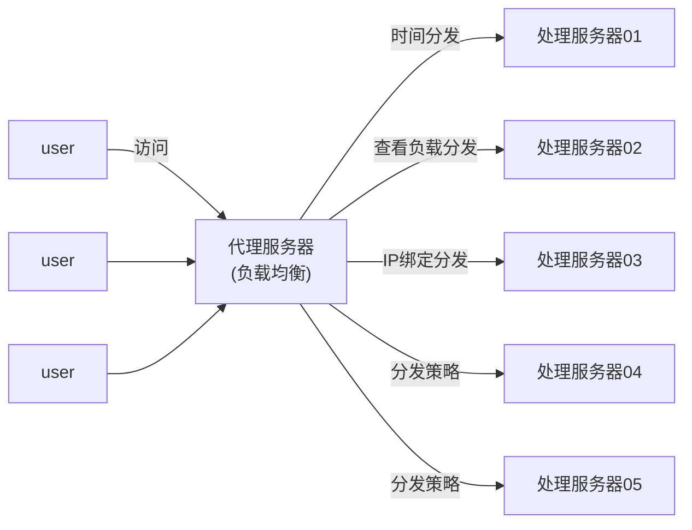
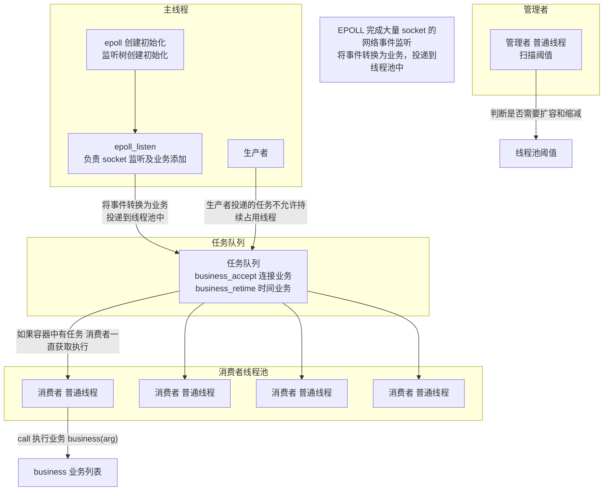
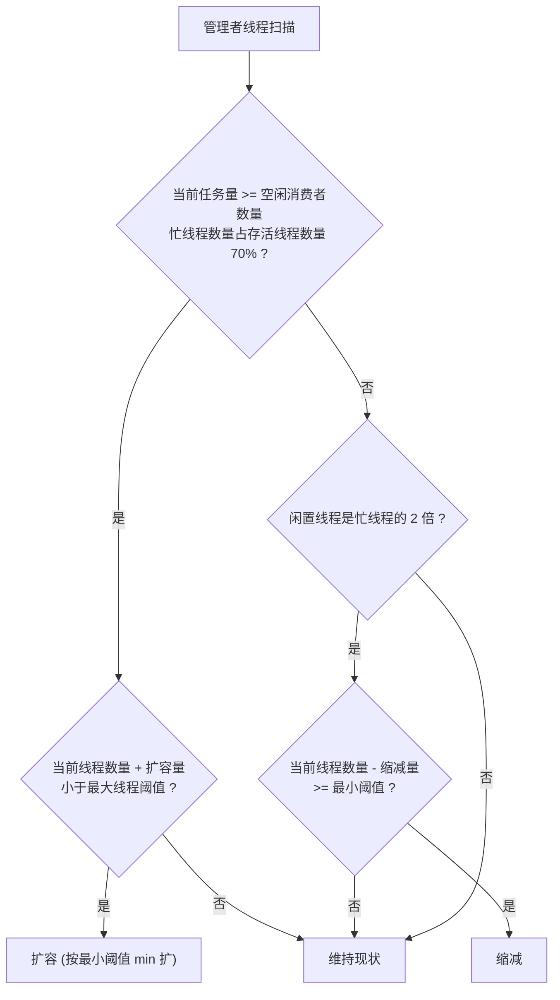
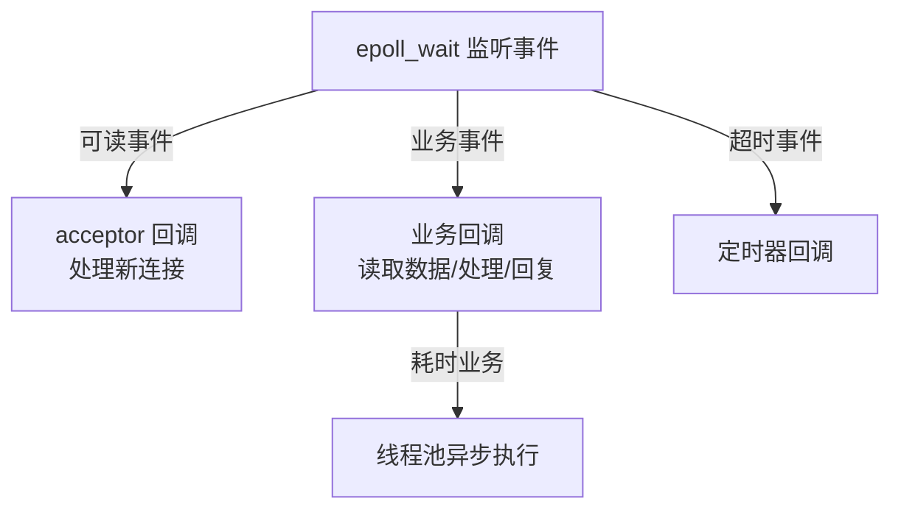

# 2.6 Epoll线程池与负载均衡

> 来源：`0611.服务器567.md` + `'attachments/负载均衡模型.png` + `'attachments/生产者消费者线程池模型.png`（原图已嵌入下方，正文为笔记整理 + 图片识别 + 知识补充）

## 0. 原图

![[../'attachments/负载均衡模型.png]]

![[../'attachments/生产者消费者线程池模型.png]]

## 1. 负载均衡技术

- 大量的用户请求可能导致**任务分发不均匀**，导致资源浪费，不能很好地处理和响应。
- 通过**预先设定的分发策略**，最大程度地均匀分发业务，让每台处理机都有任务负载。



- **代理服务器**是一个以数据中转为主要工作的中间件：可以将用户的请求中转给处理服务器，也可以将结果反馈给用户，**避免用户直接访问服务器主机**，提高安全性（安全策略都可以部署在代理服务器中），还可以进行任务的控制与分发，例如**负载均衡可以在代理服务器中完成**。
- 三种分发策略（示例）：**时间分发、查看负载分发、IP 绑定分发**。

### 1.1 HA 高可用性结构

- 某个处理机宕机，可以通过 **HA（High Availability）** 概念将数据任务转发给正常的处理机。
- 心跳检测 + 故障转移是 HA 的核心：主备节点互相监控，主节点故障后备节点接管。

## 2. Epoll + 线程池服务器

- **服务器**：
  - 强大的 socket 监听能力，可以快速察觉所有套接字的处理事件（**Epoll**）；
  - 高并发处理能力，大量的用户请求可以快速处理（**线程池**）。



### 2.1 线程池设计原则

1. **提高线程重用性**：线程不能与用户绑定，可以重复为多个用户处理业务，避免频繁创建销毁线程，减少不必要开销；
2. **预创建**：提前准备好部分线程待用，用户发送请求后直接选择线程处理，提高响应速度；
3. **线程管理策略**：设定线程池阈值，通过阈值管理调度线程，线程扩容与缩减。

- 为服务器提供并发处理能力，可以更快处理请求或业务。
- 提高线程池的**重用性**：用户实现任务，线程池线程负责执行任务。

### 2.2 生产者消费者模型实现任务传递

- 生产者（主线程/epoll 线程）：将业务事件转化为任务投递到任务队列；
- 消费者（线程池线程）：持续从队列获取任务执行对应业务逻辑；
- 任务队列：连接业务（business_accept）、时间业务（business_retime）等；
- 管理者线程：依据线程池阈值扫描判断，对线程池进行扩容或缩减。

```c
// 业务函数指针形式（生产者投递的粒度）
void *(*business)(void *arg);   // 业务函数指针
```

### 2.3 扩容与缩减规则



- 使用线程池**最小阈值 min** 作为扩容缩减数量。
- 扩容条件：当前任务量 >= 空闲消费者数量，忙线程数量占存活线程数量的 70%；且当前线程数量 + 扩容量 < 最大线程阈值。
- 缩减条件：闲置线程是忙线程的 2 倍；且当前线程数量 - 缩减量 >= 最小阈值。

## 3. 反应堆模型（reactor）——补充

- APUE 经典模式第 6 种：**反应堆模型（Reactor）**，是 epoll + 线程池的进一步抽象：**事件驱动 + 回调分发**。
- 核心：一个线程负责 epoll 监听所有事件，事件就绪后分发给对应处理函数（或投递到线程池执行）。



- 代表实现：libevent、libev、Redis 单线程 reactor、Nginx、Netty。
- Reactor 对比 Proactor（异步 IO）：Reactor 同步事件分发；Proactor 内核完成 IO 后通知，Linux 下基于 AIO/io_uring。

## 4. 补充知识点（原图之外）

- **线程池参数设计**：核心线程数（min）、最大线程数（max）、任务队列容量、空闲回收时间。经验值：CPU 密集 = CPU 核数 + 1；IO 密集 = CPU 核数 * 2（参考）。
- **任务队列实现**：用互斥锁 + 条件变量 + 环形队列（见 1.7 生产者消费者），或用无锁队列（CAS）提升性能。
- **拒绝策略**：任务队列满时可采用丢弃/阻塞/抛出/由调用线程执行等策略，避免任务无限堆积。
- **负载均衡算法**：轮询（Round Robin）、加权轮询、最少连接、IP 哈希、一致性哈希（分布式缓存常用）。
- **CDN 与负载均衡的关系**：CDN 是内容分发加速（静态资源就近缓存）；负载均衡是请求分发（动态流量调度），两者常配合使用。

## 相关笔记

- [[2.5.IO多路复用与三种模型对比]]
- [[1.7.线程安全与线程互斥访问]]
- [[2.4.多线程服务器开发]]
- [[2.2.单机服务器开发]]
