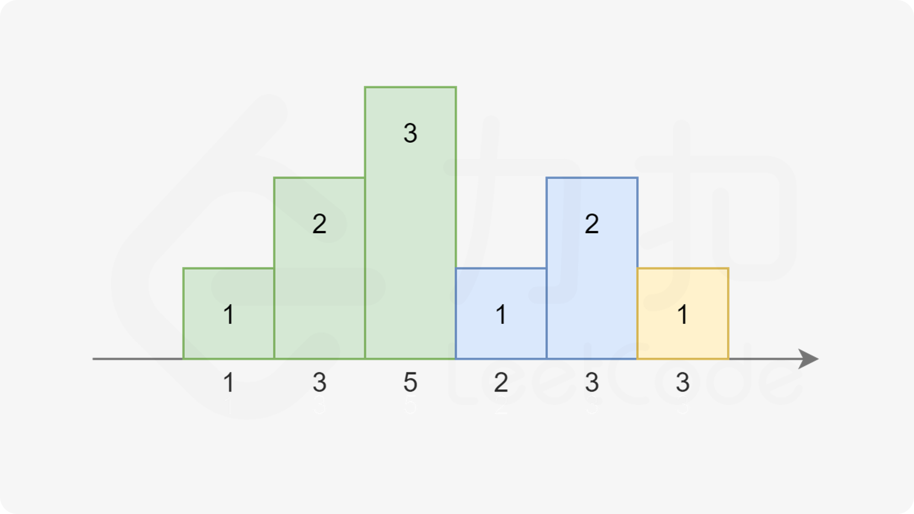
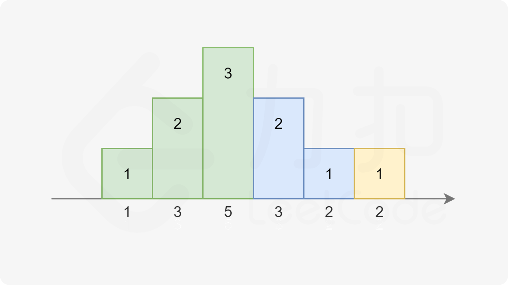
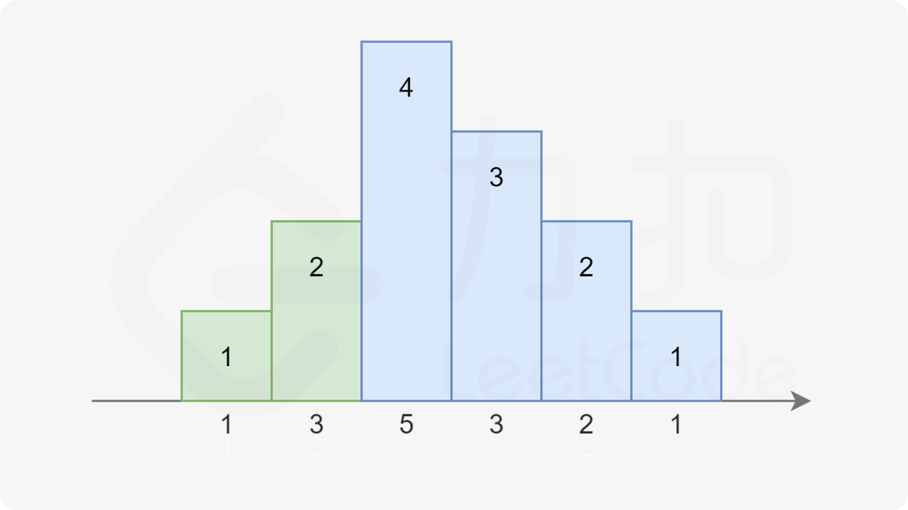

[分发糖果](https://leetcode.cn/problems/candy/description/)
_使用`std::accumulate()`可以计算总和_
- 属于贪心中分配问题
- 简单的两次遍历即可：把所有孩子的糖果数初始化为 1；  先从左往右遍历一遍，如果右边孩子的评分比左边的高，则右边孩子的糖果数更新为左边孩子的糖果数加1；再从右往左遍历一遍，如果左边孩子的评分比右边的高，且左边孩子当前的糖果数  不大于右边孩子的糖果数，则左边孩子的糖果数更新为右边孩子的糖果数加1。通过这两次遍历，  分配的糖果就可以满足题目要求了。这里的贪心策略即为，在每次遍历中，只考虑并更新相邻一 侧的大小关系
```cpp
class Solution {
public:
    int candy(vector<int>& ratings) {
        vector<int> cad(ratings.size(), 1);
        int len = ratings.size(), i, j;
         for (i = 0; i < len - 1; ++i) {
            if (ratings[i] < ratings[i + 1]) cad[i + 1]=cad[i]+1;
        }
        for (j = len - 1; j > 0; --j)
            if (ratings[j - 1] > ratings[j] && cad[j - 1] < cad[j]+1) cad[j-1]=cad[j]+1;
        return std::accumulate(cad.begin(), cad.end(), 0); // 求和，初始值为 0;
    }
};
```
# 官方方法二：常数空间遍历
注意到糖果总是尽量少给，且从 1 开始累计，每次要么比相邻的同学多给一个，要么重新置为 1。依据此规则，我们可以画出下图：




其中相同颜色的柱状图的高度总恰好为 1,2,3…。而高度也不一定一定是升序，也可能是 …3,2,1 的降序：

- 注意到在上图中，对于第三个同学，他既可以被认为是属于绿色的升序部分，也可以被认为是属于蓝色的降序部分。因为他同时比两边的同学评分更高。我们对序列稍作修改：



注意到右边的升序部分变长了，使得第三个同学不得不被分配 4 个糖果。
依据前面总结的规律，我们可以提出本题的解法。我们从左到右枚举每一个同学，记前一个同学分得的糖果数量为 pre：
- 如果当前同学比上一个同学评分高，说明我们就在最近的递增序列中，直接分配给该同学 pre+1 个糖果即可。
- 否则我们就在一个递减序列中，我们直接分配给当前同学一个糖果，并把该同学所在的递减序列中所有的同学都再多分配一个糖果，以保证糖果数量还是满足条件。
	- 我们无需显式地额外分配糖果，只需要记录当前的递减序列长度，即可知道需要额外分配的糖果数量。
	- 同时注意当当前的递减序列长度和上一个递增序列等长时，需要把最近的递增序列的最后一个同学也并进递减序列中。

这样，我们只要记录当前递减序列的长度 dec，最近的递增序列的长度 inc 和前一个同学分得的糖果数量 pre 即可。
```cpp
class Solution {
public:
    int candy(vector<int>& ratings) {
        int n = ratings.size();
        int ret = 1;
        int inc = 1, dec = 0, pre = 1;
        for (int i = 1; i < n; i++) {
            if (ratings[i] >= ratings[i - 1]) {
                dec = 0;
                pre = ratings[i] == ratings[i - 1] ? 1 : pre + 1;
                ret += pre;
                inc = pre;
            } else {
                dec++;
                if (dec == inc) {
                    dec++;
                }
                ret += dec;
                pre = 1;
            }
        }
        return ret;
    }
};
```