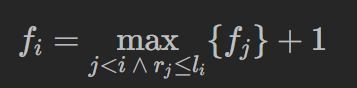

[无重复区间](https://leetcode.cn/problems/non-overlapping-intervals/description/) 
- 给定一个区间的集合 `intervals` ，其中 `intervals[i] = [starti, endi]` 。返回 _需要移除区间的最小数量，使剩余区间互不重叠_ 。
- **注意** 只在一点上接触的区间是 **不重叠的**。例如 `[1, 2]` 和 `[2, 3]` 是不重叠的。

##### 贪心
- 求最少的移除区间个数，等价于尽量多保留不重叠的区间。在选择要保留区间时，区间的结尾十分重要：选择的区间结尾越小，余留给其它区间的空间就越大，就越能保留更多的区间。因此，我们采取的贪心策略为，优先保留结尾小且不相交的区间。  具体实现方法为，先把区间按照结尾的大小进行增序排序，每次选择结尾最小且和前一个选择的区间不重叠的区间。我们这里使用C++ 的Lambda，结合 std::sort() 函数进行自定义排序。  
- 在样例中，排序后的数组为 $[[1,2], [1,3], [2,4]]$。按照我们的贪心策略，首先初始化为区间$[1,2]$；由于$[1,3]$ 与$[1,2]$ 相交，我们跳过该区间；由于$[2,4]$ 与$[1,2]$ 不相交，我们将其保留。因此最终保留的区间为$[[1,2], [2,4]]$。
```cpp
/*
 * @lc app=leetcode.cn id=435 lang=cpp
 *
 * [435] 无重叠区间
 */
#include <vector>
#include <algorithm>
using namespace std;
  
// @lc code=start
class Solution {
   public:
    bool cmp(vector<int>& a, vector<int>& b) { return a[1] < b[1]; }
    int eraseOverlapIntervals(vector<vector<int>>& intervals) {
        if (!intervals.empty()) return 0;
        int ans = 0;
        //
        sort(intervals.begin(), intervals.end(),
             [](vector<int>& a, vector<int>& b) { return a[1] < b[1]; });
   
        int pre = intervals[0][1];
        for (int i = 1; i < intervals.size(); ++i) {
            if (pre > intervals[i][0]) ++ans;
            else pre = intervals[i][1];
        }
       return ans;
    }
};
```

##### 动态规划
- 题目的要求等价于「选出最多数量的区间，使得它们互不重叠」。由于选出的区间互不重叠，因此我们可以将它们按照端点从小到大的顺序进行排序，并且无论我们按照左端点还是右端点进行排序，得到的结果都是唯一的。
- 这样一来，我们可以先将所有的 $n$ 个区间按照左端点（或者右端点）从小到大进行排序，随后使用动态规划的方法求出区间数量的最大值。设排完序后这 $n$ 个区间的左右端点分别为 $l_0 ,⋯,l_(n−1)$以及 $r_0 ,⋯,r_(n−1)$ ，那么我们令 $f_i$ 表示「以区间 i 为最后一个区间，可以选出的区间数量的最大值」，状态转移方程即为：

- 即我们枚举倒数第二个区间的编号 j，满足 j<i，并且第 j 个区间必须要与第 i 个区间不重叠。由于我们已经按照左端点进行升序排序了，因此只要第 j 个区间的右端点 $r_j$ 没有越过第 i 个区间的左端点 $l_i$ ，即 $r_j ≤l_i$ ，那么第 j 个区间就与第 i 个区间不重叠。我们在所有满足要求的 j 中，选择 $f_j$最大的那一个进行状态转移，如果找不到满足要求的区间，那么状态转移方程中 max 这一项就为 0，$f_i$ 就为 1。

- 最终的答案即为所有 $f_i$ 中的最大值。
```cpp
class Solution {
public:
    int eraseOverlapIntervals(vector<vector<int>>& intervals) {
        if (intervals.empty()) {
            return 0;
        }
        
        sort(intervals.begin(), intervals.end(), [](const auto& u, const auto& v) {
            return u[0] < v[0];
        });

        int n = intervals.size();
        vector<int> f(n, 1);
        for (int i = 1; i < n; ++i) {
            for (int j = 0; j < i; ++j) {
                if (intervals[j][1] <= intervals[i][0]) {
                    f[i] = max(f[i], f[j] + 1);
                }
            }
        }
        return n - *max_element(f.begin(), f.end());
    }
};
```

